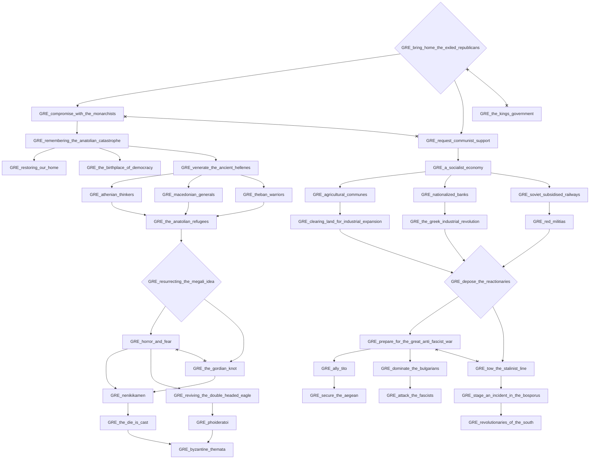
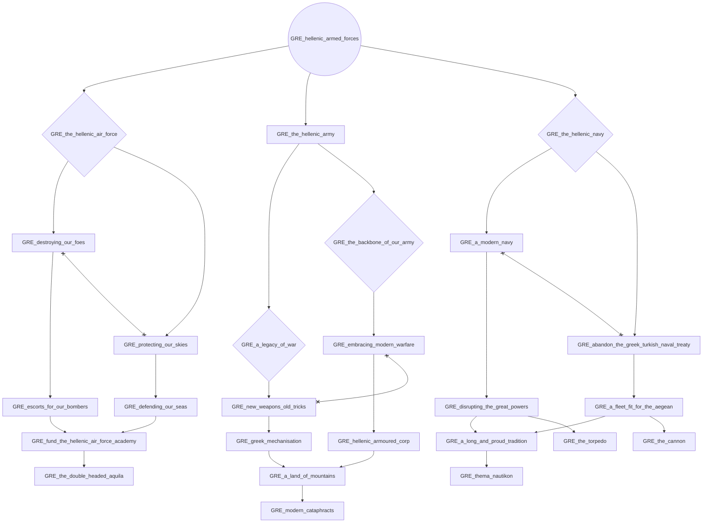
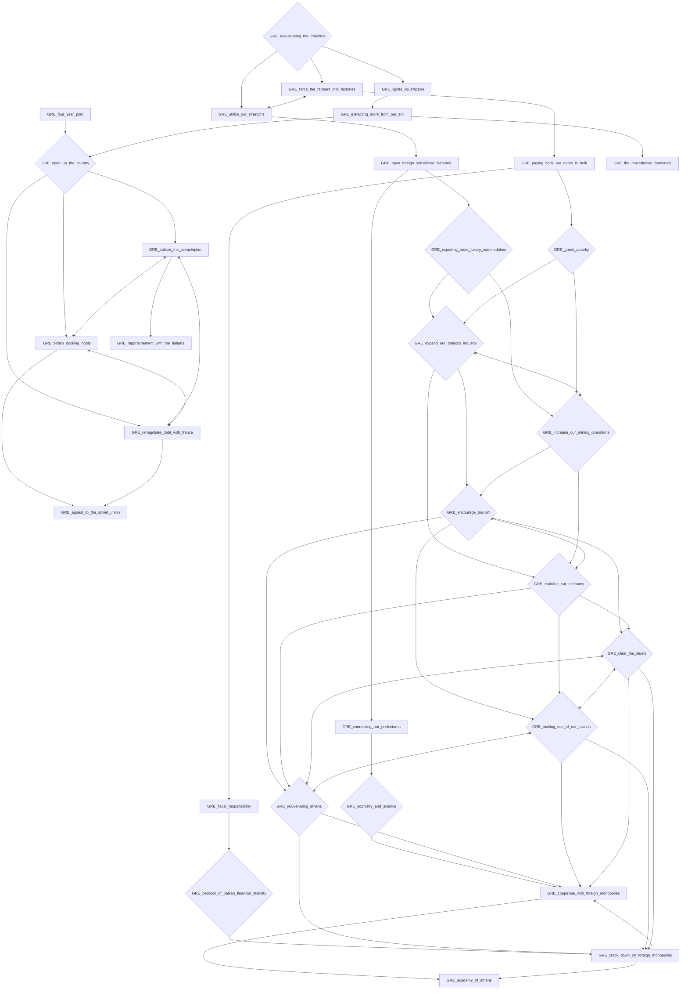
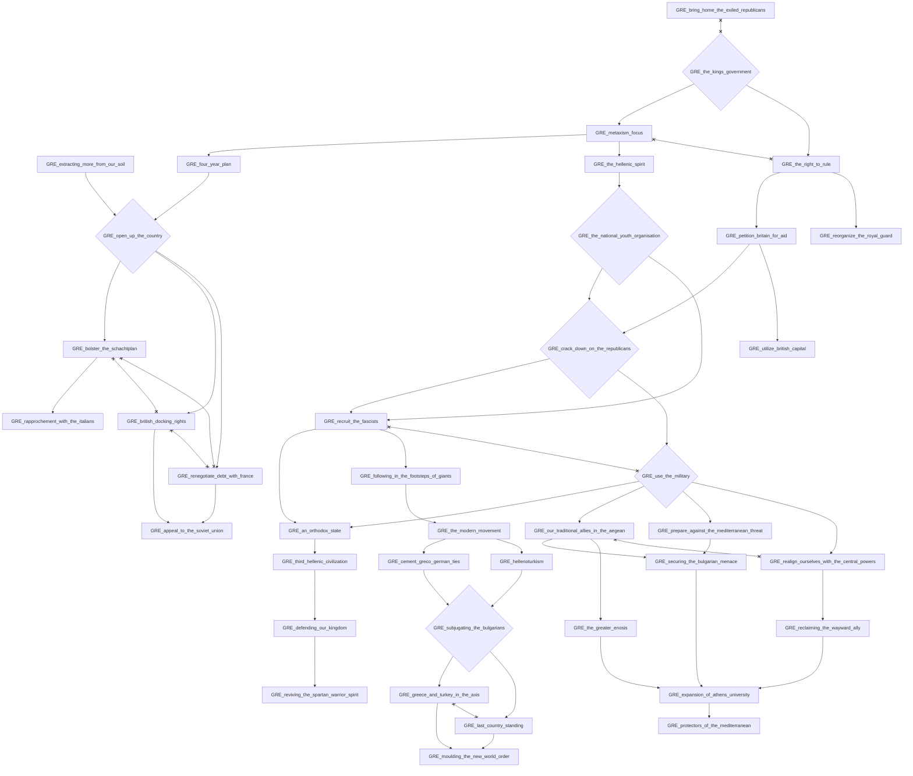

# GRE_bring_home_the_exiled_republicans

```mermaid
flowchart TD
    n1["GRE_a_socialist_economy"]
    n2["GRE_agricultural_communes"]
    n3["GRE_ally_tito"]
    n4["GRE_athenian_thinkers"]
    n5["GRE_attack_the_fascists"]
    n6{"GRE_bring_home_the_exiled_republicans"}
    n7["GRE_byzantine_themata"]
    n8["GRE_clearing_land_for_industrial_expansion"]
    n9["GRE_compromise_with_the_monarchists"]
    n10{"GRE_depose_the_reactionaries"}
    n11["GRE_dominate_the_bulgarians"]
    n12["GRE_horror_and_fear"]
    n13["GRE_macedonian_generals"]
    n14["GRE_nationalized_banks"]
    n15["GRE_nenikikamen"]
    n16["GRE_phoideratoi"]
    n17["GRE_prepare_for_the_great_anti_fascist_war"]
    n18["GRE_red_militias"]
    n19["GRE_remembering_the_anatolian_catastrophe"]
    n20["GRE_request_communist_support"]
    n21["GRE_restoring_our_home"]
    n22{"GRE_resurrecting_the_megali_idea"}
    n23["GRE_reviving_the_double_headed_eagle"]
    n24["GRE_revolutionaries_of_the_south"]
    n25["GRE_secure_the_aegean"]
    n26["GRE_soviet_subsidised_railways"]
    n27["GRE_stage_an_incident_in_the_bosporus"]
    n28["GRE_the_anatolian_refugees"]
    n29["GRE_the_birthplace_of_democracy"]
    n30["GRE_the_die_is_cast"]
    n31["GRE_the_gordian_knot"]
    n32["GRE_the_greek_industrial_revolution"]
    n33["GRE_the_kings_government"]
    n34["GRE_theban_warriors"]
    n35["GRE_tow_the_stalinist_line"]
    n36["GRE_venerate_the_ancient_hellenes"]
    n20 --> n1
    n1 --> n2
    n17 --> n3
    n36 --> n4
    n11 --> n5
    n16 --> n7
    n30 --> n7
    n2 --> n8
    n6 --> n9
    n8 --> n10
    n18 --> n10
    n32 --> n10
    n17 --> n11
    n22 --> n12
    n36 --> n13
    n1 --> n14
    n12 --> n15
    n31 --> n15
    n23 --> n16
    n10 --> n17
    n26 --> n18
    n9 --> n19
    n6 --> n20
    n19 --> n21
    n28 --> n22
    n12 --> n23
    n27 --> n24
    n3 --> n25
    n1 --> n26
    n35 --> n27
    n34 --> n28
    n4 --> n28
    n13 --> n28
    n19 --> n29
    n15 --> n30
    n22 --> n31
    n14 --> n32
    n36 --> n34
    n10 --> n35
    n19 --> n36
    n6 x--x n33
    n9 x--x n20
    n12 x--x n31
    n17 x--x n35
```

# GRE_hellenic_armed_forces

```mermaid
flowchart TD
    n37["GRE_a_fleet_fit_for_the_aegean"]
    n38["GRE_a_land_of_mountains"]
    n39{"GRE_a_legacy_of_war"}
    n40["GRE_a_long_and_proud_tradition"]
    n41["GRE_a_modern_navy"]
    n42["GRE_abandon_the_greek_turkish_naval_treaty"]
    n43["GRE_defending_our_seas"]
    n44["GRE_destroying_our_foes"]
    n45["GRE_disrupting_the_great_powers"]
    n46["GRE_embracing_modern_warfare"]
    n47["GRE_escorts_for_our_bombers"]
    n48["GRE_fund_the_hellenic_air_force_academy"]
    n49["GRE_greek_mechanisation"]
    n50(("GRE_hellenic_armed_forces"))
    n51["GRE_hellenic_armoured_corp"]
    n52["GRE_modern_cataphracts"]
    n53["GRE_new_weapons_old_tricks"]
    n54["GRE_protecting_our_skies"]
    n55{"GRE_the_backbone_of_our_army"}
    n56["GRE_the_cannon"]
    n57["GRE_the_double_headed_aquila"]
    n58{"GRE_the_hellenic_air_force"}
    n59["GRE_the_hellenic_army"]
    n60{"GRE_the_hellenic_navy"}
    n61["GRE_the_torpedo"]
    n62["GRE_thema_nautikon"]
    n42 --> n37
    n51 --> n38
    n49 --> n38
    n59 --> n39
    n45 --> n40
    n37 --> n40
    n60 --> n41
    n60 --> n42
    n54 --> n43
    n58 --> n44
    n41 --> n45
    n55 --> n46
    n44 --> n47
    n47 --> n48
    n43 --> n48
    n53 --> n49
    n46 --> n51
    n38 --> n52
    n39 --> n53
    n58 --> n54
    n59 --> n55
    n37 --> n56
    n48 --> n57
    n50 --> n58
    n50 --> n59
    n50 --> n60
    n45 --> n61
    n40 --> n62
    n41 x--x n42
    n44 x--x n54
    n46 x--x n53
```

# GRE_reevaluating_the_drachma

```mermaid
flowchart TD
    n63["GRE_academy_of_athens"]
    n64["GRE_appeal_to_the_soviet_union"]
    n65{"GRE_bedrock_of_balkan_financial_stability"}
    n66["GRE_bolster_the_schachtplan"]
    n67["GRE_british_docking_rights"]
    n68{"GRE_clear_the_slums"}
    n69["GRE_connecting_our_prefectures"]
    n70["GRE_cooperate_with_foreign_monopolies"]
    n71["GRE_crack_down_on_foreign_monopolies"]
    n72{"GRE_encourage_tourism"}
    n73{"GRE_expand_our_tobacco_industry"}
    n74{"GRE_exporting_more_luxury_commodoties"}
    n75["GRE_extracting_more_from_our_soil"]
    n76["GRE_fiscal_responsibility"]
    n77["GRE_force_the_farmers_into_factories"]
    n78["GRE_four_year_plan"]
    n79{"GRE_greek_autarky"}
    n80{"GRE_increase_our_mining_operations"}
    n81["GRE_lignite_liquefaction"]
    n82{"GRE_making_use_of_our_islands"}
    n83{"GRE_mobilise_our_economy"}
    n84["GRE_open_foreign_subsidized_factories"]
    n85{"GRE_open_up_the_country"}
    n86["GRE_paying_back_our_debts_in_bulk"]
    n87["GRE_rapprochement_with_the_italians"]
    n88{"GRE_reevaluating_the_drachma"}
    n89{"GRE_rejuvenating_athens"}
    n90["GRE_renegotiate_debt_with_france"]
    n91{"GRE_sophistry_and_science"}
    n92["GRE_the_macedonian_farmlands"]
    n93["GRE_utilize_our_strengths"]
    n70 --> n63
    n71 --> n63
    n67 --> n64
    n90 --> n64
    n76 --> n65
    n85 --> n66
    n85 --> n67
    n72 --> n68
    n83 --> n68
    n84 --> n69
    n91 --> n70
    n89 --> n70
    n82 --> n70
    n68 --> n70
    n65 --> n71
    n89 --> n71
    n82 --> n71
    n68 --> n71
    n73 --> n72
    n80 --> n72
    n74 --> n73
    n79 --> n73
    n84 --> n74
    n81 --> n75
    n86 --> n76
    n88 --> n77
    n86 --> n79
    n74 --> n80
    n79 --> n80
    n88 --> n81
    n72 --> n82
    n83 --> n82
    n73 --> n83
    n80 --> n83
    n93 --> n84
    n78 --> n85
    n75 --> n85
    n77 --> n86
    n66 --> n87
    n72 --> n89
    n83 --> n89
    n85 --> n90
    n69 --> n91
    n75 --> n92
    n88 --> n93
    n66 x--x n67
    n66 x--x n90
    n67 x--x n90
    n68 x--x n82
    n68 x--x n89
    n70 x--x n71
    n72 x--x n83
    n73 x--x n80
    n77 x--x n93
    n82 x--x n89
```

# GRE_the_kings_government

```mermaid
flowchart TD
    n94["GRE_an_orthodox_state"]
    n64["GRE_appeal_to_the_soviet_union"]
    n66["GRE_bolster_the_schachtplan"]
    n6["GRE_bring_home_the_exiled_republicans"]
    n67["GRE_british_docking_rights"]
    n95["GRE_cement_greco_german_ties"]
    n96{"GRE_crack_down_on_the_republicans"}
    n97["GRE_defending_our_kingdom"]
    n98["GRE_expansion_of_athens_university"]
    n75["GRE_extracting_more_from_our_soil"]
    n99["GRE_following_in_the_footsteps_of_giants"]
    n78["GRE_four_year_plan"]
    n100["GRE_greece_and_turkey_in_the_axis"]
    n101["GRE_hellenoturkism"]
    n102["GRE_last_country_standing"]
    n103["GRE_metaxism_focus"]
    n104["GRE_moulding_the_new_world_order"]
    n85{"GRE_open_up_the_country"}
    n105["GRE_our_traditional_allies_in_the_aegean"]
    n106["GRE_petition_britain_for_aid"]
    n107["GRE_prepare_against_the_mediterranean_threat"]
    n108["GRE_protectors_of_the_mediterranean"]
    n87["GRE_rapprochement_with_the_italians"]
    n109["GRE_realign_ourselves_with_the_central_powers"]
    n110["GRE_reclaiming_the_wayward_ally"]
    n111["GRE_recruit_the_fascists"]
    n90["GRE_renegotiate_debt_with_france"]
    n112["GRE_reorganize_the_royal_guard"]
    n113["GRE_reviving_the_spartan_warrior_spirit"]
    n114["GRE_securing_the_bulgarian_menace"]
    n115{"GRE_subjugating_the_bulgarians"}
    n116["GRE_the_greater_enosis"]
    n117["GRE_the_hellenic_spirit"]
    n33{"GRE_the_kings_government"}
    n118["GRE_the_modern_movement"]
    n119{"GRE_the_national_youth_organisation"}
    n120["GRE_the_right_to_rule"]
    n121["GRE_third_hellenic_civilization"]
    n122{"GRE_use_the_military"}
    n123["GRE_utilize_british_capital"]
    n122 --> n94
    n111 --> n94
    n67 --> n64
    n90 --> n64
    n85 --> n66
    n85 --> n67
    n118 --> n95
    n119 --> n96
    n106 --> n96
    n121 --> n97
    n110 --> n98
    n116 --> n98
    n114 --> n98
    n111 --> n99
    n103 --> n78
    n115 --> n100
    n118 --> n101
    n115 --> n102
    n33 --> n103
    n100 --> n104
    n102 --> n104
    n78 --> n85
    n75 --> n85
    n122 --> n105
    n120 --> n106
    n122 --> n107
    n98 --> n108
    n66 --> n87
    n122 --> n109
    n109 --> n110
    n96 --> n111
    n119 --> n111
    n85 --> n90
    n120 --> n112
    n97 --> n113
    n105 --> n114
    n107 --> n114
    n101 --> n115
    n95 --> n115
    n105 --> n116
    n103 --> n117
    n99 --> n118
    n117 --> n119
    n33 --> n120
    n94 --> n121
    n96 --> n122
    n106 --> n123
    n66 x--x n67
    n66 x--x n90
    n6 x--x n33
    n67 x--x n90
    n100 x--x n102
    n103 x--x n120
    n105 x--x n109
    n111 x--x n122
```
