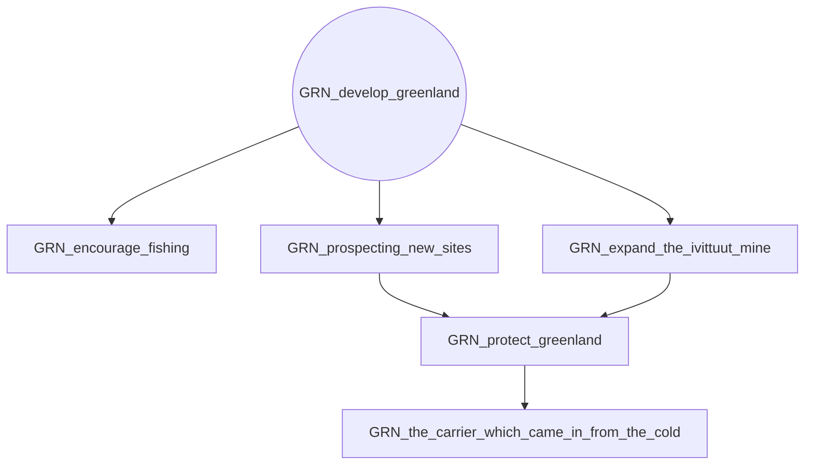

# GRN_develop_greenland

```mermaid
flowchart TD
    n1(("GRN_develop_greenland"))
    n2["GRN_encourage_fishing"]
    n3["GRN_expand_the_ivittuut_mine"]
    n4["GRN_prospecting_new_sites"]
    n5["GRN_protect_greenland"]
    n6["GRN_the_carrier_which_came_in_from_the_cold"]
    n1 --> n2
    n1 --> n3
    n1 --> n4
    n4 --> n5
    n3 --> n5
    n5 --> n6
```
