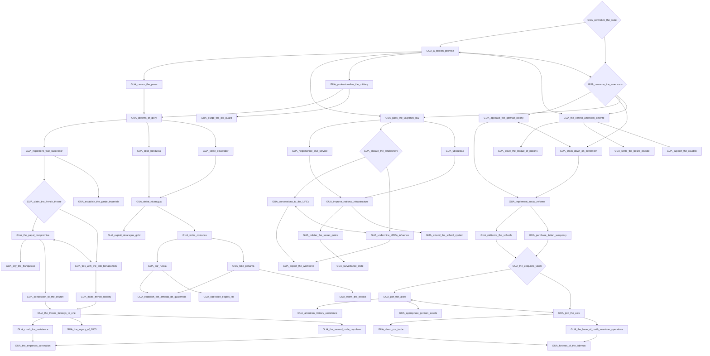

# GUA_centralize_the_state

```mermaid
flowchart TD
    n1["GUA_a_broken_promise"]
    n2["GUA_ally_the_franquistas"]
    n3["GUA_american_military_assistance"]
    n4["GUA_appease_the_german_colony"]
    n5["GUA_appropriate_german_assets"]
    n6["GUA_bolster_the_secret_police"]
    n7["GUA_censor_the_press"]
    n8{"GUA_centralize_the_state"}
    n9{"GUA_claim_the_french_throne"}
    n10["GUA_concession_to_the_church"]
    n11["GUA_concessions_to_the_UFCo"]
    n12["GUA_crack_down_on_extremism"]
    n13["GUA_crush_the_resistance"]
    n14["GUA_divert_our_trade"]
    n15["GUA_dreams_of_glory"]
    n16["GUA_establish_the_armada_de_guatemala"]
    n17["GUA_establish_the_garde_imperiale"]
    n18["GUA_exploit_nicaragua_gold"]
    n19["GUA_exploit_the_workforce"]
    n20["GUA_extend_the_school_system"]
    n21["GUA_fortress_of_the_isthmus"]
    n22["GUA_hegemonize_civil_service"]
    n23["GUA_implement_social_reforms"]
    n24["GUA_improve_national_infrastructure"]
    n25["GUA_invite_french_nobility"]
    n26["GUA_join_the_allies"]
    n27["GUA_join_the_axis"]
    n28["GUA_leave_the_league_of_nations"]
    n29["GUA_militarize_the_schools"]
    n30["GUA_napoleons_true_successor"]
    n31["GUA_operation_eagles_fall"]
    n32["GUA_our_russia"]
    n33["GUA_pass_the_vagrancy_law"]
    n34{"GUA_placate_the_landowners"}
    n35["GUA_professionalize_the_military"]
    n36["GUA_purchase_italian_weaponry"]
    n37["GUA_purge_the_old_guard"]
    n38{"GUA_reassure_the_americans"}
    n39["GUA_settle_the_belize_dispute"]
    n40["GUA_stike_honduras"]
    n41["GUA_storm_the_tropics"]
    n42["GUA_strike_costarica"]
    n43["GUA_strike_elsalvador"]
    n44["GUA_strike_nicaragua"]
    n45["GUA_support_the_caudillo"]
    n46["GUA_surveillance_state"]
    n47["GUA_take_panama"]
    n48["GUA_the_base_of_north_american_operations"]
    n49["GUA_the_central_american_detente"]
    n50["GUA_the_emperors_coronation"]
    n51["GUA_the_legacy_of_1805"]
    n52["GUA_the_papal_compromise"]
    n53["GUA_the_second_code_napoleon"]
    n54["GUA_the_throne_belongs_to_one"]
    n55{"GUA_the_ubiquista_youth"}
    n56["GUA_ties_with_the_anti_bonapartists"]
    n57["GUA_ubiquistas"]
    n58["GUA_undermine_UFCo_influence"]
    n8 --> n1
    n52 --> n2
    n26 --> n3
    n38 --> n4
    n26 --> n5
    n24 --> n6
    n1 --> n7
    n30 --> n9
    n52 --> n10
    n34 --> n11
    n38 --> n12
    n54 --> n13
    n27 --> n14
    n7 --> n15
    n35 --> n15
    n47 --> n16
    n32 --> n16
    n30 --> n17
    n44 --> n18
    n11 --> n19
    n58 --> n19
    n24 --> n20
    n14 --> n21
    n48 --> n21
    n33 --> n22
    n4 --> n23
    n12 --> n23
    n57 --> n24
    n22 --> n24
    n56 --> n25
    n55 --> n26
    n55 --> n27
    n49 --> n28
    n23 --> n29
    n15 --> n30
    n32 --> n31
    n42 --> n32
    n1 --> n33
    n38 --> n33
    n33 --> n34
    n1 --> n35
    n23 --> n36
    n35 --> n37
    n8 --> n38
    n49 --> n39
    n15 --> n40
    n47 --> n41
    n44 --> n42
    n15 --> n43
    n40 --> n44
    n43 --> n44
    n49 --> n45
    n6 --> n46
    n42 --> n47
    n27 --> n48
    n38 --> n49
    n1 --> n49
    n13 --> n50
    n53 --> n50
    n54 --> n51
    n9 --> n52
    n54 --> n53
    n10 --> n54
    n25 --> n54
    n36 --> n55
    n29 --> n55
    n9 --> n56
    n33 --> n57
    n34 --> n58
    n1 x--x n38
    n4 x--x n12
    n11 x--x n58
    n26 x--x n27
    n52 x--x n56
```
