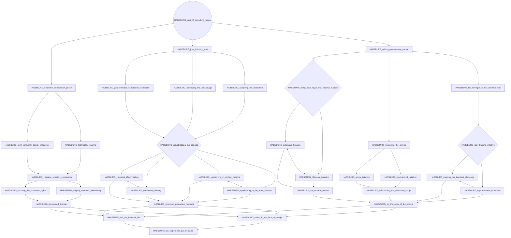

# HABSBURG_part_of_something_bigger

```mermaid
flowchart TD
    n1["HABSBURG_an_empire_not_just_in_name"]
    n2["HABSBURG_armor_initiative"]
    n3{"HABSBURG_bring_back_royal_and_imperial_hussars"}
    n4["HABSBURG_call_the_imperial_diet"]
    n5["HABSBURG_defensive_hussars"]
    n6["HABSBURG_discounted_licenses"]
    n7["HABSBURG_economic_cooperation_policy"]
    n8["HABSBURG_effectivizing_the_motorized_troops"]
    n9["HABSBURG_for_the_glory_of_the_empire"]
    n10["HABSBURG_improved_production_methods"]
    n11["HABSBURG_increase_scientific_cooperation"]
    n12["HABSBURG_industrial_effectivization"]
    n13{"HABSBURG_industrializing_our_capitals"}
    n14["HABSBURG_joint_consumer_goods_endeavors"]
    n15["HABSBURG_joint_industry_spirit"]
    n16{"HABSBURG_joint_training_initiative"}
    n17["HABSBURG_joint_ventures_in_resource_extraction"]
    n18["HABSBURG_mechanized_initiative"]
    n19["HABSBURG_meeting_the_logistical_challenge"]
    n20["HABSBURG_motorizing_the_armies"]
    n21["HABSBURG_offensive_hussars"]
    n22["HABSBURG_optimizing_the_land_usage"]
    n23["HABSBURG_organizational_exercises"]
    n24(("HABSBURG_part_of_something_bigger"))
    n25["HABSBURG_reform_gemeinsame_armee"]
    n26["HABSBURG_reinforced_industry"]
    n27["HABSBURG_securing_the_consumer_rights"]
    n28["HABSBURG_simplify_economic_lawmaking"]
    n29["HABSBURG_specializing_in_civilian_logistics"]
    n30["HABSBURG_specializing_in_the_arms_industry"]
    n31["HABSBURG_supplying_the_federation"]
    n32["HABSBURG_technology_sharing"]
    n33["HABSBURG_the_modern_hussar"]
    n34["HABSBURG_the_strength_of_the_common_man"]
    n35["HABSBURG_united_in_the_face_of_danger"]
    n35 --> n1
    n4 --> n1
    n20 --> n2
    n25 --> n3
    n9 --> n4
    n6 --> n4
    n10 --> n4
    n3 --> n5
    n27 --> n6
    n28 --> n6
    n24 --> n7
    n2 --> n8
    n18 --> n8
    n33 --> n9
    n23 --> n9
    n19 --> n9
    n8 --> n9
    n12 --> n10
    n26 --> n10
    n29 --> n10
    n30 --> n10
    n32 --> n11
    n14 --> n11
    n13 --> n12
    n17 --> n13
    n22 --> n13
    n31 --> n13
    n7 --> n14
    n24 --> n15
    n34 --> n16
    n15 --> n17
    n20 --> n18
    n16 --> n19
    n25 --> n20
    n3 --> n21
    n15 --> n22
    n16 --> n23
    n24 --> n25
    n13 --> n26
    n11 --> n27
    n11 --> n28
    n13 --> n29
    n13 --> n30
    n15 --> n31
    n7 --> n32
    n21 --> n33
    n5 --> n33
    n25 --> n34
    n9 --> n35
    n6 --> n35
    n10 --> n35
    n5 x--x n21
    n12 x--x n26
    n19 x--x n23
    n29 x--x n30
```
