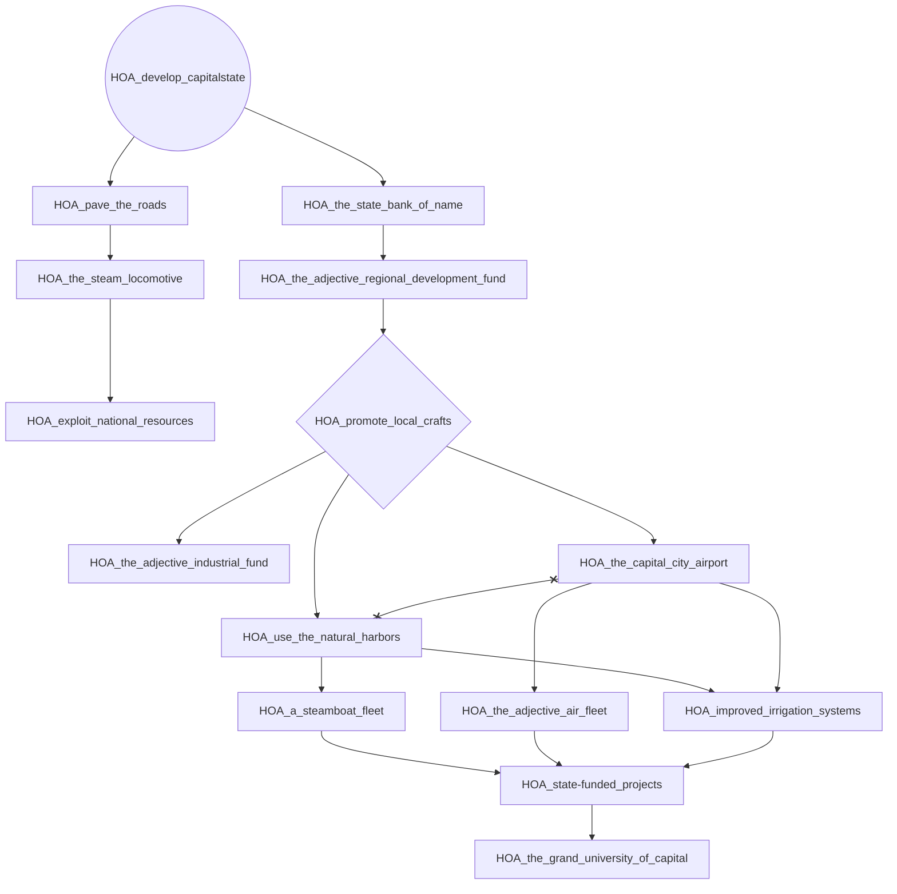
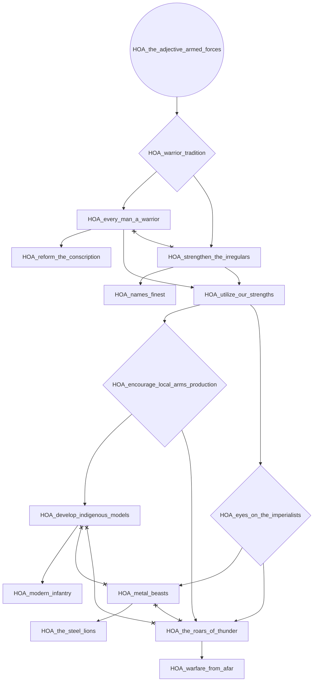
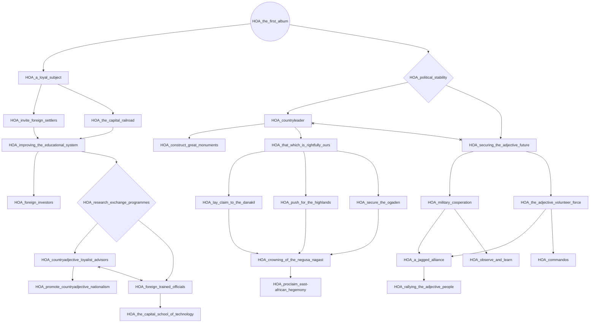

# HOA_develop_capitalstate

```mermaid
flowchart TD
    n1["HOA_a_steamboat_fleet"]
    n2(("HOA_develop_capitalstate"))
    n3["HOA_exploit_national_resources"]
    n4["HOA_improved_irrigation_systems"]
    n5["HOA_pave_the_roads"]
    n6{"HOA_promote_local_crafts"}
    n7["HOA_state-funded_projects"]
    n8["HOA_the_adjective_air_fleet"]
    n9["HOA_the_adjective_industrial_fund"]
    n10["HOA_the_adjective_regional_development_fund"]
    n11["HOA_the_capital_city_airport"]
    n12["HOA_the_grand_university_of_capital"]
    n13["HOA_the_state_bank_of_name"]
    n14["HOA_the_steam_locomotive"]
    n15["HOA_use_the_natural_harbors"]
    n15 --> n1
    n14 --> n3
    n15 --> n4
    n11 --> n4
    n2 --> n5
    n10 --> n6
    n1 --> n7
    n8 --> n7
    n4 --> n7
    n11 --> n8
    n6 --> n9
    n13 --> n10
    n6 --> n11
    n7 --> n12
    n2 --> n13
    n5 --> n14
    n6 --> n15
    n11 x--x n15
```

# HOA_the_adjective_armed_forces

```mermaid
flowchart TD
    n16["HOA_develop_indigenous_models"]
    n17{"HOA_encourage_local_arms_production"}
    n18["HOA_every_man_a_warrior"]
    n19{"HOA_eyes_on_the_imperialists"}
    n20["HOA_metal_beasts"]
    n21["HOA_modern_infantry"]
    n22["HOA_names_finest"]
    n23["HOA_reform_the_conscription"]
    n24["HOA_strengthen_the_irregulars"]
    n25(("HOA_the_adjective_armed_forces"))
    n26["HOA_the_roars_of_thunder"]
    n27["HOA_the_steel_lions"]
    n28["HOA_utilize_our_strengths"]
    n29["HOA_warfare_from_afar"]
    n30{"HOA_warrior_tradition"}
    n17 --> n16
    n28 --> n17
    n30 --> n18
    n28 --> n19
    n19 --> n20
    n16 --> n21
    n24 --> n22
    n18 --> n23
    n30 --> n24
    n19 --> n26
    n17 --> n26
    n20 --> n27
    n24 --> n28
    n18 --> n28
    n26 --> n29
    n25 --> n30
    n16 x--x n20
    n16 x--x n26
    n18 x--x n24
    n20 x--x n26
```

# HOA_the_first_album

```mermaid
flowchart TD
    n31["HOA_a_jagged_alliance"]
    n32["HOA_a_loyal_subject"]
    n33["HOA_commandos"]
    n34["HOA_construct_great_monuments"]
    n35["HOA_countryadjective_loyalist_advisors"]
    n36["HOA_countryleader"]
    n37["HOA_crowning_of_the_negusa_nagast"]
    n38["HOA_foreign_investors"]
    n39["HOA_foreign_trained_officials"]
    n40["HOA_improving_the_educational_system"]
    n41["HOA_invite_foreign_settlers"]
    n42["HOA_lay_claim_to_the_danakil"]
    n43["HOA_military_cooperation"]
    n44["HOA_observe_and_learn"]
    n45{"HOA_political_stability"}
    n46["HOA_proclaim_east-african_hegemony"]
    n47["HOA_promote_countryadjective_nationalism"]
    n48["HOA_push_for_the_highlands"]
    n49["HOA_rallying_the_adjective_people"]
    n50{"HOA_research_exchange_programmes"}
    n51["HOA_secure_the_ogaden"]
    n52["HOA_securing_the_adjective_future"]
    n53["HOA_that_which_is_rightfully_ours"]
    n54["HOA_the_adjective_volunteer_force"]
    n55["HOA_the_capital_railroad"]
    n56["HOA_the_capital_school_of_technology"]
    n57(("HOA_the_first_album"))
    n54 --> n31
    n43 --> n31
    n57 --> n32
    n54 --> n33
    n36 --> n34
    n50 --> n35
    n45 --> n36
    n48 --> n37
    n51 --> n37
    n42 --> n37
    n40 --> n38
    n50 --> n39
    n55 --> n40
    n41 --> n40
    n32 --> n41
    n53 --> n42
    n52 --> n43
    n43 --> n44
    n57 --> n45
    n37 --> n46
    n35 --> n47
    n53 --> n48
    n31 --> n49
    n40 --> n50
    n53 --> n51
    n45 --> n52
    n36 --> n53
    n52 --> n54
    n32 --> n55
    n39 --> n56
    n35 x--x n39
    n36 x--x n52
```
