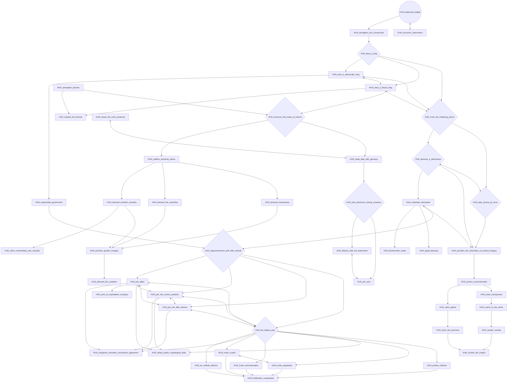
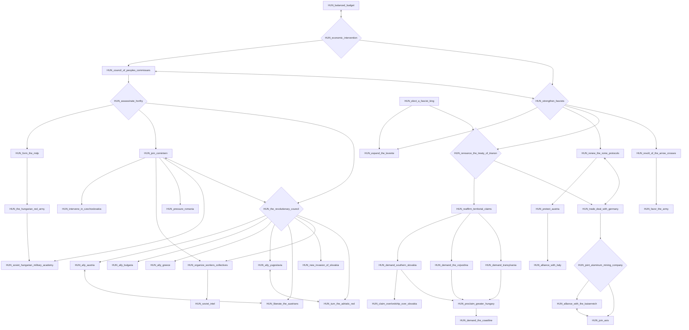
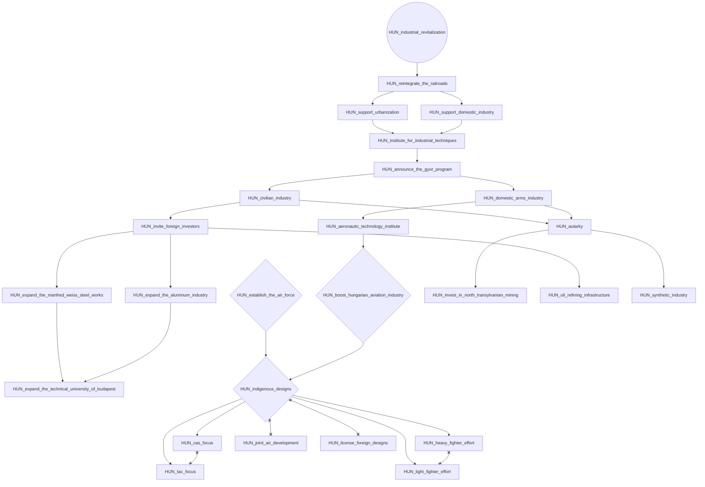
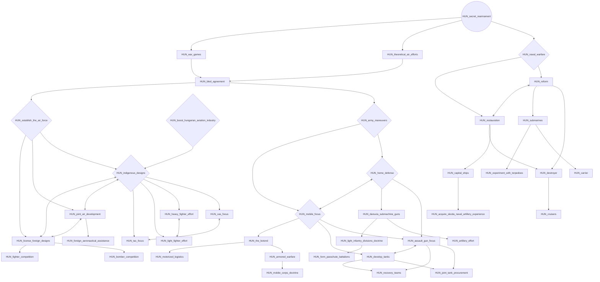

# HUN_balanced_budget

```mermaid
flowchart TD
    n1["HUN_alliance_with_the_kaiserreich"]
    n2["HUN_an_unlikely_alliance"]
    n3(("HUN_balanced_budget"))
    n4["HUN_claim_galicia"]
    n5["HUN_claim_overlordship_over_slovakia"]
    n6["HUN_claim_the_bucovina"]
    n7["HUN_claim_transylvania"]
    n8{"HUN_demand_a_referendum"}
    n9["HUN_demand_southern_slovakia"]
    n10["HUN_demand_the_coastline"]
    n11["HUN_demand_the_vojvodina"]
    n12["HUN_demand_transylvania"]
    n13["HUN_economic_intervention"]
    n14["HUN_elect_a_democratic_king"]
    n15["HUN_elect_a_fascist_king"]
    n16{"HUN_elect_a_king"}
    n17["HUN_expand_the_levente"]
    n18["HUN_fortification_cooperation"]
    n19["HUN_hungarian_minorities_recruitment_agreement"]
    n20["HUN_invite_croatia"]
    n21["HUN_invite_czechoslovakia"]
    n22{"HUN_invite_the_habsburg_prince"}
    n23["HUN_invite_yugoslavia"]
    n24["HUN_join_allies"]
    n25["HUN_join_axis"]
    n26["HUN_join_the_cordon_sanitaire"]
    n27["HUN_join_the_little_entente"]
    n28{"HUN_joint_aluminum_mining_company"}
    n29["HUN_joint_oil_exploitation_company"]
    n30["HUN_liechtenstein_treaty"]
    n31["HUN_march_to_the_shore"]
    n32["HUN_moderate_restoration"]
    n33["HUN_obtain_polish_cryptological_data"]
    n34["HUN_papal_blessing"]
    n35["HUN_proclaim_greater_hungary"]
    n36["HUN_proclaim_the_restoration_of_austria_hungary"]
    n37["HUN_protect_czechoslovakia"]
    n38["HUN_protect_ruthenia"]
    n39{"HUN_rapproachement_with_little_entente"}
    n40["HUN_reaffirm_territorial_claims"]
    n41["HUN_reclaim_the_empire"]
    n42["HUN_reclaim_venetia"]
    n43["HUN_renew_the_rome_protocols"]
    n44{"HUN_renounce_the_treaty_of_trianon"}
    n45["HUN_responsible_government"]
    n46["HUN_strengthen_fascists"]
    n47["HUN_strengthen_the_monarchists"]
    n48{"HUN_take_austria_by_force"}
    n49{"HUN_the_balkan_pact"}
    n50["HUN_trade_deal_with_germany"]
    n28 --> n1
    n49 --> n2
    n37 --> n4
    n9 --> n5
    n4 --> n6
    n37 --> n7
    n22 --> n8
    n40 --> n9
    n35 --> n10
    n40 --> n11
    n40 --> n12
    n16 --> n14
    n16 --> n15
    n47 --> n16
    n46 --> n17
    n15 --> n17
    n21 --> n18
    n38 --> n18
    n23 --> n18
    n2 --> n18
    n20 --> n18
    n27 --> n19
    n26 --> n19
    n24 --> n19
    n49 --> n19
    n49 --> n20
    n49 --> n21
    n16 --> n22
    n49 --> n23
    n39 --> n24
    n28 --> n25
    n39 --> n26
    n39 --> n27
    n50 --> n28
    n24 --> n29
    n32 --> n30
    n7 --> n31
    n8 --> n32
    n26 --> n33
    n24 --> n33
    n49 --> n33
    n32 --> n34
    n12 --> n35
    n9 --> n35
    n11 --> n35
    n8 --> n36
    n48 --> n36
    n36 --> n37
    n49 --> n38
    n45 --> n39
    n32 --> n39
    n44 --> n40
    n42 --> n41
    n6 --> n41
    n31 --> n42
    n46 --> n44
    n15 --> n44
    n14 --> n45
    n3 --> n47
    n22 --> n48
    n39 --> n49
    n44 --> n50
    n1 x--x n25
    n3 x--x n13
    n8 x--x n48
    n14 x--x n15
    n14 x--x n22
    n15 x--x n22
    n20 x--x n23
    n24 x--x n26
    n24 x--x n27
    n24 x--x n49
    n26 x--x n27
    n26 x--x n49
    n27 x--x n49
    n32 x--x n36
    n43 x--x n50
```

# HUN_economic_intervention

```mermaid
flowchart TD
    n51["HUN_alliance_with_italy"]
    n1["HUN_alliance_with_the_kaiserreich"]
    n52["HUN_ally_austria"]
    n53["HUN_ally_bulgaria"]
    n54["HUN_ally_greece"]
    n55["HUN_ally_yugoslavia"]
    n56{"HUN_assassinate_horthy"}
    n3["HUN_balanced_budget"]
    n5["HUN_claim_overlordship_over_slovakia"]
    n57["HUN_council_of_peoples_commissars"]
    n9["HUN_demand_southern_slovakia"]
    n10["HUN_demand_the_coastline"]
    n11["HUN_demand_the_vojvodina"]
    n12["HUN_demand_transylvania"]
    n13{"HUN_economic_intervention"}
    n15["HUN_elect_a_fascist_king"]
    n17["HUN_expand_the_levente"]
    n58["HUN_favor_the_army"]
    n59["HUN_form_the_mdp"]
    n60["HUN_intervene_in_czechoslovakia"]
    n25["HUN_join_axis"]
    n61["HUN_join_comintern"]
    n28{"HUN_joint_aluminum_mining_company"}
    n62["HUN_liberate_the_austrians"]
    n63["HUN_new_invasion_of_slovakia"]
    n64["HUN_organize_workers_collectives"]
    n65["HUN_pressure_romania"]
    n35["HUN_proclaim_greater_hungary"]
    n66["HUN_protect_austria"]
    n40["HUN_reaffirm_territorial_claims"]
    n43["HUN_renew_the_rome_protocols"]
    n44{"HUN_renounce_the_treaty_of_trianon"}
    n67["HUN_revolt_of_the_arrow_crosses"]
    n68["HUN_soviet_hungarian_military_academy"]
    n69["HUN_soviet_intel"]
    n46{"HUN_strengthen_fascists"}
    n70["HUN_the_hungarian_red_army"]
    n71{"HUN_the_revolutionary_council"}
    n50["HUN_trade_deal_with_germany"]
    n72["HUN_turn_the_adriatic_red"]
    n66 --> n51
    n28 --> n1
    n71 --> n52
    n71 --> n53
    n71 --> n54
    n71 --> n55
    n57 --> n56
    n9 --> n5
    n13 --> n57
    n40 --> n9
    n35 --> n10
    n40 --> n11
    n40 --> n12
    n46 --> n17
    n15 --> n17
    n67 --> n58
    n56 --> n59
    n61 --> n60
    n28 --> n25
    n56 --> n61
    n50 --> n28
    n71 --> n62
    n71 --> n63
    n61 --> n64
    n71 --> n64
    n61 --> n65
    n12 --> n35
    n9 --> n35
    n11 --> n35
    n43 --> n66
    n44 --> n40
    n46 --> n43
    n46 --> n44
    n15 --> n44
    n46 --> n67
    n70 --> n68
    n61 --> n68
    n64 --> n69
    n13 --> n46
    n59 --> n70
    n56 --> n71
    n44 --> n50
    n71 --> n72
    n1 x--x n25
    n52 x--x n62
    n55 x--x n72
    n3 x--x n13
    n57 x--x n46
    n61 x--x n71
    n43 x--x n50
```

# HUN_industrial_revitalization

```mermaid
flowchart TD
    n73["HUN_aeronautic_technology_institute"]
    n74["HUN_announce_the_gyor_program"]
    n75["HUN_autarky"]
    n76{"HUN_boost_hungarian_aviation_industry"}
    n77["HUN_cas_focus"]
    n78["HUN_civilian_industry"]
    n79["HUN_domestic_arms_industry"]
    n80{"HUN_establish_the_air_force"}
    n81["HUN_expand_the_aluminum_industry"]
    n82["HUN_expand_the_manfred_weiss_steel_works"]
    n83["HUN_expand_the_technical_university_of_budapest"]
    n84["HUN_heavy_fighter_effort"]
    n85{"HUN_indigenous_designs"}
    n86(("HUN_industrial_revitalization"))
    n87["HUN_institute_for_industrial_techniques"]
    n88["HUN_invest_in_north_transylvanian_mining"]
    n89["HUN_invite_foreign_investors"]
    n90["HUN_joint_air_development"]
    n91["HUN_license_foreign_designs"]
    n92["HUN_light_fighter_effort"]
    n93["HUN_oil_refining_infrastructure"]
    n94["HUN_reintegrate_the_railroads"]
    n95["HUN_support_domestic_industry"]
    n96["HUN_support_urbanization"]
    n97["HUN_synthetic_industry"]
    n98["HUN_tac_focus"]
    n79 --> n73
    n87 --> n74
    n78 --> n75
    n79 --> n75
    n73 --> n76
    n85 --> n77
    n74 --> n78
    n74 --> n79
    n89 --> n81
    n89 --> n82
    n82 --> n83
    n81 --> n83
    n85 --> n84
    n80 --> n85
    n76 --> n85
    n96 --> n87
    n95 --> n87
    n75 --> n88
    n78 --> n89
    n85 --> n92
    n89 --> n93
    n86 --> n94
    n94 --> n95
    n94 --> n96
    n75 --> n97
    n85 --> n98
    n77 x--x n98
    n84 x--x n92
    n85 x--x n90
    n85 x--x n91
```

# HUN_secret_rearmament

```mermaid
flowchart TD
    n99["HUN_acquire_skoda_naval_artillery_experience"]
    n100["HUN_armored_warfare"]
    n101{"HUN_army_maneuvers"}
    n102["HUN_artillery_effort"]
    n103["HUN_assault_gun_focus"]
    n104["HUN_bled_agreement"]
    n105["HUN_bomber_competition"]
    n76{"HUN_boost_hungarian_aviation_industry"}
    n106["HUN_capital_ships"]
    n107["HUN_carrier"]
    n77["HUN_cas_focus"]
    n108["HUN_cruisers"]
    n109["HUN_danuvia_submachine_guns"]
    n110["HUN_destroyer"]
    n111["HUN_develop_tanks"]
    n80{"HUN_establish_the_air_force"}
    n112["HUN_experiment_with_torpedoes"]
    n113["HUN_fighter_competition"]
    n114["HUN_foreign_aeronautical_assistance"]
    n115["HUN_form_parachute_battalions"]
    n84["HUN_heavy_fighter_effort"]
    n116{"HUN_home_defense"}
    n85{"HUN_indigenous_designs"}
    n90["HUN_joint_air_development"]
    n117["HUN_joint_tank_procurement"]
    n91["HUN_license_foreign_designs"]
    n92["HUN_light_fighter_effort"]
    n118["HUN_light_infantry_divisions_doctrine"]
    n119["HUN_mobile_corps_doctrine"]
    n120{"HUN_mobile_focus"}
    n121["HUN_motorized_logistics"]
    n122{"HUN_naval_warfare"}
    n123["HUN_recovery_teams"]
    n124["HUN_reform"]
    n125["HUN_restauration"]
    n126(("HUN_secret_rearmament"))
    n127["HUN_submarines"]
    n98["HUN_tac_focus"]
    n128["HUN_the_botond"]
    n129["HUN_theoretical_air_efforts"]
    n130["HUN_war_games"]
    n106 --> n99
    n128 --> n100
    n104 --> n101
    n109 --> n102
    n120 --> n103
    n116 --> n103
    n130 --> n104
    n129 --> n104
    n91 --> n105
    n125 --> n106
    n127 --> n107
    n85 --> n77
    n110 --> n108
    n116 --> n109
    n125 --> n110
    n124 --> n110
    n120 --> n111
    n104 --> n80
    n127 --> n112
    n91 --> n113
    n90 --> n114
    n118 --> n115
    n85 --> n84
    n101 --> n116
    n80 --> n85
    n76 --> n85
    n80 --> n90
    n111 --> n117
    n103 --> n117
    n80 --> n91
    n85 --> n92
    n109 --> n118
    n100 --> n119
    n101 --> n120
    n128 --> n121
    n126 --> n122
    n111 --> n123
    n103 --> n123
    n122 --> n124
    n122 --> n125
    n124 --> n127
    n85 --> n98
    n120 --> n128
    n126 --> n129
    n126 --> n130
    n103 x--x n111
    n77 x--x n98
    n84 x--x n92
    n116 x--x n120
    n85 x--x n90
    n85 x--x n91
    n90 x--x n91
    n124 x--x n125
```
