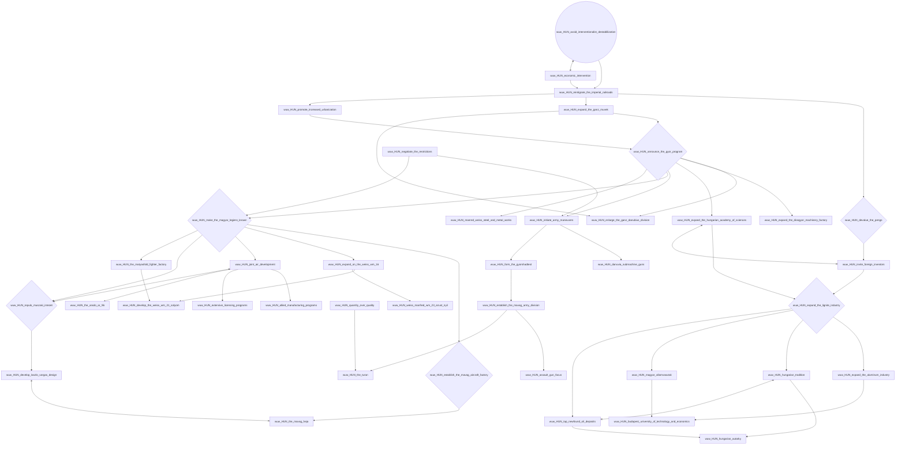
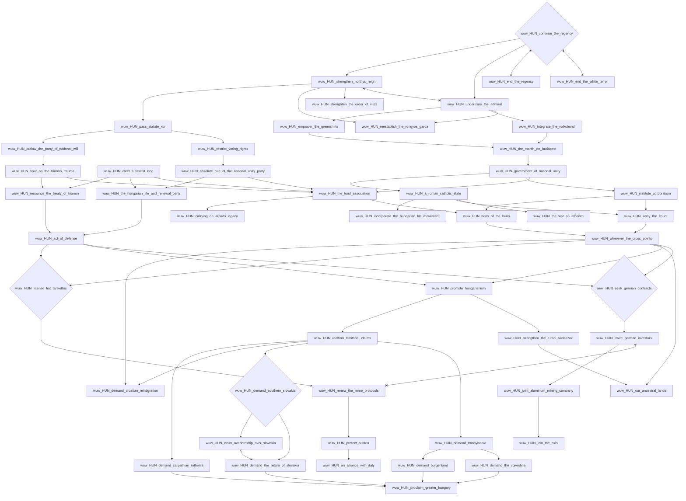
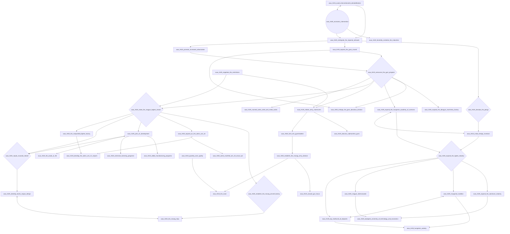
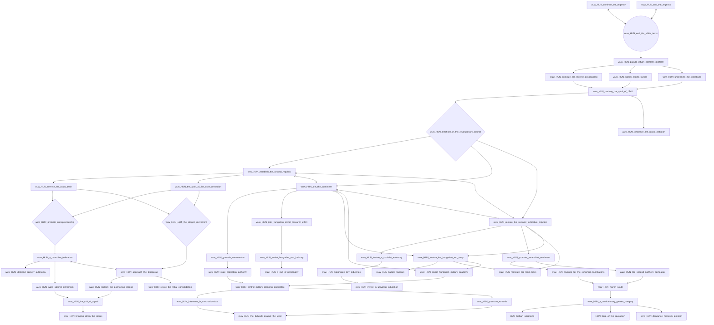
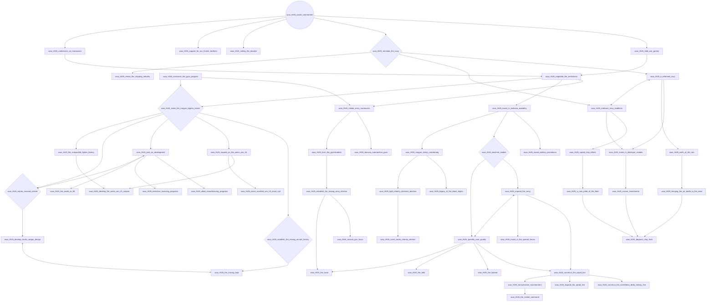

# wuw_HUN_avoid_interventionalist_destablilization

# wuw_HUN_continue_the_regency

# wuw_HUN_economic_intervention

# wuw_HUN_end_the_regency

```mermaid
flowchart TD
    n92["wuw_HUN_a_bulwark_against_communism"]
    n93["wuw_HUN_a_declaration_of_intentions"]
    n94["wuw_HUN_a_grand_habsburg_alliance"]
    n95["wuw_HUN_a_habsburg_poland"]
    n96["wuw_HUN_a_holy_empire"]
    n97["wuw_HUN_a_hungarian_galicia"]
    n98["wuw_HUN_a_mobile_army"]
    n99["wuw_HUN_a_multi_ethnic_empire"]
    n100["wuw_HUN_a_responsible_government"]
    n101["wuw_HUN_a_unifying_heritage"]
    n102{"wuw_HUN_abide_by_the_little_ententes_stipulations"}
    n42["wuw_HUN_absolute_rule_of_the_national_unity_party"]
    n43["wuw_HUN_act_of_defense"]
    n103["wuw_HUN_aid_the_carlist_struggle"]
    n104["wuw_HUN_an_airforce_to_be_reckoned_with"]
    n44["wuw_HUN_an_alliance_with_italy"]
    n105["wuw_HUN_anglo_hungarian_alliance"]
    n106["wuw_HUN_attempt_economic_independence"]
    n107["wuw_HUN_cancel_the_german_trade_deal"]
    n45["wuw_HUN_carrying_on_arpads_legacy"]
    n46["wuw_HUN_claim_overlordship_over_slovakia"]
    n47["wuw_HUN_continue_the_regency"]
    n108["wuw_HUN_crack_down_on_radicals"]
    n109{"wuw_HUN_demand_austrian_restoration"}
    n48["wuw_HUN_demand_burgenland"]
    n49["wuw_HUN_demand_carpathian_ruthenia"]
    n50["wuw_HUN_demand_croatian_reintigration"]
    n51{"wuw_HUN_demand_southern_slovakia"}
    n52["wuw_HUN_demand_the_return_of_slovakia"]
    n53["wuw_HUN_demand_the_vojvodina"]
    n54["wuw_HUN_demand_transylvania"]
    n110["wuw_HUN_demand_wiedist_restoration"]
    n111{"wuw_HUN_dissolve_the_volksbund"}
    n112["wuw_HUN_elect_a_democratic_king"]
    n55["wuw_HUN_elect_a_fascist_king"]
    n113["wuw_HUN_enact_agrarian_reform"]
    n57(("wuw_HUN_end_the_regency"))
    n58["wuw_HUN_end_the_white_terror"]
    n114["wuw_HUN_establishing_a_new_dynasty"]
    n115["wuw_HUN_establishing_a_royal_guard"]
    n59["wuw_HUN_government_of_national_unity"]
    n116{"wuw_HUN_guarantee_religious_liberties"}
    n117["wuw_HUN_habsburg_ascension_in_spain"]
    n60["wuw_HUN_heirs_of_the_huns"]
    n118["wuw_HUN_hold_territorial_referendums"]
    n119["wuw_HUN_honor_the_great_war_veterans"]
    n120["wuw_HUN_increase_economic_cooperation"]
    n62["wuw_HUN_institute_corporatism"]
    n121["wuw_HUN_integrate_bohemian_and_austrian_industries"]
    n64["wuw_HUN_invite_german_investors"]
    n122["wuw_HUN_invite_otto_to_the_throne"]
    n123["wuw_HUN_join_the_allies"]
    n65["wuw_HUN_join_the_axis"]
    n66["wuw_HUN_joint_aluminum_mining_company"]
    n124["wuw_HUN_joint_oil_exploitation_company"]
    n67{"wuw_HUN_license_fiat_tankettes"}
    n125{"wuw_HUN_magyar_cserkeszszovetseg"}
    n126["wuw_HUN_on_a_high_horse"]
    n68["wuw_HUN_our_ancestral_lands"]
    n127["wuw_HUN_press_maximilians_and_the_iturbides_claims"]
    n71["wuw_HUN_proclaim_greater_hungary"]
    n72["wuw_HUN_promote_hungarianism"]
    n73["wuw_HUN_protect_austria"]
    n128["wuw_HUN_protect_czechoslovakia"]
    n129["wuw_HUN_purchase_burgenland"]
    n130{"wuw_HUN_reach_out_to_candidates"}
    n74["wuw_HUN_reaffirm_territorial_claims"]
    n131["wuw_HUN_reclaim_the_holy_city"]
    n132{"wuw_HUN_reclaim_the_slovak_possessions"}
    n133["wuw_HUN_reclaim_transylvania"]
    n134["wuw_HUN_reenlist_the_sich_riflemen"]
    n135{"wuw_HUN_reinstate_the_pragmatic_sanction"}
    n136["wuw_HUN_reintigrate_slovakia"]
    n76["wuw_HUN_renew_the_rome_protocols"]
    n77["wuw_HUN_renounce_the_treaty_of_trianon"]
    n137["wuw_HUN_renovato_imperii"]
    n138["wuw_HUN_restore_the_duchy_of_teschen"]
    n139["wuw_HUN_restore_the_georgian_monarchy"]
    n140["wuw_HUN_restore_the_lombardo_venetian_kingdom"]
    n141{"wuw_HUN_revenge_for_1919"}
    n142["wuw_HUN_revenge_for_the_brusilov_offensive"]
    n143["wuw_HUN_reverse_the_risorgimento"]
    n144["wuw_HUN_royal_hussars"]
    n145["wuw_HUN_royalist_education_initiative"]
    n146["wuw_HUN_secure_army_loyalty"]
    n147["wuw_HUN_seek_an_alliance_with_the_kaiser"]
    n79{"wuw_HUN_seek_german_contracts"}
    n80["wuw_HUN_spur_on_the_trianon_trauma"]
    n148["wuw_HUN_stage_an_uprising_in_leitha"]
    n83["wuw_HUN_strengthen_the_turani_vadaszok"]
    n149["wuw_HUN_subvert_gombos_troops"]
    n84["wuw_HUN_sway_the_count"]
    n150["wuw_HUN_the_balkan_pact"]
    n151["wuw_HUN_the_bastion_of_catholicism"]
    n85["wuw_HUN_the_hungarian_life_and_renewal_party"]
    n152["wuw_HUN_the_kingdom_of_ukraine"]
    n153["wuw_HUN_the_lands_of_the_crown_of_saint_stephen"]
    n154["wuw_HUN_the_legacy_of_arpad_andrew_and_matthias"]
    n155["wuw_HUN_the_legacy_of_the_isonzo_front"]
    n156["wuw_HUN_the_old_grand_alliance"]
    n157["wuw_HUN_the_old_habsburg_king"]
    n158["wuw_HUN_the_triple_kingdom"]
    n87["wuw_HUN_the_turul_association"]
    n159{"wuw_HUN_undoing_the_yugoslav_mistake"}
    n160["wuw_HUN_volksbund_der_deutschen_in_ungarn"]
    n90["wuw_HUN_wherever_the_cross_points"]
    n141 --> n92
    n132 --> n92
    n159 --> n92
    n101 --> n93
    n154 --> n93
    n109 --> n94
    n94 --> n95
    n131 --> n96
    n133 --> n97
    n125 --> n98
    n131 --> n99
    n97 --> n99
    n112 --> n100
    n145 --> n101
    n130 --> n102
    n77 --> n43
    n85 --> n43
    n135 --> n103
    n111 --> n104
    n73 --> n44
    n145 --> n105
    n157 --> n106
    n122 --> n106
    n114 --> n107
    n112 --> n107
    n87 --> n45
    n51 --> n46
    n57 --> n108
    n153 --> n109
    n54 --> n48
    n74 --> n49
    n74 --> n50
    n90 --> n50
    n74 --> n51
    n51 --> n52
    n54 --> n53
    n74 --> n54
    n147 --> n110
    n94 --> n110
    n115 --> n111
    n102 --> n112
    n102 --> n55
    n151 --> n113
    n102 --> n114
    n114 --> n115
    n100 --> n116
    n94 --> n117
    n62 --> n60
    n87 --> n60
    n150 --> n118
    n123 --> n118
    n157 --> n119
    n112 --> n120
    n97 --> n121
    n79 --> n64
    n135 --> n122
    n116 --> n123
    n66 --> n65
    n64 --> n66
    n123 --> n124
    n43 --> n67
    n90 --> n67
    n115 --> n125
    n141 --> n126
    n132 --> n126
    n159 --> n126
    n83 --> n68
    n90 --> n68
    n94 --> n127
    n49 --> n71
    n53 --> n71
    n48 --> n71
    n52 --> n71
    n43 --> n72
    n90 --> n72
    n76 --> n73
    n109 --> n128
    n113 --> n129
    n149 --> n130
    n108 --> n130
    n72 --> n74
    n140 --> n131
    n93 --> n132
    n128 --> n133
    n94 --> n134
    n130 --> n135
    n128 --> n136
    n67 --> n76
    n80 --> n77
    n55 --> n77
    n96 --> n137
    n121 --> n137
    n99 --> n137
    n128 --> n138
    n152 --> n139
    n158 --> n140
    n93 --> n141
    n155 --> n142
    n140 --> n143
    n146 --> n144
    n104 --> n145
    n98 --> n145
    n106 --> n146
    n109 --> n147
    n43 --> n79
    n90 --> n79
    n101 --> n148
    n72 --> n83
    n57 --> n149
    n116 --> n150
    n157 --> n151
    n42 --> n85
    n55 --> n85
    n134 --> n152
    n122 --> n153
    n113 --> n154
    n119 --> n155
    n109 --> n156
    n135 --> n157
    n128 --> n158
    n42 --> n87
    n59 --> n87
    n80 --> n87
    n55 --> n87
    n93 --> n159
    n55 --> n160
    n60 --> n90
    n84 --> n90
    n92 x--x n126
    n94 x--x n147
    n94 x--x n156
    n98 x--x n104
    n102 x--x n135
    n46 x--x n52
    n47 x--x n57
    n112 x--x n55
    n112 x--x n114
    n55 x--x n114
    n57 x--x n58
    n64 x--x n76
    n122 x--x n157
    n123 x--x n150
    n147 x--x n156
```

# wuw_HUN_end_the_white_terror

# wuw_HUN_secret_rearmament

