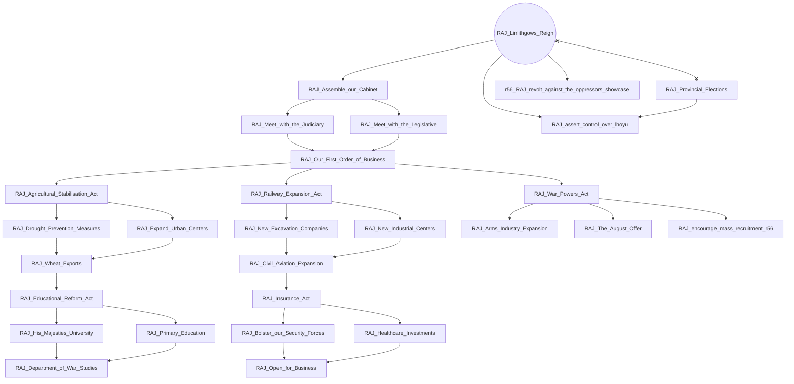

# RAJ_Linlithgows_Reign

```mermaid
flowchart TD
    n1["RAJ_Agricultural_Stabilisation_Act"]
    n2["RAJ_Arms_Industry_Expansion"]
    n3["RAJ_Assemble_our_Cabinet"]
    n4["RAJ_Bolster_our_Security_Forces"]
    n5["RAJ_Civil_Aviation_Expansion"]
    n6["RAJ_Department_of_War_Studies"]
    n7["RAJ_Drought_Prevention_Measures"]
    n8["RAJ_Educational_Reform_Act"]
    n9["RAJ_Expand_Urban_Centers"]
    n10["RAJ_Healthcare_Investments"]
    n11["RAJ_His_Majesties_University"]
    n12["RAJ_Insurance_Act"]
    n13(("RAJ_Linlithgows_Reign"))
    n14["RAJ_Meet_with_the_Judiciary"]
    n15["RAJ_Meet_with_the_Legislative"]
    n16["RAJ_New_Excavation_Companies"]
    n17["RAJ_New_Industrial_Centers"]
    n18["RAJ_Open_for_Business"]
    n19["RAJ_Our_First_Order_of_Business"]
    n20["RAJ_Primary_Education"]
    n21["RAJ_Provincial_Elections"]
    n22["RAJ_Railway_Expansion_Act"]
    n23["RAJ_The_August_Offer"]
    n24["RAJ_War_Powers_Act"]
    n25["RAJ_Wheat_Exports"]
    n26["RAJ_assert_control_over_lhoyu"]
    n27["RAJ_encourage_mass_recruitment_r56"]
    n28["r56_RAJ_revolt_against_the_oppressors_showcase"]
    n19 --> n1
    n24 --> n2
    n13 --> n3
    n12 --> n4
    n16 --> n5
    n17 --> n5
    n20 --> n6
    n11 --> n6
    n1 --> n7
    n25 --> n8
    n1 --> n9
    n12 --> n10
    n8 --> n11
    n5 --> n12
    n3 --> n14
    n3 --> n15
    n22 --> n16
    n22 --> n17
    n4 --> n18
    n10 --> n18
    n14 --> n19
    n15 --> n19
    n8 --> n20
    n19 --> n22
    n24 --> n23
    n19 --> n24
    n9 --> n25
    n7 --> n25
    n13 --> n26
    n21 --> n26
    n24 --> n27
    n13 --> n28
    n13 x--x n21
```

# RAJ_Provincial_Elections

```mermaid
flowchart TD
    n29["RAJ_A_New_Movement"]
    n30["RAJ_A_New_Way_Forward"]
    n31["RAJ_A_Society_of_All_Classes"]
    n32["RAJ_A_Truly_Indian_Navy"]
    n33["RAJ_Abolish_the_Reservation_System"]
    n34["RAJ_Agricultural_Collectivisation"]
    n35["RAJ_Ally_with_the_Muslim_League"]
    n36["RAJ_An_Offer_for_Rajagopalachari"]
    n37["RAJ_Answer_The_Call"]
    n38{"RAJ_Appeal_to_Anglo_Indians"}
    n39["RAJ_Appeal_to_the_Lower_Castes"]
    n40["RAJ_Appeal_to_the_Peasentry"]
    n41["RAJ_Aquire_War_Material"]
    n42["RAJ_Armed_Neutrality"]
    n43["RAJ_Asian_Anti_Colonialism"]
    n44{"RAJ_Assemble_the_Constitutional_Assembly"}
    n45{"RAJ_Azads_Support"}
    n46["RAJ_Bind_South_Asia_Closer"]
    n47["RAJ_Bring_Democracy_to_South_Asia"]
    n48["RAJ_Broaden_our_Coalition"]
    n49["RAJ_Caste_Reform"]
    n50["RAJ_Central_Bureau_of_Investigation"]
    n51["RAJ_Centralize_the_Party"]
    n52["RAJ_Combat_Institutional_Corruption"]
    n53["RAJ_Concessions_to_Princes"]
    n54["RAJ_Connect_the_Rural_Areas"]
    n55["RAJ_Constitutional_Minority_Protections"]
    n56["RAJ_Content_for_British_Rule"]
    n57["RAJ_Crackdown_on_Radicalism"]
    n58["RAJ_Cut_down_on_Tariffs"]
    n59{"RAJ_Danges_Influence"}
    n60["RAJ_Democracy_and_Socialism"]
    n61["RAJ_Dismantle_the_Judicial_System"]
    n62["RAJ_Emphasise_Anti_Colonialist_Sentiment"]
    n63["RAJ_Equal_Partners"]
    n64{"RAJ_Establish_The_Revolutionary_Guard"}
    n65["RAJ_Establish_a_Central_Committee"]
    n66["RAJ_Establish_a_National_Government"]
    n67["RAJ_Establish_a_Precense_in_Sindh"]
    n68["RAJ_Expand_Delhi_University"]
    n69["RAJ_Expand_Healthcare_Facilities"]
    n70["RAJ_Expand_Soviet_Aid"]
    n71["RAJ_Expand_our_Ordance_Industry"]
    n72["RAJ_Extensive_Agricultural_Subsidies"]
    n73["RAJ_Federalisation"]
    n74["RAJ_Federalize_Education"]
    n75["RAJ_Fight_the_Muslim_League"]
    n76["RAJ_Fighting_Tyranny_whereever_it_may_be"]
    n77["RAJ_Foster_Mining_Jobs"]
    n78["RAJ_Gather_Industrial_Funds"]
    n79["RAJ_Implement_Equal_Education"]
    n80["RAJ_Incentivize_Workplace_Democracy"]
    n81["RAJ_Independent_Labour_Party"]
    n82["RAJ_India_United_under_Britain"]
    n83["RAJ_Indian_National_Congress"]
    n84["RAJ_Indo_Soviet_Friendship_Treaty"]
    n85["RAJ_Institute_The_Draft"]
    n86["RAJ_Integrate_the_Princely_States"]
    n87["RAJ_Internal_Security_Act"]
    n88["RAJ_Intervention_in_Pakistan"]
    n89["RAJ_Invite_International_Theorists"]
    n90["RAJ_Invite_Soviet_Planners"]
    n91{"RAJ_Jinnahs_Kingdom"}
    n92["RAJ_Launch_The_Quit_India_Movement"]
    n13["RAJ_Linlithgows_Reign"]
    n93["RAJ_Local_Organization"]
    n94["RAJ_Loosen_Rupee_Exchange"]
    n95["RAJ_Military_Cooperation"]
    n96["RAJ_Mutual_Investments"]
    n97{"RAJ_National_Unity"}
    n98{"RAJ_Nehrus_Campaign"}
    n99["RAJ_Nehrus_Candidacy"]
    n100["RAJ_Nehrus_Vision_for_India"]
    n101["RAJ_New_Leadership"]
    n102["RAJ_No_Compromises"]
    n103["RAJ_No_Resentments"]
    n104["RAJ_Offer_the_British_Concessions"]
    n105["RAJ_Organize_a_Conference"]
    n106["RAJ_Outwards_to_the_World"]
    n107["RAJ_Overthrow_the_Rana_dynasty"]
    n108{"RAJ_Pillais_Influence"}
    n109["RAJ_Placate_the_British"]
    n110["RAJ_Placate_the_Nobles"]
    n111["RAJ_Prepare_the_Lucknow_Session"]
    n112["RAJ_Protect_the_Arabian_Sea"]
    n21{"RAJ_Provincial_Elections"}
    n113["RAJ_Reconect_broken_up_Industries"]
    n114["RAJ_Reestablish_our_Armed_Forces"]
    n115["RAJ_Reform_our_Police_Force"]
    n116["RAJ_Relieve_the_Administrative_Burden"]
    n117["RAJ_Reproachment_with_the_West"]
    n118["RAJ_Rethink_Resource_Policy"]
    n119{"RAJ_Revise_Taxation_Policies"}
    n120["RAJ_Secure_Rural_Hindus"]
    n121["RAJ_Seize_Influence_from_Upper_Castes"]
    n122["RAJ_Seize_the_Means"]
    n123["RAJ_Siphon_Congress_Ministers"]
    n124["RAJ_Sit_Down_with_the_Farmers"]
    n125["RAJ_Socialist_Science"]
    n126["RAJ_Strengthen_Liberal_Elements"]
    n127["RAJ_Subvert_Stalinist_Influence"]
    n128{"RAJ_Take_back_the_Ports"}
    n129["RAJ_Technological_Cooperation"]
    n130["RAJ_The_Bhutanese_Revolt"]
    n131["RAJ_The_Ceylon_Emergency"]
    n132["RAJ_The_Liberation_of_South_Asia"]
    n133["RAJ_The_Non_Aligned_Movement"]
    n134["RAJ_The_Ones_Who_Got_Away"]
    n135{"RAJ_The_Remaining_Ports"}
    n136["RAJ_The_Third_International"]
    n137["RAJ_The_Womens_Status"]
    n138["RAJ_Thorough_Corruption_Audits"]
    n139["RAJ_Token_Social_Reform"]
    n140["RAJ_Unionist_Party"]
    n141["RAJ_Unity_in_India"]
    n142["RAJ_Want_Peace_Prepare_for_War"]
    n26["RAJ_assert_control_over_lhoyu"]
    n143["RAJ_of_Distribution"]
    n144{"RAJ_of_Exchange"}
    n145["RAJ_of_Production"]
    n135 --> n29
    n91 --> n29
    n128 --> n30
    n119 --> n30
    n39 --> n31
    n93 --> n31
    n51 --> n31
    n85 --> n32
    n61 --> n33
    n90 --> n34
    n89 --> n34
    n38 --> n35
    n111 --> n36
    n71 --> n37
    n140 --> n38
    n105 --> n39
    n67 --> n40
    n75 --> n40
    n85 --> n41
    n30 --> n42
    n29 --> n43
    n136 --> n43
    n60 --> n44
    n111 --> n45
    n99 --> n45
    n136 --> n46
    n29 --> n46
    n103 --> n47
    n98 --> n48
    n45 --> n48
    n137 --> n49
    n74 --> n49
    n86 --> n50
    n108 --> n51
    n121 --> n52
    n64 --> n53
    n143 --> n54
    n74 --> n55
    n38 --> n56
    n68 --> n57
    n126 --> n58
    n101 --> n59
    n48 --> n60
    n120 --> n60
    n121 --> n61
    n30 --> n62
    n103 --> n63
    n69 --> n64
    n33 --> n64
    n52 --> n64
    n90 --> n65
    n86 --> n66
    n82 --> n66
    n97 --> n67
    n74 --> n68
    n79 --> n69
    n90 --> n70
    n124 --> n71
    n100 --> n72
    n109 --> n73
    n87 --> n73
    n141 --> n74
    n97 --> n75
    n85 --> n76
    n72 --> n77
    n140 --> n78
    n121 --> n79
    n89 --> n80
    n21 --> n81
    n56 --> n82
    n40 --> n82
    n123 --> n82
    n21 --> n83
    n100 --> n84
    n37 --> n85
    n110 --> n85
    n82 --> n86
    n60 --> n86
    n115 --> n87
    n110 --> n87
    n60 --> n88
    n144 --> n89
    n144 --> n90
    n132 --> n91
    n60 --> n92
    n59 --> n93
    n58 --> n94
    n46 --> n95
    n103 --> n96
    n106 --> n96
    n140 --> n97
    n99 --> n98
    n83 --> n99
    n44 --> n100
    n81 --> n101
    n64 --> n102
    n128 --> n103
    n119 --> n103
    n82 --> n104
    n81 --> n105
    n128 --> n106
    n119 --> n106
    n132 --> n107
    n101 --> n108
    n105 --> n108
    n110 --> n109
    n66 --> n110
    n124 --> n110
    n83 --> n111
    n103 --> n112
    n94 --> n113
    n86 --> n114
    n114 --> n115
    n66 --> n115
    n138 --> n116
    n126 --> n117
    n34 --> n118
    n89 --> n118
    n50 --> n119
    n98 --> n120
    n31 --> n121
    n31 --> n122
    n75 --> n123
    n35 --> n123
    n82 --> n124
    n136 --> n125
    n44 --> n126
    n105 --> n127
    n114 --> n128
    n46 --> n129
    n132 --> n130
    n132 --> n131
    n31 --> n132
    n30 --> n133
    n114 --> n134
    n132 --> n135
    n135 --> n136
    n91 --> n136
    n141 --> n137
    n58 --> n138
    n124 --> n139
    n21 --> n140
    n126 --> n141
    n100 --> n141
    n100 --> n142
    n13 --> n26
    n21 --> n26
    n122 --> n143
    n143 --> n144
    n145 --> n144
    n122 --> n145
    n29 x--x n136
    n30 x--x n103
    n30 x--x n106
    n35 x--x n75
    n48 x--x n120
    n51 x--x n93
    n53 x--x n102
    n81 x--x n83
    n81 x--x n140
    n83 x--x n140
    n89 x--x n90
    n13 x--x n21
    n100 x--x n126
    n103 x--x n106
```
