# RAJ_ammunition_factory_khadki

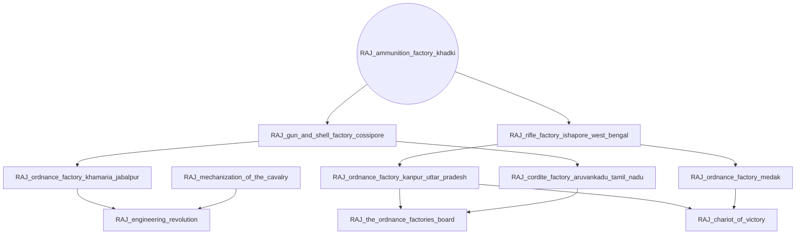

# RAJ_bombay_baroda_and_central_india_railway

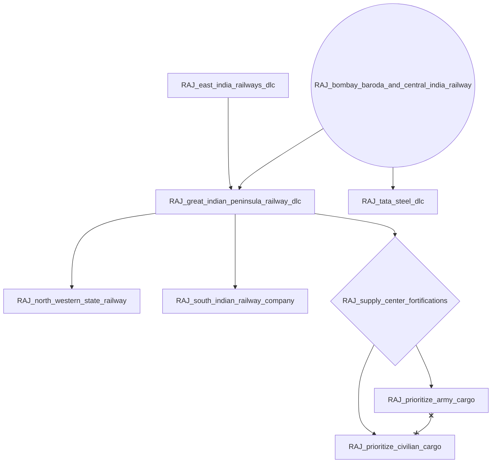

# RAJ_east_india_railways_dlc

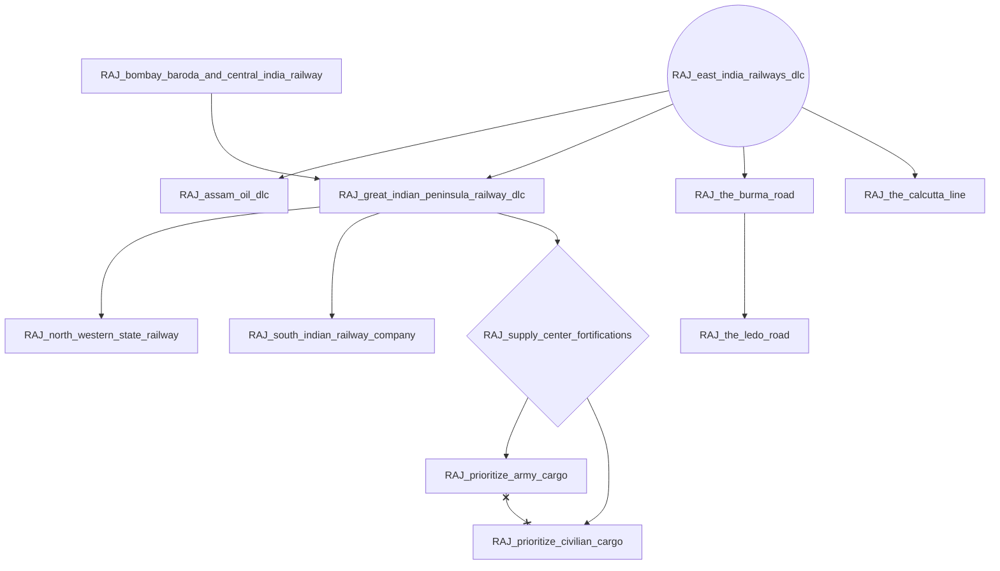

# RAJ_great_depression_price_controls

```mermaid
flowchart TD
    n25["RAJ_a_peacock_prince"]
    n26["RAJ_a_private_military"]
    n27{"RAJ_acquire_new_resources"}
    n28["RAJ_across_the_himalayas"]
    n29["RAJ_appoint_a_c_suite"]
    n30["RAJ_arrest_congress_leaders"]
    n31["RAJ_attract_scientists"]
    n32["RAJ_bombay_trade_port"]
    n33["RAJ_circuvment_demobilization_restrictions"]
    n34["RAJ_company_bonuses"]
    n35["RAJ_conquer_afghanistan"]
    n36["RAJ_conquerors_of_iraq"]
    n37["RAJ_conquerors_of_persia"]
    n38["RAJ_conquerors_of_turkey"]
    n39["RAJ_corporate_domination"]
    n40["RAJ_corporate_expansion"]
    n41["RAJ_creative_accounting"]
    n42["RAJ_crush_the_anathema"]
    n43["RAJ_deathknell_to_the_raj"]
    n44["RAJ_debt_manipulation"]
    n45["RAJ_deforestation"]
    n46["RAJ_elephants_for_the_modern_age"]
    n47["RAJ_expand_tax_loopholes"]
    n48["RAJ_force_china_to_accept_opium_trade"]
    n49["RAJ_forging_the_mughal_arsenal"]
    n50["RAJ_form_a_police_force"]
    n51["RAJ_fortify_aden"]
    n52["RAJ_funnel_british_investments_into_princely_states"]
    n53{"RAJ_great_depression_price_controls"}
    n54["RAJ_halls_of_knowledge"]
    n55["RAJ_halls_of_knowledge_2"]
    n56["RAJ_halls_of_knowledge_3"]
    n57["RAJ_headhunt_army_personell"]
    n58["RAJ_his_majestys_loyal_government"]
    n59["RAJ_hostile_takeover"]
    n60["RAJ_incorporation_of_the_east_india_company"]
    n61["RAJ_institutional_money_laundering"]
    n62["RAJ_just_good_business"]
    n63["RAJ_land_grab"]
    n64["RAJ_legacy_of_timur"]
    n65["RAJ_legalize_the_opium_trade"]
    n66["RAJ_lobby_for_increased_policing_responsibilities"]
    n67["RAJ_lobby_parliment"]
    n68["RAJ_look_to_the_future"]
    n69["RAJ_look_to_the_past"]
    n70["RAJ_manipulate_army_statistics"]
    n71["RAJ_mass_production"]
    n72["RAJ_mineral_exploitation_institute"]
    n73["RAJ_mughal_court"]
    n74["RAJ_new_economic_policy"]
    n75["RAJ_night_shifts"]
    n76["RAJ_nothing_personal"]
    n77["RAJ_open_up_new_markets"]
    n78["RAJ_peacock_throne_for_the_modern_age"]
    n79["RAJ_phantom_armies"]
    n80["RAJ_princely_autonomy"]
    n81["RAJ_privatized_healthcare"]
    n82["RAJ_privatized_tutelage"]
    n83["RAJ_procure_the_armor"]
    n84["RAJ_procure_the_guns"]
    n85["RAJ_procure_the_task_force"]
    n86["RAJ_productivity_mandate"]
    n87["RAJ_provincial_autonomy"]
    n88["RAJ_purchase_cruisers_and_dreadnoughts"]
    n89["RAJ_purchase_destroyers_and_subs"]
    n90["RAJ_rebuilding_the_empires_roads"]
    n91["RAJ_reform_the_agricultural_system"]
    n92["RAJ_restore_the_timurid_empire"]
    n93["RAJ_restrictive_administration_budget"]
    n94["RAJ_revisiting_inquities"]
    n95["RAJ_reviving_the_workshop_of_the_world"]
    n96["RAJ_revolt_of_the_princes"]
    n97["RAJ_secret_weapons"]
    n98["RAJ_secular_rule"]
    n99["RAJ_secure_weapons"]
    n100["RAJ_seek_intial_funding"]
    n101["RAJ_shareholder_democracy"]
    n102["RAJ_sharpen_the_tulwar"]
    n103["RAJ_special_economic_zones"]
    n104["RAJ_stir_unrest_in_the_north"]
    n105["RAJ_take_in_british_naval_experts"]
    n106["RAJ_take_over_administrative_rights"]
    n107["RAJ_the_crown_and_the_world"]
    n108["RAJ_the_legacy_of_babur"]
    n109["RAJ_the_mughal_uprising"]
    n110["RAJ_the_need_for_a_mercantile_navy"]
    n111["RAJ_the_silk_road"]
    n112["RAJ_the_true_mongols"]
    n113["RAJ_the_varuna_class"]
    n114["RAJ_theocratic_rule"]
    n115["RAJ_through_the_wakhan_corridor"]
    n116["RAJ_thunder_elephants"]
    n117["RAJ_timurid_bureaucracy"]
    n118["RAJ_trade_federation_of_india"]
    n119["RAJ_trade_port"]
    n120["RAJ_trade_protection"]
    n121["RAJ_union_busting"]
    n122{"RAJ_unite_the_subcontinent"}
    n123["RAJ_vertical_integration"]
    n108 --> n25
    n57 --> n26
    n77 --> n27
    n111 --> n28
    n60 --> n29
    n121 --> n30
    n72 --> n31
    n66 --> n32
    n66 --> n33
    n29 --> n34
    n117 --> n35
    n37 --> n36
    n111 --> n37
    n37 --> n38
    n79 --> n39
    n29 --> n40
    n47 --> n41
    n62 --> n42
    n61 --> n43
    n79 --> n44
    n63 --> n45
    n102 --> n46
    n123 --> n47
    n65 --> n48
    n109 --> n49
    n29 --> n50
    n119 --> n51
    n80 --> n52
    n25 --> n54
    n54 --> n55
    n55 --> n56
    n50 --> n57
    n82 --> n59
    n81 --> n59
    n67 --> n60
    n100 --> n60
    n93 --> n61
    n101 --> n61
    n43 --> n62
    n40 --> n63
    n35 --> n64
    n40 --> n65
    n26 --> n66
    n68 --> n67
    n53 --> n68
    n53 --> n69
    n66 --> n70
    n86 --> n71
    n75 --> n71
    n27 --> n72
    n98 --> n73
    n114 --> n73
    n123 --> n74
    n27 --> n75
    n62 --> n76
    n33 --> n77
    n70 --> n77
    n73 --> n78
    n47 --> n79
    n106 --> n80
    n106 --> n81
    n106 --> n82
    n120 --> n83
    n120 --> n84
    n120 --> n85
    n27 --> n86
    n89 --> n88
    n32 --> n89
    n95 --> n90
    n109 --> n91
    n38 --> n92
    n36 --> n92
    n103 --> n93
    n78 --> n94
    n25 --> n95
    n25 --> n96
    n56 --> n97
    n116 --> n97
    n122 --> n98
    n69 --> n99
    n68 --> n100
    n74 --> n101
    n25 --> n102
    n123 --> n103
    n69 --> n104
    n32 --> n105
    n29 --> n106
    n78 --> n107
    n109 --> n108
    n104 --> n109
    n99 --> n109
    n32 --> n110
    n115 --> n111
    n64 --> n111
    n111 --> n112
    n84 --> n113
    n85 --> n113
    n83 --> n113
    n122 --> n114
    n35 --> n115
    n46 --> n116
    n25 --> n117
    n42 --> n118
    n76 --> n118
    n53 --> n119
    n87 --> n119
    n110 --> n120
    n105 --> n120
    n50 --> n121
    n96 --> n122
    n59 --> n123
    n53 x--x n58
    n53 x--x n87
    n68 x--x n69
    n75 x--x n86
    n98 x--x n114
```

# RAJ_his_majestys_loyal_government

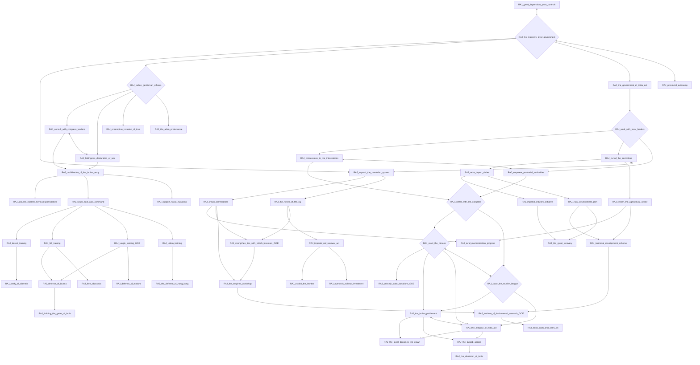

# RAJ_indian_air_force

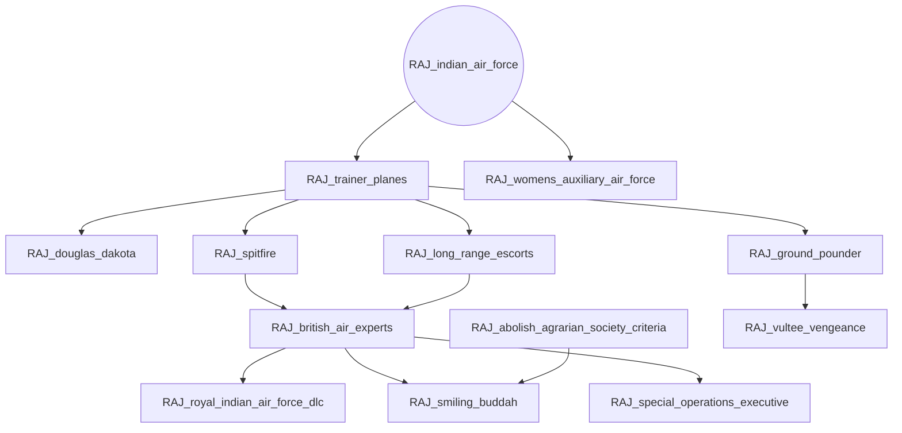

# RAJ_indianize_the_army

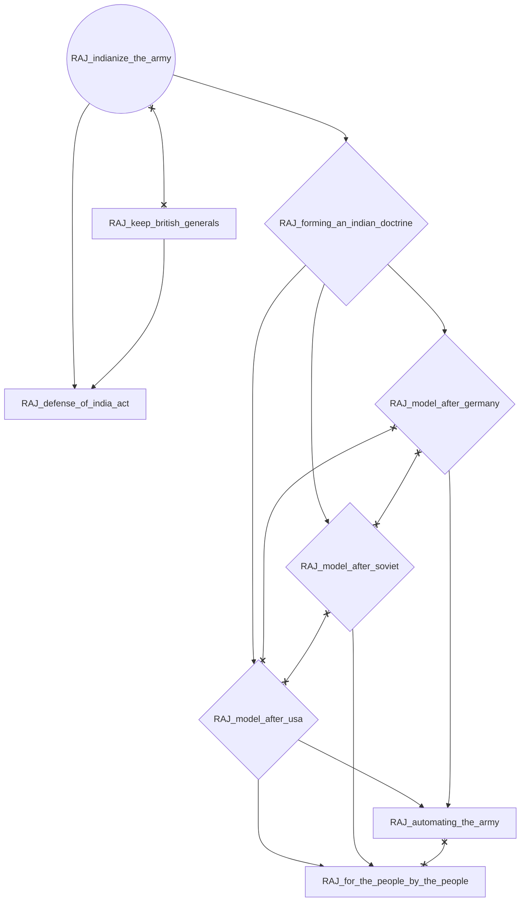

# RAJ_keep_british_generals

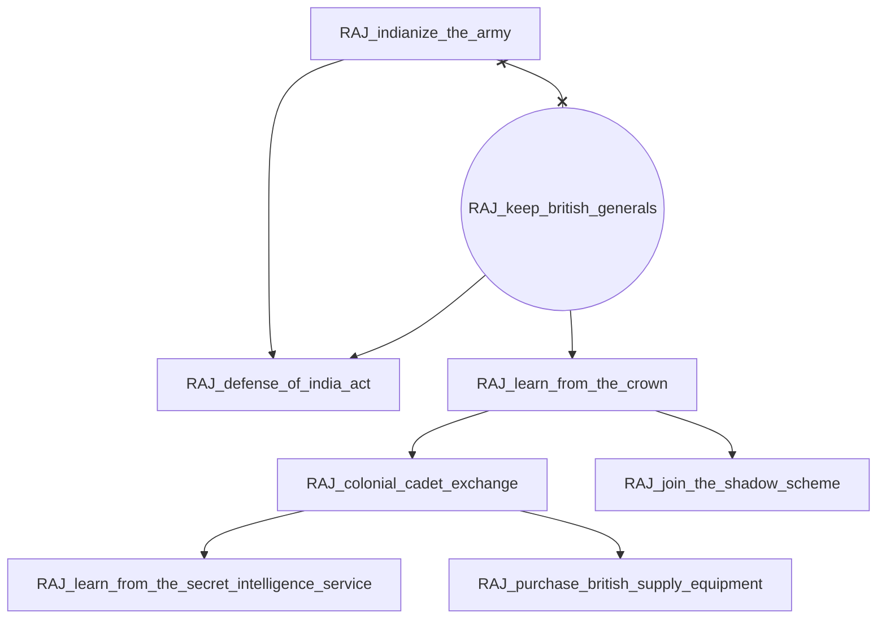

# RAJ_local_recruitment_offices

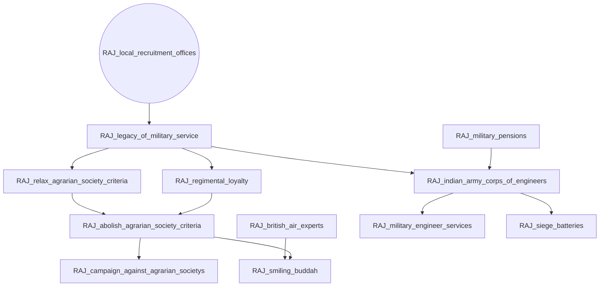

# RAJ_military_pensions

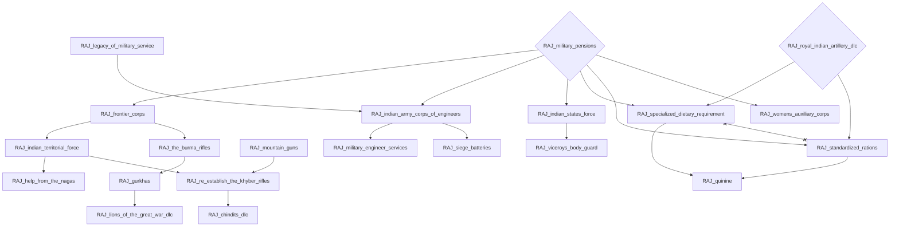

# RAJ_provincial_autonomy

```mermaid
flowchart TD
    n226{"RAJ_a_congress_resurgent"}
    n227["RAJ_a_permanent_muslim_governmental_seat"]
    n228["RAJ_a_secular_state"]
    n229["RAJ_a_tiger_unchained"]
    n230["RAJ_accept_russian_muhajir_money"]
    n231["RAJ_agrarian_socialism"]
    n232["RAJ_agricultural_cooperatives"]
    n233["RAJ_akhand_bharat"]
    n234{"RAJ_all_india_kisan_sabha"}
    n235["RAJ_all_india_students_federation"]
    n236["RAJ_an_economy_unbound"]
    n237["RAJ_annex_goa"]
    n238["RAJ_appoint_german_friendly_government"]
    n239["RAJ_appoint_soviet_friendly_government"]
    n240["RAJ_arm_the_peasantry"]
    n241["RAJ_authoritarianship"]
    n242["RAJ_azad_hind_dlc"]
    n243["RAJ_azad_hind_dlc_bank"]
    n244["RAJ_azad_hind_dlc_radio"]
    n245["RAJ_bathe_in_hellfire"]
    n246["RAJ_bhoodan_movement"]
    n247["RAJ_bhutanese_protectorate"]
    n248["RAJ_boycott_british_made_goods"]
    n249["RAJ_break_the_zamindars"]
    n250["RAJ_burn_down_the_cellular_jail"]
    n251["RAJ_cabinet_mission_plan"]
    n252["RAJ_central_comittee_authority"]
    n253["RAJ_coal_fire_and_steel"]
    n254["RAJ_comrades_of_the_city"]
    n255{"RAJ_constitution_for_the_masses"}
    n256["RAJ_contamination_cleanup_crew"]
    n257["RAJ_continue_the_five_year_plan"]
    n258["RAJ_cottage_industries"]
    n259["RAJ_cripps_mission_dlc"]
    n260["RAJ_cult_of_personality"]
    n261["RAJ_cultural_reawekening"]
    n262["RAJ_deathblow_to_imperial_remnants"]
    n263["RAJ_debt_relief"]
    n264["RAJ_decentralize_the_party"]
    n265["RAJ_defend_burma"]
    n266["RAJ_defenders_of_the_revolution"]
    n267["RAJ_demand_return_of_imperialist_colonies"]
    n268["RAJ_destroyer_of_worlds"]
    n269["RAJ_eastern_pakistan"]
    n270["RAJ_education_efforts"]
    n271["RAJ_education_efforts_2"]
    n272["RAJ_education_for_the_masses"]
    n273["RAJ_enrollment_of_dali_children"]
    n274["RAJ_every_man_a_gun"]
    n275["RAJ_every_man_a_leader"]
    n276["RAJ_exile_princes"]
    n277["RAJ_expand_healthcare_facilities"]
    n278["RAJ_expand_industry_in_hyderabad"]
    n279["RAJ_extend_indian_security_zone"]
    n280["RAJ_fight_malnutrition"]
    n281["RAJ_five_year_plan"]
    n282["RAJ_focus_on_military_industry"]
    n283["RAJ_focus_on_the_countryside"]
    n284["RAJ_form_a_federal_court"]
    n51["RAJ_fortify_aden"]
    n285["RAJ_forward_bloc"]
    n286["RAJ_founding_of_the_peoples_republic"]
    n287["RAJ_freedom_of_the_press"]
    n288{"RAJ_give_me_blood_and_i_will_grant_you_freedom"}
    n289["RAJ_go_into_hiding"]
    n53["RAJ_great_depression_price_controls"]
    n290["RAJ_guided_democracy"]
    n291["RAJ_handloom_weaving"]
    n292["RAJ_haripura_session_of_the_indian_national_congress"]
    n293["RAJ_heavy_industries"]
    n294["RAJ_hedgemony_of_the_subcontinent"]
    n295["RAJ_high_altitude_training"]
    n296["RAJ_hindi_as_a_national_language"]
    n297["RAJ_hindu_mahasabha"]
    n298["RAJ_hindutva"]
    n58["RAJ_his_majestys_loyal_government"]
    n299["RAJ_i_am_death"]
    n300["RAJ_import_substitution_industrialisation"]
    n301["RAJ_inclusive_nationalism"]
    n302["RAJ_india_indivisible"]
    n303["RAJ_india_united"]
    n304["RAJ_indian_independence_act"]
    n305["RAJ_indian_legion"]
    n306["RAJ_indian_national_highways"]
    n307["RAJ_indian_socialism"]
    n308["RAJ_indo_centric_curriculum"]
    n309["RAJ_industrialize_the_ganges"]
    n310["RAJ_infiltrate_aden"]
    n311["RAJ_integrate_the_princes"]
    n312["RAJ_integrate_the_princes2"]
    n313["RAJ_invite_soviet_industrial_experts"]
    n314["RAJ_iron_will_indoctrination"]
    n315["RAJ_jaguar"]
    n316["RAJ_join_the_co_prospherity_sphere"]
    n317["RAJ_jugantar"]
    n318["RAJ_khadi_movement"]
    n319["RAJ_kingmaker"]
    n320{"RAJ_lahore_resolution"}
    n321["RAJ_land_of_the_tillers"]
    n322["RAJ_land_reforms"]
    n323{"RAJ_league_against_gandhism"}
    n324["RAJ_litteracy_effort"]
    n325{"RAJ_local_resistance_to_land_taxes"}
    n326["RAJ_mahatma"]
    n327["RAJ_mixed_economy"]
    n328["RAJ_national_planning_committee"]
    n329["RAJ_nationalize_british_owned_factories"]
    n330["RAJ_nationalize_gun_carriage_agency"]
    n331["RAJ_nationalize_tata_group"]
    n332{"RAJ_netaji"}
    n333["RAJ_orchestrate_train_robberies"]
    n334["RAJ_partition_preparation"]
    n335["RAJ_planned_but_decentralized"]
    n336["RAJ_planned_economy"]
    n337["RAJ_planned_economy2"]
    n338["RAJ_pledge_for_the_allies"]
    n339["RAJ_power_sharing_agreement"]
    n340["RAJ_preamble_to_the_constitution_of_india"]
    n341["RAJ_princely_states_policy"]
    n342["RAJ_promote_violence_against_the_british"]
    n343["RAJ_protest_against_the_howell_monument"]
    n87(("RAJ_provincial_autonomy"))
    n344["RAJ_punjab_autonomy"]
    n345{"RAJ_purge_the_reactionaries"}
    n346{"RAJ_purna_swaraj"}
    n347["RAJ_quality_training"]
    n348{"RAJ_rally_the_indian_left"}
    n349["RAJ_rani_of_jhansi_regiment"]
    n350["RAJ_rashtriya_swayamsevak_sangh"]
    n351["RAJ_red_in_the_shadows"]
    n352["RAJ_red_punjab_operation"]
    n353["RAJ_reorganize_the_five_year_plan_towards_heavy_industry"]
    n354["RAJ_rolling_nuke_barrages"]
    n355["RAJ_royal_indian_navy_mutiny"]
    n356["RAJ_sanatani"]
    n357["RAJ_secure_rajahsthan"]
    n358["RAJ_seek_domestic_allies"]
    n359["RAJ_seek_financial_aid_from_the_ussr"]
    n360["RAJ_seek_japanese_support"]
    n361["RAJ_seven_shackles"]
    n362["RAJ_shaheed_and_swaraj"]
    n363["RAJ_sideline_the_conflict"]
    n364["RAJ_sikh_religious_guarantees"]
    n365["RAJ_socialist_self_reliance"]
    n366["RAJ_soviet_indian_industrial_cooperation"]
    n367["RAJ_soviet_influence"]
    n368["RAJ_stopping_the_japanese_threat_into_central_asia"]
    n369["RAJ_strike_against_china"]
    n370["RAJ_strike_burma"]
    n371["RAJ_strike_eastern_pakistan"]
    n372["RAJ_suppress_paramilitary_organizations"]
    n373["RAJ_swadeshi_movement"]
    n374{"RAJ_tea_exports"}
    n375["RAJ_temple_entry_movements"]
    n376["RAJ_tenancy_reforms"]
    n377["RAJ_the_enemy_of_my_enemy"]
    n378["RAJ_the_hindu_martial_tradition"]
    n379["RAJ_the_indian_national_army"]
    n380["RAJ_the_pakistan_movement"]
    n381["RAJ_the_peoples_liberation_army"]
    n382["RAJ_the_red_curtain_falls_over_asia"]
    n383["RAJ_the_revolutionary_army_marches"]
    n384["RAJ_the_second_duar_war"]
    n385["RAJ_the_second_gorkha_war"]
    n386["RAJ_the_sun_sets"]
    n387["RAJ_the_sword_and_the_saffron"]
    n388["RAJ_to_shake_the_world"]
    n119["RAJ_trade_port"]
    n389{"RAJ_tryst_with_destiny"}
    n390["RAJ_two_nation_theory_dlc"]
    n391["RAJ_united_bengal"]
    n392["RAJ_uplifting_the_people_of_india"]
    n393["RAJ_uranium_tipped_bullets"]
    n394["RAJ_urban_industrialism"]
    n395["RAJ_war_taxes"]
    n326 --> n226
    n339 --> n227
    n301 --> n228
    n237 --> n229
    n333 --> n230
    n345 --> n231
    n255 --> n231
    n376 --> n232
    n298 --> n233
    n323 --> n234
    n324 --> n235
    n302 --> n236
    n302 --> n237
    n260 --> n238
    n359 --> n239
    n307 --> n240
    n332 --> n241
    n343 --> n242
    n395 --> n243
    n242 --> n244
    n256 --> n245
    n315 --> n245
    n321 --> n246
    n332 --> n247
    n373 --> n248
    n307 --> n249
    n361 --> n250
    n339 --> n251
    n394 --> n252
    n332 --> n253
    n298 --> n253
    n394 --> n254
    n286 --> n255
    n393 --> n256
    n365 --> n257
    n330 --> n257
    n337 --> n257
    n376 --> n258
    n374 --> n259
    n332 --> n260
    n361 --> n261
    n296 --> n261
    n352 --> n262
    n357 --> n262
    n371 --> n262
    n376 --> n263
    n231 --> n264
    n302 --> n265
    n275 --> n266
    n241 --> n267
    n290 --> n267
    n299 --> n268
    n320 --> n269
    n280 --> n270
    n243 --> n271
    n307 --> n272
    n308 --> n273
    n240 --> n274
    n274 --> n275
    n382 --> n276
    n273 --> n277
    n307 --> n278
    n367 --> n278
    n332 --> n279
    n300 --> n280
    n264 --> n281
    n252 --> n281
    n353 --> n282
    n231 --> n283
    n392 --> n284
    n119 --> n51
    n323 --> n285
    n355 --> n286
    n284 --> n287
    n343 --> n288
    n342 --> n288
    n343 --> n289
    n332 --> n290
    n258 --> n291
    n232 --> n291
    n325 --> n292
    n253 --> n293
    n269 --> n294
    n391 --> n294
    n279 --> n295
    n356 --> n296
    n298 --> n297
    n332 --> n297
    n288 --> n298
    n389 --> n299
    n236 --> n300
    n251 --> n301
    n227 --> n301
    n340 --> n302
    n226 --> n303
    n292 --> n304
    n259 --> n304
    n343 --> n305
    n307 --> n306
    n367 --> n306
    n281 --> n307
    n264 --> n307
    n324 --> n308
    n394 --> n309
    n305 --> n310
    n289 --> n310
    n276 --> n311
    n295 --> n312
    n353 --> n313
    n347 --> n314
    n354 --> n315
    n377 --> n316
    n382 --> n317
    n373 --> n318
    n363 --> n319
    n380 --> n320
    n231 --> n321
    n300 --> n322
    n346 --> n323
    n284 --> n324
    n232 --> n325
    n248 --> n325
    n346 --> n326
    n300 --> n327
    n376 --> n328
    n262 --> n329
    n282 --> n330
    n306 --> n331
    n278 --> n331
    n288 --> n332
    n351 --> n333
    n391 --> n334
    n269 --> n334
    n272 --> n335
    n249 --> n335
    n359 --> n336
    n313 --> n337
    n389 --> n338
    n303 --> n339
    n363 --> n340
    n338 --> n340
    n299 --> n340
    n87 --> n341
    n285 --> n342
    n285 --> n343
    n364 --> n344
    n286 --> n345
    n87 --> n346
    n383 --> n347
    n323 --> n348
    n285 --> n349
    n351 --> n349
    n387 --> n350
    n234 --> n351
    n348 --> n351
    n382 --> n352
    n367 --> n353
    n268 --> n354
    n351 --> n355
    n298 --> n356
    n382 --> n357
    n289 --> n358
    n279 --> n359
    n242 --> n360
    n356 --> n361
    n377 --> n362
    n389 --> n363
    n375 --> n364
    n273 --> n364
    n308 --> n364
    n335 --> n365
    n367 --> n366
    n281 --> n367
    n252 --> n367
    n262 --> n368
    n279 --> n369
    n267 --> n370
    n382 --> n371
    n302 --> n372
    n346 --> n373
    n232 --> n374
    n308 --> n375
    n392 --> n376
    n360 --> n377
    n296 --> n378
    n350 --> n378
    n395 --> n379
    n390 --> n380
    n367 --> n381
    n355 --> n382
    n381 --> n383
    n332 --> n384
    n384 --> n385
    n247 --> n385
    n370 --> n386
    n356 --> n387
    n327 --> n388
    n322 --> n388
    n270 --> n388
    n53 --> n119
    n87 --> n119
    n391 --> n389
    n269 --> n389
    n228 --> n389
    n226 --> n390
    n320 --> n391
    n346 --> n392
    n268 --> n393
    n345 --> n394
    n255 --> n394
    n242 --> n395
    n231 x--x n394
    n241 x--x n290
    n247 x--x n384
    n259 x--x n292
    n269 x--x n391
    n285 x--x n351
    n53 x--x n87
    n298 x--x n332
    n58 x--x n87
    n299 x--x n338
    n299 x--x n363
    n303 x--x n390
    n323 x--x n326
    n338 x--x n363
```

# RAJ_royal_indian_artillery_dlc

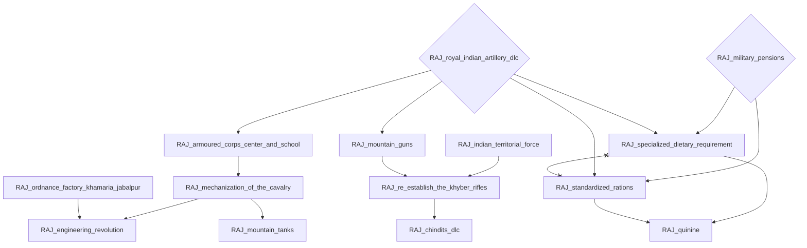

# RAJ_royal_indian_navy_dlc

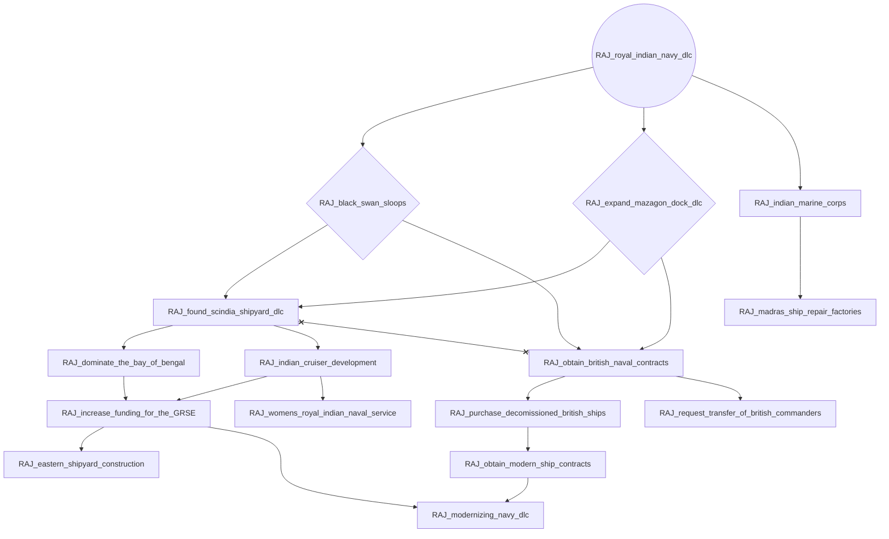
