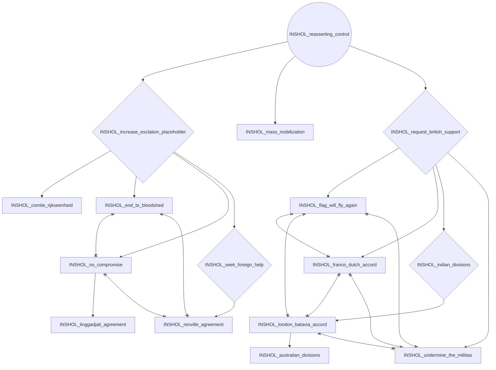

# INSHOL_reasserting_control

```mermaid
flowchart TD
    n1["INSHOL_australian_divisions"]
    n2["INSHOL_comite_rijkseenheid"]
    n3["INSHOL_end_to_bloodshed"]
    n4["INSHOL_flag_will_fly_again"]
    n5["INSHOL_franco_dutch_accord"]
    n6{"INSHOL_increase_esclation_placeholder"}
    n7{"INSHOL_indian_divisions"}
    n8["INSHOL_linggadjati_agreement"]
    n9["INSHOL_london_batavia_accord"]
    n10["INSHOL_mass_mobilization"]
    n11["INSHOL_no_compromise"]
    n12(("INSHOL_reasserting_control"))
    n13["INSHOL_renville_agreement"]
    n14{"INSHOL_request_british_support"}
    n15{"INSHOL_seek_foreign_help"}
    n16["INSHOL_undermine_the_militias"]
    n9 --> n1
    n6 --> n2
    n6 --> n3
    n14 --> n4
    n14 --> n5
    n12 --> n6
    n14 --> n7
    n11 --> n8
    n7 --> n9
    n12 --> n10
    n6 --> n11
    n15 --> n13
    n12 --> n14
    n6 --> n15
    n14 --> n16
    n3 x--x n11
    n3 x--x n13
    n4 x--x n5
    n4 x--x n9
    n4 x--x n16
    n5 x--x n9
    n5 x--x n16
    n9 x--x n16
    n11 x--x n13
```

# orphans

```mermaid
flowchart TD
    n17["HOL_continue_the_war_in_batavia_taog"]
    n18["INSHOL_agricultural_subsidies"]
    n19["INSHOL_ai_pyrotechnische"]
    n20["INSHOL_artillerie_inrichtingen"]
    n21{"INSHOL_autonomous_dominion"}
    n22["INSHOL_bandung_aircraft_facility"]
    n23{"INSHOL_bangka_production_lines"}
    n24["INSHOL_begin_negotiations_soetardjo"]
    n25["INSHOL_bio_pharma"]
    n26{"INSHOL_coffee_plantations"}
    n27{"INSHOL_cruisers"}
    n28{"INSHOL_democracy"}
    n29{"INSHOL_destroyers"}
    n30["INSHOL_develop_bombers"]
    n31["INSHOL_develop_fighters"]
    n32["INSHOL_development_loans_netherlands"]
    n33["INSHOL_divert_civilian_to_navy"]
    n34["INSHOL_domestic_ship_production"]
    n35{"INSHOL_dutch_east_indies"}
    n36["INSHOL_east_indies_fokker_division"]
    n37["INSHOL_east_indies_investments"]
    n38["INSHOL_east_indies_navy"]
    n39["INSHOL_eastern_conscription"]
    n40["INSHOL_economic_integration"]
    n41{"INSHOL_education_reforms"}
    n42["INSHOL_elevate_elite_infantry"]
    n43["INSHOL_emergency_dockyard_construction"]
    n44{"INSHOL_emergency_naval_purchases"}
    n45["INSHOL_emergency_powers_gov_general"]
    n46["INSHOL_encourage_further_investment"]
    n47["INSHOL_establish_the_princely_council"]
    n48["INSHOL_establish_vk_knil"]
    n49["INSHOL_expand_shell"]
    n50["INSHOL_foundations_of_defense"]
    n51["INSHOL_fund_ml_knil"]
    n52{"INSHOL_hawk_75a7"}
    n53["INSHOL_hybrid_navy"]
    n54{"INSHOL_import_lumber"}
    n55{"INSHOL_import_sugar"}
    n56["INSHOL_increase_funding_for_tix"]
    n57["INSHOL_indonesian_cheap_labor"]
    n58{"INSHOL_industrialized_colony"}
    n59["INSHOL_infantry_training_in_borneo"]
    n60["INSHOL_investments_in_civ_railways"]
    n61["INSHOL_java_factories"]
    n62["INSHOL_knil_engineers"]
    n63["INSHOL_license_dutch_weapon_blueprints"]
    n64["INSHOL_loyalty_to_crown"]
    n65["INSHOL_manado_military_academy"]
    n66["INSHOL_marines"]
    n67["INSHOL_military_equipment_contracts"]
    n68["INSHOL_modernize_knil"]
    n69["INSHOL_mountaineers"]
    n70["INSHOL_nationalist_coallition"]
    n71["INSHOL_nationalize_dutch_companies"]
    n72["INSHOL_naval_program"]
    n73["INSHOL_naval_secondchance"]
    n74["INSHOL_netherlands_indies_air_doctrine"]
    n75["INSHOL_netherlands_indonesia_union"]
    n76["INSHOL_outsourced_navy"]
    n77["INSHOL_overallwagen"]
    n78["INSHOL_padang_port"]
    n79["INSHOL_princely_authority"]
    n80["INSHOL_prioritize_dutch_profits"]
    n81["INSHOL_produce_own_goods"]
    n82["INSHOL_rangers"]
    n83["INSHOL_recall_gerardus_johannes_berenschot"]
    n84["INSHOL_reduce_land_ownership_taxes"]
    n85{"INSHOL_reform_knil"}
    n86["INSHOL_republic_of_indonesia"]
    n87["INSHOL_request_east_timor"]
    n88["INSHOL_request_economic_dev_subsidy"]
    n89["INSHOL_request_naval_control"]
    n90["INSHOL_rubber_taxation"]
    n91["INSHOL_sideline_the_volksraad"]
    n92{"INSHOL_submarines"}
    n93["INSHOL_subsidize_bauxite"]
    n94["INSHOL_transfer_of_henri_winkelman"]
    n95["INSHOL_urge_gov_veto"]
    n96["INSHOL_volksraad_compromises"]
    n97["INSHOL_work_with_oil_barons"]
    n98["INS_the_jewel_in_the_crown"]
    n93 --> n18
    n26 --> n18
    n20 --> n19
    n61 --> n20
    n28 --> n21
    n31 --> n22
    n30 --> n22
    n52 --> n22
    n61 --> n23
    n35 --> n24
    n20 --> n25
    n78 --> n26
    n34 --> n27
    n70 --> n28
    n96 --> n28
    n34 --> n29
    n51 --> n30
    n51 --> n31
    n91 --> n32
    n29 --> n33
    n27 --> n33
    n92 --> n33
    n38 --> n34
    n98 --> n35
    n37 --> n36
    n35 --> n37
    n85 --> n38
    n48 --> n39
    n58 --> n40
    n24 --> n41
    n82 --> n42
    n69 --> n42
    n38 --> n43
    n43 --> n44
    n72 --> n44
    n91 --> n45
    n96 --> n46
    n70 --> n47
    n50 --> n48
    n37 --> n49
    n85 --> n50
    n85 --> n51
    n51 --> n52
    n44 --> n53
    n18 --> n54
    n18 --> n55
    n52 --> n56
    n90 --> n57
    n55 --> n58
    n54 --> n58
    n26 --> n58
    n65 --> n59
    n84 --> n60
    n81 --> n61
    n63 --> n61
    n68 --> n62
    n85 --> n63
    n80 --> n64
    n85 --> n65
    n38 --> n66
    n85 --> n67
    n65 --> n68
    n67 --> n68
    n68 --> n69
    n41 --> n70
    n70 --> n71
    n38 --> n72
    n50 --> n72
    n89 --> n73
    n30 --> n74
    n21 --> n75
    n58 --> n75
    n29 --> n76
    n27 --> n76
    n92 --> n76
    n23 --> n77
    n49 --> n78
    n84 --> n78
    n47 --> n79
    n28 --> n79
    n91 --> n80
    n85 --> n81
    n68 --> n82
    n85 --> n83
    n37 --> n84
    n98 --> n85
    n21 --> n86
    n24 --> n87
    n91 --> n87
    n80 --> n88
    n44 --> n89
    n49 --> n90
    n35 --> n91
    n34 --> n92
    n84 --> n93
    n85 --> n94
    n24 --> n95
    n41 --> n96
    n90 --> n97
    n17 x--x n21
    n17 x--x n58
    n21 x--x n58
    n24 x--x n91
    n33 x--x n76
    n40 x--x n75
    n40 x--x n86
    n53 x--x n89
    n56 x--x n77
    n63 x--x n81
    n70 x--x n96
    n75 x--x n86
```
