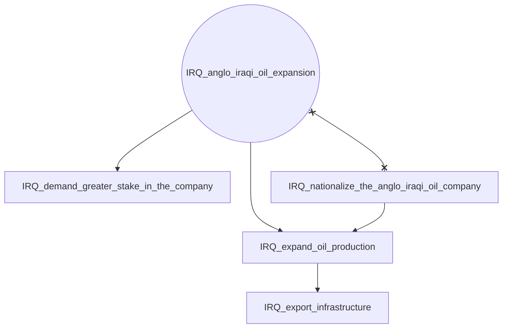
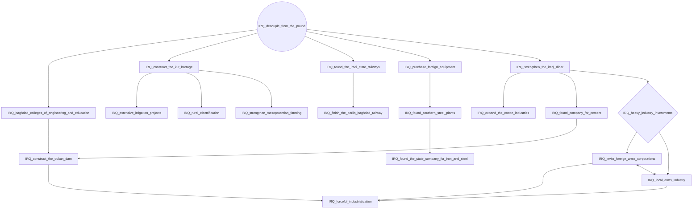
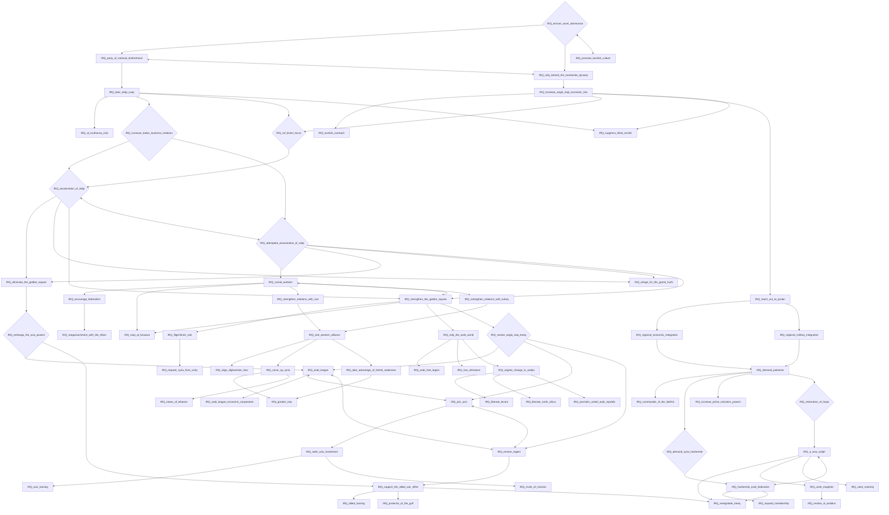
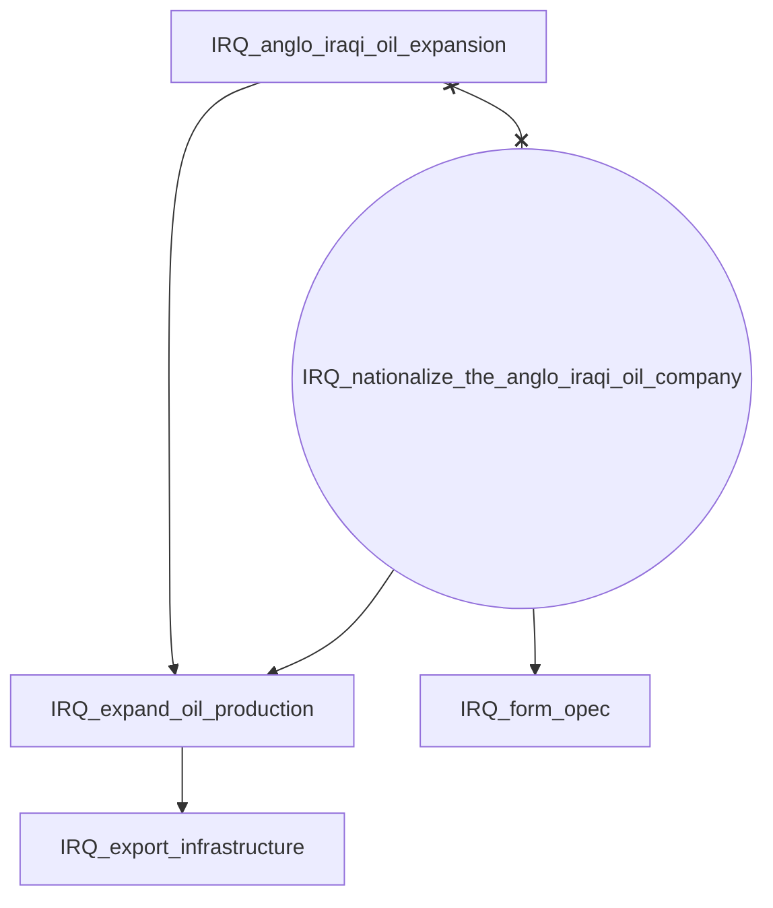
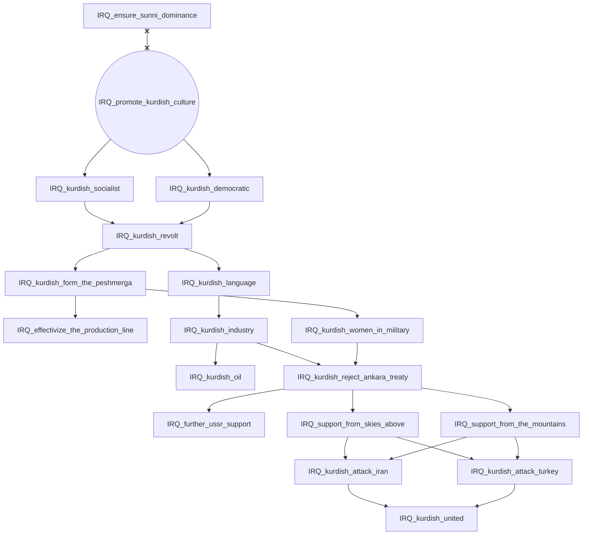
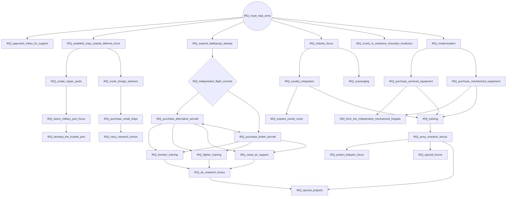

# IRQ_anglo_iraqi_oil_expansion

# IRQ_decouple_from_the_pound

# IRQ_ensure_sunni_dominance

# IRQ_nationalize_the_anglo_iraqi_oil_company

# IRQ_promote_kurdish_culture

# IRQ_royal_iraqi_army

