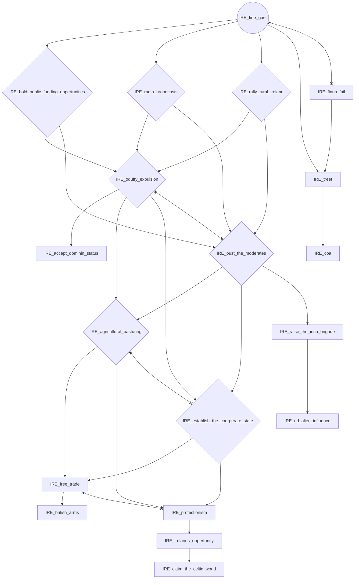
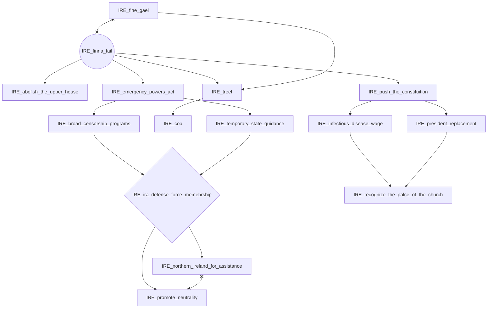

# IRE_fine_gael

```mermaid
flowchart TD
    n1["IRE_accept_dominin_status"]
    n2{"IRE_agricultural_pasturing"}
    n3["IRE_british_arms"]
    n4["IRE_claim_the_celtic_world"]
    n5["IRE_coa"]
    n6{"IRE_establish_the_coorperate_state"}
    n7(("IRE_fine_gael"))
    n8["IRE_finna_fail"]
    n9["IRE_free_trade"]
    n10{"IRE_hold_public_funding_oppertunities"}
    n11["IRE_irelands_oppertunity"]
    n12{"IRE_oduffy_expulsion"}
    n13{"IRE_oust_the_moderates"}
    n14["IRE_protectionism"]
    n15{"IRE_radio_broadcasts"}
    n16["IRE_raise_the_irish_brigade"]
    n17{"IRE_rally_rural_ireland"}
    n18["IRE_rid_alien_influence"]
    n19["IRE_treet"]
    n12 --> n1
    n12 --> n2
    n13 --> n2
    n9 --> n3
    n11 --> n4
    n19 --> n5
    n12 --> n6
    n13 --> n6
    n2 --> n9
    n6 --> n9
    n7 --> n10
    n14 --> n11
    n15 --> n12
    n10 --> n12
    n17 --> n12
    n15 --> n13
    n10 --> n13
    n17 --> n13
    n2 --> n14
    n6 --> n14
    n7 --> n15
    n13 --> n16
    n7 --> n17
    n16 --> n18
    n8 --> n19
    n7 --> n19
    n2 x--x n6
    n7 x--x n8
    n9 x--x n14
    n12 x--x n13
```

# IRE_finna_fail

```mermaid
flowchart TD
    n20["IRE_abolish_the_upper_house"]
    n21["IRE_broad_censorship_programs"]
    n5["IRE_coa"]
    n22["IRE_emergency_powers_act"]
    n7["IRE_fine_gael"]
    n8(("IRE_finna_fail"))
    n23["IRE_infectious_disease_wage"]
    n24{"IRE_ira_defense_force_memebrship"}
    n25["IRE_northern_ireland_for_assistance"]
    n26["IRE_president_replacement"]
    n27["IRE_promote_neutrality"]
    n28["IRE_push_the_constituition"]
    n29["IRE_recognize_the_palce_of_the_church"]
    n30["IRE_temporary_state_guidance"]
    n19["IRE_treet"]
    n8 --> n20
    n22 --> n21
    n19 --> n5
    n8 --> n22
    n28 --> n23
    n21 --> n24
    n30 --> n24
    n24 --> n25
    n28 --> n26
    n24 --> n27
    n8 --> n28
    n23 --> n29
    n26 --> n29
    n22 --> n30
    n8 --> n19
    n7 --> n19
    n7 x--x n8
    n25 x--x n27
```
