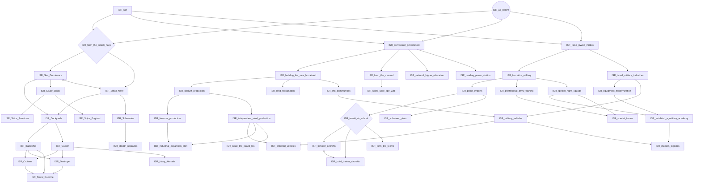
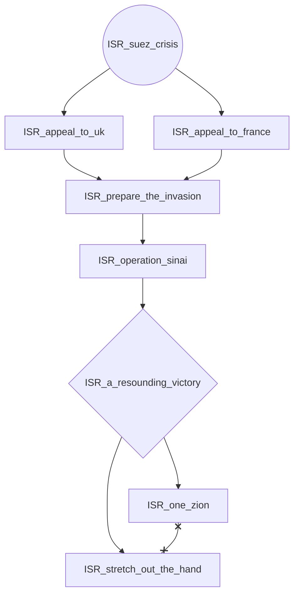

# ISR_ad_halom

```mermaid
flowchart TD
    n1["ISR_Battleship"]
    n2["ISR_Carrier"]
    n3["ISR_Cruisers"]
    n4["ISR_Destroyer"]
    n5["ISR_Dockyards"]
    n6["ISR_Naval_Doctrine"]
    n7["ISR_Navy_Aircrafts"]
    n8["ISR_Sea_Dominance"]
    n9["ISR_Ships_American"]
    n10["ISR_Ships_England"]
    n11["ISR_Small_Navy"]
    n12["ISR_Study_Ships"]
    n13["ISR_Submarine"]
    n14(("ISR_ad_halom"))
    n15["ISR_armored_vehicles"]
    n16["ISR_bimotor_aircrafts"]
    n17["ISR_build_trainer_aircrafts"]
    n18["ISR_building_the_new_homeland"]
    n19["ISR_equipment_modernization"]
    n20["ISR_establish_a_military_academy"]
    n21["ISR_firearms_production"]
    n22{"ISR_form_the_israeli_navy"}
    n23["ISR_form_the_mossad"]
    n24["ISR_form_the_techni"]
    n25["ISR_formalize_military"]
    n26["ISR_independent_steel_production"]
    n27["ISR_industrial_expansion_plan"]
    n28["ISR_israel_military_industries"]
    n29{"ISR_israeli_air_school"}
    n30["ISR_issue_the_israeli_lira"]
    n31["ISR_kibbutz_production"]
    n32["ISR_land_reclamation"]
    n33["ISR_link_communities"]
    n34["ISR_military_vehicles"]
    n35["ISR_modern_logistics"]
    n36["ISR_national_higher_education"]
    n37["ISR_plane_imports"]
    n38["ISR_proffesional_army_training"]
    n39["ISR_provisional_government"]
    n40["ISR_raise_jewish_militias"]
    n41["ISR_reading_power_station"]
    n42["ISR_special_forces"]
    n43["ISR_special_night_squads"]
    n44["ISR_stealth_upgrades"]
    n45["ISR_volunteer_pilots"]
    n46["ISR_win"]
    n47["ISR_world_wide_spy_web"]
    n5 --> n1
    n5 --> n2
    n1 --> n3
    n2 --> n3
    n1 --> n4
    n2 --> n4
    n11 --> n5
    n8 --> n5
    n3 --> n6
    n4 --> n6
    n1 --> n6
    n2 --> n7
    n22 --> n8
    n12 --> n9
    n12 --> n10
    n22 --> n11
    n8 --> n12
    n11 --> n13
    n34 --> n15
    n26 --> n15
    n29 --> n16
    n29 --> n17
    n39 --> n18
    n28 --> n19
    n43 --> n20
    n19 --> n20
    n31 --> n21
    n46 --> n22
    n14 --> n22
    n39 --> n23
    n29 --> n24
    n40 --> n25
    n31 --> n26
    n21 --> n27
    n26 --> n27
    n40 --> n28
    n37 --> n29
    n26 --> n30
    n18 --> n31
    n18 --> n32
    n18 --> n33
    n33 --> n34
    n28 --> n34
    n34 --> n35
    n20 --> n35
    n39 --> n36
    n25 --> n37
    n25 --> n38
    n46 --> n39
    n14 --> n39
    n46 --> n40
    n14 --> n40
    n39 --> n41
    n38 --> n42
    n43 --> n42
    n25 --> n43
    n13 --> n44
    n37 --> n45
    n23 --> n47
    n8 x--x n11
    n16 x--x n17
```

# ISR_legacy_of_the_conference

```mermaid
flowchart TD
    n1["ISR_Battleship"]
    n2["ISR_Carrier"]
    n3["ISR_Cruisers"]
    n4["ISR_Destroyer"]
    n5["ISR_Dockyards"]
    n6["ISR_Naval_Doctrine"]
    n7["ISR_Navy_Aircrafts"]
    n8["ISR_Sea_Dominance"]
    n9["ISR_Ships_American"]
    n10["ISR_Ships_England"]
    n11["ISR_Small_Navy"]
    n12["ISR_Study_Ships"]
    n13["ISR_Submarine"]
    n48["ISR_abandon_eretz_yisrael"]
    n49["ISR_abandon_jordan"]
    n14["ISR_ad_halom"]
    n50["ISR_affirm_territorial_claims"]
    n51["ISR_alone"]
    n52["ISR_am_yisrael_hai"]
    n53["ISR_appeal_middle_class"]
    n54["ISR_appeal_to_diaspora"]
    n55["ISR_appeal_to_haganah"]
    n56["ISR_appeal_west"]
    n57["ISR_appease_religious"]
    n58["ISR_arab_recruitment"]
    n15["ISR_armored_vehicles"]
    n59["ISR_arms_sourcing"]
    n60["ISR_assume_the_national_cause"]
    n61["ISR_avenge_tragedies"]
    n62["ISR_begin_nationalization"]
    n63["ISR_begin_takes_over"]
    n64["ISR_ben_gurion_stays"]
    n65{"ISR_best_of_the_best"}
    n66["ISR_betar_revived"]
    n16["ISR_bimotor_aircrafts"]
    n67["ISR_brighter_future"]
    n68["ISR_build_third_temple"]
    n17["ISR_build_trainer_aircrafts"]
    n18["ISR_building_the_new_homeland"]
    n69["ISR_campaign_women"]
    n70["ISR_cement_five_mems"]
    n71["ISR_cement_histadrut_powers"]
    n72["ISR_cement_jewish_identity"]
    n73["ISR_centralization"]
    n74{"ISR_centre"}
    n75["ISR_centre_victorious"]
    n76["ISR_clean_resistance"]
    n77["ISR_consolidate_power"]
    n78{"ISR_convene_knesset"}
    n79["ISR_cooperate_maki"]
    n80["ISR_cooperate_religious"]
    n81["ISR_crown_of_david"]
    n82["ISR_demand_secular_education"]
    n83["ISR_destroy_nazi"]
    n84{"ISR_develop_gush_dan"}
    n85["ISR_develop_negev"]
    n86["ISR_develop_road_infrastructure"]
    n87["ISR_draft_constitution"]
    n88["ISR_economic_liberalisation"]
    n89["ISR_education_reforms"]
    n90["ISR_elect_president"]
    n91["ISR_empower_stern_gang"]
    n92["ISR_end_austerity"]
    n19["ISR_equipment_modernization"]
    n20["ISR_establish_a_military_academy"]
    n93["ISR_establish_bituah_leumi"]
    n94["ISR_exempt_yeshiva_students"]
    n95["ISR_expand_immigrant_infrastructure"]
    n96["ISR_expand_industrial_hubs"]
    n97["ISR_expand_rural_influence"]
    n98{"ISR_expand_settlement"}
    n99["ISR_expand_support_uses"]
    n100["ISR_factory_investments"]
    n101["ISR_fight_resistance"]
    n21["ISR_firearms_production"]
    n102["ISR_fix_bureaucracy"]
    n103["ISR_foreign_experts"]
    n104["ISR_form_DLN"]
    n22{"ISR_form_the_israeli_navy"}
    n23["ISR_form_the_mossad"]
    n24["ISR_form_the_techni"]
    n25["ISR_formalize_military"]
    n105["ISR_fund_religious_education"]
    n106["ISR_fund_urban_areas"]
    n107["ISR_further_industry_expansions"]
    n108["ISR_further_palestinian_negotiations"]
    n109["ISR_galilee_development"]
    n110["ISR_gather_outside_support"]
    n111["ISR_gather_the_loyalists"]
    n112["ISR_general_zionists"]
    n113{"ISR_hashomer"}
    n114["ISR_hashomer_leads"]
    n115{"ISR_hatzohar"}
    n116["ISR_herzl_followers"]
    n117["ISR_herzl_successor"]
    n118["ISR_histadrut_legislation"]
    n119["ISR_histardrut_deregulation"]
    n120["ISR_increase_urban_investments"]
    n26["ISR_independent_steel_production"]
    n27["ISR_industrial_expansion_plan"]
    n121["ISR_into_the_desert"]
    n122["ISR_invest_in_kibbutzim"]
    n123["ISR_invest_in_white_collar"]
    n124["ISR_iranian_alliance"]
    n125["ISR_irgun_in_power"]
    n28["ISR_israel_military_industries"]
    n29{"ISR_israeli_air_school"}
    n30["ISR_issue_the_israeli_lira"]
    n126["ISR_jabotinsky_death"]
    n127["ISR_join_ENG"]
    n128["ISR_join_ITA"]
    n129["ISR_join_SOV"]
    n130["ISR_join_USA"]
    n131["ISR_join_fascists"]
    n132["ISR_join_soviet"]
    n133["ISR_joint_military_exercises"]
    n134["ISR_judea_fell"]
    n135["ISR_judea_rise"]
    n31["ISR_kibbutz_production"]
    n136{"ISR_kill_stern"}
    n32["ISR_land_reclamation"]
    n137["ISR_lean_hatzohar"]
    n138["ISR_lean_mapai"]
    n139{"ISR_legacy_of_basel"}
    n140(("ISR_legacy_of_the_conference"))
    n141["ISR_lessen_austerity"]
    n142["ISR_lessen_soviet_stance"]
    n143["ISR_levantine_commune"]
    n144["ISR_limited_austerity"]
    n145{"ISR_limited_return"}
    n33["ISR_link_communities"]
    n146{"ISR_mapai"}
    n147["ISR_mapai_cemented"]
    n148["ISR_mapai_hashomer"]
    n149{"ISR_martial_law"}
    n150["ISR_merge_unions"]
    n151["ISR_middle_class_investments"]
    n34["ISR_military_vehicles"]
    n35["ISR_modern_logistics"]
    n152{"ISR_moses_hess_legacy"}
    n36["ISR_national_higher_education"]
    n153["ISR_negotiate_lehi_defectors"]
    n154{"ISR_nile_to_euphrates"}
    n155{"ISR_only_thus"}
    n156["ISR_open_economy"]
    n157["ISR_operation_ezra_nehamiah"]
    n158["ISR_operation_magic_carpet"]
    n159["ISR_operation_yoav"]
    n160["ISR_our_rightful_land"]
    n161["ISR_palestinian_compromises"]
    n162["ISR_partition_syria"]
    n163["ISR_periphery_investments"]
    n37["ISR_plane_imports"]
    n38["ISR_proffesional_army_training"]
    n164["ISR_progressives"]
    n165["ISR_promise_arabs"]
    n166["ISR_promote_electronic_developments"]
    n167["ISR_promote_urban"]
    n39["ISR_provisional_government"]
    n168["ISR_purge_irgun"]
    n169["ISR_push_jewish"]
    n170["ISR_push_militarism"]
    n171["ISR_push_military_industries"]
    n172["ISR_push_secular"]
    n173["ISR_push_secular_education"]
    n40["ISR_raise_jewish_militias"]
    n41["ISR_reading_power_station"]
    n174["ISR_recognize_beduin"]
    n175["ISR_reconciliation"]
    n176["ISR_reject_lesser_israel"]
    n177["ISR_revisionist_revolution"]
    n178["ISR_schizo_nazbol"]
    n179{"ISR_secularize_public_laws"}
    n180["ISR_seize_foreign_assets"]
    n181["ISR_seize_lebanon"]
    n182["ISR_settlement_projects"]
    n183["ISR_setup_public_transit"]
    n184["ISR_sharett_diplomacy"]
    n185["ISR_sharett_reforms"]
    n186["ISR_sharett_takes_over"]
    n187{"ISR_shearim"}
    n188["ISR_shift_rightwards"]
    n189["ISR_soviet_cooperation"]
    n190["ISR_soviet_support"]
    n42["ISR_special_forces"]
    n43["ISR_special_night_squads"]
    n191["ISR_status_quo_agreement"]
    n192["ISR_status_quo_arabs"]
    n193["ISR_steady"]
    n44["ISR_stealth_upgrades"]
    n194{"ISR_stern_cult"}
    n195["ISR_strengthen_maki"]
    n196["ISR_strengthen_military_industrial"]
    n197["ISR_strengthen_progressives"]
    n198["ISR_strengthen_union"]
    n199["ISR_strike_egypt"]
    n200["ISR_strike_infrastructure"]
    n201["ISR_support_irgun_fighters"]
    n202["ISR_support_maronite_lebanese"]
    n203["ISR_syria_war"]
    n204["ISR_tax_reforms"]
    n205{"ISR_the_ageing_father"}
    n206["ISR_the_east_bank"]
    n207["ISR_the_elections"]
    n208["ISR_the_five_mems"]
    n209{"ISR_the_italian_model"}
    n210{"ISR_the_periphery_strategy"}
    n211["ISR_the_religious_front"]
    n212{"ISR_the_revisionist_split"}
    n213["ISR_the_west_bank"]
    n214["ISR_to_the_euphrates"]
    n215["ISR_to_the_suez"]
    n216["ISR_toe_line"]
    n217{"ISR_turkish_alliance"}
    n218["ISR_two_state_solution"]
    n219["ISR_undo_austerity"]
    n45["ISR_volunteer_pilots"]
    n220["ISR_watch_yishuv_leaders"]
    n221["ISR_weaken_histadrut"]
    n222["ISR_welfare_for_refugees"]
    n46{"ISR_win"}
    n223["ISR_womens_rights"]
    n224["ISR_work_with_arab"]
    n47["ISR_world_wide_spy_web"]
    n225{"ISR_yodefet_masada_betar"}
    n5 --> n1
    n5 --> n2
    n1 --> n3
    n2 --> n3
    n1 --> n4
    n2 --> n4
    n11 --> n5
    n8 --> n5
    n3 --> n6
    n4 --> n6
    n1 --> n6
    n2 --> n7
    n22 --> n8
    n12 --> n9
    n12 --> n10
    n22 --> n11
    n8 --> n12
    n11 --> n13
    n149 --> n48
    n98 --> n48
    n115 --> n49
    n115 --> n50
    n187 --> n51
    n152 --> n51
    n139 --> n51
    n225 --> n51
    n87 --> n52
    n51 --> n52
    n129 --> n52
    n127 --> n52
    n130 --> n52
    n128 --> n52
    n74 --> n53
    n123 --> n54
    n173 --> n54
    n111 --> n55
    n147 --> n56
    n75 --> n56
    n177 --> n56
    n146 --> n57
    n73 --> n58
    n34 --> n15
    n26 --> n15
    n134 --> n59
    n200 --> n61
    n110 --> n61
    n147 --> n62
    n70 --> n63
    n205 --> n64
    n166 --> n65
    n120 --> n65
    n80 --> n66
    n201 --> n66
    n49 --> n66
    n50 --> n66
    n29 --> n16
    n97 --> n67
    n165 --> n67
    n142 --> n67
    n79 --> n67
    n194 --> n68
    n29 --> n17
    n39 --> n18
    n74 --> n69
    n72 --> n70
    n221 --> n70
    n156 --> n70
    n62 --> n71
    n208 --> n72
    n189 --> n73
    n96 --> n73
    n78 --> n74
    n207 --> n75
    n134 --> n76
    n101 --> n77
    n46 --> n78
    n113 --> n79
    n115 --> n80
    n55 --> n81
    n153 --> n81
    n146 --> n82
    n52 --> n83
    n86 --> n84
    n64 --> n85
    n112 --> n86
    n90 --> n87
    n219 --> n88
    n62 --> n89
    n114 --> n90
    n147 --> n90
    n75 --> n90
    n177 --> n90
    n212 --> n91
    n77 --> n92
    n28 --> n19
    n43 --> n20
    n19 --> n20
    n62 --> n93
    n105 --> n94
    n54 --> n95
    n195 --> n96
    n113 --> n97
    n176 --> n98
    n59 --> n99
    n92 --> n100
    n118 --> n100
    n125 --> n101
    n31 --> n21
    n216 --> n102
    n219 --> n103
    n146 --> n104
    n46 --> n22
    n14 --> n22
    n39 --> n23
    n29 --> n24
    n40 --> n25
    n211 --> n105
    n64 --> n106
    n119 --> n107
    n204 --> n107
    n186 --> n108
    n122 --> n109
    n91 --> n110
    n212 --> n111
    n207 --> n112
    n78 --> n113
    n207 --> n114
    n78 --> n115
    n69 --> n116
    n53 --> n116
    n137 --> n116
    n138 --> n116
    n106 --> n117
    n85 --> n117
    n77 --> n118
    n188 --> n119
    n88 --> n120
    n31 --> n26
    n21 --> n27
    n26 --> n27
    n203 --> n121
    n181 --> n121
    n216 --> n122
    n197 --> n123
    n210 --> n124
    n46 --> n125
    n40 --> n28
    n37 --> n29
    n26 --> n30
    n77 --> n126
    n187 --> n127
    n152 --> n127
    n139 --> n127
    n225 --> n127
    n225 --> n128
    n187 --> n129
    n187 --> n130
    n152 --> n130
    n139 --> n130
    n225 --> n130
    n194 --> n131
    n136 --> n131
    n178 --> n132
    n209 --> n133
    n81 --> n134
    n202 --> n135
    n162 --> n135
    n18 --> n31
    n154 --> n136
    n18 --> n32
    n74 --> n137
    n74 --> n138
    n192 --> n139
    n151 --> n139
    n95 --> n139
    n93 --> n141
    n71 --> n141
    n89 --> n141
    n113 --> n142
    n58 --> n143
    n150 --> n143
    n198 --> n144
    n144 --> n145
    n190 --> n145
    n18 --> n33
    n78 --> n146
    n207 --> n147
    n207 --> n148
    n176 --> n149
    n73 --> n150
    n107 --> n151
    n33 --> n34
    n28 --> n34
    n34 --> n35
    n20 --> n35
    n157 --> n152
    n117 --> n152
    n184 --> n152
    n39 --> n36
    n111 --> n153
    n61 --> n154
    n134 --> n155
    n99 --> n155
    n180 --> n155
    n182 --> n155
    n76 --> n155
    n163 --> n156
    n64 --> n157
    n186 --> n157
    n141 --> n158
    n149 --> n160
    n98 --> n160
    n141 --> n161
    n217 --> n162
    n208 --> n163
    n25 --> n37
    n25 --> n38
    n207 --> n164
    n113 --> n165
    n103 --> n166
    n146 --> n167
    n46 --> n39
    n14 --> n39
    n77 --> n169
    n169 --> n170
    n220 --> n170
    n208 --> n171
    n148 --> n172
    n197 --> n173
    n46 --> n40
    n14 --> n40
    n39 --> n41
    n175 --> n174
    n216 --> n175
    n63 --> n176
    n207 --> n177
    n136 --> n178
    n223 --> n179
    n196 --> n180
    n206 --> n181
    n134 --> n182
    n147 --> n183
    n114 --> n183
    n185 --> n184
    n108 --> n184
    n186 --> n185
    n205 --> n186
    n218 --> n187
    n143 --> n187
    n65 --> n188
    n84 --> n188
    n195 --> n189
    n198 --> n190
    n38 --> n42
    n43 --> n42
    n25 --> n43
    n94 --> n191
    n197 --> n192
    n188 --> n192
    n167 --> n193
    n104 --> n193
    n57 --> n193
    n82 --> n193
    n13 --> n44
    n154 --> n194
    n145 --> n195
    n134 --> n196
    n65 --> n197
    n179 --> n197
    n114 --> n198
    n209 --> n199
    n91 --> n200
    n115 --> n201
    n209 --> n202
    n210 --> n202
    n206 --> n203
    n188 --> n204
    n161 --> n205
    n158 --> n205
    n194 --> n206
    n136 --> n206
    n66 --> n207
    n116 --> n207
    n193 --> n207
    n67 --> n207
    n177 --> n208
    n155 --> n209
    n155 --> n210
    n207 --> n211
    n126 --> n212
    n203 --> n214
    n181 --> n215
    n145 --> n216
    n210 --> n217
    n224 --> n218
    n174 --> n218
    n75 --> n219
    n37 --> n45
    n77 --> n220
    n171 --> n221
    n147 --> n222
    n114 --> n222
    n168 --> n46
    n60 --> n46
    n140 --> n46
    n159 --> n46
    n213 --> n46
    n140 --> n46
    n164 --> n223
    n175 --> n224
    n109 --> n224
    n23 --> n47
    n160 --> n225
    n48 --> n225
    n8 x--x n11
    n48 x--x n160
    n49 x--x n50
    n51 x--x n127
    n51 x--x n128
    n51 x--x n129
    n51 x--x n130
    n57 x--x n82
    n64 x--x n186
    n16 x--x n17
    n74 x--x n113
    n74 x--x n115
    n74 x--x n146
    n78 x--x n125
    n79 x--x n142
    n91 x--x n111
    n113 x--x n115
    n113 x--x n146
    n115 x--x n146
    n127 x--x n128
    n127 x--x n129
    n127 x--x n130
    n128 x--x n129
    n128 x--x n130
    n129 x--x n130
    n131 x--x n178
    n136 x--x n194
    n137 x--x n138
    n162 x--x n202
    n188 x--x n197
    n195 x--x n216
    n209 x--x n210
```

# ISR_revolution

```mermaid
flowchart TD
    n1["ISR_Battleship"]
    n2["ISR_Carrier"]
    n3["ISR_Cruisers"]
    n4["ISR_Destroyer"]
    n5["ISR_Dockyards"]
    n6["ISR_Naval_Doctrine"]
    n7["ISR_Navy_Aircrafts"]
    n8["ISR_Sea_Dominance"]
    n9["ISR_Ships_American"]
    n10["ISR_Ships_England"]
    n11["ISR_Small_Navy"]
    n12["ISR_Study_Ships"]
    n13["ISR_Submarine"]
    n48["ISR_abandon_eretz_yisrael"]
    n49["ISR_abandon_jordan"]
    n14["ISR_ad_halom"]
    n50["ISR_affirm_territorial_claims"]
    n51["ISR_alone"]
    n52["ISR_am_yisrael_hai"]
    n53["ISR_appeal_middle_class"]
    n54["ISR_appeal_to_diaspora"]
    n55["ISR_appeal_to_haganah"]
    n56["ISR_appeal_west"]
    n57["ISR_appease_religious"]
    n58["ISR_arab_recruitment"]
    n15["ISR_armored_vehicles"]
    n59["ISR_arms_sourcing"]
    n60["ISR_assume_the_national_cause"]
    n61["ISR_avenge_tragedies"]
    n226["ISR_begin_approach"]
    n62["ISR_begin_nationalization"]
    n63["ISR_begin_takes_over"]
    n64["ISR_ben_gurion_stays"]
    n227["ISR_ben_gurion_strategy"]
    n65{"ISR_best_of_the_best"}
    n66["ISR_betar_revived"]
    n16["ISR_bimotor_aircrafts"]
    n67["ISR_brighter_future"]
    n68["ISR_build_third_temple"]
    n17["ISR_build_trainer_aircrafts"]
    n18["ISR_building_the_new_homeland"]
    n228{"ISR_call_diaspora_volunteers"}
    n69["ISR_campaign_women"]
    n70["ISR_cement_five_mems"]
    n71["ISR_cement_histadrut_powers"]
    n72["ISR_cement_jewish_identity"]
    n73["ISR_centralization"]
    n74{"ISR_centre"}
    n75["ISR_centre_victorious"]
    n76["ISR_clean_resistance"]
    n229["ISR_consolidate_haganah"]
    n77["ISR_consolidate_power"]
    n78{"ISR_convene_knesset"}
    n79["ISR_cooperate_maki"]
    n80["ISR_cooperate_religious"]
    n81["ISR_crown_of_david"]
    n230["ISR_czech_weaponry"]
    n231["ISR_dealing_with_irgun"]
    n82["ISR_demand_secular_education"]
    n83["ISR_destroy_nazi"]
    n84{"ISR_develop_gush_dan"}
    n85["ISR_develop_negev"]
    n86["ISR_develop_road_infrastructure"]
    n87["ISR_draft_constitution"]
    n88["ISR_economic_liberalisation"]
    n89["ISR_education_reforms"]
    n90["ISR_elect_president"]
    n91["ISR_empower_stern_gang"]
    n92["ISR_end_austerity"]
    n19["ISR_equipment_modernization"]
    n20["ISR_establish_a_military_academy"]
    n93["ISR_establish_bituah_leumi"]
    n94["ISR_exempt_yeshiva_students"]
    n95["ISR_expand_immigrant_infrastructure"]
    n96["ISR_expand_industrial_hubs"]
    n97["ISR_expand_rural_influence"]
    n98{"ISR_expand_settlement"}
    n99["ISR_expand_support_uses"]
    n100["ISR_factory_investments"]
    n101["ISR_fight_resistance"]
    n21["ISR_firearms_production"]
    n102["ISR_fix_bureaucracy"]
    n103["ISR_foreign_experts"]
    n104["ISR_form_DLN"]
    n232["ISR_form_the_idf"]
    n22{"ISR_form_the_israeli_navy"}
    n23["ISR_form_the_mossad"]
    n24["ISR_form_the_techni"]
    n25["ISR_formalize_military"]
    n105["ISR_fund_religious_education"]
    n106["ISR_fund_urban_areas"]
    n107["ISR_further_industry_expansions"]
    n108["ISR_further_palestinian_negotiations"]
    n109["ISR_galilee_development"]
    n233["ISR_gather_irgun"]
    n110["ISR_gather_outside_support"]
    n111["ISR_gather_the_loyalists"]
    n112["ISR_general_zionists"]
    n113{"ISR_hashomer"}
    n114["ISR_hashomer_leads"]
    n115{"ISR_hatzohar"}
    n116["ISR_herzl_followers"]
    n117["ISR_herzl_successor"]
    n118["ISR_histadrut_legislation"]
    n119["ISR_histardrut_deregulation"]
    n120["ISR_increase_urban_investments"]
    n26["ISR_independent_steel_production"]
    n27["ISR_industrial_expansion_plan"]
    n121["ISR_into_the_desert"]
    n122["ISR_invest_in_kibbutzim"]
    n123["ISR_invest_in_white_collar"]
    n124["ISR_iranian_alliance"]
    n125["ISR_irgun_in_power"]
    n28["ISR_israel_military_industries"]
    n29{"ISR_israeli_air_school"}
    n30["ISR_issue_the_israeli_lira"]
    n126["ISR_jabotinsky_death"]
    n234["ISR_jerusalem_strategy"]
    n127["ISR_join_ENG"]
    n128["ISR_join_ITA"]
    n129["ISR_join_SOV"]
    n130["ISR_join_USA"]
    n131["ISR_join_fascists"]
    n132["ISR_join_soviet"]
    n133["ISR_joint_military_exercises"]
    n134["ISR_judea_fell"]
    n135["ISR_judea_rise"]
    n31["ISR_kibbutz_production"]
    n136{"ISR_kill_stern"}
    n32["ISR_land_reclamation"]
    n137["ISR_lean_hatzohar"]
    n138["ISR_lean_mapai"]
    n139{"ISR_legacy_of_basel"}
    n140["ISR_legacy_of_the_conference"]
    n141["ISR_lessen_austerity"]
    n142["ISR_lessen_soviet_stance"]
    n143["ISR_levantine_commune"]
    n144["ISR_limited_austerity"]
    n145{"ISR_limited_return"}
    n33["ISR_link_communities"]
    n146{"ISR_mapai"}
    n147["ISR_mapai_cemented"]
    n148["ISR_mapai_hashomer"]
    n149{"ISR_martial_law"}
    n150["ISR_merge_unions"]
    n151["ISR_middle_class_investments"]
    n34["ISR_military_vehicles"]
    n35["ISR_modern_logistics"]
    n152{"ISR_moses_hess_legacy"}
    n36["ISR_national_higher_education"]
    n153["ISR_negotiate_lehi_defectors"]
    n154{"ISR_nile_to_euphrates"}
    n155{"ISR_only_thus"}
    n156["ISR_open_economy"]
    n157["ISR_operation_ezra_nehamiah"]
    n158["ISR_operation_magic_carpet"]
    n159["ISR_operation_yoav"]
    n160["ISR_our_rightful_land"]
    n161["ISR_palestinian_compromises"]
    n162["ISR_partition_syria"]
    n163["ISR_periphery_investments"]
    n37["ISR_plane_imports"]
    n38["ISR_proffesional_army_training"]
    n164["ISR_progressives"]
    n165["ISR_promise_arabs"]
    n166["ISR_promote_electronic_developments"]
    n167["ISR_promote_urban"]
    n39["ISR_provisional_government"]
    n168["ISR_purge_irgun"]
    n169["ISR_push_jewish"]
    n170["ISR_push_militarism"]
    n171["ISR_push_military_industries"]
    n172["ISR_push_secular"]
    n173["ISR_push_secular_education"]
    n40["ISR_raise_jewish_militias"]
    n41["ISR_reading_power_station"]
    n174["ISR_recognize_beduin"]
    n175["ISR_reconciliation"]
    n176["ISR_reject_lesser_israel"]
    n177["ISR_revisionist_revolution"]
    n235(("ISR_revolution"))
    n178["ISR_schizo_nazbol"]
    n179{"ISR_secularize_public_laws"}
    n180["ISR_seize_foreign_assets"]
    n181["ISR_seize_lebanon"]
    n182["ISR_settlement_projects"]
    n183["ISR_setup_public_transit"]
    n184["ISR_sharett_diplomacy"]
    n185["ISR_sharett_reforms"]
    n186["ISR_sharett_takes_over"]
    n187{"ISR_shearim"}
    n188["ISR_shift_rightwards"]
    n236["ISR_southern_plan"]
    n189["ISR_soviet_cooperation"]
    n190["ISR_soviet_support"]
    n42["ISR_special_forces"]
    n43["ISR_special_night_squads"]
    n237["ISR_spread_revisionist_media"]
    n191["ISR_status_quo_agreement"]
    n192["ISR_status_quo_arabs"]
    n193["ISR_steady"]
    n238["ISR_steal_haganah_weapons"]
    n44["ISR_stealth_upgrades"]
    n194{"ISR_stern_cult"}
    n195["ISR_strengthen_maki"]
    n196["ISR_strengthen_military_industrial"]
    n197["ISR_strengthen_progressives"]
    n198["ISR_strengthen_union"]
    n199["ISR_strike_egypt"]
    n200["ISR_strike_infrastructure"]
    n239["ISR_subvert_haganah"]
    n240["ISR_subvert_irgun_influence"]
    n201["ISR_support_irgun_fighters"]
    n202["ISR_support_maronite_lebanese"]
    n203["ISR_syria_war"]
    n204["ISR_tax_reforms"]
    n205{"ISR_the_ageing_father"}
    n206["ISR_the_east_bank"]
    n207["ISR_the_elections"]
    n208["ISR_the_five_mems"]
    n209{"ISR_the_italian_model"}
    n210{"ISR_the_periphery_strategy"}
    n211["ISR_the_religious_front"]
    n212{"ISR_the_revisionist_split"}
    n213["ISR_the_west_bank"]
    n214["ISR_to_the_euphrates"]
    n215["ISR_to_the_suez"]
    n216["ISR_toe_line"]
    n217{"ISR_turkish_alliance"}
    n218["ISR_two_state_solution"]
    n219["ISR_undo_austerity"]
    n45["ISR_volunteer_pilots"]
    n220["ISR_watch_yishuv_leaders"]
    n221["ISR_weaken_histadrut"]
    n222["ISR_welfare_for_refugees"]
    n46{"ISR_win"}
    n223["ISR_womens_rights"]
    n224["ISR_work_with_arab"]
    n47["ISR_world_wide_spy_web"]
    n225{"ISR_yodefet_masada_betar"}
    n5 --> n1
    n5 --> n2
    n1 --> n3
    n2 --> n3
    n1 --> n4
    n2 --> n4
    n11 --> n5
    n8 --> n5
    n3 --> n6
    n4 --> n6
    n1 --> n6
    n2 --> n7
    n22 --> n8
    n12 --> n9
    n12 --> n10
    n22 --> n11
    n8 --> n12
    n11 --> n13
    n149 --> n48
    n98 --> n48
    n115 --> n49
    n115 --> n50
    n187 --> n51
    n152 --> n51
    n139 --> n51
    n225 --> n51
    n87 --> n52
    n51 --> n52
    n129 --> n52
    n127 --> n52
    n130 --> n52
    n128 --> n52
    n74 --> n53
    n123 --> n54
    n173 --> n54
    n111 --> n55
    n147 --> n56
    n75 --> n56
    n177 --> n56
    n146 --> n57
    n73 --> n58
    n34 --> n15
    n26 --> n15
    n134 --> n59
    n238 --> n60
    n237 --> n60
    n200 --> n61
    n110 --> n61
    n233 --> n226
    n147 --> n62
    n70 --> n63
    n205 --> n64
    n229 --> n227
    n166 --> n65
    n120 --> n65
    n80 --> n66
    n201 --> n66
    n49 --> n66
    n50 --> n66
    n29 --> n16
    n97 --> n67
    n165 --> n67
    n142 --> n67
    n79 --> n67
    n194 --> n68
    n29 --> n17
    n39 --> n18
    n235 --> n228
    n74 --> n69
    n72 --> n70
    n221 --> n70
    n156 --> n70
    n62 --> n71
    n208 --> n72
    n189 --> n73
    n96 --> n73
    n78 --> n74
    n207 --> n75
    n134 --> n76
    n228 --> n229
    n101 --> n77
    n46 --> n78
    n113 --> n79
    n115 --> n80
    n55 --> n81
    n153 --> n81
    n229 --> n230
    n233 --> n230
    n229 --> n231
    n146 --> n82
    n52 --> n83
    n86 --> n84
    n64 --> n85
    n112 --> n86
    n90 --> n87
    n219 --> n88
    n62 --> n89
    n114 --> n90
    n147 --> n90
    n75 --> n90
    n177 --> n90
    n212 --> n91
    n77 --> n92
    n28 --> n19
    n43 --> n20
    n19 --> n20
    n62 --> n93
    n105 --> n94
    n54 --> n95
    n195 --> n96
    n113 --> n97
    n176 --> n98
    n59 --> n99
    n92 --> n100
    n118 --> n100
    n125 --> n101
    n31 --> n21
    n216 --> n102
    n219 --> n103
    n146 --> n104
    n231 --> n232
    n46 --> n22
    n14 --> n22
    n39 --> n23
    n29 --> n24
    n40 --> n25
    n211 --> n105
    n64 --> n106
    n119 --> n107
    n204 --> n107
    n186 --> n108
    n122 --> n109
    n228 --> n233
    n91 --> n110
    n212 --> n111
    n207 --> n112
    n78 --> n113
    n207 --> n114
    n78 --> n115
    n69 --> n116
    n53 --> n116
    n137 --> n116
    n138 --> n116
    n106 --> n117
    n85 --> n117
    n77 --> n118
    n188 --> n119
    n88 --> n120
    n31 --> n26
    n21 --> n27
    n26 --> n27
    n203 --> n121
    n181 --> n121
    n216 --> n122
    n197 --> n123
    n210 --> n124
    n46 --> n125
    n40 --> n28
    n37 --> n29
    n26 --> n30
    n77 --> n126
    n226 --> n234
    n187 --> n127
    n152 --> n127
    n139 --> n127
    n225 --> n127
    n225 --> n128
    n187 --> n129
    n187 --> n130
    n152 --> n130
    n139 --> n130
    n225 --> n130
    n194 --> n131
    n136 --> n131
    n178 --> n132
    n209 --> n133
    n81 --> n134
    n202 --> n135
    n162 --> n135
    n18 --> n31
    n154 --> n136
    n18 --> n32
    n74 --> n137
    n74 --> n138
    n192 --> n139
    n151 --> n139
    n95 --> n139
    n93 --> n141
    n71 --> n141
    n89 --> n141
    n113 --> n142
    n58 --> n143
    n150 --> n143
    n198 --> n144
    n144 --> n145
    n190 --> n145
    n18 --> n33
    n78 --> n146
    n207 --> n147
    n207 --> n148
    n176 --> n149
    n73 --> n150
    n107 --> n151
    n33 --> n34
    n28 --> n34
    n34 --> n35
    n20 --> n35
    n157 --> n152
    n117 --> n152
    n184 --> n152
    n39 --> n36
    n111 --> n153
    n61 --> n154
    n134 --> n155
    n99 --> n155
    n180 --> n155
    n182 --> n155
    n76 --> n155
    n163 --> n156
    n64 --> n157
    n186 --> n157
    n141 --> n158
    n236 --> n159
    n232 --> n159
    n149 --> n160
    n98 --> n160
    n141 --> n161
    n217 --> n162
    n208 --> n163
    n25 --> n37
    n25 --> n38
    n207 --> n164
    n113 --> n165
    n103 --> n166
    n146 --> n167
    n46 --> n39
    n14 --> n39
    n232 --> n168
    n240 --> n168
    n77 --> n169
    n169 --> n170
    n220 --> n170
    n208 --> n171
    n148 --> n172
    n197 --> n173
    n46 --> n40
    n14 --> n40
    n39 --> n41
    n175 --> n174
    n216 --> n175
    n63 --> n176
    n207 --> n177
    n136 --> n178
    n223 --> n179
    n196 --> n180
    n206 --> n181
    n134 --> n182
    n147 --> n183
    n114 --> n183
    n185 --> n184
    n108 --> n184
    n186 --> n185
    n205 --> n186
    n218 --> n187
    n143 --> n187
    n65 --> n188
    n84 --> n188
    n227 --> n236
    n195 --> n189
    n198 --> n190
    n38 --> n42
    n43 --> n42
    n25 --> n43
    n239 --> n237
    n94 --> n191
    n197 --> n192
    n188 --> n192
    n167 --> n193
    n104 --> n193
    n57 --> n193
    n82 --> n193
    n239 --> n238
    n13 --> n44
    n154 --> n194
    n145 --> n195
    n134 --> n196
    n65 --> n197
    n179 --> n197
    n114 --> n198
    n209 --> n199
    n91 --> n200
    n233 --> n239
    n231 --> n240
    n115 --> n201
    n209 --> n202
    n210 --> n202
    n206 --> n203
    n188 --> n204
    n161 --> n205
    n158 --> n205
    n194 --> n206
    n136 --> n206
    n66 --> n207
    n116 --> n207
    n193 --> n207
    n67 --> n207
    n177 --> n208
    n155 --> n209
    n155 --> n210
    n207 --> n211
    n126 --> n212
    n234 --> n213
    n238 --> n213
    n203 --> n214
    n181 --> n215
    n145 --> n216
    n210 --> n217
    n224 --> n218
    n174 --> n218
    n75 --> n219
    n37 --> n45
    n77 --> n220
    n171 --> n221
    n147 --> n222
    n114 --> n222
    n168 --> n46
    n60 --> n46
    n140 --> n46
    n159 --> n46
    n213 --> n46
    n140 --> n46
    n164 --> n223
    n175 --> n224
    n109 --> n224
    n23 --> n47
    n160 --> n225
    n48 --> n225
    n8 x--x n11
    n48 x--x n160
    n49 x--x n50
    n51 x--x n127
    n51 x--x n128
    n51 x--x n129
    n51 x--x n130
    n57 x--x n82
    n64 x--x n186
    n16 x--x n17
    n74 x--x n113
    n74 x--x n115
    n74 x--x n146
    n229 x--x n233
    n78 x--x n125
    n79 x--x n142
    n91 x--x n111
    n113 x--x n115
    n113 x--x n146
    n115 x--x n146
    n127 x--x n128
    n127 x--x n129
    n127 x--x n130
    n128 x--x n129
    n128 x--x n130
    n129 x--x n130
    n131 x--x n178
    n136 x--x n194
    n137 x--x n138
    n162 x--x n202
    n188 x--x n197
    n195 x--x n216
    n209 x--x n210
```

# ISR_suez_crisis

```mermaid
flowchart TD
    n241{"ISR_a_resounding_victory"}
    n242["ISR_appeal_to_france"]
    n243["ISR_appeal_to_uk"]
    n244["ISR_one_zion"]
    n245["ISR_operation_sinai"]
    n246["ISR_prepare_the_invasion"]
    n247["ISR_stretch_out_the_hand"]
    n248(("ISR_suez_crisis"))
    n245 --> n241
    n248 --> n242
    n248 --> n243
    n241 --> n244
    n246 --> n245
    n243 --> n246
    n242 --> n246
    n241 --> n247
    n244 x--x n247
```
