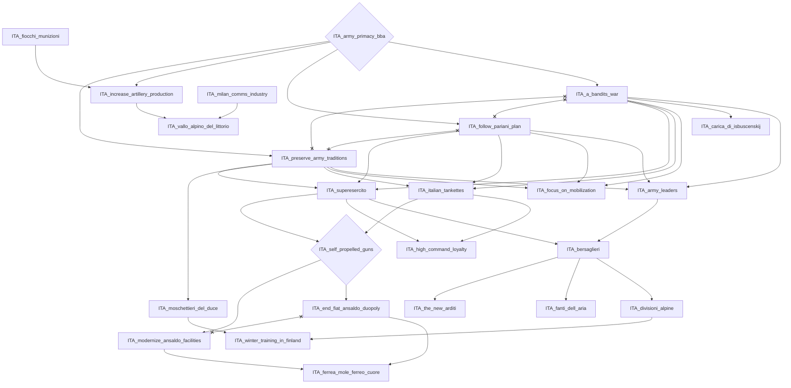
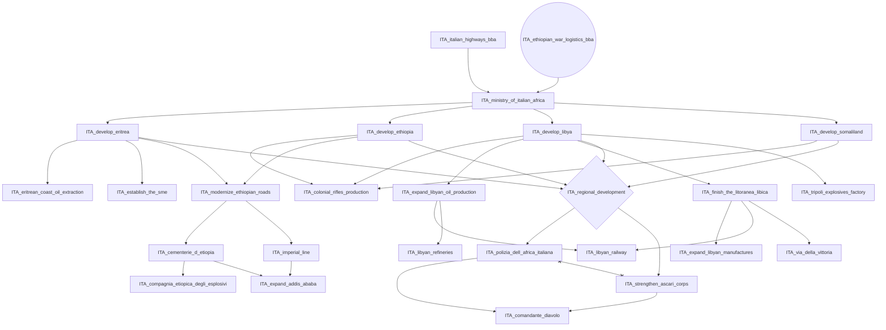
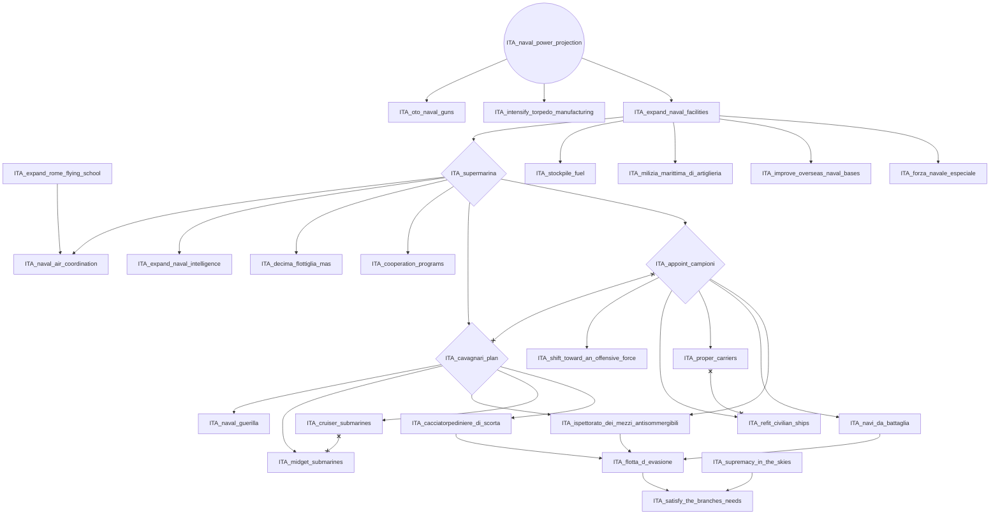
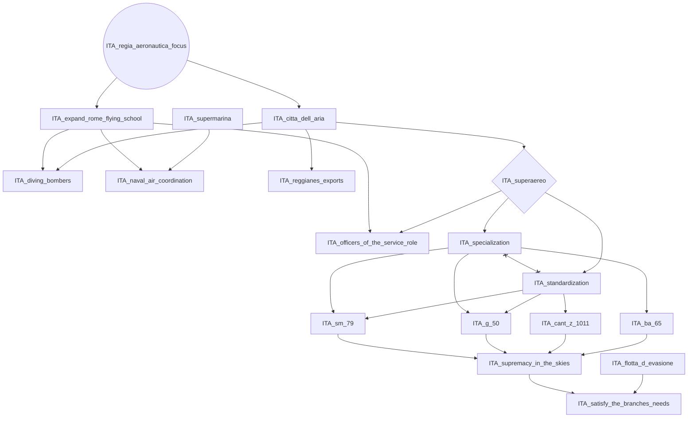
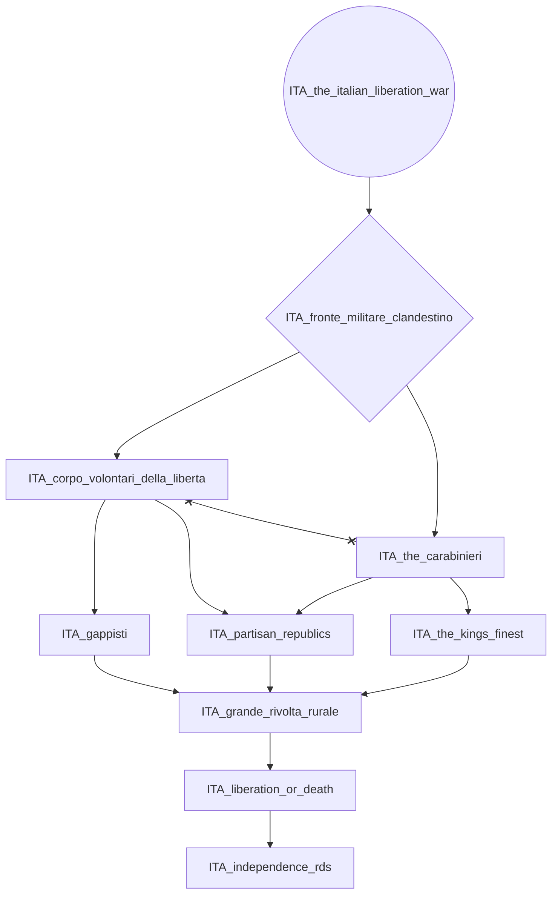
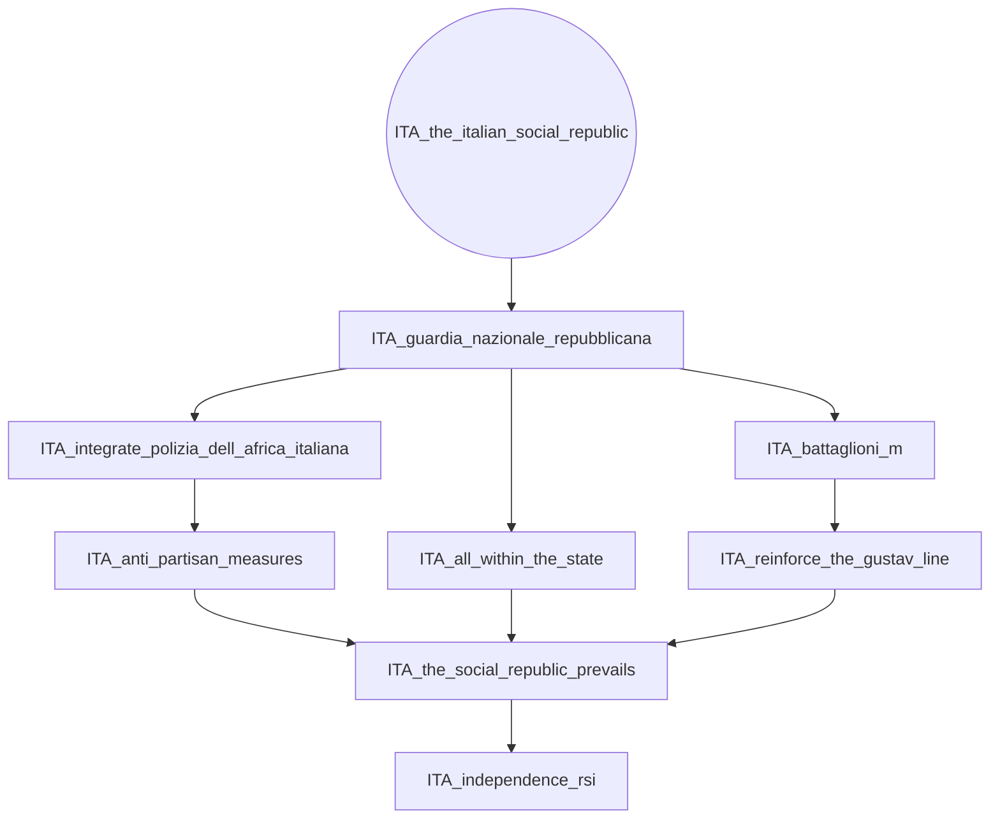

# ITA_army_primacy_bba

# ITA_ethiopian_war_logistics_bba

# ITA_italian_highways_bba

```mermaid
flowchart TD
    n3["ITA_army_primacy_bba"]
    n51["ITA_brescia_small_arms_industry"]
    n25["ITA_cementerie_d_etiopia"]
    n26["ITA_colonial_rifles_production"]
    n27["ITA_comandante_diavolo"]
    n28["ITA_compagnia_etiopica_degli_esplosivi"]
    n52["ITA_crocco_mission"]
    n29["ITA_develop_eritrea"]
    n30["ITA_develop_ethiopia"]
    n31["ITA_develop_libya"]
    n32["ITA_develop_somaliland"]
    n33["ITA_eritrean_coast_oil_extraction"]
    n34["ITA_establish_the_sme"]
    n35["ITA_ethiopian_war_logistics_bba"]
    n36["ITA_expand_addis_ababa"]
    n53["ITA_expand_foggia_farm_fields"]
    n37["ITA_expand_libyan_manufactures"]
    n38["ITA_expand_libyan_oil_production"]
    n54{"ITA_expand_national_universities"}
    n55{"ITA_finance_anic"}
    n39["ITA_finish_the_litoranea_libica"]
    n10["ITA_fiocchi_munizioni"]
    n40["ITA_imperial_line"]
    n56["ITA_incease_fiat_presence_in_the_south"]
    n14["ITA_increase_artillery_production"]
    n57["ITA_increase_production"]
    n58["ITA_investments_in_edison"]
    n41{"ITA_italian_highways_bba"}
    n59["ITA_keep_specialization"]
    n42["ITA_libyan_railway"]
    n43["ITA_libyan_refineries"]
    n16["ITA_milan_comms_industry"]
    n44["ITA_ministry_of_italian_africa"]
    n45["ITA_modernize_ethiopian_roads"]
    n60["ITA_modernize_the_mezzogiorno"]
    n61["ITA_new_industrialization_program"]
    n62["ITA_po_valley_mettalurgy"]
    n46["ITA_polizia_dell_africa_italiana"]
    n63["ITA_power_plants_in_terni"]
    n64["ITA_railway_innovations"]
    n65{"ITA_redirect_alfa_romeo_production"}
    n47{"ITA_regional_development"}
    n66["ITA_steel_industry_in_terni"]
    n48["ITA_strengthen_ascari_corps"]
    n67["ITA_strengthen_northern_industry"]
    n49["ITA_tripoli_explosives_factory"]
    n23["ITA_vallo_alpino_del_littorio"]
    n50["ITA_via_della_vittoria"]
    n10 --> n51
    n45 --> n25
    n31 --> n26
    n32 --> n26
    n30 --> n26
    n46 --> n27
    n48 --> n27
    n25 --> n28
    n57 --> n52
    n59 --> n52
    n44 --> n29
    n44 --> n30
    n44 --> n31
    n44 --> n32
    n29 --> n33
    n29 --> n34
    n40 --> n36
    n25 --> n36
    n64 --> n53
    n39 --> n37
    n31 --> n38
    n58 --> n54
    n66 --> n55
    n63 --> n55
    n31 --> n39
    n41 --> n10
    n45 --> n40
    n60 --> n56
    n10 --> n14
    n3 --> n14
    n54 --> n57
    n65 --> n57
    n64 --> n58
    n54 --> n59
    n65 --> n59
    n39 --> n42
    n38 --> n42
    n38 --> n43
    n10 --> n16
    n41 --> n44
    n35 --> n44
    n30 --> n45
    n29 --> n45
    n55 --> n60
    n67 --> n61
    n60 --> n61
    n54 --> n61
    n67 --> n62
    n47 --> n46
    n41 --> n63
    n41 --> n64
    n51 --> n65
    n16 --> n65
    n29 --> n47
    n31 --> n47
    n32 --> n47
    n30 --> n47
    n41 --> n66
    n47 --> n48
    n55 --> n67
    n31 --> n49
    n16 --> n23
    n14 --> n23
    n39 --> n50
    n57 x--x n59
    n60 x--x n67
    n46 x--x n48
    n63 x--x n66
```

# ITA_naval_power_projection

# ITA_regia_aeronautica_focus

# ITA_solid_progress

```mermaid
flowchart TD
    n108["ITA_a_colonial_empire"]
    n109["ITA_a_greater_purpose"]
    n110["ITA_a_leader_steps_forward"]
    n111["ITA_a_new_era_for_the_red_shirts"]
    n112["ITA_a_time_for_war"]
    n113["ITA_abolish_the_colonies"]
    n114["ITA_agents_of_the_church"]
    n115["ITA_aid_for_the_spanish_republic"]
    n116["ITA_albanian_fascist_militia"]
    n117["ITA_albanian_occupation"]
    n118["ITA_albanian_oil"]
    n119["ITA_all_roads_lead_to_rome"]
    n120{"ITA_ally_yugoslavia"}
    n121["ITA_anglo_italian_agreements"]
    n122["ITA_anglo_italian_pact"]
    n123["ITA_appeal_to_the_bourgeoisie"]
    n124["ITA_appease_the_military"]
    n125["ITA_army_modernization"]
    n126["ITA_ascari"]
    n127["ITA_auxiliaries"]
    n128{"ITA_balkan_ambition"}
    n129["ITA_banda_carita"]
    n130["ITA_banda_koch"]
    n131["ITA_battaglioni_d_assalto"]
    n132{"ITA_befriend_greece"}
    n133["ITA_befriend_japan"]
    n134["ITA_befriend_portugal"]
    n135["ITA_befriend_turkey"]
    n136["ITA_believe_obey_fight"]
    n137["ITA_bend_the_bars"]
    n138{"ITA_blackshirt_loyalty"}
    n139["ITA_boost_the_grand_council_of_fascism"]
    n140["ITA_bring_back_exiled_intellectuals"]
    n141["ITA_bring_back_old_glories"]
    n142["ITA_bring_down_fascist_strongholds"]
    n143["ITA_by_blood_alone"]
    n144["ITA_caligulas_pride"]
    n145["ITA_capo_supremo"]
    n146["ITA_catholic_action"]
    n147["ITA_christian_democracy"]
    n148["ITA_christian_democracy_r56"]
    n149["ITA_claims_on_turkey_bba"]
    n150["ITA_combined_land_and_air_warfare"]
    n151["ITA_combined_research_effort"]
    n152{"ITA_common_ground"}
    n153["ITA_compagnie_auto_avio_sahariane"]
    n154["ITA_condemn_colonialism"]
    n155["ITA_consolidate_power"]
    n156{"ITA_conspiracies_in_the_shadows"}
    n157["ITA_control_the_industrial_elites"]
    n158["ITA_convene_the_grand_council"]
    n159["ITA_cooperate_with_moderates"]
    n160["ITA_cooperate_with_the_mafia"]
    n161["ITA_cooperatives_for_intensive_exploitation"]
    n162{"ITA_corpo_di_truppe_volontarie"}
    n163{"ITA_crush_opposition"}
    n164{"ITA_crush_the_mafia"}
    n165{"ITA_culto_del_duce"}
    n166["ITA_decrease_tariffs"]
    n167["ITA_defend_the_land"]
    n168["ITA_defense_against_capitalism"]
    n169["ITA_defy_the_duce"]
    n170["ITA_demand_balearic_islands_bba"]
    n171["ITA_demand_dalmatia"]
    n172["ITA_demand_ticino"]
    n173["ITA_democratic_king"]
    n174{"ITA_depose_mussolini"}
    n175["ITA_deus_vult"]
    n176["ITA_devaluate_the_lire"]
    n177{"ITA_devotion"}
    n178{"ITA_dino_grandi_focus"}
    n179["ITA_disband_the_blackshirts"]
    n180["ITA_disband_the_partisans"]
    n181["ITA_divino_duce"]
    n182["ITA_economic_reforms"]
    n183["ITA_empower_the_carabinieri"]
    n184{"ITA_empower_the_monarchists"}
    n185["ITA_empower_the_unions"]
    n186["ITA_enlist_the_bashkimi_kombetar"]
    n187["ITA_european_democracies"]
    n188["ITA_expand_intelligence_services"]
    n189["ITA_expand_ond_membership"]
    n190["ITA_expand_the_romanian_oil_fields"]
    n191["ITA_expand_the_royal_guard"]
    n192["ITA_expanded_corporatism"]
    n193["ITA_extraction_industry"]
    n194["ITA_follow_the_soviet_union"]
    n195{"ITA_foreign_affairs"}
    n196["ITA_formalize_the_albanian_protectorate"]
    n197["ITA_franco_italian_pact"]
    n198["ITA_german_military_assistance"]
    n199["ITA_giannini_sarnow_protocols"]
    n200{"ITA_gloria_al_regno_d_italia"}
    n201["ITA_gruppi_di_difesa_della_donna"]
    n202["ITA_guarantee_austrian_independence"]
    n203["ITA_heroes_of_the_nation"]
    n204["ITA_iberian_protection"]
    n205["ITA_il_sol_dell_avvenire"]
    n206["ITA_il_vento_aureo"]
    n207["ITA_improve_the_industries"]
    n208{"ITA_industrial_socialization"}
    n209["ITA_institute_the_five_year_plan"]
    n210["ITA_invite_andorra"]
    n211["ITA_invite_croatia"]
    n212["ITA_invite_france_to_military_partnership"]
    n213["ITA_irregulars"]
    n214["ITA_italia_libera"]
    n215["ITA_italian_hegemony"]
    n216{"ITA_italian_irredentism"}
    n217{"ITA_italian_socialism"}
    n218{"ITA_italo_balbo_focus"}
    n219["ITA_italys_destiny"]
    n220["ITA_joint_military_programs"]
    n221["ITA_la_battaglia_del_grano"]
    n222["ITA_la_battaglia_per_la_terra"]
    n223["ITA_la_battaglia_per_le_nascite"]
    n224["ITA_legge_bottai"]
    n225["ITA_liberalize_our_industries"]
    n226["ITA_liberate_gramsci"]
    n227["ITA_liberate_the_workers_of_africa"]
    n228["ITA_mafia_abroad"]
    n229["ITA_mare_nostrum_bba"]
    n230["ITA_masters_of_the_aegean"]
    n231["ITA_masters_of_the_mediterranean"]
    n232["ITA_meritocracy"]
    n233{"ITA_militarize_the_rome_protocols"}
    n234["ITA_military_agreements"]
    n235["ITA_military_cooperation"]
    n236["ITA_milizia_coloniale"]
    n237["ITA_ministero_della_cultura_popolare"]
    n238["ITA_mobilize_the_railway_guns"]
    n239["ITA_mobilize_womens"]
    n240["ITA_modern_musculus"]
    n241{"ITA_monarchia_d_italia"}
    n242["ITA_move_toward_autarky"]
    n243["ITA_negotiate_italian_claims"]
    n244["ITA_negotiations_with_albania"]
    n245["ITA_new_colonial_policies"]
    n246["ITA_new_corporations"]
    n247["ITA_new_forms_of_weaponry"]
    n248["ITA_new_ricostruzione_industriale"]
    n249["ITA_new_roman_citizens"]
    n250["ITA_novus_ordo"]
    n251["ITA_oil_in_tripoli"]
    n252["ITA_operazione_costantino"]
    n253["ITA_operazione_druso"]
    n254["ITA_operazione_tiberio"]
    n255["ITA_operazione_trajan"]
    n256{"ITA_organize_strikes_in_the_north"}
    n257{"ITA_pact_of_steel"}
    n258["ITA_paramilitary_training"]
    n259["ITA_peace_preservation"]
    n260["ITA_planned_economy"]
    n261["ITA_political_commissars"]
    n262["ITA_potential_allies_in_the_balkans"]
    n263{"ITA_power_to_the_king"}
    n264["ITA_prepare_for_the_coming_wars"]
    n265["ITA_prevent_the_spread_of_communism"]
    n266["ITA_preventive_intervention"]
    n267["ITA_proclaim_the_italian_empire"]
    n268["ITA_production_lines"]
    n269["ITA_pugno_alzato"]
    n270["ITA_purge_the_party"]
    n271["ITA_raise_the_peoples"]
    n272["ITA_ratify_the_stresa_front"]
    n273["ITA_rebuild_the_north"]
    n274["ITA_reestablish_old_alliances"]
    n275["ITA_referendum_on_the_monarchy"]
    n276["ITA_reinforce_regia_aeronautica"]
    n277["ITA_reopen_the_markets"]
    n278["ITA_reorganize_regio_esercito"]
    n279["ITA_reorganize_the_party"]
    n280["ITA_request_civil_war_support"]
    n281["ITA_request_control_of_french_territories"]
    n282["ITA_request_soviet_aid_alternative"]
    n283["ITA_restore_the_statuto_albertino"]
    n284["ITA_resume_food_importation"]
    n285["ITA_revive_the_opera_nazionale_balilla"]
    n286{"ITA_revoke_the_acerbo_law"}
    n287{"ITA_royal_intervention"}
    n288["ITA_royal_militarism"]
    n289["ITA_sanction_mafia_killings"]
    n290["ITA_scientific_cooperation"]
    n291["ITA_scientific_cooperation_r56"]
    n292["ITA_sea_wolves_bba"]
    n293["ITA_secure_control_over_parliament"]
    n294["ITA_secure_the_borders"]
    n295{"ITA_security_militias"}
    n296["ITA_seek_british_military_cooperation"]
    n297["ITA_seek_papal_support"]
    n298["ITA_seize_old_equipment"]
    n299["ITA_servizio_informazione_militare"]
    n300{"ITA_setting_course"}
    n301{"ITA_social_stability"}
    n302(("ITA_solid_progress"))
    n303["ITA_south_american_alliances"]
    n304["ITA_spanish_italian_alliance"]
    n305["ITA_special_brigades"]
    n306["ITA_spreading_the_eagles_wings"]
    n307["ITA_steel_in_tripoli"]
    n308{"ITA_stop_the_squandering"}
    n309["ITA_strengthen_the_blackshirts"]
    n310["ITA_strengthen_the_coalition"]
    n311{"ITA_strengthen_the_papacy"}
    n312{"ITA_strengthen_the_regime"}
    n313["ITA_struggle_in_ethiopia"]
    n314["ITA_study_the_spanish_civil_war"]
    n315["ITA_subdue_the_sentinels"]
    n316["ITA_support_albanian_irredentism"]
    n317["ITA_the_abyssinian_fiasco"]
    n318["ITA_the_catholic_dominion"]
    n319["ITA_the_enemies_of_capitalism"]
    n320{"ITA_the_ethiopian_question"}
    n321{"ITA_the_fate_of_mussolini"}
    n322["ITA_the_fight_against_stalinism"]
    n323["ITA_the_fight_overseas"]
    n324{"ITA_the_fourth_shore"}
    n325["ITA_the_garibaldi_legion"]
    n326["ITA_the_holy_lands"]
    n327["ITA_the_italian_confederation"]
    n328["ITA_the_italian_legions"]
    n329{"ITA_the_italian_republic"}
    n330["ITA_the_italian_tiger"]
    n331["ITA_the_king_of_the_skies"]
    n332{"ITA_the_man_of_providence"}
    n333["ITA_the_new_emperor_of_ethiopia"]
    n334["ITA_the_papacy_reborn"]
    n335["ITA_the_path_to_progress"]
    n336{"ITA_the_popular_front"}
    n337["ITA_the_republics_leadership"]
    n338{"ITA_the_southern_farmlands"}
    n339["ITA_the_spanish_question"]
    n340["ITA_to_live_as_a_lion"]
    n341["ITA_topple_amhara_rulers"]
    n342{"ITA_towards_a_greater_italy"}
    n343{"ITA_triumph_in_africa_bba"}
    n344{"ITA_union_in_the_party"}
    n345["ITA_unite_the_opposition"]
    n346["ITA_united_anarchist_confederations"]
    n347["ITA_utilize_the_blackshirts"]
    n348["ITA_war_with_france"]
    n349{"ITA_war_with_greece"}
    n350["ITA_war_with_the_uk"]
    n315 --> n108
    n321 --> n109
    n336 --> n110
    n325 --> n111
    n175 --> n112
    n320 --> n113
    n297 --> n114
    n217 --> n115
    n316 --> n116
    n120 --> n117
    n128 --> n117
    n117 --> n118
    n196 --> n118
    n328 --> n119
    n195 --> n120
    n343 --> n121
    n296 --> n122
    n169 --> n123
    n152 --> n124
    n124 --> n125
    n261 --> n125
    n183 --> n125
    n323 --> n126
    n229 --> n127
    n195 --> n128
    n136 --> n129
    n129 --> n130
    n295 --> n131
    n233 --> n132
    n257 --> n133
    n233 --> n133
    n304 --> n134
    n170 --> n134
    n349 --> n135
    n132 --> n135
    n237 --> n136
    n342 --> n137
    n181 --> n138
    n332 --> n139
    n337 --> n140
    n264 --> n141
    n290 --> n142
    n108 --> n143
    n119 --> n144
    n342 --> n145
    n177 --> n145
    n334 --> n146
    n286 --> n147
    n275 --> n148
    n349 --> n149
    n132 --> n149
    n153 --> n150
    n235 --> n151
    n336 --> n152
    n217 --> n152
    n278 --> n153
    n276 --> n153
    n161 --> n154
    n218 --> n155
    n178 --> n155
    n288 --> n157
    n343 --> n158
    n156 --> n158
    n147 --> n159
    n173 --> n159
    n217 --> n160
    n113 --> n161
    n195 --> n162
    n159 --> n163
    n188 --> n163
    n336 --> n164
    n217 --> n164
    n343 --> n165
    n284 --> n166
    n344 --> n167
    n235 --> n168
    n256 --> n169
    n338 --> n169
    n343 --> n169
    n162 --> n170
    n272 --> n171
    n348 --> n172
    n281 --> n172
    n286 --> n173
    n158 --> n174
    n334 --> n175
    n343 --> n176
    n340 --> n177
    n139 --> n177
    n312 --> n177
    n174 --> n178
    n263 --> n179
    n286 --> n179
    n275 --> n180
    n321 --> n181
    n279 --> n182
    n164 --> n183
    n287 --> n184
    n217 --> n185
    n244 --> n186
    n214 --> n187
    n173 --> n188
    n147 --> n188
    n237 --> n189
    n255 --> n190
    n179 --> n191
    n347 --> n191
    n232 --> n192
    n207 --> n192
    n241 --> n193
    n344 --> n194
    n343 --> n195
    n156 --> n195
    n120 --> n196
    n128 --> n196
    n212 --> n197
    n257 --> n198
    n257 --> n199
    n191 --> n200
    n173 --> n200
    n325 --> n201
    n120 --> n202
    n128 --> n202
    n342 --> n203
    n177 --> n203
    n229 --> n204
    n175 --> n204
    n151 --> n205
    n271 --> n205
    n175 --> n206
    n182 --> n207
    n336 --> n208
    n208 --> n209
    n304 --> n210
    n233 --> n211
    n178 --> n212
    n241 --> n212
    n323 --> n213
    n301 --> n214
    n306 --> n215
    n257 --> n216
    n233 --> n216
    n329 --> n217
    n174 --> n218
    n171 --> n219
    n272 --> n220
    n165 --> n221
    n165 --> n222
    n221 --> n223
    n222 --> n223
    n332 --> n224
    n180 --> n225
    n148 --> n225
    n345 --> n226
    n343 --> n226
    n323 --> n227
    n160 --> n228
    n300 --> n229
    n312 --> n229
    n138 --> n229
    n137 --> n230
    n230 --> n231
    n279 --> n232
    n270 --> n232
    n120 --> n233
    n128 --> n233
    n274 --> n234
    n194 --> n235
    n131 --> n236
    n309 --> n236
    n165 --> n237
    n158 --> n237
    n264 --> n238
    n237 --> n239
    n119 --> n240
    n174 --> n241
    n221 --> n242
    n222 --> n242
    n202 --> n243
    n113 --> n244
    n245 --> n244
    n320 --> n245
    n193 --> n246
    n264 --> n247
    n209 --> n248
    n229 --> n249
    n307 --> n250
    n251 --> n250
    n324 --> n251
    n149 --> n252
    n135 --> n252
    n172 --> n253
    n216 --> n254
    n233 --> n255
    n120 --> n257
    n128 --> n257
    n191 --> n258
    n347 --> n258
    n187 --> n259
    n327 --> n260
    n208 --> n261
    n128 --> n262
    n120 --> n262
    n241 --> n263
    n193 --> n264
    n219 --> n265
    n219 --> n266
    n122 --> n267
    n197 --> n267
    n185 --> n268
    n201 --> n269
    n111 --> n269
    n155 --> n270
    n308 --> n270
    n167 --> n271
    n243 --> n272
    n184 --> n273
    n310 --> n273
    n301 --> n274
    n310 --> n275
    n218 --> n276
    n308 --> n276
    n273 --> n277
    n218 --> n278
    n308 --> n278
    n178 --> n279
    n155 --> n279
    n282 --> n280
    n257 --> n281
    n216 --> n281
    n200 --> n282
    n163 --> n282
    n311 --> n282
    n184 --> n283
    n272 --> n284
    n295 --> n285
    n241 --> n286
    n343 --> n287
    n293 --> n288
    n283 --> n288
    n200 --> n289
    n163 --> n289
    n311 --> n289
    n214 --> n290
    n274 --> n290
    n198 --> n291
    n199 --> n291
    n198 --> n292
    n184 --> n293
    n290 --> n294
    n165 --> n295
    n158 --> n295
    n178 --> n296
    n241 --> n296
    n263 --> n297
    n169 --> n298
    n302 --> n299
    n317 --> n299
    n313 --> n299
    n200 --> n300
    n163 --> n300
    n311 --> n300
    n140 --> n301
    n204 --> n303
    n162 --> n304
    n233 --> n304
    n194 --> n305
    n167 --> n305
    n109 --> n306
    n324 --> n307
    n218 --> n308
    n178 --> n308
    n295 --> n309
    n287 --> n310
    n114 --> n311
    n223 --> n312
    n162 --> n314
    n137 --> n315
    n117 --> n316
    n196 --> n316
    n112 --> n318
    n326 --> n318
    n234 --> n319
    n169 --> n320
    n270 --> n321
    n167 --> n322
    n161 --> n323
    n327 --> n323
    n218 --> n324
    n308 --> n324
    n336 --> n325
    n175 --> n326
    n245 --> n327
    n229 --> n328
    n169 --> n329
    n291 --> n330
    n119 --> n331
    n165 --> n332
    n343 --> n333
    n311 --> n334
    n110 --> n335
    n329 --> n336
    n217 --> n337
    n304 --> n339
    n170 --> n339
    n332 --> n340
    n343 --> n341
    n312 --> n342
    n138 --> n342
    n300 --> n342
    n299 --> n343
    n335 --> n344
    n167 --> n346
    n263 --> n347
    n216 --> n348
    n216 --> n349
    n233 --> n350
    n216 --> n350
    n109 x--x n181
    n113 x--x n245
    n117 x--x n196
    n120 x--x n128
    n124 x--x n183
    n124 x--x n261
    n131 x--x n309
    n132 x--x n349
    n135 x--x n149
    n139 x--x n340
    n145 x--x n203
    n147 x--x n173
    n158 x--x n165
    n158 x--x n169
    n160 x--x n164
    n165 x--x n169
    n165 x--x n287
    n167 x--x n194
    n170 x--x n304
    n178 x--x n218
    n178 x--x n241
    n179 x--x n347
    n183 x--x n261
    n184 x--x n310
    n202 x--x n233
    n202 x--x n257
    n212 x--x n296
    n214 x--x n274
    n217 x--x n336
    n218 x--x n241
    n221 x--x n222
    n229 x--x n342
    n233 x--x n257
    n251 x--x n307
    n263 x--x n286
    n276 x--x n278
    n281 x--x n348
    n282 x--x n289
    n283 x--x n293
    n302 x--x n313
    n302 x--x n317
```

# ITA_struggle_in_ethiopia

```mermaid
flowchart TD
    n108["ITA_a_colonial_empire"]
    n109["ITA_a_greater_purpose"]
    n110["ITA_a_leader_steps_forward"]
    n111["ITA_a_new_era_for_the_red_shirts"]
    n112["ITA_a_time_for_war"]
    n113["ITA_abolish_the_colonies"]
    n114["ITA_agents_of_the_church"]
    n115["ITA_aid_for_the_spanish_republic"]
    n116["ITA_albanian_fascist_militia"]
    n117["ITA_albanian_occupation"]
    n118["ITA_albanian_oil"]
    n119["ITA_all_roads_lead_to_rome"]
    n120{"ITA_ally_yugoslavia"}
    n121["ITA_anglo_italian_agreements"]
    n122["ITA_anglo_italian_pact"]
    n123["ITA_appeal_to_the_bourgeoisie"]
    n124["ITA_appease_the_military"]
    n125["ITA_army_modernization"]
    n126["ITA_ascari"]
    n127["ITA_auxiliaries"]
    n128{"ITA_balkan_ambition"}
    n129["ITA_banda_carita"]
    n130["ITA_banda_koch"]
    n131["ITA_battaglioni_d_assalto"]
    n132{"ITA_befriend_greece"}
    n133["ITA_befriend_japan"]
    n134["ITA_befriend_portugal"]
    n135["ITA_befriend_turkey"]
    n136["ITA_believe_obey_fight"]
    n137["ITA_bend_the_bars"]
    n138{"ITA_blackshirt_loyalty"}
    n139["ITA_boost_the_grand_council_of_fascism"]
    n140["ITA_bring_back_exiled_intellectuals"]
    n141["ITA_bring_back_old_glories"]
    n142["ITA_bring_down_fascist_strongholds"]
    n143["ITA_by_blood_alone"]
    n144["ITA_caligulas_pride"]
    n145["ITA_capo_supremo"]
    n146["ITA_catholic_action"]
    n147["ITA_christian_democracy"]
    n148["ITA_christian_democracy_r56"]
    n149["ITA_claims_on_turkey_bba"]
    n150["ITA_combined_land_and_air_warfare"]
    n151["ITA_combined_research_effort"]
    n152{"ITA_common_ground"}
    n153["ITA_compagnie_auto_avio_sahariane"]
    n154["ITA_condemn_colonialism"]
    n155["ITA_consolidate_power"]
    n156{"ITA_conspiracies_in_the_shadows"}
    n157["ITA_control_the_industrial_elites"]
    n158["ITA_convene_the_grand_council"]
    n159["ITA_cooperate_with_moderates"]
    n160["ITA_cooperate_with_the_mafia"]
    n161["ITA_cooperatives_for_intensive_exploitation"]
    n162{"ITA_corpo_di_truppe_volontarie"}
    n163{"ITA_crush_opposition"}
    n164{"ITA_crush_the_mafia"}
    n165{"ITA_culto_del_duce"}
    n166["ITA_decrease_tariffs"]
    n167["ITA_defend_the_land"]
    n168["ITA_defense_against_capitalism"]
    n169["ITA_defy_the_duce"]
    n170["ITA_demand_balearic_islands_bba"]
    n171["ITA_demand_dalmatia"]
    n172["ITA_demand_ticino"]
    n173["ITA_democratic_king"]
    n174{"ITA_depose_mussolini"}
    n175["ITA_deus_vult"]
    n176["ITA_devaluate_the_lire"]
    n177{"ITA_devotion"}
    n178{"ITA_dino_grandi_focus"}
    n179["ITA_disband_the_blackshirts"]
    n180["ITA_disband_the_partisans"]
    n181["ITA_divino_duce"]
    n182["ITA_economic_reforms"]
    n183["ITA_empower_the_carabinieri"]
    n184{"ITA_empower_the_monarchists"}
    n185["ITA_empower_the_unions"]
    n186["ITA_enlist_the_bashkimi_kombetar"]
    n187["ITA_european_democracies"]
    n188["ITA_expand_intelligence_services"]
    n189["ITA_expand_ond_membership"]
    n190["ITA_expand_the_romanian_oil_fields"]
    n191["ITA_expand_the_royal_guard"]
    n192["ITA_expanded_corporatism"]
    n193["ITA_extraction_industry"]
    n194["ITA_follow_the_soviet_union"]
    n195{"ITA_foreign_affairs"}
    n196["ITA_formalize_the_albanian_protectorate"]
    n197["ITA_franco_italian_pact"]
    n198["ITA_german_military_assistance"]
    n199["ITA_giannini_sarnow_protocols"]
    n200{"ITA_gloria_al_regno_d_italia"}
    n201["ITA_gruppi_di_difesa_della_donna"]
    n202["ITA_guarantee_austrian_independence"]
    n203["ITA_heroes_of_the_nation"]
    n204["ITA_iberian_protection"]
    n205["ITA_il_sol_dell_avvenire"]
    n206["ITA_il_vento_aureo"]
    n207["ITA_improve_the_industries"]
    n208{"ITA_industrial_socialization"}
    n209["ITA_institute_the_five_year_plan"]
    n210["ITA_invite_andorra"]
    n211["ITA_invite_croatia"]
    n212["ITA_invite_france_to_military_partnership"]
    n213["ITA_irregulars"]
    n214["ITA_italia_libera"]
    n215["ITA_italian_hegemony"]
    n216{"ITA_italian_irredentism"}
    n217{"ITA_italian_socialism"}
    n218{"ITA_italo_balbo_focus"}
    n219["ITA_italys_destiny"]
    n220["ITA_joint_military_programs"]
    n221["ITA_la_battaglia_del_grano"]
    n222["ITA_la_battaglia_per_la_terra"]
    n223["ITA_la_battaglia_per_le_nascite"]
    n224["ITA_legge_bottai"]
    n225["ITA_liberalize_our_industries"]
    n226["ITA_liberate_gramsci"]
    n227["ITA_liberate_the_workers_of_africa"]
    n228["ITA_mafia_abroad"]
    n229["ITA_mare_nostrum_bba"]
    n230["ITA_masters_of_the_aegean"]
    n231["ITA_masters_of_the_mediterranean"]
    n232["ITA_meritocracy"]
    n233{"ITA_militarize_the_rome_protocols"}
    n234["ITA_military_agreements"]
    n235["ITA_military_cooperation"]
    n236["ITA_milizia_coloniale"]
    n237["ITA_ministero_della_cultura_popolare"]
    n238["ITA_mobilize_the_railway_guns"]
    n239["ITA_mobilize_womens"]
    n240["ITA_modern_musculus"]
    n241{"ITA_monarchia_d_italia"}
    n242["ITA_move_toward_autarky"]
    n243["ITA_negotiate_italian_claims"]
    n244["ITA_negotiations_with_albania"]
    n245["ITA_new_colonial_policies"]
    n246["ITA_new_corporations"]
    n247["ITA_new_forms_of_weaponry"]
    n248["ITA_new_ricostruzione_industriale"]
    n249["ITA_new_roman_citizens"]
    n250["ITA_novus_ordo"]
    n251["ITA_oil_in_tripoli"]
    n252["ITA_operazione_costantino"]
    n253["ITA_operazione_druso"]
    n254["ITA_operazione_tiberio"]
    n255["ITA_operazione_trajan"]
    n256{"ITA_organize_strikes_in_the_north"}
    n257{"ITA_pact_of_steel"}
    n258["ITA_paramilitary_training"]
    n259["ITA_peace_preservation"]
    n260["ITA_planned_economy"]
    n261["ITA_political_commissars"]
    n262["ITA_potential_allies_in_the_balkans"]
    n263{"ITA_power_to_the_king"}
    n264["ITA_prepare_for_the_coming_wars"]
    n265["ITA_prevent_the_spread_of_communism"]
    n266["ITA_preventive_intervention"]
    n267["ITA_proclaim_the_italian_empire"]
    n268["ITA_production_lines"]
    n269["ITA_pugno_alzato"]
    n270["ITA_purge_the_party"]
    n271["ITA_raise_the_peoples"]
    n272["ITA_ratify_the_stresa_front"]
    n273["ITA_rebuild_the_north"]
    n274["ITA_reestablish_old_alliances"]
    n275["ITA_referendum_on_the_monarchy"]
    n276["ITA_reinforce_regia_aeronautica"]
    n277["ITA_reopen_the_markets"]
    n278["ITA_reorganize_regio_esercito"]
    n279["ITA_reorganize_the_party"]
    n280["ITA_request_civil_war_support"]
    n281["ITA_request_control_of_french_territories"]
    n282["ITA_request_soviet_aid_alternative"]
    n283["ITA_restore_the_statuto_albertino"]
    n284["ITA_resume_food_importation"]
    n285["ITA_revive_the_opera_nazionale_balilla"]
    n286{"ITA_revoke_the_acerbo_law"}
    n287{"ITA_royal_intervention"}
    n288["ITA_royal_militarism"]
    n289["ITA_sanction_mafia_killings"]
    n290["ITA_scientific_cooperation"]
    n291["ITA_scientific_cooperation_r56"]
    n292["ITA_sea_wolves_bba"]
    n293["ITA_secure_control_over_parliament"]
    n294["ITA_secure_the_borders"]
    n295{"ITA_security_militias"}
    n296["ITA_seek_british_military_cooperation"]
    n297["ITA_seek_papal_support"]
    n298["ITA_seize_old_equipment"]
    n299["ITA_servizio_informazione_militare"]
    n300{"ITA_setting_course"}
    n301{"ITA_social_stability"}
    n302["ITA_solid_progress"]
    n303["ITA_south_american_alliances"]
    n304["ITA_spanish_italian_alliance"]
    n305["ITA_special_brigades"]
    n306["ITA_spreading_the_eagles_wings"]
    n307["ITA_steel_in_tripoli"]
    n308{"ITA_stop_the_squandering"}
    n309["ITA_strengthen_the_blackshirts"]
    n310["ITA_strengthen_the_coalition"]
    n311{"ITA_strengthen_the_papacy"}
    n312{"ITA_strengthen_the_regime"}
    n313(("ITA_struggle_in_ethiopia"))
    n314["ITA_study_the_spanish_civil_war"]
    n315["ITA_subdue_the_sentinels"]
    n316["ITA_support_albanian_irredentism"]
    n317["ITA_the_abyssinian_fiasco"]
    n318["ITA_the_catholic_dominion"]
    n319["ITA_the_enemies_of_capitalism"]
    n320{"ITA_the_ethiopian_question"}
    n321{"ITA_the_fate_of_mussolini"}
    n322["ITA_the_fight_against_stalinism"]
    n323["ITA_the_fight_overseas"]
    n324{"ITA_the_fourth_shore"}
    n325["ITA_the_garibaldi_legion"]
    n326["ITA_the_holy_lands"]
    n327["ITA_the_italian_confederation"]
    n328["ITA_the_italian_legions"]
    n329{"ITA_the_italian_republic"}
    n330["ITA_the_italian_tiger"]
    n331["ITA_the_king_of_the_skies"]
    n332{"ITA_the_man_of_providence"}
    n333["ITA_the_new_emperor_of_ethiopia"]
    n334["ITA_the_papacy_reborn"]
    n335["ITA_the_path_to_progress"]
    n336{"ITA_the_popular_front"}
    n337["ITA_the_republics_leadership"]
    n338{"ITA_the_southern_farmlands"}
    n339["ITA_the_spanish_question"]
    n340["ITA_to_live_as_a_lion"]
    n341["ITA_topple_amhara_rulers"]
    n342{"ITA_towards_a_greater_italy"}
    n343{"ITA_triumph_in_africa_bba"}
    n351["ITA_undermine_the_duce"]
    n344{"ITA_union_in_the_party"}
    n345["ITA_unite_the_opposition"]
    n346["ITA_united_anarchist_confederations"]
    n347["ITA_utilize_the_blackshirts"]
    n348["ITA_war_with_france"]
    n349{"ITA_war_with_greece"}
    n350["ITA_war_with_the_uk"]
    n315 --> n108
    n321 --> n109
    n336 --> n110
    n325 --> n111
    n175 --> n112
    n320 --> n113
    n297 --> n114
    n217 --> n115
    n316 --> n116
    n120 --> n117
    n128 --> n117
    n117 --> n118
    n196 --> n118
    n328 --> n119
    n195 --> n120
    n343 --> n121
    n296 --> n122
    n169 --> n123
    n152 --> n124
    n124 --> n125
    n261 --> n125
    n183 --> n125
    n323 --> n126
    n229 --> n127
    n195 --> n128
    n136 --> n129
    n129 --> n130
    n295 --> n131
    n233 --> n132
    n257 --> n133
    n233 --> n133
    n304 --> n134
    n170 --> n134
    n349 --> n135
    n132 --> n135
    n237 --> n136
    n342 --> n137
    n181 --> n138
    n332 --> n139
    n337 --> n140
    n264 --> n141
    n290 --> n142
    n108 --> n143
    n119 --> n144
    n342 --> n145
    n177 --> n145
    n334 --> n146
    n286 --> n147
    n275 --> n148
    n349 --> n149
    n132 --> n149
    n153 --> n150
    n235 --> n151
    n336 --> n152
    n217 --> n152
    n278 --> n153
    n276 --> n153
    n161 --> n154
    n218 --> n155
    n178 --> n155
    n351 --> n156
    n288 --> n157
    n343 --> n158
    n156 --> n158
    n147 --> n159
    n173 --> n159
    n217 --> n160
    n113 --> n161
    n195 --> n162
    n159 --> n163
    n188 --> n163
    n336 --> n164
    n217 --> n164
    n343 --> n165
    n284 --> n166
    n344 --> n167
    n235 --> n168
    n256 --> n169
    n338 --> n169
    n343 --> n169
    n162 --> n170
    n272 --> n171
    n348 --> n172
    n281 --> n172
    n286 --> n173
    n158 --> n174
    n334 --> n175
    n343 --> n176
    n340 --> n177
    n139 --> n177
    n312 --> n177
    n174 --> n178
    n263 --> n179
    n286 --> n179
    n275 --> n180
    n321 --> n181
    n279 --> n182
    n164 --> n183
    n287 --> n184
    n217 --> n185
    n244 --> n186
    n214 --> n187
    n173 --> n188
    n147 --> n188
    n237 --> n189
    n255 --> n190
    n179 --> n191
    n347 --> n191
    n232 --> n192
    n207 --> n192
    n241 --> n193
    n344 --> n194
    n343 --> n195
    n156 --> n195
    n120 --> n196
    n128 --> n196
    n212 --> n197
    n257 --> n198
    n257 --> n199
    n191 --> n200
    n173 --> n200
    n325 --> n201
    n120 --> n202
    n128 --> n202
    n342 --> n203
    n177 --> n203
    n229 --> n204
    n175 --> n204
    n151 --> n205
    n271 --> n205
    n175 --> n206
    n182 --> n207
    n336 --> n208
    n208 --> n209
    n304 --> n210
    n233 --> n211
    n178 --> n212
    n241 --> n212
    n323 --> n213
    n301 --> n214
    n306 --> n215
    n257 --> n216
    n233 --> n216
    n329 --> n217
    n174 --> n218
    n171 --> n219
    n272 --> n220
    n165 --> n221
    n165 --> n222
    n221 --> n223
    n222 --> n223
    n332 --> n224
    n180 --> n225
    n148 --> n225
    n345 --> n226
    n343 --> n226
    n323 --> n227
    n160 --> n228
    n300 --> n229
    n312 --> n229
    n138 --> n229
    n137 --> n230
    n230 --> n231
    n279 --> n232
    n270 --> n232
    n120 --> n233
    n128 --> n233
    n274 --> n234
    n194 --> n235
    n131 --> n236
    n309 --> n236
    n165 --> n237
    n158 --> n237
    n264 --> n238
    n237 --> n239
    n119 --> n240
    n174 --> n241
    n221 --> n242
    n222 --> n242
    n202 --> n243
    n113 --> n244
    n245 --> n244
    n320 --> n245
    n193 --> n246
    n264 --> n247
    n209 --> n248
    n229 --> n249
    n307 --> n250
    n251 --> n250
    n324 --> n251
    n149 --> n252
    n135 --> n252
    n172 --> n253
    n216 --> n254
    n233 --> n255
    n120 --> n257
    n128 --> n257
    n191 --> n258
    n347 --> n258
    n187 --> n259
    n327 --> n260
    n208 --> n261
    n128 --> n262
    n120 --> n262
    n241 --> n263
    n193 --> n264
    n219 --> n265
    n219 --> n266
    n122 --> n267
    n197 --> n267
    n185 --> n268
    n201 --> n269
    n111 --> n269
    n155 --> n270
    n308 --> n270
    n167 --> n271
    n243 --> n272
    n184 --> n273
    n310 --> n273
    n301 --> n274
    n310 --> n275
    n218 --> n276
    n308 --> n276
    n273 --> n277
    n218 --> n278
    n308 --> n278
    n178 --> n279
    n155 --> n279
    n282 --> n280
    n257 --> n281
    n216 --> n281
    n200 --> n282
    n163 --> n282
    n311 --> n282
    n184 --> n283
    n272 --> n284
    n295 --> n285
    n241 --> n286
    n343 --> n287
    n293 --> n288
    n283 --> n288
    n200 --> n289
    n163 --> n289
    n311 --> n289
    n214 --> n290
    n274 --> n290
    n198 --> n291
    n199 --> n291
    n198 --> n292
    n184 --> n293
    n290 --> n294
    n165 --> n295
    n158 --> n295
    n178 --> n296
    n241 --> n296
    n263 --> n297
    n169 --> n298
    n302 --> n299
    n317 --> n299
    n313 --> n299
    n200 --> n300
    n163 --> n300
    n311 --> n300
    n140 --> n301
    n204 --> n303
    n162 --> n304
    n233 --> n304
    n194 --> n305
    n167 --> n305
    n109 --> n306
    n324 --> n307
    n218 --> n308
    n178 --> n308
    n295 --> n309
    n287 --> n310
    n114 --> n311
    n223 --> n312
    n162 --> n314
    n137 --> n315
    n117 --> n316
    n196 --> n316
    n112 --> n318
    n326 --> n318
    n234 --> n319
    n169 --> n320
    n270 --> n321
    n167 --> n322
    n161 --> n323
    n327 --> n323
    n218 --> n324
    n308 --> n324
    n336 --> n325
    n175 --> n326
    n245 --> n327
    n229 --> n328
    n169 --> n329
    n291 --> n330
    n119 --> n331
    n165 --> n332
    n343 --> n333
    n311 --> n334
    n110 --> n335
    n329 --> n336
    n217 --> n337
    n304 --> n339
    n170 --> n339
    n332 --> n340
    n343 --> n341
    n312 --> n342
    n138 --> n342
    n300 --> n342
    n299 --> n343
    n313 --> n351
    n335 --> n344
    n167 --> n346
    n263 --> n347
    n216 --> n348
    n216 --> n349
    n233 --> n350
    n216 --> n350
    n109 x--x n181
    n113 x--x n245
    n117 x--x n196
    n120 x--x n128
    n124 x--x n183
    n124 x--x n261
    n131 x--x n309
    n132 x--x n349
    n135 x--x n149
    n139 x--x n340
    n145 x--x n203
    n147 x--x n173
    n158 x--x n165
    n158 x--x n169
    n160 x--x n164
    n165 x--x n169
    n165 x--x n287
    n167 x--x n194
    n170 x--x n304
    n178 x--x n218
    n178 x--x n241
    n179 x--x n347
    n183 x--x n261
    n184 x--x n310
    n202 x--x n233
    n202 x--x n257
    n212 x--x n296
    n214 x--x n274
    n217 x--x n336
    n218 x--x n241
    n221 x--x n222
    n229 x--x n342
    n233 x--x n257
    n251 x--x n307
    n263 x--x n286
    n276 x--x n278
    n281 x--x n348
    n282 x--x n289
    n283 x--x n293
    n302 x--x n313
    n313 x--x n317
```

# ITA_the_abyssinian_fiasco

```mermaid
flowchart TD
    n108["ITA_a_colonial_empire"]
    n109["ITA_a_greater_purpose"]
    n110["ITA_a_leader_steps_forward"]
    n111["ITA_a_new_era_for_the_red_shirts"]
    n112["ITA_a_time_for_war"]
    n113["ITA_abolish_the_colonies"]
    n114["ITA_agents_of_the_church"]
    n115["ITA_aid_for_the_spanish_republic"]
    n116["ITA_albanian_fascist_militia"]
    n117["ITA_albanian_occupation"]
    n118["ITA_albanian_oil"]
    n119["ITA_all_roads_lead_to_rome"]
    n120{"ITA_ally_yugoslavia"}
    n121["ITA_anglo_italian_agreements"]
    n122["ITA_anglo_italian_pact"]
    n123["ITA_appeal_to_the_bourgeoisie"]
    n124["ITA_appease_the_military"]
    n125["ITA_army_modernization"]
    n126["ITA_ascari"]
    n127["ITA_auxiliaries"]
    n128{"ITA_balkan_ambition"}
    n129["ITA_banda_carita"]
    n130["ITA_banda_koch"]
    n131["ITA_battaglioni_d_assalto"]
    n132{"ITA_befriend_greece"}
    n133["ITA_befriend_japan"]
    n134["ITA_befriend_portugal"]
    n135["ITA_befriend_turkey"]
    n136["ITA_believe_obey_fight"]
    n137["ITA_bend_the_bars"]
    n138{"ITA_blackshirt_loyalty"}
    n139["ITA_boost_the_grand_council_of_fascism"]
    n140["ITA_bring_back_exiled_intellectuals"]
    n141["ITA_bring_back_old_glories"]
    n142["ITA_bring_down_fascist_strongholds"]
    n143["ITA_by_blood_alone"]
    n144["ITA_caligulas_pride"]
    n145["ITA_capo_supremo"]
    n146["ITA_catholic_action"]
    n147["ITA_christian_democracy"]
    n148["ITA_christian_democracy_r56"]
    n149["ITA_claims_on_turkey_bba"]
    n150["ITA_combined_land_and_air_warfare"]
    n151["ITA_combined_research_effort"]
    n152{"ITA_common_ground"}
    n153["ITA_compagnie_auto_avio_sahariane"]
    n154["ITA_condemn_colonialism"]
    n155["ITA_consolidate_power"]
    n156{"ITA_conspiracies_in_the_shadows"}
    n157["ITA_control_the_industrial_elites"]
    n158["ITA_convene_the_grand_council"]
    n159["ITA_cooperate_with_moderates"]
    n160["ITA_cooperate_with_the_mafia"]
    n161["ITA_cooperatives_for_intensive_exploitation"]
    n162{"ITA_corpo_di_truppe_volontarie"}
    n163{"ITA_crush_opposition"}
    n164{"ITA_crush_the_mafia"}
    n165{"ITA_culto_del_duce"}
    n166["ITA_decrease_tariffs"]
    n167["ITA_defend_the_land"]
    n168["ITA_defense_against_capitalism"]
    n169["ITA_defy_the_duce"]
    n170["ITA_demand_balearic_islands_bba"]
    n171["ITA_demand_dalmatia"]
    n172["ITA_demand_ticino"]
    n173["ITA_democratic_king"]
    n174{"ITA_depose_mussolini"}
    n175["ITA_deus_vult"]
    n176["ITA_devaluate_the_lire"]
    n177{"ITA_devotion"}
    n178{"ITA_dino_grandi_focus"}
    n179["ITA_disband_the_blackshirts"]
    n180["ITA_disband_the_partisans"]
    n181["ITA_divino_duce"]
    n182["ITA_economic_reforms"]
    n183["ITA_empower_the_carabinieri"]
    n184{"ITA_empower_the_monarchists"}
    n185["ITA_empower_the_unions"]
    n186["ITA_enlist_the_bashkimi_kombetar"]
    n187["ITA_european_democracies"]
    n188["ITA_expand_intelligence_services"]
    n189["ITA_expand_ond_membership"]
    n190["ITA_expand_the_romanian_oil_fields"]
    n191["ITA_expand_the_royal_guard"]
    n192["ITA_expanded_corporatism"]
    n193["ITA_extraction_industry"]
    n194["ITA_follow_the_soviet_union"]
    n195{"ITA_foreign_affairs"}
    n196["ITA_formalize_the_albanian_protectorate"]
    n197["ITA_franco_italian_pact"]
    n198["ITA_german_military_assistance"]
    n199["ITA_giannini_sarnow_protocols"]
    n200{"ITA_gloria_al_regno_d_italia"}
    n201["ITA_gruppi_di_difesa_della_donna"]
    n202["ITA_guarantee_austrian_independence"]
    n203["ITA_heroes_of_the_nation"]
    n204["ITA_iberian_protection"]
    n205["ITA_il_sol_dell_avvenire"]
    n206["ITA_il_vento_aureo"]
    n207["ITA_improve_the_industries"]
    n208{"ITA_industrial_socialization"}
    n209["ITA_institute_the_five_year_plan"]
    n210["ITA_invite_andorra"]
    n211["ITA_invite_croatia"]
    n212["ITA_invite_france_to_military_partnership"]
    n213["ITA_irregulars"]
    n214["ITA_italia_libera"]
    n215["ITA_italian_hegemony"]
    n216{"ITA_italian_irredentism"}
    n217{"ITA_italian_socialism"}
    n218{"ITA_italo_balbo_focus"}
    n219["ITA_italys_destiny"]
    n220["ITA_joint_military_programs"]
    n221["ITA_la_battaglia_del_grano"]
    n222["ITA_la_battaglia_per_la_terra"]
    n223["ITA_la_battaglia_per_le_nascite"]
    n224["ITA_legge_bottai"]
    n225["ITA_liberalize_our_industries"]
    n226["ITA_liberate_gramsci"]
    n227["ITA_liberate_the_workers_of_africa"]
    n228["ITA_mafia_abroad"]
    n229["ITA_mare_nostrum_bba"]
    n230["ITA_masters_of_the_aegean"]
    n231["ITA_masters_of_the_mediterranean"]
    n232["ITA_meritocracy"]
    n233{"ITA_militarize_the_rome_protocols"}
    n234["ITA_military_agreements"]
    n235["ITA_military_cooperation"]
    n236["ITA_milizia_coloniale"]
    n237["ITA_ministero_della_cultura_popolare"]
    n238["ITA_mobilize_the_railway_guns"]
    n239["ITA_mobilize_womens"]
    n240["ITA_modern_musculus"]
    n241{"ITA_monarchia_d_italia"}
    n242["ITA_move_toward_autarky"]
    n243["ITA_negotiate_italian_claims"]
    n244["ITA_negotiations_with_albania"]
    n245["ITA_new_colonial_policies"]
    n246["ITA_new_corporations"]
    n247["ITA_new_forms_of_weaponry"]
    n248["ITA_new_ricostruzione_industriale"]
    n249["ITA_new_roman_citizens"]
    n250["ITA_novus_ordo"]
    n251["ITA_oil_in_tripoli"]
    n252["ITA_operazione_costantino"]
    n253["ITA_operazione_druso"]
    n254["ITA_operazione_tiberio"]
    n255["ITA_operazione_trajan"]
    n256{"ITA_organize_strikes_in_the_north"}
    n257{"ITA_pact_of_steel"}
    n258["ITA_paramilitary_training"]
    n259["ITA_peace_preservation"]
    n260["ITA_planned_economy"]
    n261["ITA_political_commissars"]
    n262["ITA_potential_allies_in_the_balkans"]
    n263{"ITA_power_to_the_king"}
    n264["ITA_prepare_for_the_coming_wars"]
    n265["ITA_prevent_the_spread_of_communism"]
    n266["ITA_preventive_intervention"]
    n267["ITA_proclaim_the_italian_empire"]
    n268["ITA_production_lines"]
    n269["ITA_pugno_alzato"]
    n270["ITA_purge_the_party"]
    n271["ITA_raise_the_peoples"]
    n272["ITA_ratify_the_stresa_front"]
    n273["ITA_rebuild_the_north"]
    n274["ITA_reestablish_old_alliances"]
    n275["ITA_referendum_on_the_monarchy"]
    n276["ITA_reinforce_regia_aeronautica"]
    n277["ITA_reopen_the_markets"]
    n278["ITA_reorganize_regio_esercito"]
    n279["ITA_reorganize_the_party"]
    n280["ITA_request_civil_war_support"]
    n281["ITA_request_control_of_french_territories"]
    n282["ITA_request_soviet_aid_alternative"]
    n283["ITA_restore_the_statuto_albertino"]
    n284["ITA_resume_food_importation"]
    n285["ITA_revive_the_opera_nazionale_balilla"]
    n286{"ITA_revoke_the_acerbo_law"}
    n287{"ITA_royal_intervention"}
    n288["ITA_royal_militarism"]
    n289["ITA_sanction_mafia_killings"]
    n290["ITA_scientific_cooperation"]
    n291["ITA_scientific_cooperation_r56"]
    n292["ITA_sea_wolves_bba"]
    n293["ITA_secure_control_over_parliament"]
    n294["ITA_secure_the_borders"]
    n295{"ITA_security_militias"}
    n296["ITA_seek_british_military_cooperation"]
    n297["ITA_seek_papal_support"]
    n298["ITA_seize_old_equipment"]
    n299["ITA_servizio_informazione_militare"]
    n300{"ITA_setting_course"}
    n301{"ITA_social_stability"}
    n302["ITA_solid_progress"]
    n303["ITA_south_american_alliances"]
    n304["ITA_spanish_italian_alliance"]
    n305["ITA_special_brigades"]
    n306["ITA_spreading_the_eagles_wings"]
    n307["ITA_steel_in_tripoli"]
    n308{"ITA_stop_the_squandering"}
    n309["ITA_strengthen_the_blackshirts"]
    n310["ITA_strengthen_the_coalition"]
    n311{"ITA_strengthen_the_papacy"}
    n312{"ITA_strengthen_the_regime"}
    n313["ITA_struggle_in_ethiopia"]
    n314["ITA_study_the_spanish_civil_war"]
    n315["ITA_subdue_the_sentinels"]
    n316["ITA_support_albanian_irredentism"]
    n317(("ITA_the_abyssinian_fiasco"))
    n318["ITA_the_catholic_dominion"]
    n319["ITA_the_enemies_of_capitalism"]
    n320{"ITA_the_ethiopian_question"}
    n321{"ITA_the_fate_of_mussolini"}
    n322["ITA_the_fight_against_stalinism"]
    n323["ITA_the_fight_overseas"]
    n324{"ITA_the_fourth_shore"}
    n325["ITA_the_garibaldi_legion"]
    n326["ITA_the_holy_lands"]
    n327["ITA_the_italian_confederation"]
    n328["ITA_the_italian_legions"]
    n329{"ITA_the_italian_republic"}
    n330["ITA_the_italian_tiger"]
    n331["ITA_the_king_of_the_skies"]
    n332{"ITA_the_man_of_providence"}
    n333["ITA_the_new_emperor_of_ethiopia"]
    n334["ITA_the_papacy_reborn"]
    n335["ITA_the_path_to_progress"]
    n336{"ITA_the_popular_front"}
    n337["ITA_the_republics_leadership"]
    n338{"ITA_the_southern_farmlands"}
    n339["ITA_the_spanish_question"]
    n340["ITA_to_live_as_a_lion"]
    n341["ITA_topple_amhara_rulers"]
    n342{"ITA_towards_a_greater_italy"}
    n343{"ITA_triumph_in_africa_bba"}
    n344{"ITA_union_in_the_party"}
    n345{"ITA_unite_the_opposition"}
    n346["ITA_united_anarchist_confederations"]
    n347["ITA_utilize_the_blackshirts"]
    n348["ITA_war_with_france"]
    n349{"ITA_war_with_greece"}
    n350["ITA_war_with_the_uk"]
    n315 --> n108
    n321 --> n109
    n336 --> n110
    n325 --> n111
    n175 --> n112
    n320 --> n113
    n297 --> n114
    n217 --> n115
    n316 --> n116
    n120 --> n117
    n128 --> n117
    n117 --> n118
    n196 --> n118
    n328 --> n119
    n195 --> n120
    n343 --> n121
    n296 --> n122
    n169 --> n123
    n152 --> n124
    n124 --> n125
    n261 --> n125
    n183 --> n125
    n323 --> n126
    n229 --> n127
    n195 --> n128
    n136 --> n129
    n129 --> n130
    n295 --> n131
    n233 --> n132
    n257 --> n133
    n233 --> n133
    n304 --> n134
    n170 --> n134
    n349 --> n135
    n132 --> n135
    n237 --> n136
    n342 --> n137
    n181 --> n138
    n332 --> n139
    n337 --> n140
    n264 --> n141
    n290 --> n142
    n108 --> n143
    n119 --> n144
    n342 --> n145
    n177 --> n145
    n334 --> n146
    n286 --> n147
    n275 --> n148
    n349 --> n149
    n132 --> n149
    n153 --> n150
    n235 --> n151
    n336 --> n152
    n217 --> n152
    n278 --> n153
    n276 --> n153
    n161 --> n154
    n218 --> n155
    n178 --> n155
    n288 --> n157
    n343 --> n158
    n156 --> n158
    n147 --> n159
    n173 --> n159
    n217 --> n160
    n113 --> n161
    n195 --> n162
    n159 --> n163
    n188 --> n163
    n336 --> n164
    n217 --> n164
    n343 --> n165
    n284 --> n166
    n344 --> n167
    n235 --> n168
    n256 --> n169
    n338 --> n169
    n343 --> n169
    n162 --> n170
    n272 --> n171
    n348 --> n172
    n281 --> n172
    n286 --> n173
    n158 --> n174
    n334 --> n175
    n343 --> n176
    n340 --> n177
    n139 --> n177
    n312 --> n177
    n174 --> n178
    n263 --> n179
    n286 --> n179
    n275 --> n180
    n321 --> n181
    n279 --> n182
    n164 --> n183
    n287 --> n184
    n217 --> n185
    n244 --> n186
    n214 --> n187
    n173 --> n188
    n147 --> n188
    n237 --> n189
    n255 --> n190
    n179 --> n191
    n347 --> n191
    n232 --> n192
    n207 --> n192
    n241 --> n193
    n344 --> n194
    n343 --> n195
    n156 --> n195
    n120 --> n196
    n128 --> n196
    n212 --> n197
    n257 --> n198
    n257 --> n199
    n191 --> n200
    n173 --> n200
    n325 --> n201
    n120 --> n202
    n128 --> n202
    n342 --> n203
    n177 --> n203
    n229 --> n204
    n175 --> n204
    n151 --> n205
    n271 --> n205
    n175 --> n206
    n182 --> n207
    n336 --> n208
    n208 --> n209
    n304 --> n210
    n233 --> n211
    n178 --> n212
    n241 --> n212
    n323 --> n213
    n301 --> n214
    n306 --> n215
    n257 --> n216
    n233 --> n216
    n329 --> n217
    n174 --> n218
    n171 --> n219
    n272 --> n220
    n165 --> n221
    n165 --> n222
    n221 --> n223
    n222 --> n223
    n332 --> n224
    n180 --> n225
    n148 --> n225
    n345 --> n226
    n343 --> n226
    n323 --> n227
    n160 --> n228
    n300 --> n229
    n312 --> n229
    n138 --> n229
    n137 --> n230
    n230 --> n231
    n279 --> n232
    n270 --> n232
    n120 --> n233
    n128 --> n233
    n274 --> n234
    n194 --> n235
    n131 --> n236
    n309 --> n236
    n165 --> n237
    n158 --> n237
    n264 --> n238
    n237 --> n239
    n119 --> n240
    n174 --> n241
    n221 --> n242
    n222 --> n242
    n202 --> n243
    n113 --> n244
    n245 --> n244
    n320 --> n245
    n193 --> n246
    n264 --> n247
    n209 --> n248
    n229 --> n249
    n307 --> n250
    n251 --> n250
    n324 --> n251
    n149 --> n252
    n135 --> n252
    n172 --> n253
    n216 --> n254
    n233 --> n255
    n345 --> n256
    n120 --> n257
    n128 --> n257
    n191 --> n258
    n347 --> n258
    n187 --> n259
    n327 --> n260
    n208 --> n261
    n128 --> n262
    n120 --> n262
    n241 --> n263
    n193 --> n264
    n219 --> n265
    n219 --> n266
    n122 --> n267
    n197 --> n267
    n185 --> n268
    n201 --> n269
    n111 --> n269
    n155 --> n270
    n308 --> n270
    n167 --> n271
    n243 --> n272
    n184 --> n273
    n310 --> n273
    n301 --> n274
    n310 --> n275
    n218 --> n276
    n308 --> n276
    n273 --> n277
    n218 --> n278
    n308 --> n278
    n178 --> n279
    n155 --> n279
    n282 --> n280
    n257 --> n281
    n216 --> n281
    n200 --> n282
    n163 --> n282
    n311 --> n282
    n184 --> n283
    n272 --> n284
    n295 --> n285
    n241 --> n286
    n343 --> n287
    n293 --> n288
    n283 --> n288
    n200 --> n289
    n163 --> n289
    n311 --> n289
    n214 --> n290
    n274 --> n290
    n198 --> n291
    n199 --> n291
    n198 --> n292
    n184 --> n293
    n290 --> n294
    n165 --> n295
    n158 --> n295
    n178 --> n296
    n241 --> n296
    n263 --> n297
    n169 --> n298
    n302 --> n299
    n317 --> n299
    n313 --> n299
    n200 --> n300
    n163 --> n300
    n311 --> n300
    n140 --> n301
    n204 --> n303
    n162 --> n304
    n233 --> n304
    n194 --> n305
    n167 --> n305
    n109 --> n306
    n324 --> n307
    n218 --> n308
    n178 --> n308
    n295 --> n309
    n287 --> n310
    n114 --> n311
    n223 --> n312
    n162 --> n314
    n137 --> n315
    n117 --> n316
    n196 --> n316
    n112 --> n318
    n326 --> n318
    n234 --> n319
    n169 --> n320
    n270 --> n321
    n167 --> n322
    n161 --> n323
    n327 --> n323
    n218 --> n324
    n308 --> n324
    n336 --> n325
    n175 --> n326
    n245 --> n327
    n229 --> n328
    n169 --> n329
    n291 --> n330
    n119 --> n331
    n165 --> n332
    n343 --> n333
    n311 --> n334
    n110 --> n335
    n329 --> n336
    n217 --> n337
    n345 --> n338
    n304 --> n339
    n170 --> n339
    n332 --> n340
    n343 --> n341
    n312 --> n342
    n138 --> n342
    n300 --> n342
    n299 --> n343
    n335 --> n344
    n317 --> n345
    n167 --> n346
    n263 --> n347
    n216 --> n348
    n216 --> n349
    n233 --> n350
    n216 --> n350
    n109 x--x n181
    n113 x--x n245
    n117 x--x n196
    n120 x--x n128
    n124 x--x n183
    n124 x--x n261
    n131 x--x n309
    n132 x--x n349
    n135 x--x n149
    n139 x--x n340
    n145 x--x n203
    n147 x--x n173
    n158 x--x n165
    n158 x--x n169
    n160 x--x n164
    n165 x--x n169
    n165 x--x n287
    n167 x--x n194
    n170 x--x n304
    n178 x--x n218
    n178 x--x n241
    n179 x--x n347
    n183 x--x n261
    n184 x--x n310
    n202 x--x n233
    n202 x--x n257
    n212 x--x n296
    n214 x--x n274
    n217 x--x n336
    n218 x--x n241
    n221 x--x n222
    n229 x--x n342
    n233 x--x n257
    n251 x--x n307
    n256 x--x n338
    n263 x--x n286
    n276 x--x n278
    n281 x--x n348
    n282 x--x n289
    n283 x--x n293
    n302 x--x n317
    n313 x--x n317
```

# ITA_the_italian_liberation_war

# ITA_the_italian_social_republic

