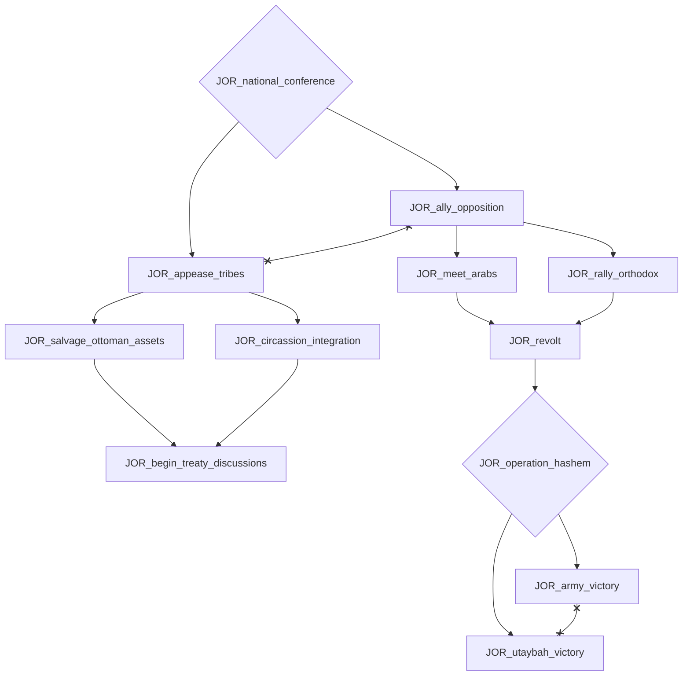

# JOR_national_conference

```mermaid
flowchart TD
    n1["JOR_ally_opposition"]
    n2["JOR_appease_tribes"]
    n3["JOR_army_victory"]
    n4["JOR_begin_treaty_discussions"]
    n5["JOR_circassion_integration"]
    n6["JOR_meet_arabs"]
    n7{"JOR_national_conference"}
    n8{"JOR_operation_hashem"}
    n9["JOR_rally_orthodox"]
    n10["JOR_revolt"]
    n11["JOR_salvage_ottoman_assets"]
    n12["JOR_utaybah_victory"]
    n7 --> n1
    n7 --> n2
    n8 --> n3
    n11 --> n4
    n5 --> n4
    n2 --> n5
    n1 --> n6
    n10 --> n8
    n1 --> n9
    n6 --> n10
    n9 --> n10
    n2 --> n11
    n8 --> n12
    n1 x--x n2
    n3 x--x n12
```
