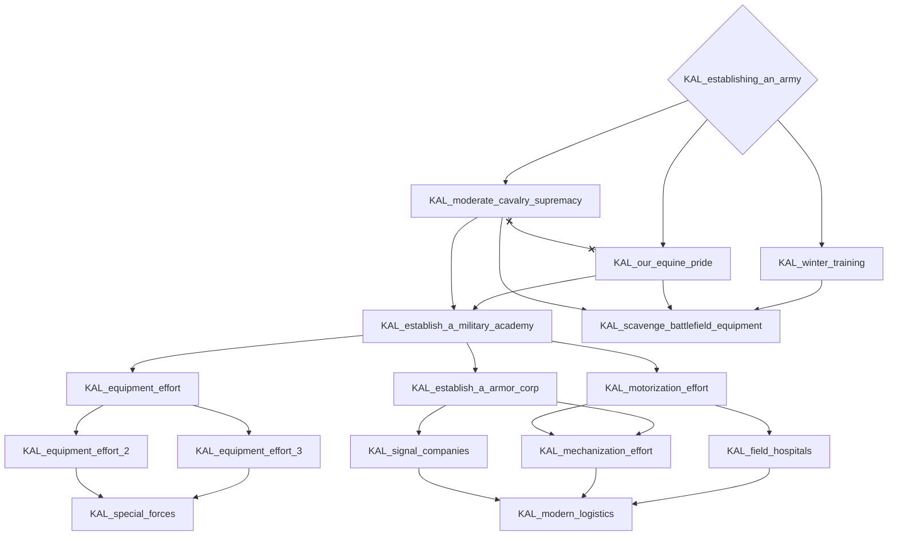

# KAL_establishing_an_army

```mermaid
flowchart TD
    n1["KAL_equipment_effort"]
    n2["KAL_equipment_effort_2"]
    n3["KAL_equipment_effort_3"]
    n4["KAL_establish_a_armor_corp"]
    n5["KAL_establish_a_military_academy"]
    n6{"KAL_establishing_an_army"}
    n7["KAL_field_hospitals"]
    n8["KAL_mechanization_effort"]
    n9["KAL_moderate_cavalry_supremacy"]
    n10["KAL_modern_logistics"]
    n11["KAL_motorization_effort"]
    n12["KAL_our_equine_pride"]
    n13["KAL_scavenge_battlefield_equipment"]
    n14["KAL_signal_companies"]
    n15["KAL_special_forces"]
    n16["KAL_winter_training"]
    n5 --> n1
    n1 --> n2
    n1 --> n3
    n5 --> n4
    n12 --> n5
    n9 --> n5
    n11 --> n7
    n4 --> n8
    n11 --> n8
    n6 --> n9
    n7 --> n10
    n8 --> n10
    n14 --> n10
    n5 --> n11
    n6 --> n12
    n16 --> n13
    n12 --> n13
    n9 --> n13
    n4 --> n14
    n3 --> n15
    n2 --> n15
    n6 --> n16
    n9 x--x n12
```

# KAL_organize_the_government

```mermaid
flowchart TD
    n17["KAL_anti_revolutionary_decree"]
    n18["KAL_armament_production_plan"]
    n19{"KAL_bring_in_exiled_nationalists"}
    n20["KAL_buddhist_society"]
    n21["KAL_building_a_kingdom"]
    n22["KAL_claim_greater_mongolia"]
    n23["KAL_collectivist_propaganda"]
    n24["KAL_cult_of_personality"]
    n25["KAL_deterrence"]
    n26["KAL_discipline_hierarchy_and_order"]
    n27["KAL_dominate_the_pontic_caspian_steppe"]
    n28["KAL_economic_optimization"]
    n29["KAL_examplary_battle_leadership"]
    n30["KAL_finance_military_infrastructure"]
    n31["KAL_five_year_plan"]
    n32["KAL_form_a_royal_guard"]
    n33["KAL_form_manufacturing_cooperatives"]
    n34["KAL_indoctrination_focus"]
    n35{"KAL_internationalism"}
    n36["KAL_introduce_political_reforms"]
    n37["KAL_organize_our_alliance"]
    n38{"KAL_organize_the_government"}
    n39["KAL_paramilitarism"]
    n40["KAL_prepare_the_youth_for_service"]
    n41["KAL_promote_militarism"]
    n42["KAL_promote_nichiren_buddhism"]
    n43["KAL_propaganda_for_the_khagan_god"]
    n44["KAL_rally_behind_the_khan"]
    n45["KAL_reconcile_buddhism_and_socialism"]
    n46["KAL_red_army"]
    n47["KAL_reinforce_the_security_apparatus"]
    n48["KAL_reinstate_monasteries"]
    n49["KAL_research_grants"]
    n50["KAL_revolutionary_pioneer_organizations"]
    n51["KAL_royal_officer_corps"]
    n52["KAL_solidify_the_military_government"]
    n53["KAL_state_atheism"]
    n54["KAL_stimulate_mongol_traditions_in_buryatia"]
    n55["KAL_stimulate_mongol_traditions_in_inner_mongolia"]
    n56["KAL_stimulate_mongol_traditions_in_mongolia"]
    n57["KAL_stimulate_mongol_traditions_in_tuva"]
    n58["KAL_take_leadership"]
    n59["KAL_the_court_of_joinville_le_pont"]
    n60["KAL_the_kalmyk_flag_organization"]
    n61["KAL_the_spirit_of_genghis"]
    n62["KAL_trust_democratic_institutions"]
    n63["KAL_war_communism"]
    n64["KAL_why_we_fight"]
    n36 --> n17
    n59 --> n17
    n60 --> n18
    n44 --> n18
    n38 --> n19
    n48 --> n20
    n30 --> n21
    n61 --> n22
    n33 --> n23
    n34 --> n24
    n40 --> n24
    n28 --> n25
    n17 --> n25
    n41 --> n26
    n41 --> n27
    n42 --> n27
    n36 --> n28
    n41 --> n29
    n59 --> n30
    n23 --> n31
    n44 --> n32
    n59 --> n32
    n35 --> n33
    n50 --> n34
    n23 --> n34
    n38 --> n35
    n62 --> n36
    n58 --> n37
    n61 --> n37
    n26 --> n39
    n50 --> n40
    n18 --> n41
    n52 --> n41
    n18 --> n42
    n20 --> n43
    n61 --> n43
    n51 --> n43
    n19 --> n44
    n35 --> n45
    n24 --> n46
    n23 --> n47
    n60 --> n47
    n44 --> n47
    n59 --> n48
    n28 --> n49
    n45 --> n50
    n53 --> n50
    n32 --> n51
    n60 --> n52
    n35 --> n53
    n22 --> n54
    n22 --> n55
    n22 --> n56
    n22 --> n57
    n27 --> n58
    n38 --> n59
    n19 --> n60
    n32 --> n61
    n38 --> n62
    n33 --> n63
    n25 --> n64
    n19 x--x n35
    n19 x--x n59
    n19 x--x n62
    n35 x--x n59
    n35 x--x n62
    n44 x--x n60
    n45 x--x n53
    n59 x--x n62
```
