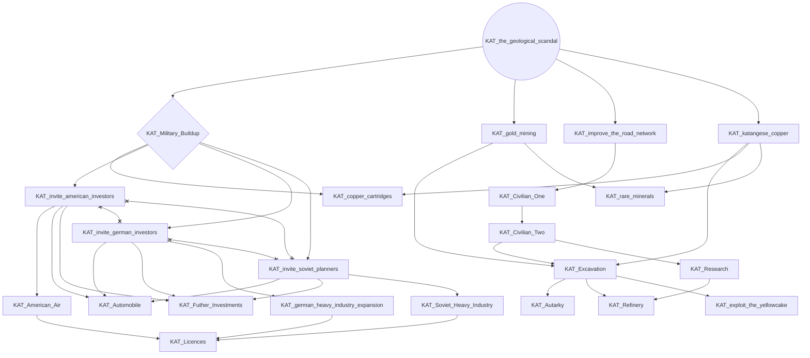

# KAT_the_geological_scandal

```mermaid
flowchart TD
    n1["KAT_American_Air"]
    n2["KAT_Autarky"]
    n3["KAT_Automobile"]
    n4["KAT_Civilian_One"]
    n5["KAT_Civilian_Two"]
    n6["KAT_Excavation"]
    n7["KAT_Futher_Investments"]
    n8["KAT_Licences"]
    n9{"KAT_Military_Buildup"}
    n10["KAT_Refinery"]
    n11["KAT_Research"]
    n12["KAT_Soviet_Heavy_Industry"]
    n13["KAT_copper_cartridges"]
    n14["KAT_exploit_the_yellowcake"]
    n15["KAT_german_heavy_industry_expansion"]
    n16["KAT_gold_mining"]
    n17["KAT_improve_the_road_network"]
    n18["KAT_invite_american_investors"]
    n19["KAT_invite_german_investors"]
    n20["KAT_invite_soviet_planners"]
    n21["KAT_katangese_copper"]
    n22["KAT_rare_minerals"]
    n23(("KAT_the_geological_scandal"))
    n18 --> n1
    n6 --> n2
    n18 --> n3
    n19 --> n3
    n20 --> n3
    n17 --> n4
    n4 --> n5
    n5 --> n6
    n16 --> n6
    n21 --> n6
    n18 --> n7
    n19 --> n7
    n20 --> n7
    n1 --> n8
    n15 --> n8
    n12 --> n8
    n23 --> n9
    n6 --> n10
    n11 --> n10
    n5 --> n11
    n20 --> n12
    n21 --> n13
    n9 --> n13
    n6 --> n14
    n19 --> n15
    n23 --> n16
    n23 --> n17
    n9 --> n18
    n9 --> n19
    n9 --> n20
    n23 --> n21
    n16 --> n22
    n21 --> n22
    n18 x--x n19
    n18 x--x n20
    n19 x--x n20
```
