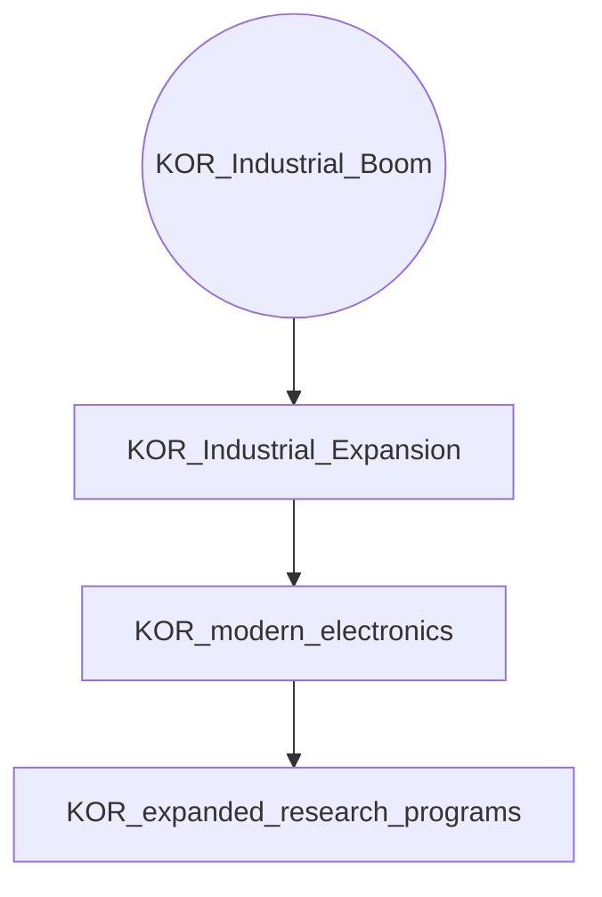
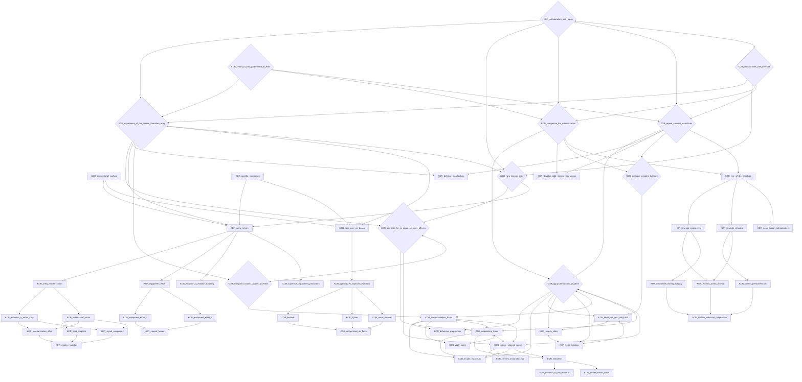
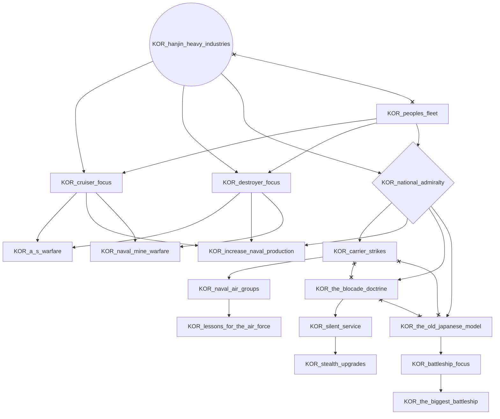
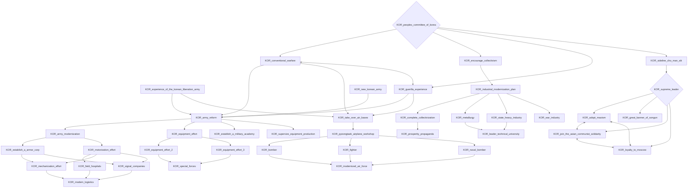
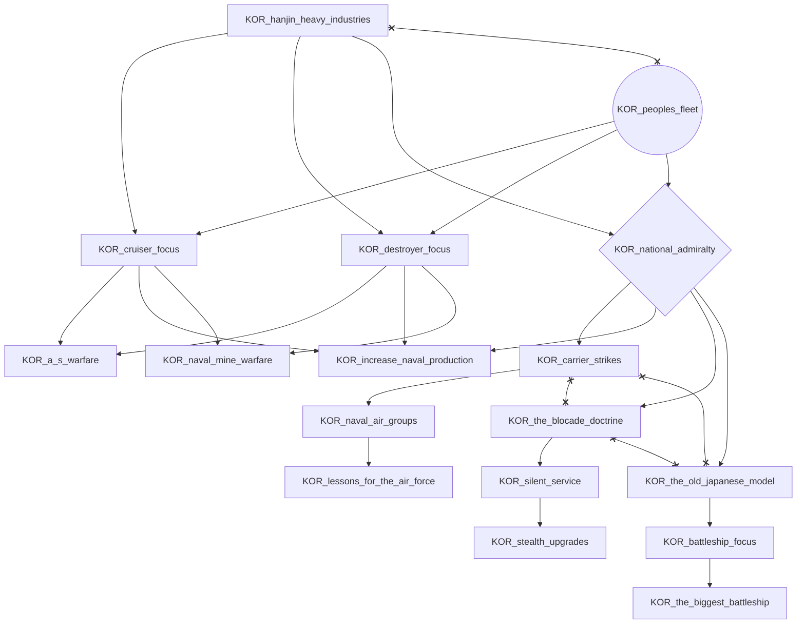
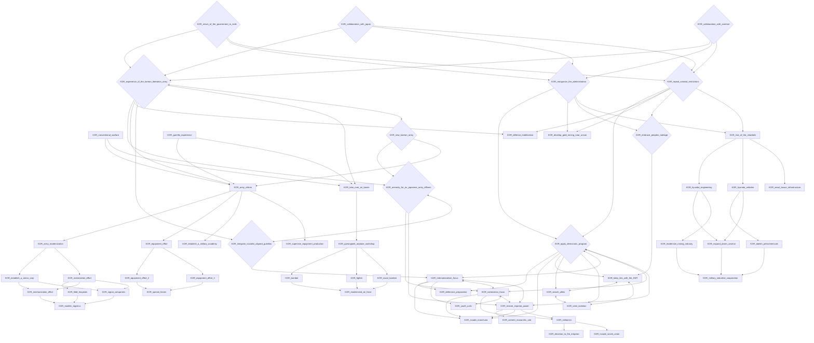

# KOR_Industrial_Boom

# KOR_collaboration_with_japan

# KOR_collaboration_with_overlord

# KOR_hanjin_heavy_industries

# KOR_peoples_committee_of_korea

# KOR_peoples_fleet

# KOR_return_of_the_government_in_exile

