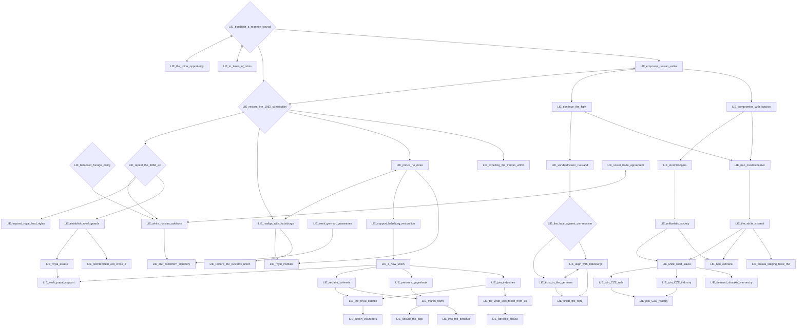
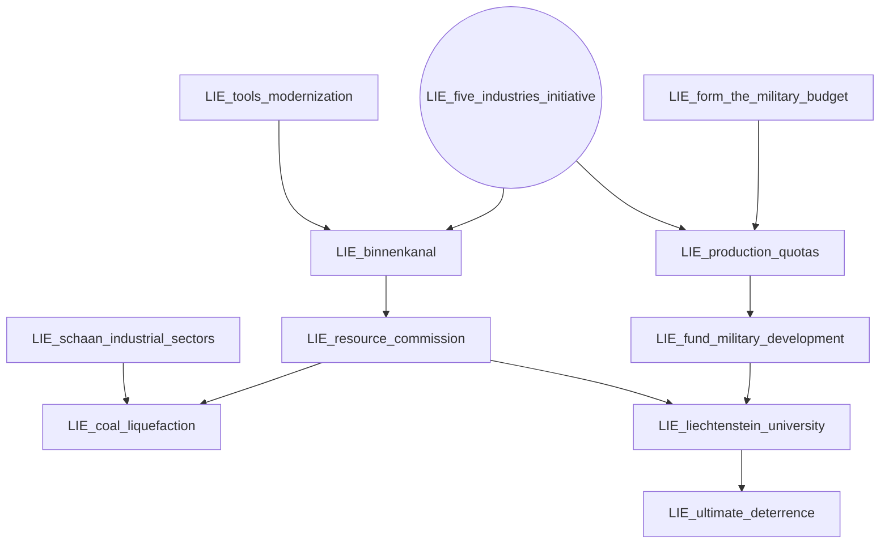
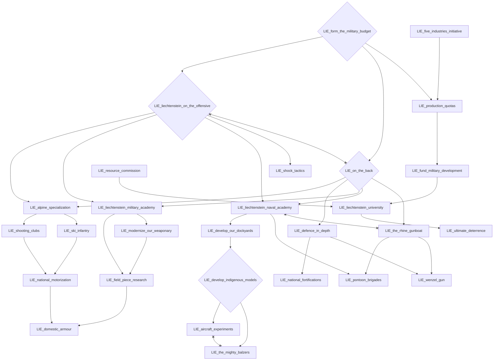
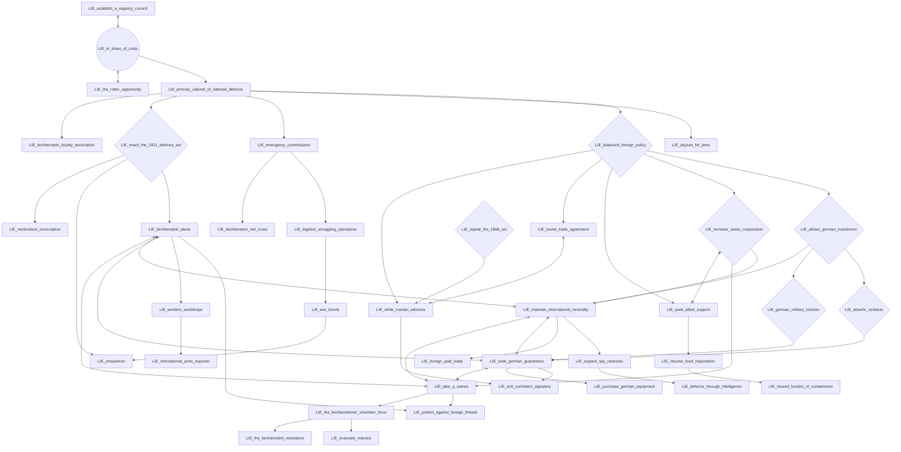
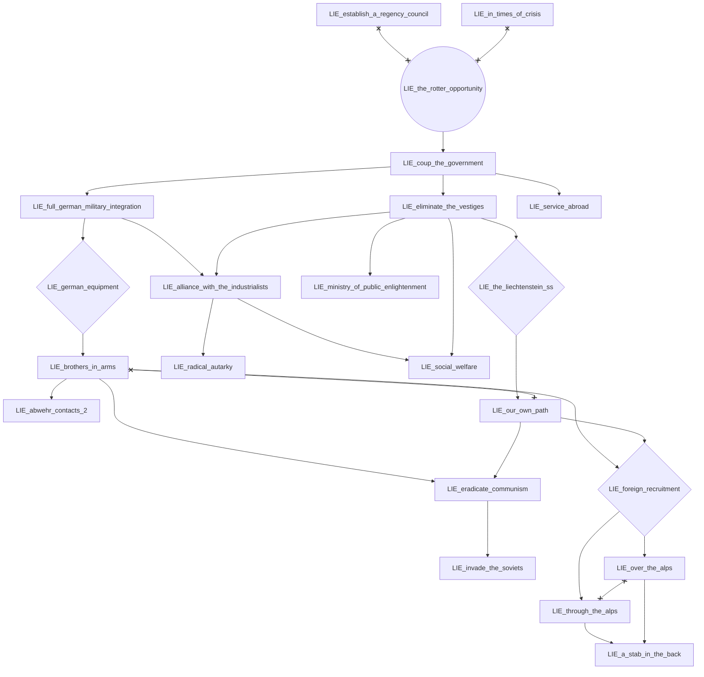
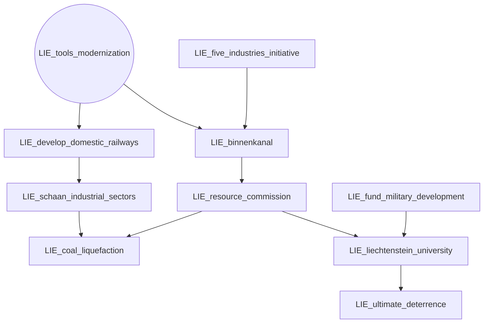

# LIE_establish_a_regency_council

```mermaid
flowchart TD
    n1["LIE_a_new_union"]
    n2["LIE_alaska_staging_base_r56"]
    n3["LIE_align_with_habsburgs"]
    n4["LIE_anti_comintern_signatory"]
    n5{"LIE_balanced_foreign_policy"}
    n6["LIE_compromise_with_fascists"]
    n7["LIE_continue_the_fight"]
    n8["LIE_czech_volunteers"]
    n9["LIE_demand_slovakia_monarchy"]
    n10["LIE_develop_alaska"]
    n11["LIE_empower_russian_exiles"]
    n12{"LIE_establish_a_regency_council"}
    n13["LIE_establish_royal_guards"]
    n14["LIE_expand_royal_land_rights"]
    n15["LIE_expelling_the_traitors_within"]
    n16["LIE_finish_the_fight"]
    n17["LIE_for_what_was_taken_from_us"]
    n18["LIE_in_times_of_crisis"]
    n19["LIE_into_the_benelux"]
    n20["LIE_join_CZE_industry"]
    n21["LIE_join_CZE_military"]
    n22["LIE_join_CZE_rails"]
    n23["LIE_join_industries"]
    n24["LIE_liechtenstein_red_cross_2"]
    n25["LIE_march_north"]
    n26["LIE_militaristic_society"]
    n27["LIE_neo_mestnichestvo"]
    n28["LIE_neo_okhrana"]
    n29["LIE_pressure_yugoslavia"]
    n30["LIE_prince_no_more"]
    n31["LIE_realign_with_habsburgs"]
    n32["LIE_reclaim_bohemia"]
    n33{"LIE_repeal_the_1868_act"}
    n34{"LIE_restore_the_1862_constitution"}
    n35["LIE_restore_the_customs_union"]
    n36["LIE_royal_assets"]
    n37["LIE_royal_institute"]
    n38["LIE_secure_the_alps"]
    n39["LIE_seek_german_guarantees"]
    n40["LIE_seek_papal_support"]
    n41["LIE_sonderdivision_russland"]
    n42["LIE_soviet_trade_agreement"]
    n43["LIE_stormtroopers"]
    n44["LIE_support_habsburg_restoration"]
    n45{"LIE_the_face_against_communism"}
    n46["LIE_the_rotter_opportunity"]
    n47["LIE_the_royal_estates"]
    n48["LIE_the_white_arsenal"]
    n49["LIE_trust_in_the_germans"]
    n50["LIE_unite_west_slavia"]
    n51["LIE_white_russian_advisors"]
    n44 --> n1
    n48 --> n2
    n45 --> n3
    n39 --> n4
    n51 --> n4
    n11 --> n6
    n11 --> n7
    n47 --> n8
    n50 --> n9
    n17 --> n10
    n12 --> n11
    n33 --> n13
    n33 --> n14
    n34 --> n15
    n49 --> n16
    n3 --> n16
    n23 --> n17
    n25 --> n19
    n50 --> n20
    n20 --> n21
    n22 --> n21
    n50 --> n22
    n1 --> n23
    n13 --> n24
    n32 --> n25
    n29 --> n25
    n43 --> n26
    n6 --> n27
    n7 --> n27
    n26 --> n28
    n48 --> n28
    n1 --> n29
    n34 --> n30
    n34 --> n31
    n1 --> n32
    n34 --> n33
    n12 --> n34
    n31 --> n35
    n13 --> n36
    n30 --> n37
    n31 --> n37
    n25 --> n38
    n36 --> n40
    n1 --> n40
    n7 --> n41
    n6 --> n43
    n30 --> n44
    n41 --> n45
    n23 --> n47
    n32 --> n47
    n27 --> n48
    n45 --> n49
    n48 --> n50
    n26 --> n50
    n5 --> n51
    n33 --> n51
    n3 x--x n49
    n11 x--x n34
    n12 x--x n18
    n12 x--x n46
    n30 x--x n31
    n42 x--x n51
```

# LIE_five_industries_initiative

```mermaid
flowchart TD
    n52["LIE_binnenkanal"]
    n53["LIE_coal_liquefaction"]
    n54(("LIE_five_industries_initiative"))
    n55["LIE_form_the_military_budget"]
    n56["LIE_fund_military_development"]
    n57["LIE_liechtenstein_university"]
    n58["LIE_production_quotas"]
    n59["LIE_resource_commission"]
    n60["LIE_schaan_industrial_sectors"]
    n61["LIE_tools_modernization"]
    n62["LIE_ultimate_deterrence"]
    n54 --> n52
    n61 --> n52
    n59 --> n53
    n60 --> n53
    n58 --> n56
    n56 --> n57
    n59 --> n57
    n55 --> n58
    n54 --> n58
    n52 --> n59
    n57 --> n62
```

# LIE_form_the_military_budget

```mermaid
flowchart TD
    n63["LIE_aircraft_experiments"]
    n64["LIE_alpine_specialization"]
    n65["LIE_defence_in_depth"]
    n66{"LIE_develop_indigenous_models"}
    n67["LIE_develop_our_dockyards"]
    n68["LIE_domestic_armour"]
    n69["LIE_field_piece_research"]
    n54["LIE_five_industries_initiative"]
    n55{"LIE_form_the_military_budget"}
    n56["LIE_fund_military_development"]
    n70["LIE_liechtenstein_military_academy"]
    n71["LIE_liechtenstein_naval_academy"]
    n72{"LIE_liechtenstein_on_the_offensive"}
    n57["LIE_liechtenstein_university"]
    n73["LIE_modernize_our_weaponary"]
    n74["LIE_national_fortifications"]
    n75["LIE_national_motorization"]
    n76{"LIE_on_the_back"}
    n77["LIE_pontoon_brigades"]
    n58["LIE_production_quotas"]
    n59["LIE_resource_commission"]
    n78["LIE_shock_tactics"]
    n79["LIE_shooting_clubs"]
    n80["LIE_ski_infantry"]
    n81["LIE_the_mighty_balzers"]
    n82["LIE_the_rhine_gunboat"]
    n62["LIE_ultimate_deterrence"]
    n83["LIE_wenzel_gun"]
    n66 --> n63
    n72 --> n64
    n76 --> n64
    n76 --> n65
    n67 --> n66
    n71 --> n67
    n69 --> n68
    n75 --> n68
    n70 --> n69
    n73 --> n69
    n58 --> n56
    n72 --> n70
    n76 --> n70
    n72 --> n71
    n76 --> n71
    n55 --> n72
    n56 --> n57
    n59 --> n57
    n70 --> n73
    n65 --> n74
    n80 --> n75
    n79 --> n75
    n55 --> n76
    n82 --> n77
    n71 --> n77
    n55 --> n58
    n54 --> n58
    n72 --> n78
    n64 --> n79
    n64 --> n80
    n66 --> n81
    n76 --> n82
    n57 --> n62
    n65 --> n83
    n82 --> n83
    n63 x--x n81
    n71 x--x n82
    n72 x--x n76
```

# LIE_in_times_of_crisis

```mermaid
flowchart TD
    n84{"LIE_abwehr_contacts"}
    n4["LIE_anti_comintern_signatory"]
    n85["LIE_asylum_for_jews"]
    n86{"LIE_attract_german_investment"}
    n5{"LIE_balanced_foreign_policy"}
    n87["LIE_defence_through_intelligence"]
    n88["LIE_emergency_commissions"]
    n89{"LIE_enact_the_1921_defence_act"}
    n12["LIE_establish_a_regency_council"]
    n90["LIE_evacuate_industry"]
    n91["LIE_expand_spy_networks"]
    n92["LIE_foreign_gold_trade"]
    n93{"LIE_german_military_mission"}
    n18(("LIE_in_times_of_crisis"))
    n94{"LIE_increase_swiss_cooperation"}
    n95["LIE_international_arms_exporter"]
    n96["LIE_legalize_smuggling_operations"]
    n97["LIE_liechtenstein_alone"]
    n98["LIE_liechtenstein_loyalty_association"]
    n99["LIE_liechtenstein_red_cross"]
    n100["LIE_maintain_international_neutrality"]
    n101["LIE_ortswehren"]
    n102["LIE_princely_cabinet_of_national_defence"]
    n103["LIE_protect_against_foreign_threats"]
    n104["LIE_purchase_german_equipment"]
    n105["LIE_reintroduce_conscription"]
    n33{"LIE_repeal_the_1868_act"}
    n106["LIE_resume_food_importation"]
    n107["LIE_seek_allied_support"]
    n39["LIE_seek_german_guarantees"]
    n108["LIE_shared_burden_of_containment"]
    n42["LIE_soviet_trade_agreement"]
    n109["LIE_take_a_stance"]
    n110["LIE_the_liechtenstein_resistance"]
    n111["LIE_the_liechtensteiner_volunteer_force"]
    n46["LIE_the_rotter_opportunity"]
    n112["LIE_war_bonds"]
    n51["LIE_white_russian_advisors"]
    n113["LIE_workers_workshops"]
    n86 --> n84
    n39 --> n4
    n51 --> n4
    n102 --> n85
    n5 --> n86
    n102 --> n5
    n91 --> n87
    n102 --> n88
    n102 --> n89
    n111 --> n90
    n100 --> n91
    n100 --> n92
    n86 --> n93
    n5 --> n94
    n113 --> n95
    n88 --> n96
    n89 --> n97
    n102 --> n98
    n88 --> n99
    n94 --> n100
    n86 --> n100
    n89 --> n101
    n112 --> n101
    n18 --> n102
    n97 --> n103
    n109 --> n103
    n39 --> n104
    n89 --> n105
    n107 --> n106
    n5 --> n107
    n93 --> n39
    n84 --> n39
    n106 --> n108
    n5 --> n42
    n94 --> n109
    n111 --> n110
    n109 --> n111
    n96 --> n112
    n5 --> n51
    n33 --> n51
    n97 --> n113
    n12 x--x n18
    n18 x--x n46
    n94 x--x n107
    n97 x--x n100
    n97 x--x n39
    n97 x--x n109
    n100 x--x n39
    n100 x--x n109
    n39 x--x n109
    n42 x--x n51
```

# LIE_the_rotter_opportunity

```mermaid
flowchart TD
    n114["LIE_a_stab_in_the_back"]
    n115["LIE_abwehr_contacts_2"]
    n116["LIE_alliance_with_the_industrialists"]
    n117["LIE_brothers_in_arms"]
    n118["LIE_coup_the_government"]
    n119["LIE_eliminate_the_vestiges"]
    n120["LIE_eradicate_communism"]
    n12["LIE_establish_a_regency_council"]
    n121{"LIE_foreign_recruitment"}
    n122["LIE_full_german_military_integration"]
    n123{"LIE_german_equipment"}
    n18["LIE_in_times_of_crisis"]
    n124["LIE_invade_the_soviets"]
    n125["LIE_ministry_of_public_enlightenment"]
    n126["LIE_our_own_path"]
    n127["LIE_over_the_alps"]
    n128["LIE_radical_autarky"]
    n129["LIE_service_abroad"]
    n130["LIE_social_welfare"]
    n131{"LIE_the_liechtenstein_ss"}
    n46(("LIE_the_rotter_opportunity"))
    n132["LIE_through_the_alps"]
    n132 --> n114
    n127 --> n114
    n117 --> n115
    n122 --> n116
    n119 --> n116
    n123 --> n117
    n46 --> n118
    n118 --> n119
    n117 --> n120
    n126 --> n120
    n117 --> n121
    n126 --> n121
    n118 --> n122
    n122 --> n123
    n120 --> n124
    n119 --> n125
    n131 --> n126
    n121 --> n127
    n116 --> n128
    n118 --> n129
    n116 --> n130
    n119 --> n130
    n119 --> n131
    n121 --> n132
    n117 x--x n126
    n12 x--x n46
    n18 x--x n46
    n127 x--x n132
```

# LIE_tools_modernization

```mermaid
flowchart TD
    n52["LIE_binnenkanal"]
    n53["LIE_coal_liquefaction"]
    n133["LIE_develop_domestic_railways"]
    n54["LIE_five_industries_initiative"]
    n56["LIE_fund_military_development"]
    n57["LIE_liechtenstein_university"]
    n59["LIE_resource_commission"]
    n60["LIE_schaan_industrial_sectors"]
    n61(("LIE_tools_modernization"))
    n62["LIE_ultimate_deterrence"]
    n54 --> n52
    n61 --> n52
    n59 --> n53
    n60 --> n53
    n61 --> n133
    n56 --> n57
    n59 --> n57
    n52 --> n59
    n133 --> n60
    n57 --> n62
```
