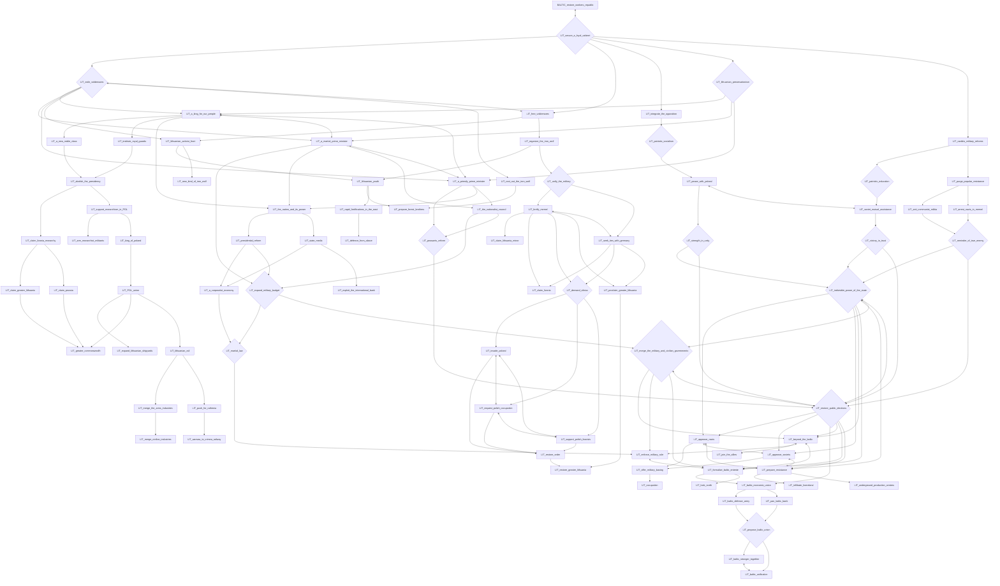

# LIT_secure_a_loyal_cabinet

```mermaid
flowchart TD
    n1["BALTIC_restore_workers_republic"]
    n2["LIT_POL_union"]
    n3["LIT_a_corporatist_economy"]
    n4["LIT_a_king_for_our_people"]
    n5["LIT_a_martial_prime_minister"]
    n6["LIT_a_new_noble_class"]
    n7["LIT_a_priestly_prime_minister"]
    n8["LIT_abolish_the_presidency"]
    n9["LIT_anti_communist_militia"]
    n10["LIT_appease_nazis"]
    n11["LIT_appease_soviets"]
    n12["LIT_arm_monarchist_militants"]
    n13["LIT_arrest_nazis_in_memel"]
    n14["LIT_baltic_defence_army"]
    n15["LIT_baltic_economic_union"]
    n16["LIT_baltic_stronger_together"]
    n17["LIT_baltic_unification"]
    n18["LIT_beyond_the_baltic"]
    n19["LIT_claim_greater_lithuania"]
    n20["LIT_claim_lithuania_minor"]
    n21["LIT_claim_livonia"]
    n22["LIT_claim_livonia_monarchy"]
    n23["LIT_claim_prussia"]
    n24["LIT_defence_from_above"]
    n25{"LIT_demand_vilnius"}
    n26["LIT_enforce_military_rule"]
    n27{"LIT_exile_voldemares"}
    n28["LIT_expand_lithuanian_shipyards"]
    n29{"LIT_expand_military_budget"}
    n30["LIT_exploit_the_international_bank"]
    n31["LIT_formalize_baltic_entente"]
    n32["LIT_fortify_memel"]
    n33["LIT_free_voldemares"]
    n34["LIT_greater_commonwealth"]
    n35{"LIT_indivisible_power_of_the_state"}
    n36["LIT_infiltrate_homeland"]
    n37["LIT_institute_royal_guards"]
    n38["LIT_integrate_the_opposition"]
    n39["LIT_invade_poland"]
    n40["LIT_join_the_allies"]
    n41["LIT_king_of_poland"]
    n42["LIT_lithuanian_activist_front"]
    n43{"LIT_lithuanian_preservationism"}
    n44["LIT_lithuanian_rail"]
    n45["LIT_lithuanian_youth"]
    n46["LIT_look_north"]
    n47{"LIT_martial_law"}
    n48["LIT_merge_civilian_industries"]
    n49["LIT_merge_the_arms_industries"]
    n50{"LIT_merge_the_military_and_civilian_governments"}
    n51["LIT_new_kind_of_iron_wolf"]
    n52["LIT_occupation"]
    n53["LIT_offer_military_basing"]
    n54["LIT_organize_the_iron_wolf"]
    n55["LIT_pan_baltic_bank"]
    n56{"LIT_patriotic_education"}
    n57{"LIT_patriotic_socialism"}
    n58["LIT_peace_with_poland"]
    n59{"LIT_peasants_reform"}
    n60["LIT_prepare_forest_brothers"]
    n61["LIT_prepare_resistance"]
    n62["LIT_presidential_reform"]
    n63["LIT_proclaim_greater_lithuania"]
    n64{"LIT_propose_baltic_union"}
    n65["LIT_purge_popular_resistance"]
    n66["LIT_push_for_ruthenia"]
    n67["LIT_rapid_fortifications_in_the_east"]
    n68["LIT_rastikis_military_reforms"]
    n69{"LIT_reminder_of_true_enemy"}
    n70["LIT_request_polish_occupation"]
    n71["LIT_restore_greater_lithuania"]
    n72["LIT_restore_order"]
    n73{"LIT_restore_public_elections"}
    n74["LIT_root_out_the_iron_wolf"]
    n75{"LIT_secure_a_loyal_cabinet"}
    n76["LIT_seek_ties_with_germany"]
    n77["LIT_soviet_mutual_assistance"]
    n78["LIT_state_media"]
    n79{"LIT_strength_in_unity"}
    n80["LIT_support_monarchism_in_POL"]
    n81["LIT_support_polish_fascists"]
    n82["LIT_the_nation_and_its_power"]
    n83["LIT_the_nationalist_council"]
    n84["LIT_underground_production_centers"]
    n85{"LIT_unify_the_military"}
    n86{"LIT_victory_in_trust"}
    n87["LIT_warsaw_to_crimea_railway"]
    n41 --> n2
    n62 --> n3
    n78 --> n3
    n27 --> n4
    n43 --> n4
    n43 --> n5
    n27 --> n5
    n4 --> n6
    n43 --> n7
    n27 --> n7
    n6 --> n8
    n37 --> n8
    n65 --> n9
    n35 --> n10
    n73 --> n10
    n35 --> n11
    n73 --> n11
    n80 --> n12
    n65 --> n13
    n15 --> n14
    n31 --> n15
    n73 --> n15
    n64 --> n16
    n64 --> n17
    n50 --> n18
    n73 --> n18
    n35 --> n18
    n22 --> n19
    n32 --> n20
    n32 --> n21
    n76 --> n21
    n8 --> n22
    n22 --> n23
    n67 --> n24
    n76 --> n25
    n32 --> n25
    n50 --> n26
    n47 --> n26
    n75 --> n27
    n2 --> n28
    n5 --> n29
    n83 --> n29
    n62 --> n29
    n78 --> n30
    n50 --> n31
    n73 --> n31
    n35 --> n31
    n85 --> n32
    n75 --> n33
    n19 --> n34
    n23 --> n34
    n2 --> n34
    n69 --> n35
    n86 --> n35
    n79 --> n35
    n61 --> n36
    n4 --> n37
    n75 --> n38
    n25 --> n39
    n18 --> n40
    n80 --> n41
    n33 --> n42
    n27 --> n42
    n75 --> n43
    n2 --> n44
    n54 --> n45
    n42 --> n45
    n31 --> n46
    n3 --> n47
    n29 --> n47
    n49 --> n48
    n44 --> n49
    n29 --> n50
    n42 --> n51
    n53 --> n52
    n11 --> n53
    n10 --> n53
    n33 --> n54
    n15 --> n55
    n68 --> n56
    n38 --> n57
    n57 --> n58
    n7 --> n59
    n83 --> n59
    n74 --> n60
    n45 --> n60
    n35 --> n61
    n73 --> n61
    n82 --> n62
    n76 --> n63
    n32 --> n63
    n55 --> n64
    n14 --> n64
    n68 --> n65
    n44 --> n66
    n45 --> n67
    n75 --> n68
    n9 --> n69
    n13 --> n69
    n25 --> n70
    n63 --> n71
    n72 --> n71
    n81 --> n72
    n39 --> n72
    n70 --> n72
    n69 --> n73
    n59 --> n73
    n79 --> n73
    n86 --> n73
    n27 --> n74
    n85 --> n76
    n56 --> n77
    n82 --> n78
    n58 --> n79
    n8 --> n80
    n25 --> n81
    n5 --> n82
    n7 --> n82
    n4 --> n82
    n5 --> n83
    n7 --> n83
    n61 --> n84
    n54 --> n85
    n77 --> n86
    n66 --> n87
    n1 x--x n75
    n4 x--x n5
    n4 x--x n7
    n5 x--x n7
    n10 x--x n11
    n10 x--x n61
    n11 x--x n61
    n16 x--x n17
    n18 x--x n26
    n18 x--x n31
    n26 x--x n31
    n27 x--x n33
    n32 x--x n76
    n35 x--x n50
    n35 x--x n73
    n39 x--x n70
    n39 x--x n81
    n50 x--x n73
    n58 x--x n77
    n70 x--x n81
```
