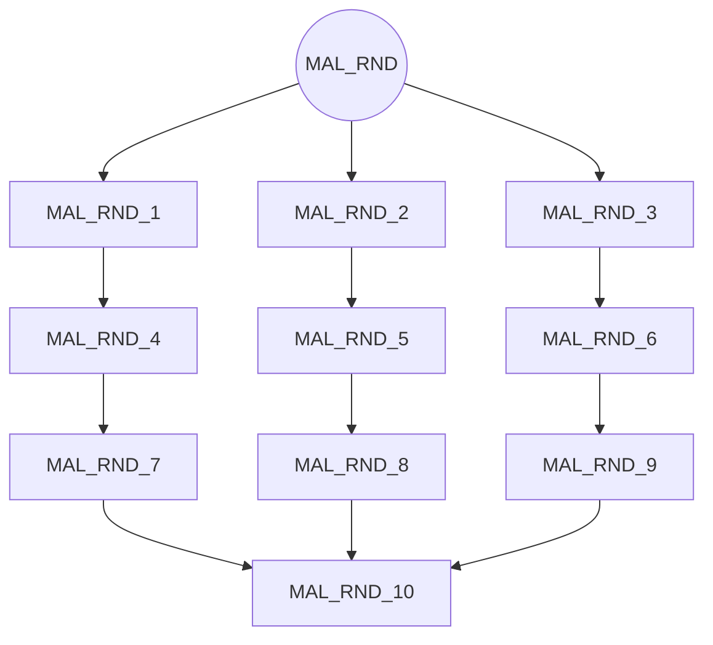
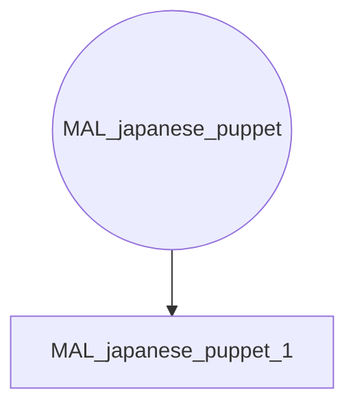
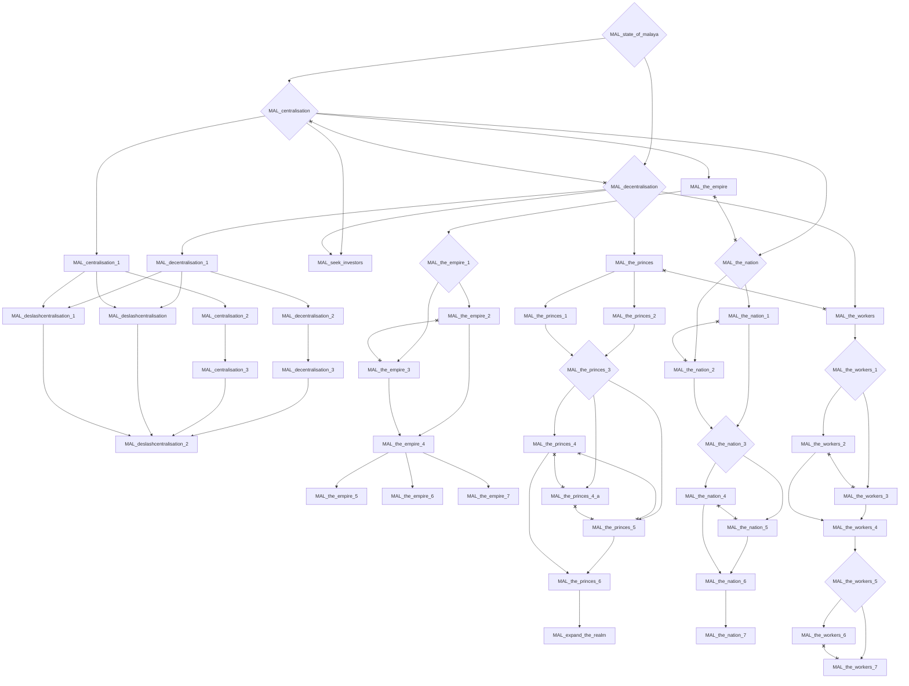
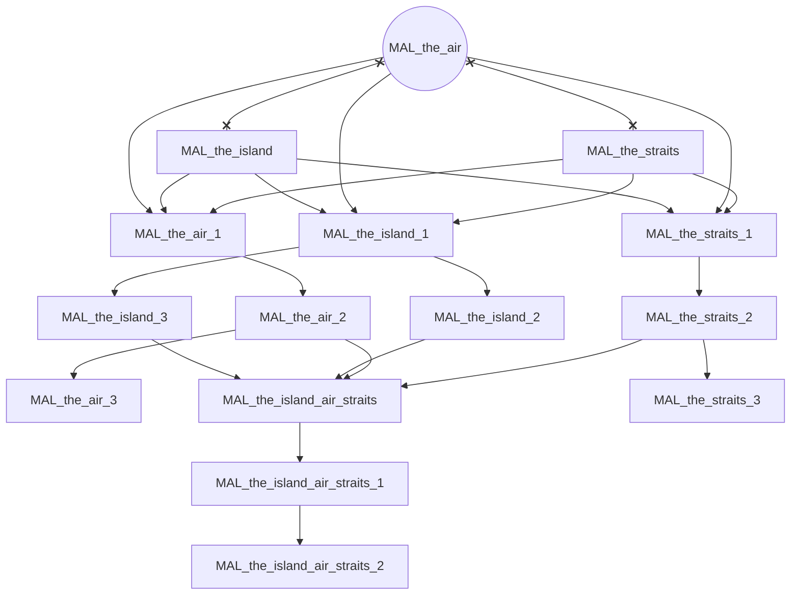
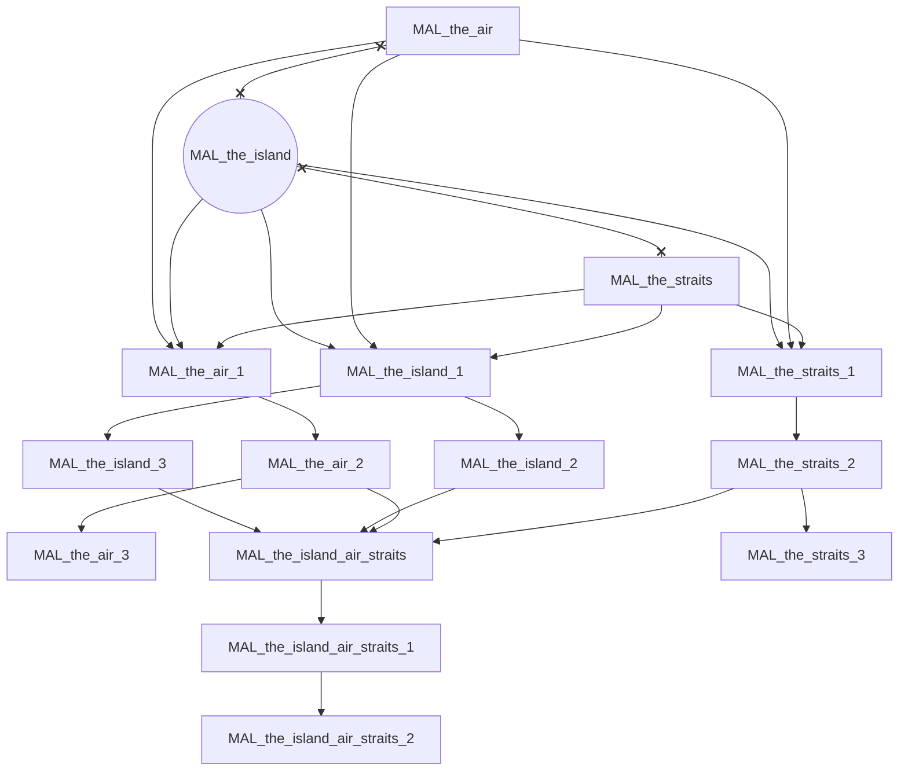
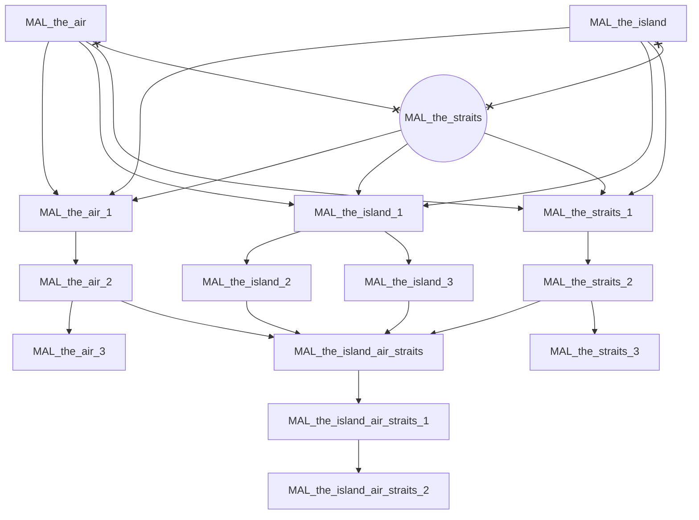
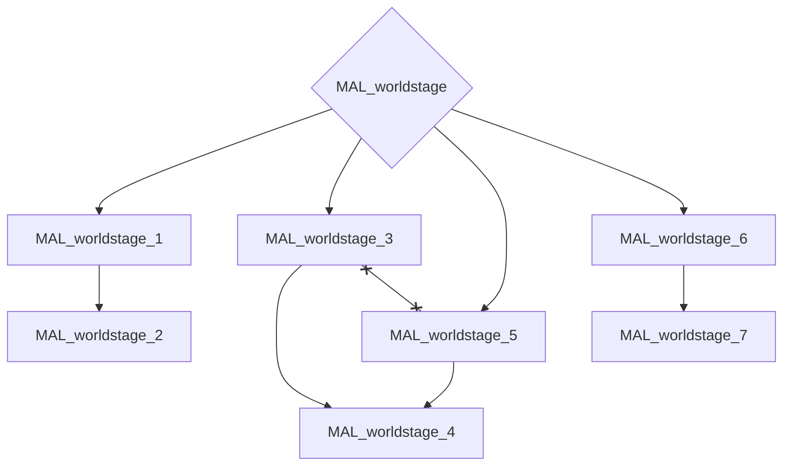

# MAL_RND

```mermaid
flowchart TD
    n1(("MAL_RND"))
    n2["MAL_RND_1"]
    n3["MAL_RND_10"]
    n4["MAL_RND_2"]
    n5["MAL_RND_3"]
    n6["MAL_RND_4"]
    n7["MAL_RND_5"]
    n8["MAL_RND_6"]
    n9["MAL_RND_7"]
    n10["MAL_RND_8"]
    n11["MAL_RND_9"]
    n1 --> n2
    n9 --> n3
    n10 --> n3
    n11 --> n3
    n1 --> n4
    n1 --> n5
    n2 --> n6
    n4 --> n7
    n5 --> n8
    n6 --> n9
    n7 --> n10
    n8 --> n11
```

# MAL_japanese_puppet

```mermaid
flowchart TD
    n12(("MAL_japanese_puppet"))
    n13["MAL_japanese_puppet_1"]
    n12 --> n13
```

# MAL_state_of_malaya

```mermaid
flowchart TD
    n14{"MAL_centralisation"}
    n15["MAL_centralisation_1"]
    n16["MAL_centralisation_2"]
    n17["MAL_centralisation_3"]
    n18{"MAL_decentralisation"}
    n19["MAL_decentralisation_1"]
    n20["MAL_decentralisation_2"]
    n21["MAL_decentralisation_3"]
    n22["MAL_deslashcentralisation"]
    n23["MAL_deslashcentralisation_1"]
    n24["MAL_deslashcentralisation_2"]
    n25["MAL_expand_the_realm"]
    n26["MAL_seek_investors"]
    n27{"MAL_state_of_malaya"}
    n28["MAL_the_empire"]
    n29{"MAL_the_empire_1"}
    n30["MAL_the_empire_2"]
    n31["MAL_the_empire_3"]
    n32["MAL_the_empire_4"]
    n33["MAL_the_empire_5"]
    n34["MAL_the_empire_6"]
    n35["MAL_the_empire_7"]
    n36{"MAL_the_nation"}
    n37["MAL_the_nation_1"]
    n38["MAL_the_nation_2"]
    n39{"MAL_the_nation_3"}
    n40["MAL_the_nation_4"]
    n41["MAL_the_nation_5"]
    n42["MAL_the_nation_6"]
    n43["MAL_the_nation_7"]
    n44["MAL_the_princes"]
    n45["MAL_the_princes_1"]
    n46["MAL_the_princes_2"]
    n47{"MAL_the_princes_3"}
    n48["MAL_the_princes_4"]
    n49["MAL_the_princes_4_a"]
    n50["MAL_the_princes_5"]
    n51["MAL_the_princes_6"]
    n52["MAL_the_workers"]
    n53{"MAL_the_workers_1"}
    n54["MAL_the_workers_2"]
    n55["MAL_the_workers_3"]
    n56["MAL_the_workers_4"]
    n57{"MAL_the_workers_5"}
    n58["MAL_the_workers_6"]
    n59["MAL_the_workers_7"]
    n27 --> n14
    n14 --> n15
    n15 --> n16
    n16 --> n17
    n27 --> n18
    n18 --> n19
    n19 --> n20
    n20 --> n21
    n19 --> n22
    n15 --> n22
    n19 --> n23
    n15 --> n23
    n21 --> n24
    n17 --> n24
    n22 --> n24
    n23 --> n24
    n51 --> n25
    n14 --> n26
    n18 --> n26
    n14 --> n28
    n28 --> n29
    n29 --> n30
    n29 --> n31
    n30 --> n32
    n31 --> n32
    n32 --> n33
    n32 --> n34
    n32 --> n35
    n14 --> n36
    n36 --> n37
    n36 --> n38
    n37 --> n39
    n38 --> n39
    n39 --> n40
    n39 --> n41
    n41 --> n42
    n40 --> n42
    n42 --> n43
    n18 --> n44
    n44 --> n45
    n44 --> n46
    n46 --> n47
    n45 --> n47
    n47 --> n48
    n47 --> n49
    n47 --> n50
    n50 --> n51
    n48 --> n51
    n18 --> n52
    n52 --> n53
    n53 --> n54
    n53 --> n55
    n55 --> n56
    n54 --> n56
    n56 --> n57
    n57 --> n58
    n57 --> n59
    n14 x--x n18
    n28 x--x n36
    n30 x--x n31
    n37 x--x n38
    n40 x--x n41
    n44 x--x n52
    n48 x--x n49
    n48 x--x n50
    n49 x--x n50
    n54 x--x n55
    n58 x--x n59
```

# MAL_the_air

```mermaid
flowchart TD
    n60(("MAL_the_air"))
    n61["MAL_the_air_1"]
    n62["MAL_the_air_2"]
    n63["MAL_the_air_3"]
    n64["MAL_the_island"]
    n65["MAL_the_island_1"]
    n66["MAL_the_island_2"]
    n67["MAL_the_island_3"]
    n68["MAL_the_island_air_straits"]
    n69["MAL_the_island_air_straits_1"]
    n70["MAL_the_island_air_straits_2"]
    n71["MAL_the_straits"]
    n72["MAL_the_straits_1"]
    n73["MAL_the_straits_2"]
    n74["MAL_the_straits_3"]
    n60 --> n61
    n64 --> n61
    n71 --> n61
    n61 --> n62
    n62 --> n63
    n64 --> n65
    n60 --> n65
    n71 --> n65
    n65 --> n66
    n65 --> n67
    n67 --> n68
    n66 --> n68
    n62 --> n68
    n73 --> n68
    n68 --> n69
    n69 --> n70
    n64 --> n72
    n60 --> n72
    n71 --> n72
    n72 --> n73
    n73 --> n74
    n60 x--x n64
    n60 x--x n71
```

# MAL_the_island

```mermaid
flowchart TD
    n60["MAL_the_air"]
    n61["MAL_the_air_1"]
    n62["MAL_the_air_2"]
    n63["MAL_the_air_3"]
    n64(("MAL_the_island"))
    n65["MAL_the_island_1"]
    n66["MAL_the_island_2"]
    n67["MAL_the_island_3"]
    n68["MAL_the_island_air_straits"]
    n69["MAL_the_island_air_straits_1"]
    n70["MAL_the_island_air_straits_2"]
    n71["MAL_the_straits"]
    n72["MAL_the_straits_1"]
    n73["MAL_the_straits_2"]
    n74["MAL_the_straits_3"]
    n60 --> n61
    n64 --> n61
    n71 --> n61
    n61 --> n62
    n62 --> n63
    n64 --> n65
    n60 --> n65
    n71 --> n65
    n65 --> n66
    n65 --> n67
    n67 --> n68
    n66 --> n68
    n62 --> n68
    n73 --> n68
    n68 --> n69
    n69 --> n70
    n64 --> n72
    n60 --> n72
    n71 --> n72
    n72 --> n73
    n73 --> n74
    n60 x--x n64
    n64 x--x n71
```

# MAL_the_straits

```mermaid
flowchart TD
    n60["MAL_the_air"]
    n61["MAL_the_air_1"]
    n62["MAL_the_air_2"]
    n63["MAL_the_air_3"]
    n64["MAL_the_island"]
    n65["MAL_the_island_1"]
    n66["MAL_the_island_2"]
    n67["MAL_the_island_3"]
    n68["MAL_the_island_air_straits"]
    n69["MAL_the_island_air_straits_1"]
    n70["MAL_the_island_air_straits_2"]
    n71(("MAL_the_straits"))
    n72["MAL_the_straits_1"]
    n73["MAL_the_straits_2"]
    n74["MAL_the_straits_3"]
    n60 --> n61
    n64 --> n61
    n71 --> n61
    n61 --> n62
    n62 --> n63
    n64 --> n65
    n60 --> n65
    n71 --> n65
    n65 --> n66
    n65 --> n67
    n67 --> n68
    n66 --> n68
    n62 --> n68
    n73 --> n68
    n68 --> n69
    n69 --> n70
    n64 --> n72
    n60 --> n72
    n71 --> n72
    n72 --> n73
    n73 --> n74
    n60 x--x n71
    n64 x--x n71
```

# MAL_worldstage

```mermaid
flowchart TD
    n75{"MAL_worldstage"}
    n76["MAL_worldstage_1"]
    n77["MAL_worldstage_2"]
    n78["MAL_worldstage_3"]
    n79["MAL_worldstage_4"]
    n80["MAL_worldstage_5"]
    n81["MAL_worldstage_6"]
    n82["MAL_worldstage_7"]
    n75 --> n76
    n76 --> n77
    n75 --> n78
    n78 --> n79
    n80 --> n79
    n75 --> n80
    n75 --> n81
    n81 --> n82
    n78 x--x n80
```
