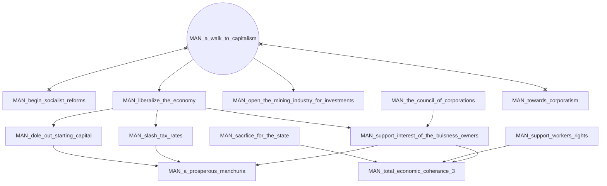
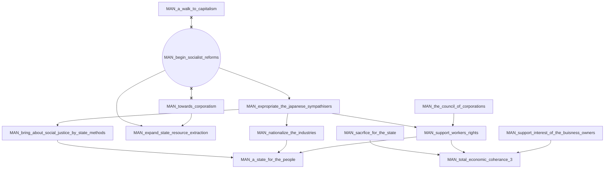
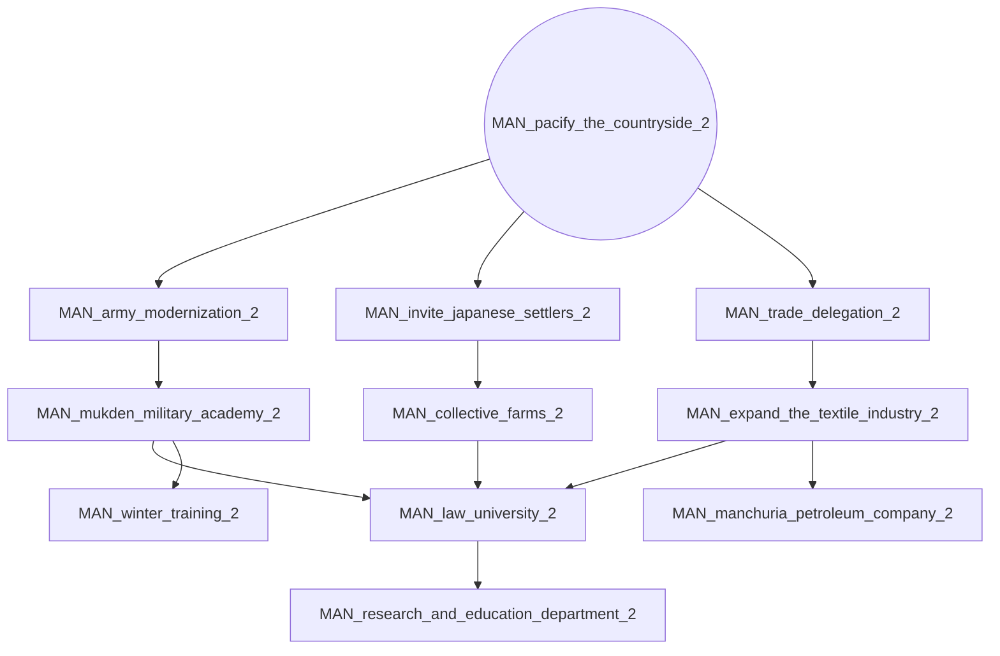
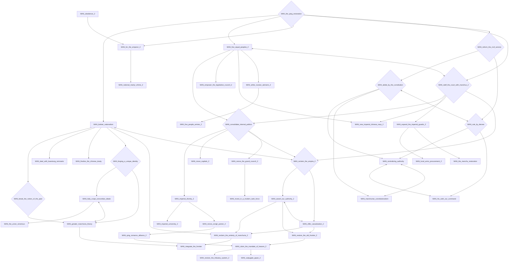
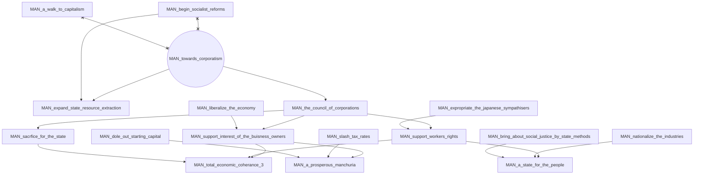

# MAN_a_walk_to_capitalism

```mermaid
flowchart TD
    n1["MAN_a_prosperous_manchuria"]
    n2(("MAN_a_walk_to_capitalism"))
    n3["MAN_begin_socialist_reforms"]
    n4["MAN_dole_out_starting_capital"]
    n5["MAN_liberalize_the_economy"]
    n6["MAN_open_the_mining_industry_for_investments"]
    n7["MAN_sacrfice_for_the_state"]
    n8["MAN_slash_tax_rates"]
    n9["MAN_support_interest_of_the_buisness_owners"]
    n10["MAN_support_workers_rights"]
    n11["MAN_the_council_of_corporations"]
    n12["MAN_total_economic_coherance_3"]
    n13["MAN_towards_corporatism"]
    n4 --> n1
    n8 --> n1
    n9 --> n1
    n5 --> n4
    n2 --> n5
    n2 --> n6
    n5 --> n8
    n5 --> n9
    n11 --> n9
    n7 --> n12
    n10 --> n12
    n9 --> n12
    n2 x--x n3
    n2 x--x n13
```

# MAN_begin_socialist_reforms

```mermaid
flowchart TD
    n14["MAN_a_state_for_the_people"]
    n2["MAN_a_walk_to_capitalism"]
    n3(("MAN_begin_socialist_reforms"))
    n15["MAN_bring_about_social_justice_by_state_methods"]
    n16["MAN_expand_state_resource_extraction"]
    n17["MAN_expropriate_the_japanese_sympathisers"]
    n18["MAN_nationalize_the_industries"]
    n7["MAN_sacrfice_for_the_state"]
    n9["MAN_support_interest_of_the_buisness_owners"]
    n10["MAN_support_workers_rights"]
    n11["MAN_the_council_of_corporations"]
    n12["MAN_total_economic_coherance_3"]
    n13["MAN_towards_corporatism"]
    n15 --> n14
    n18 --> n14
    n10 --> n14
    n17 --> n15
    n3 --> n16
    n13 --> n16
    n3 --> n17
    n17 --> n18
    n17 --> n10
    n11 --> n10
    n7 --> n12
    n10 --> n12
    n9 --> n12
    n2 x--x n3
    n3 x--x n13
```

# MAN_obedience_2

```mermaid
flowchart TD
    n19["MAN_a_bent_knee_before_the_emporer"]
    n20["MAN_a_tale_of_two_emperors_2"]
    n21["MAN_a_truly_non_han_identity"]
    n22["MAN_acquire_kanto_shu_2"]
    n23["MAN_alliance_with_the_kwantung_army_2"]
    n24["MAN_assume_continental_responsibilities_2"]
    n25["MAN_auxiliary_forces_2"]
    n26["MAN_back_to_the_basics_2"]
    n27["MAN_bedrock_of_the_japanese_economy"]
    n28["MAN_beyond_baikal_2"]
    n29["MAN_central_control_2"]
    n30["MAN_consolidate_control_over_the_state"]
    n31["MAN_council_of_corporations_2"]
    n32{"MAN_depose_the_weak_monarch_2"}
    n33["MAN_develop_aluminum_sources_2"]
    n34["MAN_embrace_the_status_quo"]
    n35["MAN_enforce_japanese_cultural_norms"]
    n36["MAN_establish_continental_frontier_army_2"]
    n37["MAN_establish_mangyo_2"]
    n38["MAN_expand_kwantung_influence_in_china"]
    n39["MAN_expand_opium_production_2"]
    n40["MAN_expand_showa_steel_works_2"]
    n41["MAN_expand_the_railways_2"]
    n42["MAN_finish_the_five_year_plan_2"]
    n43{"MAN_first_five_year_plan_2"}
    n44["MAN_for_the_emperor_2"]
    n45["MAN_full_seperation_from_china"]
    n46["MAN_fully_sideline_kwantung"]
    n47["MAN_greater_manchuria_2"]
    n48["MAN_greatly_increase_tenko_measures"]
    n49["MAN_hainan_forward_operating_base_2"]
    n50["MAN_hoankyoku_2"]
    n51["MAN_honor_the_military_2"]
    n52{"MAN_imperial_tianjin_conference_2"}
    n53["MAN_increase_japanese_settlements"]
    n54["MAN_invite_japanese_investors_2"]
    n55["MAN_kwantung_finally_marches_south"]
    n56["MAN_kwantungs_power_secured"]
    n57["MAN_labor_corps_2"]
    n58["MAN_lessons_of_the_warlord_era_2"]
    n59["MAN_liberation_is_nigh_2"]
    n60["MAN_mamc_2"]
    n61["MAN_manchurian_auxiliary_navy_2"]
    n62["MAN_mantetsu_railway_monopoly_2"]
    n63["MAN_military_supplies_requisition_law_2"]
    n64["MAN_mongol_dominion_2"]
    n65["MAN_mongol_dominion_3"]
    n66["MAN_mukden_arsenal_2"]
    n67["MAN_mukden_convention_2"]
    n68["MAN_national_cooperation_government_2"]
    n69["MAN_national_defense_state_2"]
    n70["MAN_national_martyr_shrine_2"]
    n71(("MAN_obedience_2"))
    n72["MAN_officer_academies_2"]
    n73{"MAN_operation_kantokuen_2"}
    n74["MAN_order_under_the_marshal_2"]
    n75["MAN_our_part_in_the_new_eastasian_order"]
    n76["MAN_our_place_in_the_empire_2"]
    n77["MAN_pressure_tibet_2"]
    n78["MAN_propagate_nanshinron_2"]
    n79["MAN_raid_the_social_research_unit"]
    n80["MAN_reclaim_the_entierty_of_manchuria_puppet_2"]
    n81["MAN_reform_command_structure_2"]
    n82{"MAN_reinforce_east_hebei_2"}
    n83{"MAN_reinforce_the_heilongjiang_2"}
    n84["MAN_remodel_the_river_detachments_2"]
    n85["MAN_reorganize_the_kwantung_army_2"]
    n86["MAN_request_continental_territory_2"]
    n87["MAN_return_of_the_manchus_2"]
    n88["MAN_revise_imperial_treaties_2"]
    n89["MAN_second_five_year_plan_2"]
    n90["MAN_self_sufficient_military_2"]
    n91["MAN_send_cadets_to_japan_2"]
    n92["MAN_sino_japanese_basic_treaty"]
    n93["MAN_social_research_unit_2"]
    n94["MAN_special_river_detachments_2"]
    n95["MAN_support_aikawa_2"]
    n96["MAN_support_hoshino_2"]
    n97["MAN_technological_supremacy_2"]
    n98["MAN_the_concord_of_ethnicities_2"]
    n99["MAN_the_empire_of_great_manchuria"]
    n100["MAN_the_fight_for_the_continent"]
    n101["MAN_the_imperial_wildcard_2"]
    n102["MAN_the_kashmir_border_2"]
    n103["MAN_the_kwantung_connection_2"]
    n104["MAN_the_pan_asian_dream_2"]
    n105["MAN_the_qing_restoration"]
    n106["MAN_the_republican_disgrace_2"]
    n107["MAN_total_economic_coherence_2"]
    n108["MAN_tsr_trading_illicit_goods"]
    n109["MAN_vanguard_of_the_state_2"]
    n75 --> n19
    n106 --> n20
    n109 --> n20
    n53 --> n21
    n99 --> n21
    n71 --> n22
    n71 --> n23
    n78 --> n24
    n63 --> n25
    n57 --> n25
    n58 --> n26
    n51 --> n26
    n53 --> n27
    n73 --> n28
    n97 --> n29
    n31 --> n29
    n85 --> n30
    n35 --> n30
    n98 --> n31
    n101 --> n31
    n67 --> n32
    n54 --> n33
    n82 --> n34
    n83 --> n34
    n79 --> n35
    n85 --> n36
    n95 --> n37
    n92 --> n38
    n96 --> n39
    n33 --> n40
    n54 --> n41
    n43 --> n42
    n71 --> n43
    n105 --> n44
    n71 --> n44
    n92 --> n45
    n104 --> n46
    n29 --> n46
    n73 --> n47
    n34 --> n48
    n78 --> n49
    n71 --> n50
    n74 --> n51
    n68 --> n52
    n34 --> n53
    n107 --> n54
    n75 --> n55
    n109 --> n56
    n51 --> n56
    n72 --> n57
    n74 --> n58
    n88 --> n59
    n66 --> n60
    n94 --> n61
    n95 --> n62
    n96 --> n62
    n72 --> n63
    n76 --> n64
    n24 --> n65
    n92 --> n65
    n107 --> n66
    n86 --> n67
    n64 --> n67
    n103 --> n68
    n89 --> n69
    n44 --> n70
    n23 --> n72
    n100 --> n73
    n104 --> n73
    n36 --> n73
    n29 --> n73
    n52 --> n74
    n99 --> n75
    n82 --> n76
    n83 --> n76
    n78 --> n77
    n26 --> n78
    n20 --> n78
    n19 --> n78
    n48 --> n79
    n78 --> n80
    n90 --> n81
    n90 --> n82
    n90 --> n83
    n78 --> n84
    n32 --> n85
    n76 --> n86
    n52 --> n87
    n28 --> n88
    n47 --> n88
    n93 --> n89
    n40 --> n89
    n63 --> n90
    n72 --> n91
    n55 --> n92
    n41 --> n93
    n72 --> n94
    n43 --> n95
    n43 --> n96
    n85 --> n97
    n101 --> n97
    n32 --> n98
    n34 --> n99
    n75 --> n100
    n32 --> n101
    n78 --> n102
    n82 --> n103
    n98 --> n104
    n87 --> n106
    n62 --> n107
    n37 --> n107
    n39 --> n107
    n43 --> n108
    n87 --> n109
    n28 x--x n47
    n34 x--x n76
    n34 x--x n103
    n74 x--x n87
    n76 x--x n103
    n85 x--x n98
    n85 x--x n101
    n95 x--x n96
    n98 x--x n101
```

# MAN_pacify_the_countryside_2

```mermaid
flowchart TD
    n110["MAN_army_modernization_2"]
    n111["MAN_collective_farms_2"]
    n112["MAN_expand_the_textile_industry_2"]
    n113["MAN_invite_japanese_settlers_2"]
    n114["MAN_law_university_2"]
    n115["MAN_manchuria_petroleum_company_2"]
    n116["MAN_mukden_military_academy_2"]
    n117(("MAN_pacify_the_countryside_2"))
    n118["MAN_research_and_education_department_2"]
    n119["MAN_trade_delegation_2"]
    n120["MAN_winter_training_2"]
    n117 --> n110
    n113 --> n111
    n119 --> n112
    n117 --> n113
    n111 --> n114
    n116 --> n114
    n112 --> n114
    n112 --> n115
    n110 --> n116
    n114 --> n118
    n117 --> n119
    n116 --> n120
```

# MAN_the_qing_restoration

```mermaid
flowchart TD
    n121{"MAN_abide_by_the_constitution"}
    n122["MAN_assert_our_authority_2"]
    n123["MAN_bolster_nationalism"]
    n124{"MAN_break_the_notion_of_the_past"}
    n125["MAN_centralizing_authority"]
    n126["MAN_claim_the_mandate_of_heaven_2"]
    n127{"MAN_consolidate_internal_politics"}
    n128["MAN_deal_with_kwantung_remnants"]
    n129["MAN_empower_the_legislative_council_2"]
    n130["MAN_expand_the_imperial_guards_2"]
    n131["MAN_finalize_the_chinese_treaty"]
    n132["MAN_five_equal_peoples_2"]
    n133["MAN_five_people_armies_2"]
    n44["MAN_for_the_emperor_2"]
    n134{"MAN_forging_a_unique_identity"}
    n135["MAN_fully_coopt_concordian_ideals"]
    n136["MAN_greater_manchuria_theory"]
    n137["MAN_his_wish_our_command"]
    n138["MAN_imperial_divinity_2"]
    n139["MAN_imperial_university_2"]
    n140["MAN_integrate_the_frontier"]
    n141["MAN_invest_in_a_modern_tank_force"]
    n142["MAN_local_arms_procurement_2"]
    n143["MAN_manchurian_constitutionalism"]
    n144["MAN_move_capitals_2"]
    n70["MAN_national_martyr_shrine_2"]
    n145["MAN_new_imperial_chinese_navy_2"]
    n71["MAN_obedience_2"]
    n146["MAN_offer_vassalization_2"]
    n147["MAN_qing_romanov_alliance_2"]
    n148{"MAN_reclaim_the_empire_2"}
    n149["MAN_reclaim_the_entierty_of_manchuria_2"]
    n150{"MAN_reform_the_civil_service"}
    n151["MAN_restore_the_old_frontier_2"]
    n152["MAN_restore_the_tributary_system_2"]
    n153["MAN_revive_the_grand_council_2"]
    n154["MAN_revive_zongli_yamen_2"]
    n155{"MAN_rule_by_decree"}
    n156{"MAN_staff_the_court_with_manchus_2"}
    n157["MAN_subjugate_japan_2"]
    n158["MAN_the_manchu_restoration"]
    n105{"MAN_the_qing_restoration"}
    n159["MAN_the_union_victorious"]
    n160["MAN_white_russian_advisers_2"]
    n150 --> n121
    n148 --> n122
    n105 --> n123
    n123 --> n124
    n155 --> n125
    n121 --> n125
    n151 --> n126
    n147 --> n126
    n156 --> n127
    n132 --> n127
    n123 --> n128
    n132 --> n129
    n156 --> n130
    n123 --> n131
    n105 --> n132
    n160 --> n133
    n105 --> n44
    n71 --> n44
    n123 --> n134
    n134 --> n135
    n124 --> n136
    n134 --> n136
    n155 --> n137
    n127 --> n138
    n138 --> n139
    n149 --> n140
    n136 --> n140
    n153 --> n141
    n130 --> n142
    n121 --> n143
    n127 --> n144
    n44 --> n70
    n156 --> n145
    n132 --> n145
    n148 --> n146
    n154 --> n147
    n127 --> n148
    n156 --> n148
    n123 --> n149
    n146 --> n149
    n122 --> n149
    n105 --> n150
    n146 --> n151
    n122 --> n151
    n126 --> n152
    n127 --> n153
    n138 --> n154
    n150 --> n155
    n105 --> n156
    n126 --> n157
    n130 --> n158
    n135 --> n159
    n132 --> n160
    n121 x--x n155
    n122 x--x n146
    n123 x--x n148
    n125 x--x n137
    n125 x--x n143
    n132 x--x n156
    n135 x--x n136
```

# MAN_towards_corporatism

```mermaid
flowchart TD
    n1["MAN_a_prosperous_manchuria"]
    n14["MAN_a_state_for_the_people"]
    n2["MAN_a_walk_to_capitalism"]
    n3["MAN_begin_socialist_reforms"]
    n15["MAN_bring_about_social_justice_by_state_methods"]
    n4["MAN_dole_out_starting_capital"]
    n16["MAN_expand_state_resource_extraction"]
    n17["MAN_expropriate_the_japanese_sympathisers"]
    n5["MAN_liberalize_the_economy"]
    n18["MAN_nationalize_the_industries"]
    n7["MAN_sacrfice_for_the_state"]
    n8["MAN_slash_tax_rates"]
    n9["MAN_support_interest_of_the_buisness_owners"]
    n10["MAN_support_workers_rights"]
    n11["MAN_the_council_of_corporations"]
    n12["MAN_total_economic_coherance_3"]
    n13(("MAN_towards_corporatism"))
    n4 --> n1
    n8 --> n1
    n9 --> n1
    n15 --> n14
    n18 --> n14
    n10 --> n14
    n3 --> n16
    n13 --> n16
    n11 --> n7
    n5 --> n9
    n11 --> n9
    n17 --> n10
    n11 --> n10
    n13 --> n11
    n7 --> n12
    n10 --> n12
    n9 --> n12
    n2 x--x n13
    n3 x--x n13
```
