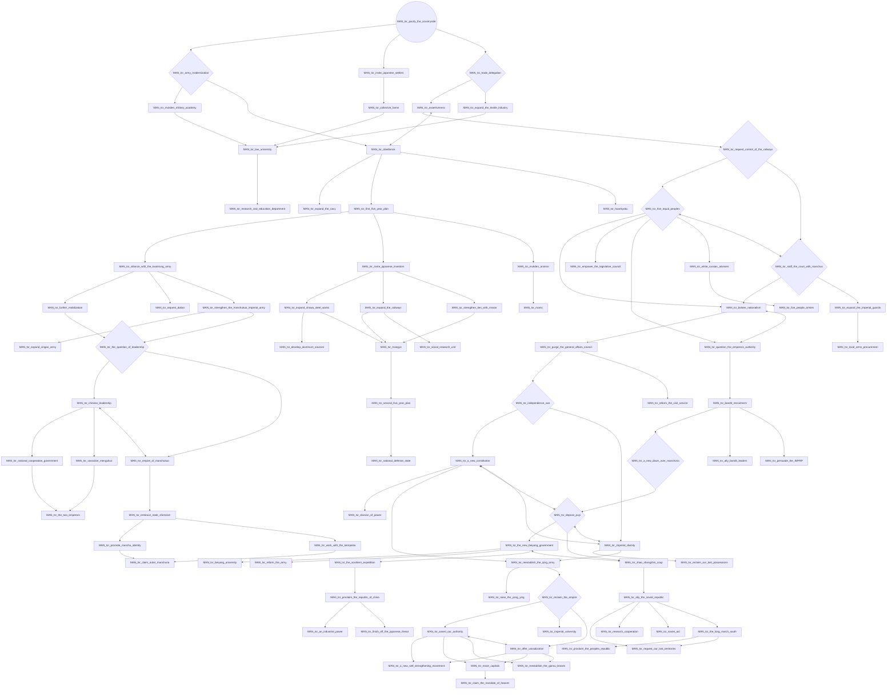

# MAN_tsr_pacify_the_countryside

```mermaid
flowchart TD
    n1["MAN_tsr_a_new_constitution"]
    n2{"MAN_tsr_a_new_dawn_over_manchuria"}
    n3["MAN_tsr_a_new_self_strengthening_movement"]
    n4["MAN_tsr_alliance_with_the_kwantung_army"]
    n5["MAN_tsr_ally_bandit_leaders"]
    n6["MAN_tsr_ally_the_soviet_republic"]
    n7["MAN_tsr_an_industrial_power"]
    n8{"MAN_tsr_army_modernization"}
    n9["MAN_tsr_assert_our_authority"]
    n10["MAN_tsr_assertiveness"]
    n11["MAN_tsr_bandit_recruitment"]
    n12["MAN_tsr_beiyang_university"]
    n13["MAN_tsr_bolster_nationalism"]
    n14["MAN_tsr_chinese_leadership"]
    n15["MAN_tsr_claim_outer_manchuria"]
    n16["MAN_tsr_claim_the_mandate_of_heaven"]
    n17["MAN_tsr_collective_farms"]
    n18{"MAN_tsr_depose_puyi"}
    n19["MAN_tsr_develop_aluminum_sources"]
    n20["MAN_tsr_division_of_power"]
    n21["MAN_tsr_embrace_state_shintoism"]
    n22["MAN_tsr_empire_of_manchukuo"]
    n23["MAN_tsr_empower_the_legislative_council"]
    n24["MAN_tsr_expand_showa_steel_works"]
    n25["MAN_tsr_expand_the_imperial_guards"]
    n26["MAN_tsr_expand_the_navy"]
    n27["MAN_tsr_expand_the_railways"]
    n28["MAN_tsr_expand_the_textile_industry"]
    n29["MAN_tsr_expand_xingan_army"]
    n30["MAN_tsr_finish_off_the_japanese_threat"]
    n31["MAN_tsr_first_five_year_plan"]
    n32{"MAN_tsr_five_equal_peoples"}
    n33["MAN_tsr_five_people_armies"]
    n34["MAN_tsr_further_mobilization"]
    n35["MAN_tsr_hoankyoku"]
    n36["MAN_tsr_imperial_divinity"]
    n37["MAN_tsr_imperial_university"]
    n38{"MAN_tsr_independence_war"}
    n39["MAN_tsr_invite_japanese_investors"]
    n40["MAN_tsr_invite_japanese_settlers"]
    n41["MAN_tsr_law_university"]
    n42["MAN_tsr_local_arms_procurement"]
    n43["MAN_tsr_mamc"]
    n44["MAN_tsr_mangyo"]
    n45["MAN_tsr_move_capitals"]
    n46["MAN_tsr_mukden_arsenal"]
    n47["MAN_tsr_mukden_military_academy"]
    n48["MAN_tsr_national_cooperation_government"]
    n49["MAN_tsr_national_defense_state"]
    n50["MAN_tsr_obedience"]
    n51["MAN_tsr_offer_vassalization"]
    n52(("MAN_tsr_pacify_the_countryside"))
    n53["MAN_tsr_persuade_the_IMPRP"]
    n54["MAN_tsr_proclaim_the_peoples_republic"]
    n55["MAN_tsr_proclaim_the_republic_of_china"]
    n56["MAN_tsr_promote_manchu_identity"]
    n57["MAN_tsr_purge_the_general_affairs_council"]
    n58["MAN_tsr_question_the_emperors_authority"]
    n59["MAN_tsr_raise_the_yong_ying"]
    n60["MAN_tsr_reclaim_our_lost_possessions"]
    n61{"MAN_tsr_reclaim_the_empire"}
    n62["MAN_tsr_reestablish_the_gansu_braves"]
    n63["MAN_tsr_reestablish_the_qing_army"]
    n64["MAN_tsr_reform_the_army"]
    n65["MAN_tsr_reform_the_civil_service"]
    n66{"MAN_tsr_request_control_of_the_railways"}
    n67["MAN_tsr_request_dalian"]
    n68["MAN_tsr_request_our_lost_territories"]
    n69["MAN_tsr_research_and_education_department"]
    n70["MAN_tsr_research_cooperation"]
    n71["MAN_tsr_second_five_year_plan"]
    n72["MAN_tsr_social_research_unit"]
    n73["MAN_tsr_soviet_aid"]
    n74{"MAN_tsr_staff_the_court_with_manchus"}
    n75["MAN_tsr_strengthen_the_manchukuo_imperial_army"]
    n76["MAN_tsr_strengthen_ties_with_nissan"]
    n77["MAN_tsr_the_long_march_south"]
    n78["MAN_tsr_the_new_beiyang_government"]
    n79{"MAN_tsr_the_question_of_leadership"}
    n80["MAN_tsr_the_southern_expedition"]
    n81["MAN_tsr_the_two_emperors"]
    n82{"MAN_tsr_trade_delegation"}
    n83["MAN_tsr_vassalize_mengukuo"]
    n84["MAN_tsr_white_russian_advisers"]
    n85["MAN_tsr_work_with_the_kempeitai"]
    n86["MAN_tsr_zhao_shangzhis_coup"]
    n38 --> n1
    n11 --> n2
    n9 --> n3
    n51 --> n3
    n31 --> n4
    n11 --> n5
    n86 --> n6
    n55 --> n7
    n52 --> n8
    n61 --> n9
    n82 --> n10
    n58 --> n11
    n78 --> n12
    n74 --> n13
    n32 --> n13
    n79 --> n14
    n56 --> n15
    n85 --> n15
    n45 --> n16
    n40 --> n17
    n2 --> n18
    n24 --> n19
    n1 --> n20
    n22 --> n21
    n79 --> n22
    n32 --> n23
    n39 --> n24
    n74 --> n25
    n50 --> n26
    n39 --> n27
    n82 --> n28
    n75 --> n29
    n55 --> n30
    n50 --> n31
    n66 --> n32
    n84 --> n33
    n4 --> n34
    n50 --> n35
    n38 --> n36
    n61 --> n37
    n57 --> n38
    n31 --> n39
    n52 --> n40
    n17 --> n41
    n47 --> n41
    n28 --> n41
    n25 --> n42
    n46 --> n43
    n76 --> n44
    n24 --> n44
    n27 --> n44
    n9 --> n45
    n51 --> n45
    n31 --> n46
    n8 --> n47
    n14 --> n48
    n71 --> n49
    n8 --> n50
    n61 --> n51
    n11 --> n53
    n77 --> n54
    n80 --> n55
    n21 --> n56
    n13 --> n57
    n32 --> n58
    n63 --> n59
    n36 --> n60
    n63 --> n61
    n9 --> n62
    n51 --> n62
    n36 --> n63
    n1 --> n63
    n78 --> n64
    n57 --> n65
    n10 --> n66
    n4 --> n67
    n6 --> n68
    n77 --> n68
    n41 --> n69
    n6 --> n70
    n44 --> n71
    n27 --> n72
    n6 --> n73
    n66 --> n74
    n4 --> n75
    n39 --> n76
    n6 --> n77
    n18 --> n78
    n75 --> n79
    n34 --> n79
    n78 --> n80
    n83 --> n81
    n48 --> n81
    n52 --> n82
    n14 --> n83
    n32 --> n84
    n21 --> n85
    n18 --> n86
    n1 x--x n18
    n1 x--x n36
    n9 x--x n51
    n10 x--x n50
    n13 x--x n58
    n14 x--x n22
    n18 x--x n36
    n32 x--x n74
    n78 x--x n86
```
