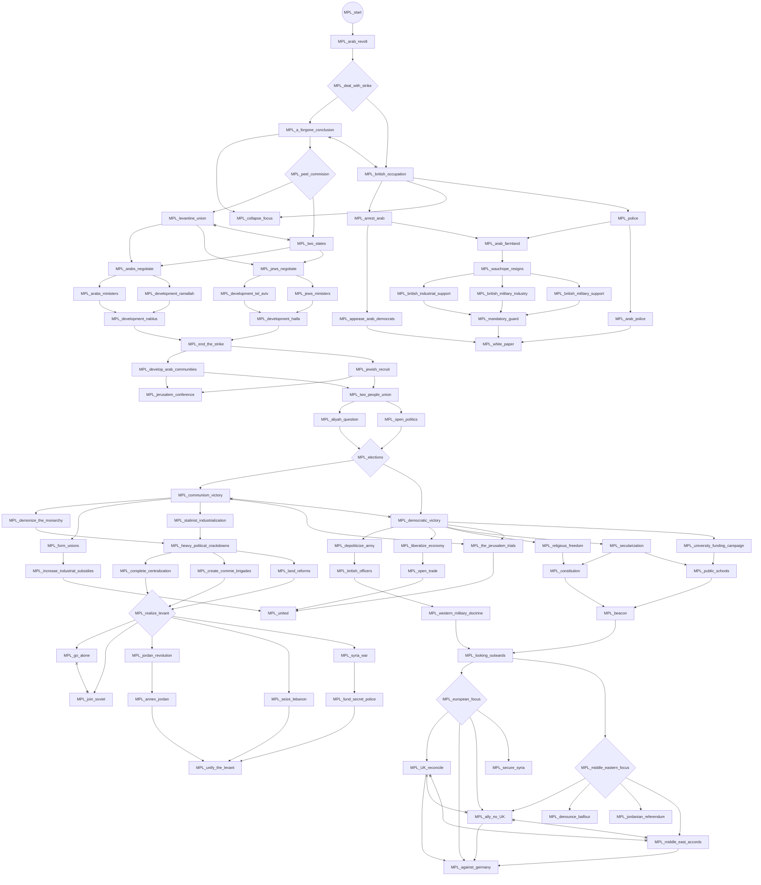
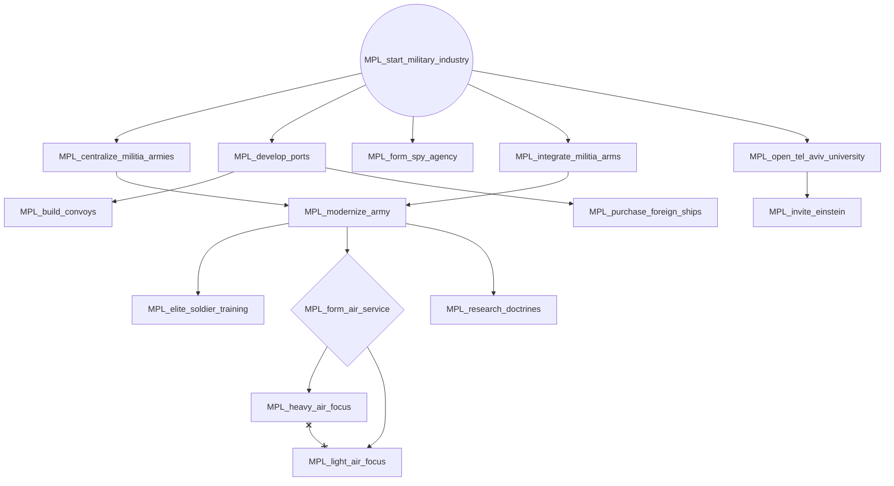

# MPL_start

```mermaid
flowchart TD
    n1["MPL_UK_reconcile"]
    n2["MPL_a_forgone_conclusion"]
    n3["MPL_against_germany"]
    n4["MPL_aliyah_question"]
    n5["MPL_ally_no_UK"]
    n6["MPL_annex_jordan"]
    n7["MPL_appease_arab_democrats"]
    n8["MPL_arab_farmland"]
    n9["MPL_arab_police"]
    n10["MPL_arab_revolt"]
    n11["MPL_arabs_ministers"]
    n12["MPL_arabs_negotiate"]
    n13["MPL_arrest_arab"]
    n14["MPL_beacon"]
    n15["MPL_british_industrial_support"]
    n16["MPL_british_military_industry"]
    n17["MPL_british_military_support"]
    n18["MPL_british_occupation"]
    n19["MPL_british_officers"]
    n20["MPL_collapse_focus"]
    n21["MPL_communism_victory"]
    n22["MPL_complete_centralization"]
    n23["MPL_constitution"]
    n24["MPL_create_commie_brigades"]
    n25{"MPL_deal_with_strike"}
    n26["MPL_democratic_victory"]
    n27["MPL_demonize_the_monarchy"]
    n28["MPL_denounce_balfour"]
    n29["MPL_depoliticize_army"]
    n30["MPL_develop_arab_communities"]
    n31["MPL_development_haifa"]
    n32["MPL_development_nablus"]
    n33["MPL_development_ramallah"]
    n34["MPL_development_tel_aviv"]
    n35{"MPL_elections"}
    n36["MPL_end_the_strike"]
    n37{"MPL_european_focus"}
    n38["MPL_form_unions"]
    n39["MPL_fund_secret_police"]
    n40["MPL_go_alone"]
    n41["MPL_heavy_political_crackdowns"]
    n42["MPL_increase_industrial_subsidies"]
    n43["MPL_jerusalem_conference"]
    n44["MPL_jewish_recruit"]
    n45["MPL_jews_ministers"]
    n46["MPL_jews_negotiate"]
    n47["MPL_join_soviet"]
    n48["MPL_jordan_revolution"]
    n49["MPL_jordanian_referendum"]
    n50["MPL_land_reforms"]
    n51["MPL_levantine_union"]
    n52["MPL_liberalize_economy"]
    n53["MPL_looking_outwards"]
    n54["MPL_mandatory_guard"]
    n55["MPL_middle_east_accords"]
    n56{"MPL_middle_eastern_focus"}
    n57["MPL_open_politics"]
    n58["MPL_open_trade"]
    n59{"MPL_peel_commision"}
    n60["MPL_police"]
    n61["MPL_public_schools"]
    n62{"MPL_realize_levant"}
    n63["MPL_religious_freedom"]
    n64["MPL_secularization"]
    n65["MPL_secure_syria"]
    n66["MPL_seize_lebanon"]
    n67["MPL_stalinist_industrialization"]
    n68(("MPL_start"))
    n69["MPL_syria_war"]
    n70["MPL_the_jerusalem_trials"]
    n71["MPL_two_people_union"]
    n72["MPL_two_states"]
    n73["MPL_unify_the_levant"]
    n74["MPL_united"]
    n75["MPL_university_funding_campaign"]
    n76["MPL_wauchope_resigns"]
    n77["MPL_western_military_doctrine"]
    n78["MPL_white_paper"]
    n37 --> n1
    n25 --> n2
    n55 --> n3
    n1 --> n3
    n5 --> n3
    n37 --> n3
    n71 --> n4
    n56 --> n5
    n37 --> n5
    n48 --> n6
    n13 --> n7
    n13 --> n8
    n60 --> n8
    n60 --> n9
    n68 --> n10
    n12 --> n11
    n51 --> n12
    n72 --> n12
    n18 --> n13
    n61 --> n14
    n23 --> n14
    n76 --> n15
    n76 --> n16
    n76 --> n17
    n25 --> n18
    n29 --> n19
    n2 --> n20
    n18 --> n20
    n35 --> n21
    n41 --> n22
    n64 --> n23
    n63 --> n23
    n41 --> n24
    n10 --> n25
    n35 --> n26
    n21 --> n27
    n56 --> n28
    n26 --> n29
    n36 --> n30
    n34 --> n31
    n45 --> n31
    n33 --> n32
    n11 --> n32
    n12 --> n33
    n46 --> n34
    n57 --> n35
    n4 --> n35
    n31 --> n36
    n32 --> n36
    n53 --> n37
    n21 --> n38
    n69 --> n39
    n62 --> n40
    n27 --> n41
    n67 --> n41
    n38 --> n42
    n30 --> n43
    n44 --> n43
    n36 --> n44
    n46 --> n45
    n51 --> n46
    n72 --> n46
    n62 --> n47
    n62 --> n48
    n56 --> n49
    n41 --> n50
    n59 --> n51
    n26 --> n52
    n14 --> n53
    n77 --> n53
    n15 --> n54
    n16 --> n54
    n17 --> n54
    n56 --> n55
    n53 --> n56
    n71 --> n57
    n52 --> n58
    n2 --> n59
    n18 --> n60
    n64 --> n61
    n75 --> n61
    n24 --> n62
    n22 --> n62
    n50 --> n62
    n26 --> n63
    n26 --> n64
    n37 --> n65
    n62 --> n66
    n21 --> n67
    n62 --> n69
    n26 --> n70
    n21 --> n70
    n30 --> n71
    n44 --> n71
    n59 --> n72
    n39 --> n73
    n6 --> n73
    n66 --> n73
    n42 --> n74
    n58 --> n74
    n70 --> n74
    n26 --> n75
    n8 --> n76
    n19 --> n77
    n54 --> n78
    n9 --> n78
    n7 --> n78
    n1 x--x n5
    n1 x--x n55
    n2 x--x n18
    n5 x--x n55
    n21 x--x n26
    n40 x--x n47
    n51 x--x n72
```

# MPL_start_military_industry

```mermaid
flowchart TD
    n79["MPL_build_convoys"]
    n80["MPL_centralize_militia_armies"]
    n81["MPL_develop_ports"]
    n82["MPL_elite_soldier_training"]
    n83{"MPL_form_air_service"}
    n84["MPL_form_spy_agency"]
    n85["MPL_heavy_air_focus"]
    n86["MPL_integrate_militia_arms"]
    n87["MPL_invite_einstein"]
    n88["MPL_light_air_focus"]
    n89["MPL_modernize_army"]
    n90["MPL_open_tel_aviv_university"]
    n91["MPL_purchase_foreign_ships"]
    n92["MPL_research_doctrines"]
    n93(("MPL_start_military_industry"))
    n81 --> n79
    n93 --> n80
    n93 --> n81
    n89 --> n82
    n89 --> n83
    n93 --> n84
    n83 --> n85
    n93 --> n86
    n90 --> n87
    n83 --> n88
    n86 --> n89
    n80 --> n89
    n93 --> n90
    n81 --> n91
    n89 --> n92
    n85 x--x n88
```
