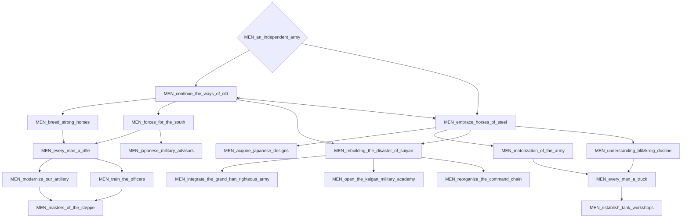
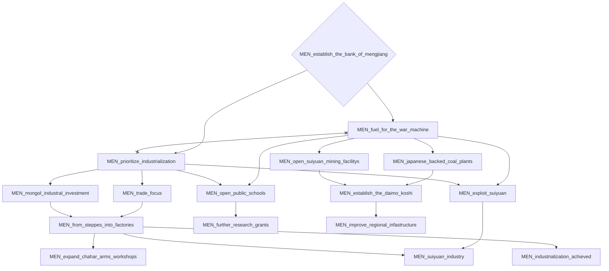
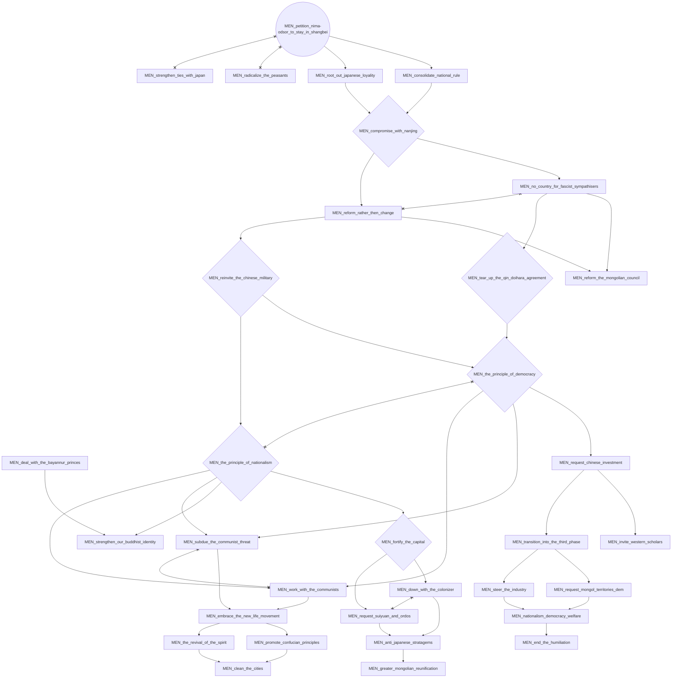
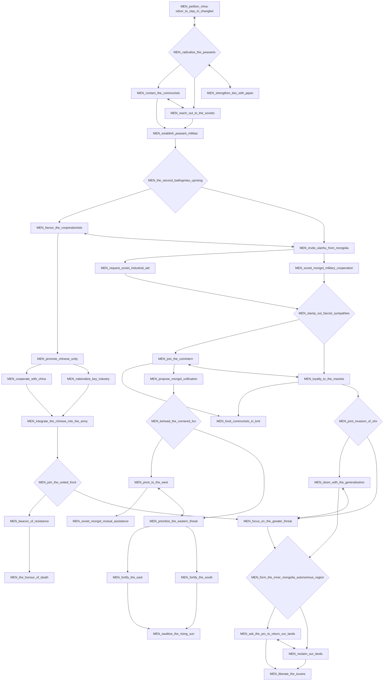
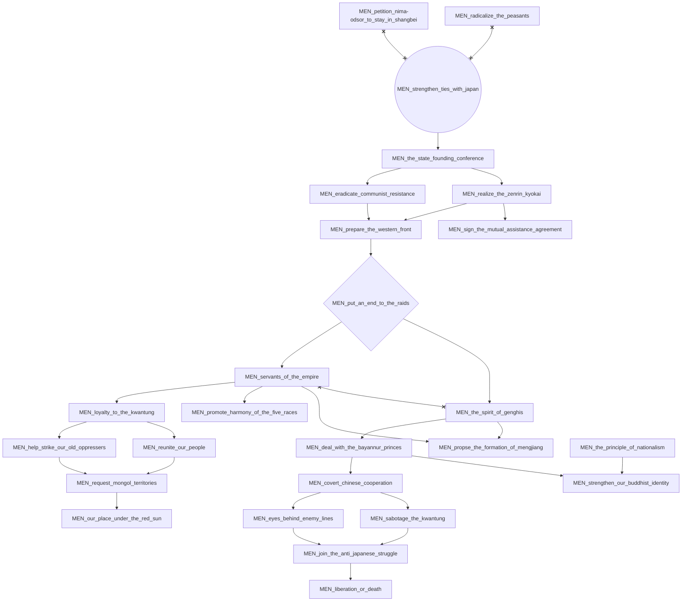

# MEN_an_independent_army

```mermaid
flowchart TD
    n1["MEN_acquire_japanese_designs"]
    n2{"MEN_an_independent_army"}
    n3["MEN_breed_strong_horses"]
    n4["MEN_continue_the_ways_of_old"]
    n5["MEN_embrace_horses_of_steel"]
    n6["MEN_establish_tank_workshops"]
    n7["MEN_every_man_a_rifle"]
    n8["MEN_every_man_a_truck"]
    n9["MEN_forces_for_the_south"]
    n10["MEN_integrate_the_grand_han_righteous_army"]
    n11["MEN_japanese_military_advisors"]
    n12["MEN_masters_of_the_steppe"]
    n13["MEN_modernize_our_artillery"]
    n14["MEN_motorization_of_the_army"]
    n15["MEN_open_the_kalgan_military_academy"]
    n16["MEN_rebuilding_the_disaster_of_suiyan"]
    n17["MEN_reorganize_the_command_chain"]
    n18["MEN_train_the_officers"]
    n19["MEN_understanding_blitzkreig_doctine"]
    n5 --> n1
    n4 --> n3
    n2 --> n4
    n2 --> n5
    n8 --> n6
    n3 --> n7
    n9 --> n7
    n19 --> n8
    n14 --> n8
    n4 --> n9
    n16 --> n10
    n9 --> n11
    n18 --> n12
    n13 --> n12
    n7 --> n13
    n5 --> n14
    n16 --> n15
    n5 --> n16
    n4 --> n16
    n16 --> n17
    n7 --> n18
    n5 --> n19
    n4 x--x n5
```

# MEN_establish_the_bank_of_mengjiang

```mermaid
flowchart TD
    n20{"MEN_establish_the_bank_of_mengjiang"}
    n21["MEN_establish_the_daimo_koshi"]
    n22["MEN_expand_chahar_arms_workshops"]
    n23["MEN_exploit_suiyuan"]
    n24["MEN_from_steppes_into_factories"]
    n25["MEN_fuel_for_the_war_machine"]
    n26["MEN_further_research_grants"]
    n27["MEN_improve_regional_infastructure"]
    n28["MEN_industrialization_achieved"]
    n29["MEN_japanese_backed_coal_plants"]
    n30["MEN_mongol_industral_investment"]
    n31["MEN_open_public_schools"]
    n32["MEN_open_suiyuan_mining_facilitys"]
    n33["MEN_prioritize_industrialization"]
    n34["MEN_suiyuan_industry"]
    n35["MEN_trade_focus"]
    n29 --> n21
    n32 --> n21
    n24 --> n22
    n25 --> n23
    n33 --> n23
    n35 --> n24
    n30 --> n24
    n20 --> n25
    n31 --> n26
    n21 --> n27
    n24 --> n28
    n25 --> n29
    n33 --> n30
    n25 --> n31
    n33 --> n31
    n25 --> n32
    n20 --> n33
    n23 --> n34
    n24 --> n34
    n33 --> n35
    n25 x--x n33
```

# MEN_petition_nima-odsor_to_stay_in_shangbei

```mermaid
flowchart TD
    n36["MEN_anti_japanese_stratagems"]
    n37["MEN_clean_the_cities"]
    n38{"MEN_compromise_with_nanjing"}
    n39["MEN_consolidate_national_rule"]
    n40["MEN_deal_with_the_bayannur_princes"]
    n41["MEN_down_with_the_colonizer"]
    n42["MEN_embrace_the_new_life_movement"]
    n43["MEN_end_the_humiliation"]
    n44{"MEN_fortify_the_capital"}
    n45["MEN_greater_mongolian_reunification"]
    n46["MEN_invite_western_scholars"]
    n47["MEN_nationalism_democracy_welfare"]
    n48["MEN_no_country_for_fascist_sympathisers"]
    n49(("MEN_petition_nima-odsor_to_stay_in_shangbei"))
    n50["MEN_promote_confucian_principles"]
    n51["MEN_radicalize_the_peasants"]
    n52["MEN_reform_rather_then_change"]
    n53["MEN_reform_the_mongolian_council"]
    n54{"MEN_reinvite_the_chinese_military"}
    n55["MEN_request_chinese_investment"]
    n56["MEN_request_mongol_territories_dem"]
    n57["MEN_request_suiyuan_and_ordos"]
    n58["MEN_root_out_japanese_loyality"]
    n59["MEN_steer_the_industry"]
    n60["MEN_strengthen_our_buddhist_identity"]
    n61["MEN_strengthen_ties_with_japan"]
    n62["MEN_subdue_the_communist_threat"]
    n63{"MEN_tear_up_the_qin_doihara_agreement"}
    n64{"MEN_the_principle_of_democracy"}
    n65{"MEN_the_principle_of_nationalism"}
    n66["MEN_the_revival_of_the_spirit"]
    n67["MEN_transition_into_the_third_phase"]
    n68["MEN_work_with_the_communists"]
    n57 --> n36
    n41 --> n36
    n66 --> n37
    n50 --> n37
    n39 --> n38
    n58 --> n38
    n49 --> n39
    n44 --> n41
    n68 --> n42
    n62 --> n42
    n47 --> n43
    n65 --> n44
    n36 --> n45
    n55 --> n46
    n56 --> n47
    n59 --> n47
    n38 --> n48
    n42 --> n50
    n38 --> n52
    n48 --> n53
    n52 --> n53
    n52 --> n54
    n64 --> n55
    n67 --> n56
    n44 --> n57
    n49 --> n58
    n67 --> n59
    n40 --> n60
    n65 --> n60
    n65 --> n62
    n64 --> n62
    n48 --> n63
    n63 --> n64
    n54 --> n64
    n54 --> n65
    n42 --> n66
    n55 --> n67
    n65 --> n68
    n64 --> n68
    n41 x--x n57
    n48 x--x n52
    n49 x--x n51
    n49 x--x n61
    n62 x--x n68
    n64 x--x n65
```

# MEN_radicalize_the_peasants

```mermaid
flowchart TD
    n69["MEN_ask_the_prc_to_return_our_lands"]
    n70["MEN_beacon_of_resistance"]
    n71{"MEN_behead_the_cornered_fox"}
    n72["MEN_contact_the_communists"]
    n73["MEN_cooperate_with_china"]
    n74["MEN_down_with_the_generalissimo"]
    n75["MEN_establish_peasant_militias"]
    n76["MEN_favour_the_cooperationists"]
    n77["MEN_focus_on_the_greater_threat"]
    n78{"MEN_form_the_inner_mongolia_autonomous_region"}
    n79["MEN_fortify_the_east"]
    n80["MEN_fortify_the_south"]
    n81["MEN_fund_communists_in_kmt"]
    n82["MEN_integrate_the_chinese_into_the_army"]
    n83["MEN_invite_ulanhu_from_mongolia"]
    n84["MEN_join_the_comintern"]
    n85{"MEN_join_the_united_front"}
    n86{"MEN_joint_invasion_of_shx"}
    n87["MEN_liberate_the_tuvans"]
    n88["MEN_loyalty_to_the_maoists"]
    n89["MEN_nationalize_key_industry"]
    n49["MEN_petition_nima-odsor_to_stay_in_shangbei"]
    n90["MEN_pivot_to_the_west"]
    n91["MEN_prioritize_the_eastern_threat"]
    n92["MEN_promote_chinese_unity"]
    n93["MEN_propose_mongol_unification"]
    n51{"MEN_radicalize_the_peasants"}
    n94["MEN_reach_out_to_the_soviets"]
    n95["MEN_reclaim_our_lands"]
    n96["MEN_request_soviet_industrial_aid"]
    n97["MEN_soviet_mongol_military_cooperation"]
    n98["MEN_soviet_mongol_mutual_assistance"]
    n99{"MEN_stamp_out_fascist_sympathies"}
    n61["MEN_strengthen_ties_with_japan"]
    n100["MEN_swallow_the_rising_sun"]
    n101["MEN_the_honour_of_death"]
    n102{"MEN_the_second_bailingmiao_uprising"}
    n78 --> n69
    n85 --> n70
    n93 --> n71
    n51 --> n72
    n92 --> n73
    n86 --> n74
    n94 --> n75
    n72 --> n75
    n102 --> n76
    n86 --> n77
    n85 --> n77
    n77 --> n78
    n74 --> n78
    n91 --> n79
    n91 --> n80
    n88 --> n81
    n84 --> n81
    n73 --> n82
    n89 --> n82
    n102 --> n83
    n99 --> n84
    n82 --> n85
    n88 --> n86
    n69 --> n87
    n95 --> n87
    n99 --> n88
    n92 --> n89
    n71 --> n90
    n71 --> n91
    n76 --> n92
    n84 --> n93
    n51 --> n94
    n78 --> n95
    n83 --> n96
    n83 --> n97
    n90 --> n98
    n96 --> n99
    n97 --> n99
    n80 --> n100
    n79 --> n100
    n70 --> n101
    n75 --> n102
    n69 x--x n95
    n72 x--x n94
    n74 x--x n77
    n76 x--x n83
    n84 x--x n88
    n49 x--x n51
    n90 x--x n91
    n51 x--x n61
```

# MEN_strengthen_ties_with_japan

```mermaid
flowchart TD
    n103["MEN_covert_chinese_cooperation"]
    n40["MEN_deal_with_the_bayannur_princes"]
    n104["MEN_eradicate_communist_resistance"]
    n105["MEN_eyes_behind_enemy_lines"]
    n106["MEN_help_strike_our_old_oppressers"]
    n107["MEN_join_the_anti_japanese_struggle"]
    n108["MEN_liberation_or_death"]
    n109["MEN_loyalty_to_the_kwantung"]
    n110["MEN_our_place_under_the_red_sun"]
    n49["MEN_petition_nima-odsor_to_stay_in_shangbei"]
    n111["MEN_prepare_the_western_front"]
    n112["MEN_promote_harmony_of_the_five_races"]
    n113["MEN_propse_the_formation_of_mengjiang"]
    n114{"MEN_put_an_end_to_the_raids"}
    n51["MEN_radicalize_the_peasants"]
    n115["MEN_realize_the_zenrin_kyokai"]
    n116["MEN_request_mongol_territories"]
    n117["MEN_reunite_our_people"]
    n118["MEN_sabotage_the_kwantung"]
    n119["MEN_servants_of_the_empire"]
    n120["MEN_sign_the_mutual_assistance_agreement"]
    n60["MEN_strengthen_our_buddhist_identity"]
    n61(("MEN_strengthen_ties_with_japan"))
    n65["MEN_the_principle_of_nationalism"]
    n121["MEN_the_spirit_of_genghis"]
    n122["MEN_the_state_founding_conference"]
    n40 --> n103
    n121 --> n40
    n122 --> n104
    n103 --> n105
    n109 --> n106
    n105 --> n107
    n118 --> n107
    n107 --> n108
    n119 --> n109
    n116 --> n110
    n104 --> n111
    n115 --> n111
    n119 --> n112
    n121 --> n113
    n119 --> n113
    n111 --> n114
    n122 --> n115
    n117 --> n116
    n106 --> n116
    n109 --> n117
    n103 --> n118
    n114 --> n119
    n115 --> n120
    n40 --> n60
    n65 --> n60
    n114 --> n121
    n61 --> n122
    n49 x--x n61
    n51 x--x n61
    n119 x--x n121
```
