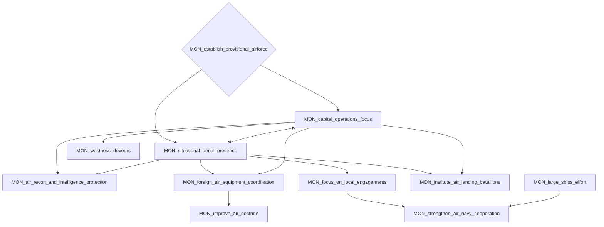
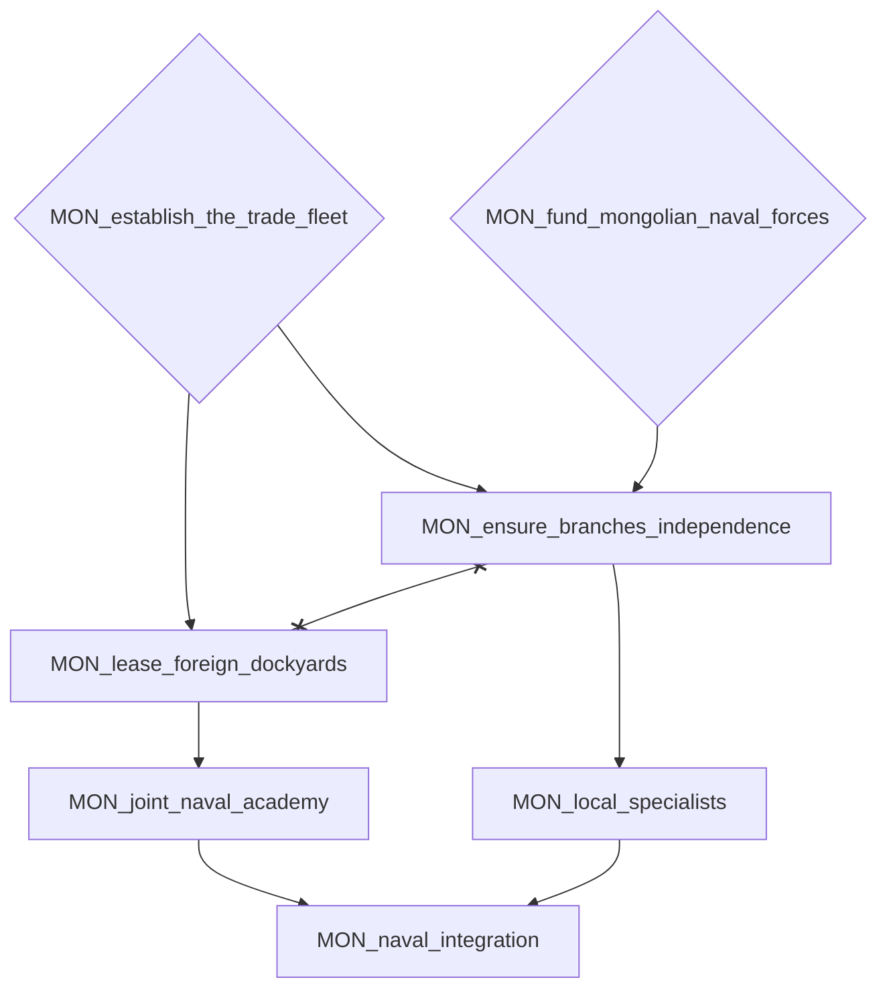
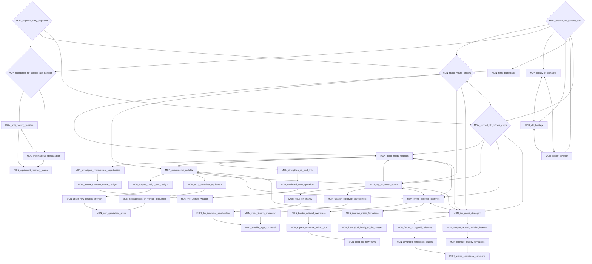
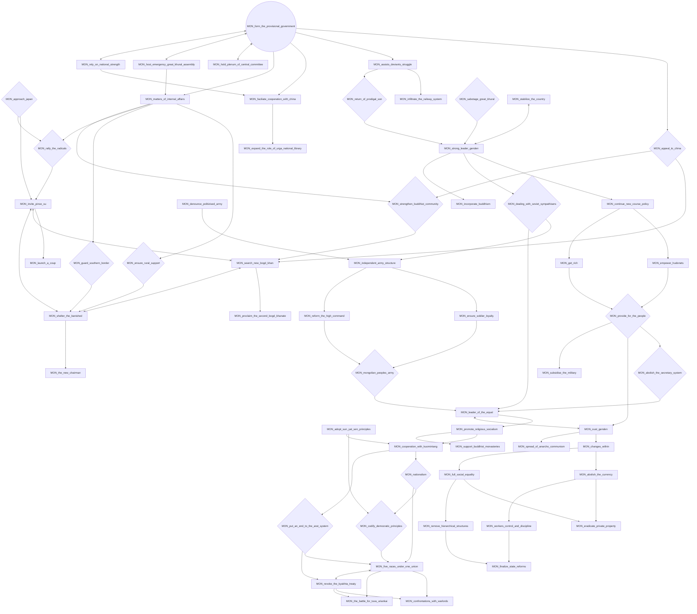
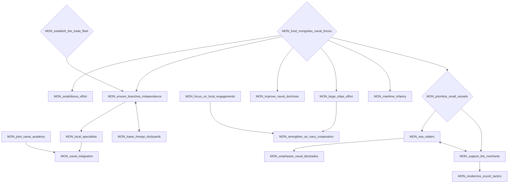
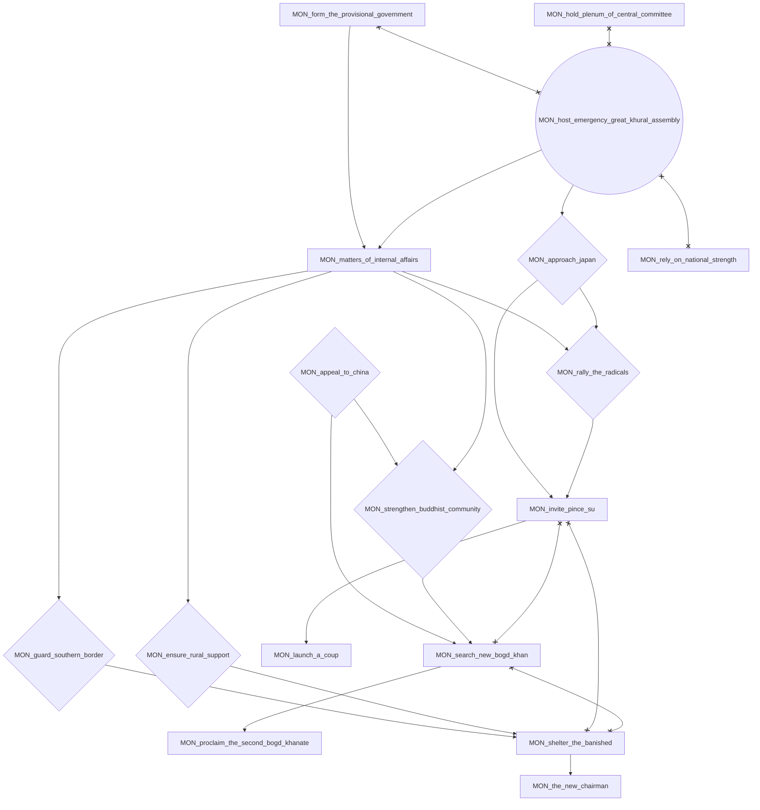
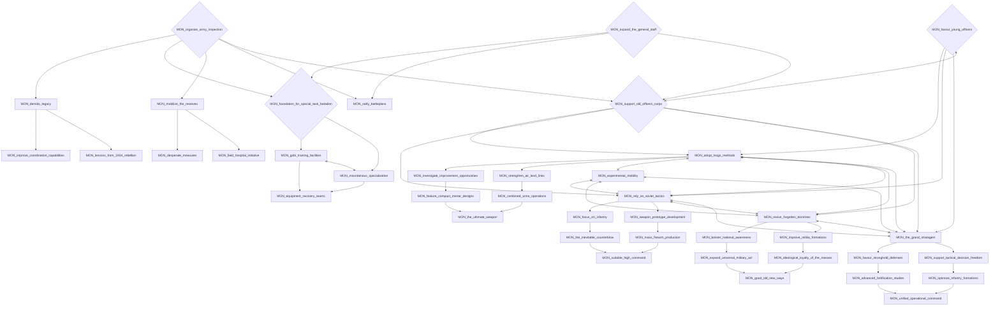
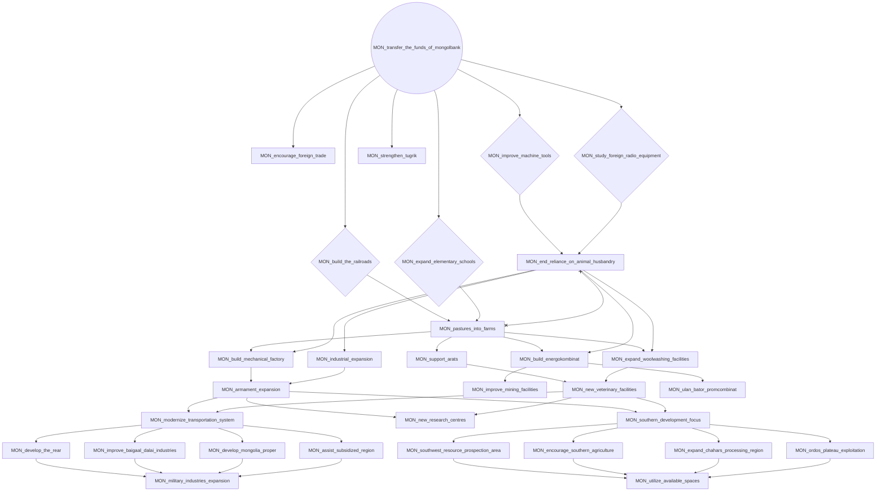

# MON_establish_provisional_airforce

# MON_establish_the_trade_fleet

# MON_expand_the_general_staff

# MON_form_the_provisional_government

# MON_fund_mongolian_naval_forces

# MON_hold_plenum_of_central_committee

```mermaid
flowchart TD
    n128["MON_a_pragmatic_diplomacy"]
    n129["MON_a_socialist_republic"]
    n130["MON_a_unity_with_buryats"]
    n131["MON_aerial_support_initiative"]
    n132["MON_affirm_rearmament_program"]
    n133["MON_appoint_soviet_protege"]
    n134["MON_approach_soviet_planners"]
    n135["MON_arm_civil_militia"]
    n136["MON_assist_the_revolutionary_struggle"]
    n137["MON_begin_the_collectivization"]
    n138["MON_central_asia_defensive_pact"]
    n139["MON_changing_times"]
    n140["MON_confiscate_soviet_weaponry"]
    n141["MON_contact_the_bandits"]
    n142["MON_contest_the_insurgents"]
    n143["MON_deal_with_genden"]
    n144["MON_deal_with_religious_centre"]
    n145["MON_decrease_defense_budget"]
    n146["MON_delegation_to_tuva"]
    n147["MON_destabilize_the_central_plain"]
    n148["MON_disagreements_with_sinkiang"]
    n149["MON_divide_spheres_of_influence"]
    n150{"MON_dream_of_greater_mongolia"}
    n151["MON_end_political_opportunism"]
    n152["MON_ensure_control_over_the_railways"]
    n153{"MON_ensure_mvd_loyalty"}
    n154["MON_establish_socialist_society"]
    n155{"MON_example_of_communist_paradise"}
    n156["MON_expand_influence_into_greater_steppe"]
    n157["MON_expand_the_treaty"]
    n158["MON_finalize_army_reform"]
    n159["MON_first_five_year_plan_focus"]
    n82["MON_form_the_provisional_government"]
    n160["MON_formalize_the_treaty"]
    n161["MON_frontline_infrastructure"]
    n162["MON_fruits_of_revolution"]
    n163["MON_gather_ulaanbaatar_conference"]
    n164["MON_gobi_border_realignment"]
    n86(("MON_hold_plenum_of_central_committee"))
    n87["MON_host_emergency_great_khural_assembly"]
    n165["MON_improve_transportation_network"]
    n166["MON_incorporate_new_lands"]
    n167["MON_increase_border_patrols"]
    n168["MON_increase_presence_in_caucasus"]
    n169["MON_industrial_relocation"]
    n170["MON_infiltrate_transural_region"]
    n171["MON_intensify_cooperation"]
    n172["MON_intervene_in_sinkiang"]
    n173{"MON_invite_frinovsky"}
    n174["MON_invite_political_exiles"]
    n175["MON_invite_soviet_advisors"]
    n176["MON_join_the_big_brother"]
    n177["MON_joint_pilgrimage_to_mount_wutai"]
    n178["MON_joint_technological_development"]
    n179["MON_launch_peoples_uprising"]
    n180["MON_learn_from_lkhumbe_affair"]
    n181["MON_liberalize_trade_policies"]
    n182["MON_limited_research_cooperation"]
    n183["MON_local_command_structure"]
    n184["MON_make_use_of_monastery_assets"]
    n185["MON_means_of_propaganda"]
    n186["MON_mengjian_issue"]
    n187["MON_new_comintern_beacon"]
    n188["MON_new_generation_of_intelligentsia"]
    n189["MON_new_party_elite"]
    n190["MON_one_mongolia_policy"]
    n191["MON_one_union_government"]
    n192["MON_open_up_the_country"]
    n193["MON_oppose_soviet_colonialism"]
    n194["MON_partial_religious_compromise"]
    n195["MON_peasants_focus"]
    n196["MON_plea_to_the_russian_far_east"]
    n197["MON_prepare_for_the_inevitable"]
    n198["MON_prepare_leftist_takeover"]
    n199["MON_ratify_mutual_assistance_treaty"]
    n200["MON_reach_out_to_moscow"]
    n201["MON_reassure_the_soviets"]
    n202["MON_rebuke_1932_mediation_issue"]
    n203["MON_reform_national_script"]
    n204["MON_reignite_the_civil_war"]
    n205["MON_reject_choibalsan_advances"]
    n104["MON_rely_on_national_strength"]
    n206["MON_remove_nominal_leadership"]
    n207["MON_reorganize_homeland_security"]
    n208["MON_reorganize_state_agenda"]
    n209["MON_secure_hexi_corridor"]
    n210["MON_secure_the_rear"]
    n211{"MON_secure_the_transition_of_power"}
    n212["MON_seize_our_advantages"]
    n213{"MON_seize_the_power"}
    n214["MON_separate_army_and_politics"]
    n215["MON_sideline_the_left"]
    n216["MON_solidify_language_institutes"]
    n217{"MON_stay_on_guard"}
    n218["MON_struggle_for_communal_liberation"]
    n219["MON_student_exchange_program"]
    n220["MON_support_east_siberian_independists"]
    n221["MON_support_the_rebels"]
    n222["MON_support_the_red_army_focus"]
    n223["MON_tackle_the_eastern_threat"]
    n224["MON_the_great_terror"]
    n225["MON_the_second_northern_expedition"]
    n226["MON_thinking_out_of_bounds"]
    n227["MON_tolerate_religious_groups"]
    n228{"MON_true_hero_for_the_people"}
    n229["MON_ulaanbaatar_national_university"]
    n230["MON_vessels_of_the_future_war"]
    n231["MON_weaken_soviet_control_over_northwestern_siberia"]
    n232["MON_workers_and_peasants_unite_focus"]
    n233["MON_workers_focus"]
    n150 --> n128
    n158 --> n129
    n232 --> n129
    n148 --> n130
    n146 --> n130
    n222 --> n131
    n167 --> n132
    n173 --> n133
    n211 --> n133
    n199 --> n134
    n180 --> n135
    n132 --> n136
    n213 --> n137
    n217 --> n138
    n228 --> n138
    n155 --> n139
    n228 --> n139
    n217 --> n139
    n152 --> n140
    n152 --> n141
    n153 --> n142
    n86 --> n143
    n133 --> n144
    n214 --> n145
    n150 --> n146
    n138 --> n146
    n226 --> n147
    n128 --> n148
    n163 --> n149
    n228 --> n150
    n155 --> n150
    n217 --> n150
    n213 --> n151
    n198 --> n152
    n200 --> n153
    n154 --> n153
    n205 --> n154
    n151 --> n155
    n201 --> n155
    n193 --> n156
    n138 --> n157
    n183 --> n158
    n145 --> n158
    n155 --> n159
    n228 --> n159
    n217 --> n159
    n221 --> n160
    n129 --> n161
    n197 --> n161
    n147 --> n162
    n185 --> n162
    n150 --> n163
    n128 --> n164
    n163 --> n164
    n222 --> n165
    n163 --> n166
    n130 --> n166
    n207 --> n167
    n214 --> n167
    n156 --> n168
    n165 --> n169
    n231 --> n170
    n178 --> n171
    n138 --> n172
    n143 --> n173
    n198 --> n174
    n199 --> n175
    n139 --> n176
    n149 --> n177
    n86 --> n178
    n170 --> n179
    n196 --> n179
    n168 --> n179
    n198 --> n180
    n129 --> n181
    n214 --> n183
    n208 --> n184
    n226 --> n185
    n138 --> n186
    n165 --> n187
    n162 --> n187
    n224 --> n188
    n224 --> n189
    n128 --> n190
    n187 --> n191
    n138 --> n193
    n192 --> n193
    n180 --> n194
    n154 --> n195
    n220 --> n196
    n173 --> n198
    n86 --> n199
    n213 --> n201
    n132 --> n202
    n178 --> n203
    n219 --> n203
    n210 --> n204
    n209 --> n204
    n211 --> n205
    n189 --> n206
    n188 --> n206
    n133 --> n207
    n213 --> n208
    n189 --> n208
    n149 --> n209
    n149 --> n210
    n143 --> n211
    n199 --> n211
    n137 --> n212
    n174 --> n213
    n141 --> n213
    n135 --> n213
    n194 --> n213
    n140 --> n213
    n205 --> n214
    n129 --> n215
    n182 --> n216
    n219 --> n216
    n129 --> n217
    n197 --> n217
    n191 --> n218
    n178 --> n219
    n182 --> n219
    n193 --> n220
    n153 --> n221
    n155 --> n222
    n228 --> n222
    n132 --> n223
    n207 --> n224
    n144 --> n224
    n177 --> n225
    n210 --> n225
    n201 --> n226
    n205 --> n227
    n206 --> n228
    n223 --> n228
    n216 --> n229
    n203 --> n229
    n222 --> n230
    n193 --> n231
    n195 --> n232
    n233 --> n232
    n154 --> n233
    n128 x--x n163
    n133 x--x n198
    n133 x--x n205
    n138 x--x n150
    n138 x--x n192
    n142 x--x n221
    n150 x--x n192
    n151 x--x n201
    n82 x--x n86
    n86 x--x n87
    n86 x--x n104
    n198 x--x n205
```

# MON_host_emergency_great_khural_assembly

# MON_organize_army_inspection

# MON_rely_on_national_strength

```mermaid
flowchart TD
    n128["MON_a_pragmatic_diplomacy"]
    n129["MON_a_socialist_republic"]
    n130["MON_a_unity_with_buryats"]
    n61["MON_abolish_the_currency"]
    n62{"MON_abolish_the_secretary_system"}
    n63["MON_adopt_sun_yat_sen_principles"]
    n240["MON_appeal_for_overseas_protection"]
    n241["MON_appeal_to_european_democracies"]
    n242["MON_bulwark_against_fascist_threat"]
    n138["MON_central_asia_defensive_pact"]
    n67["MON_changes_within"]
    n139["MON_changing_times"]
    n68{"MON_codify_democratic_principles"}
    n243{"MON_compromise_with_lamas"}
    n69["MON_confrontations_with_warlords"]
    n142["MON_contest_the_insurgents"]
    n70["MON_continue_new_course_policy"]
    n71["MON_cooperation_with_kuomintang"]
    n72{"MON_dealing_with_soviet_sympathisers"}
    n244{"MON_declare_official_neutrality"}
    n146["MON_delegation_to_tuva"]
    n245["MON_democratic_foundation_of_mongolia"]
    n73["MON_denounce_politizised_army"]
    n148["MON_disagreements_with_sinkiang"]
    n149["MON_divide_spheres_of_influence"]
    n150{"MON_dream_of_greater_mongolia"}
    n74["MON_empower_hudonets"]
    n153{"MON_ensure_mvd_loyalty"}
    n76["MON_ensure_soldier_loyalty"]
    n77["MON_eradicate_private_property"]
    n154["MON_establish_socialist_society"]
    n155{"MON_example_of_communist_paradise"}
    n246["MON_excessive_military_build_up"]
    n156["MON_expand_influence_into_greater_steppe"]
    n78["MON_expand_the_role_of_urga_national_library"]
    n157["MON_expand_the_treaty"]
    n247["MON_expel_choibalsan"]
    n79["MON_faciliate_cooperation_with_china"]
    n80["MON_finalize_state_reforms"]
    n159["MON_first_five_year_plan_focus"]
    n81["MON_five_races_under_one_union"]
    n248["MON_forge_asian_self_determination"]
    n82["MON_form_the_provisional_government"]
    n249["MON_form_the_rightist_cabinet"]
    n160["MON_formalize_the_treaty"]
    n161["MON_frontline_infrastructure"]
    n83["MON_full_social_equality"]
    n163["MON_gather_ulaanbaatar_conference"]
    n84["MON_get_rich"]
    n164["MON_gobi_border_realignment"]
    n86["MON_hold_plenum_of_central_committee"]
    n87["MON_host_emergency_great_khural_assembly"]
    n88["MON_incorporate_buddhism"]
    n166["MON_incorporate_new_lands"]
    n168["MON_increase_presence_in_caucasus"]
    n89["MON_independent_army_structure"]
    n170["MON_infiltrate_transural_region"]
    n172["MON_intervene_in_sinkiang"]
    n250{"MON_invite_foreign_investors"}
    n176["MON_join_the_big_brother"]
    n177["MON_joint_pilgrimage_to_mount_wutai"]
    n178["MON_joint_technological_development"]
    n179["MON_launch_peoples_uprising"]
    n93["MON_leader_of_the_equal"]
    n182["MON_limited_research_cooperation"]
    n186["MON_mengjian_issue"]
    n95{"MON_mongolian_peoples_army"}
    n96{"MON_nationalism"}
    n251["MON_offer_facilities_for_exiled_scientists"]
    n190["MON_one_mongolia_policy"]
    n192{"MON_open_up_the_country"}
    n193["MON_oppose_soviet_colonialism"]
    n97["MON_oust_genden"]
    n252["MON_peace_and_prosperity"]
    n196["MON_plea_to_the_russian_far_east"]
    n197{"MON_prepare_for_the_inevitable"}
    n99["MON_promote_religious_socialism"]
    n100{"MON_provide_for_the_people"}
    n253["MON_provide_shelter_for_refugees"]
    n101{"MON_put_an_end_to_the_arat_system"}
    n200{"MON_reach_out_to_moscow"}
    n203["MON_reform_national_script"]
    n103["MON_reform_the_high_command"]
    n204["MON_reignite_the_civil_war"]
    n104(("MON_rely_on_national_strength"))
    n105["MON_remove_hierarchical_structures"]
    n254["MON_repay_old_debths"]
    n106{"MON_return_of_prodigal_son"}
    n107["MON_revoke_the_kyakhta_treaty"]
    n255["MON_riders_of_the_storm"]
    n108{"MON_sabotage_great_khural"}
    n256["MON_secularization_of_education"]
    n209["MON_secure_hexi_corridor"]
    n210["MON_secure_the_rear"]
    n257["MON_seek_democratic_alliances"]
    n216["MON_solidify_language_institutes"]
    n111["MON_spread_of_anarcho_communism"]
    n112["MON_stabilize_the_country"]
    n217{"MON_stay_on_guard"}
    n258["MON_strengthen_existing_industrial_contracts"]
    n259["MON_strike_against_communist_menace"]
    n114["MON_strong_leader_genden"]
    n219["MON_student_exchange_program"]
    n115["MON_subsidise_the_military"]
    n260["MON_subvert_soviet_control"]
    n116["MON_support_buddhist_monasteries"]
    n220["MON_support_east_siberian_independists"]
    n221["MON_support_the_rebels"]
    n117["MON_the_battle_for_tuva_uriankai"]
    n225["MON_the_second_northern_expedition"]
    n228{"MON_true_hero_for_the_people"}
    n229["MON_ulaanbaatar_national_university"]
    n231["MON_weaken_soviet_control_over_northwestern_siberia"]
    n261["MON_welfare_focus"]
    n119["MON_workers_control_and_discipline"]
    n150 --> n128
    n148 --> n130
    n146 --> n130
    n67 --> n61
    n100 --> n62
    n244 --> n63
    n192 --> n240
    n192 --> n241
    n257 --> n242
    n245 --> n242
    n217 --> n138
    n228 --> n138
    n97 --> n67
    n155 --> n139
    n228 --> n139
    n217 --> n139
    n63 --> n68
    n96 --> n68
    n249 --> n243
    n107 --> n69
    n81 --> n69
    n153 --> n142
    n114 --> n70
    n63 --> n71
    n99 --> n71
    n114 --> n72
    n252 --> n244
    n150 --> n146
    n138 --> n146
    n192 --> n245
    n112 --> n73
    n128 --> n148
    n163 --> n149
    n228 --> n150
    n155 --> n150
    n217 --> n150
    n70 --> n74
    n200 --> n153
    n154 --> n153
    n89 --> n76
    n83 --> n77
    n61 --> n77
    n197 --> n246
    n193 --> n156
    n79 --> n78
    n138 --> n157
    n104 --> n247
    n104 --> n79
    n82 --> n79
    n119 --> n80
    n105 --> n80
    n155 --> n159
    n228 --> n159
    n217 --> n159
    n96 --> n81
    n68 --> n81
    n101 --> n81
    n245 --> n248
    n112 --> n249
    n221 --> n160
    n129 --> n161
    n197 --> n161
    n67 --> n83
    n150 --> n163
    n70 --> n84
    n128 --> n164
    n163 --> n164
    n114 --> n88
    n163 --> n166
    n130 --> n166
    n156 --> n168
    n73 --> n89
    n72 --> n89
    n231 --> n170
    n138 --> n172
    n254 --> n250
    n139 --> n176
    n149 --> n177
    n170 --> n179
    n196 --> n179
    n168 --> n179
    n72 --> n93
    n95 --> n93
    n62 --> n93
    n104 --> n182
    n138 --> n186
    n103 --> n95
    n76 --> n95
    n71 --> n96
    n253 --> n251
    n128 --> n190
    n244 --> n192
    n197 --> n192
    n138 --> n193
    n192 --> n193
    n100 --> n97
    n243 --> n252
    n250 --> n252
    n220 --> n196
    n200 --> n197
    n93 --> n99
    n74 --> n100
    n84 --> n100
    n245 --> n253
    n257 --> n253
    n71 --> n101
    n112 --> n200
    n178 --> n203
    n219 --> n203
    n89 --> n103
    n210 --> n204
    n209 --> n204
    n83 --> n105
    n200 --> n254
    n249 --> n254
    n101 --> n107
    n192 --> n255
    n260 --> n108
    n247 --> n108
    n249 --> n256
    n149 --> n209
    n149 --> n210
    n192 --> n257
    n182 --> n216
    n219 --> n216
    n97 --> n111
    n108 --> n112
    n129 --> n217
    n197 --> n217
    n182 --> n258
    n257 --> n259
    n245 --> n259
    n108 --> n114
    n106 --> n114
    n178 --> n219
    n182 --> n219
    n100 --> n115
    n104 --> n260
    n99 --> n116
    n193 --> n220
    n153 --> n221
    n107 --> n117
    n81 --> n117
    n177 --> n225
    n210 --> n225
    n216 --> n229
    n203 --> n229
    n193 --> n231
    n63 --> n261
    n61 --> n119
    n128 x--x n163
    n138 x--x n150
    n138 x--x n192
    n142 x--x n221
    n245 x--x n257
    n150 x--x n192
    n81 x--x n107
    n82 x--x n104
    n86 x--x n104
    n87 x--x n104
    n93 x--x n97
    n192 x--x n192
    n252 x--x n197
    n112 x--x n114
```

# MON_transfer_the_funds_of_mongolbank

