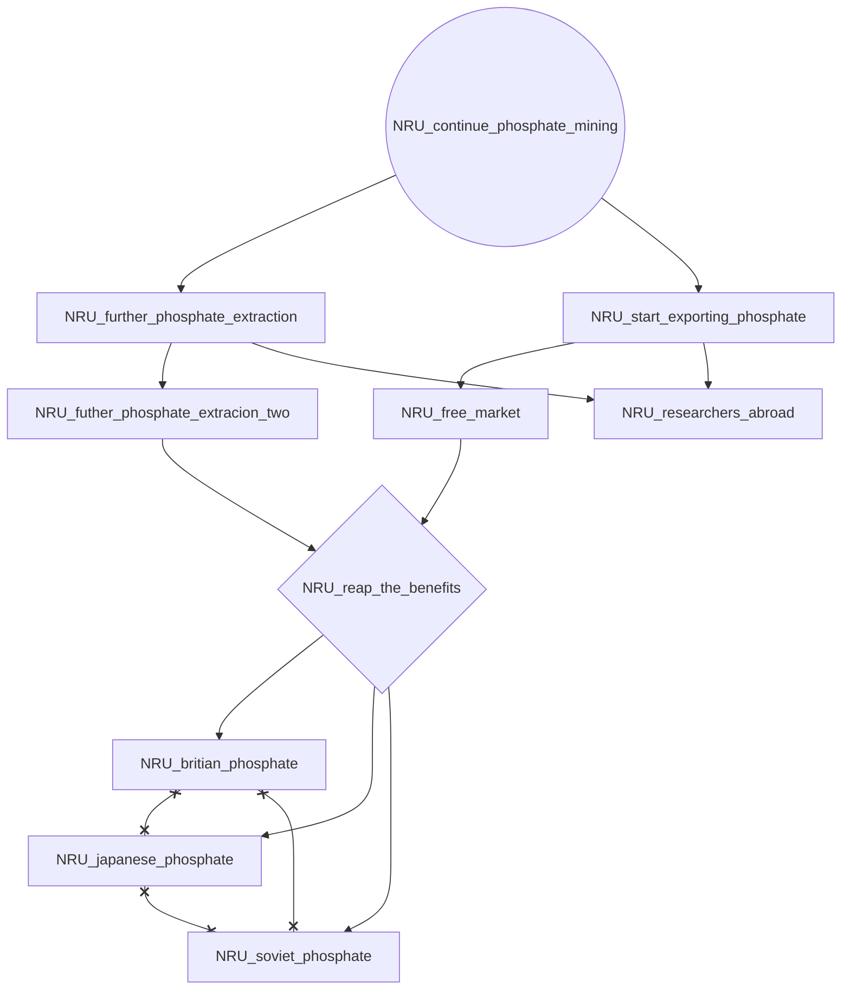
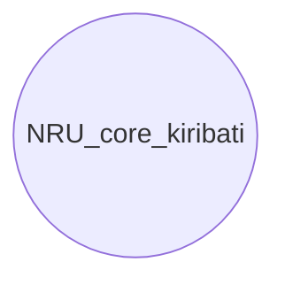
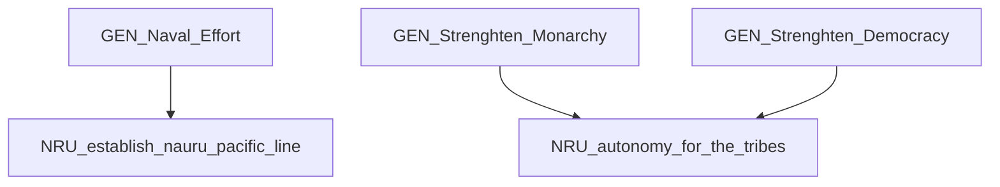

# NRU_continue_phosphate_mining

```mermaid
flowchart TD
    n1["NRU_britian_phosphate"]
    n2(("NRU_continue_phosphate_mining"))
    n3["NRU_free_market"]
    n4["NRU_further_phosphate_extraction"]
    n5["NRU_futher_phosphate_extracion_two"]
    n6["NRU_japanese_phosphate"]
    n7{"NRU_reap_the_benefits"}
    n8["NRU_researchers_abroad"]
    n9["NRU_soviet_phosphate"]
    n10["NRU_start_exporting_phosphate"]
    n7 --> n1
    n10 --> n3
    n2 --> n4
    n4 --> n5
    n7 --> n6
    n3 --> n7
    n5 --> n7
    n4 --> n8
    n10 --> n8
    n7 --> n9
    n2 --> n10
    n1 x--x n6
    n1 x--x n9
    n6 x--x n9
```

# NRU_core_kiribati

```mermaid
flowchart TD
    n11(("NRU_core_kiribati"))
```

# orphans

```mermaid
flowchart TD
    n12["GEN_Naval_Effort"]
    n13["GEN_Strenghten_Democracy"]
    n14["GEN_Strenghten_Monarchy"]
    n15["NRU_autonomy_for_the_tribes"]
    n16["NRU_establish_nauru_pacific_line"]
    n14 --> n15
    n13 --> n15
    n12 --> n16
```
