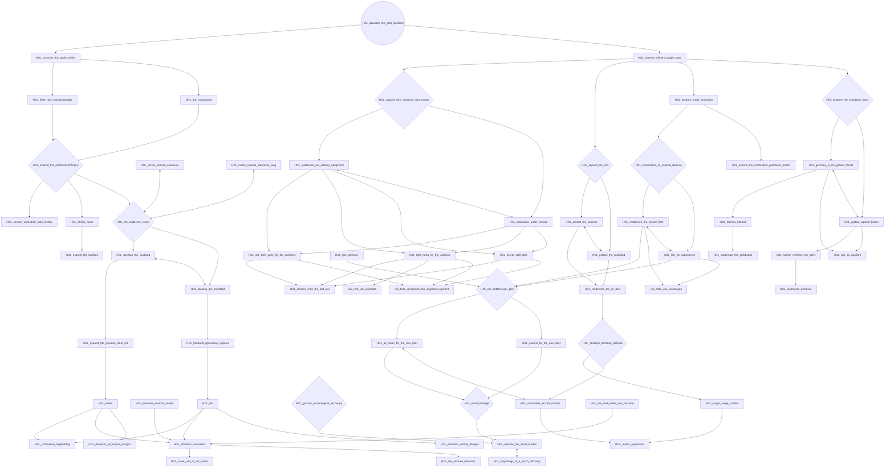
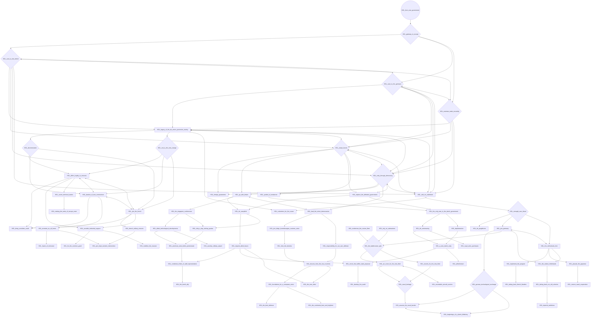
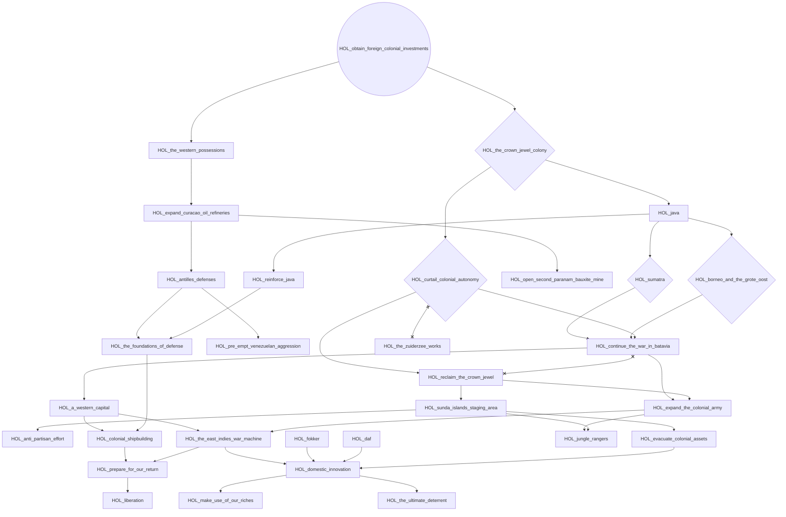
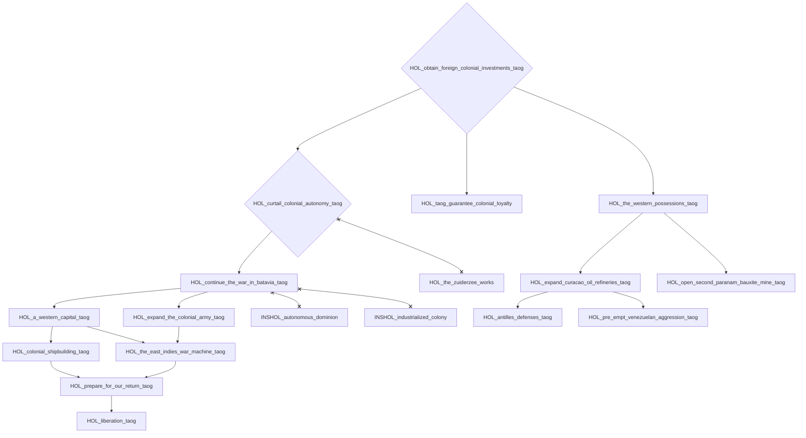

# HOL_abandon_the_gold_standard

```mermaid
flowchart TD
    n1(("HOL_abandon_the_gold_standard"))
    n2["HOL_air_cover_for_the_new_fleet"]
    n3["HOL_anti_tank_guns_for_the_continent"]
    n4{"HOL_appoint_new_supreme_commander"}
    n5["HOL_assume_the_naval_burden"]
    n6["HOL_aviatic_aspirations"]
    n7["HOL_beginnings_of_a_dutch_blitzkrieg"]
    n8["HOL_continental_shipbuilding"]
    n9["HOL_continue_the_public_works"]
    n10["HOL_convert_werkspoor_train_factory"]
    n11{"HOL_cornerstone_of_colonial_defense"}
    n12["HOL_curtail_colonial_autonomy"]
    n13["HOL_curtail_colonial_autonomy_taog"]
    n14["HOL_daf"]
    n15["HOL_develop_the_randstad"]
    n16["HOL_develop_the_zandstad"]
    n17["HOL_domestic_innovation"]
    n18["HOL_domestic_jet_engine_designs"]
    n19["HOL_domestic_vehicle_designs"]
    n20["HOL_escorts_for_the_new_fleet"]
    n21["HOL_evacuate_colonial_assets"]
    n22["HOL_expand_RD_facilities"]
    n23["HOL_expand_the_amsterdam_petroleum_harbor"]
    n24{"HOL_expand_the_artillerieinrichtingen"}
    n25["HOL_expand_the_ijmuiden_steel_mill"]
    n26{"HOL_expand_the_mld"}
    n27["HOL_finish_the_noordoostpolder"]
    n28["HOL_fokker"]
    n29["HOL_fortress_holland"]
    n30["HOL_friesland_agricultural_impetus"]
    n31["HOL_further_reinforce_the_ports"]
    n32{"HOL_german_technological_exchange"}
    n33["HOL_germany_is_the_greater_threat"]
    n34["HOL_join_germany"]
    n35["HOL_lessons_from_the_last_war"]
    n36["HOL_light_tanks_for_the_colonies"]
    n37["HOL_longer_range_models"]
    n38["HOL_make_use_of_our_riches"]
    n39["HOL_modernize_our_infantry_equipment"]
    n40["HOL_modernize_the_air_fleet"]
    n41["HOL_modernize_the_cruiser_fleet"]
    n42["HOL_modernize_the_grebbeline"]
    n43{"HOL_naval_heritage"}
    n44["HOL_overturn_military_budget_cuts"]
    n45["HOL_philips_focus"]
    n46["HOL_prepare_naval_expansion"]
    n47{"HOL_prepare_the_inundation_lines"}
    n48["HOL_production_under_license"]
    n49["HOL_protect_against_britain"]
    n50["HOL_protect_the_colonies"]
    n51["HOL_protect_the_mainland"]
    n52["HOL_rely_on_submarines"]
    n53["HOL_secret_staff_talks"]
    n54["HOL_southward_defenses"]
    n55{"HOL_strategic_bombing_defense"}
    n56{"HOL_the_battlecruiser_plan"}
    n57["HOL_the_east_indies_war_machine"]
    n58["HOL_the_maastunnel"]
    n59["HOL_the_ultimate_deterrent"]
    n60{"HOL_the_zuiderzee_works"}
    n61["HOL_unsinkable_aircraft_carriers"]
    n62["HOL_war_on_pacifism"]
    n63["r56_HOL_daf_pantrado"]
    n64["r56_HOL_reorganize_the_engineer_regiment"]
    n65["r56_HOL_van_kinsbergen"]
    n56 --> n2
    n39 --> n3
    n48 --> n3
    n44 --> n4
    n43 --> n5
    n32 --> n5
    n37 --> n6
    n61 --> n6
    n28 --> n8
    n14 --> n8
    n1 --> n9
    n24 --> n10
    n46 --> n11
    n30 --> n14
    n60 --> n15
    n60 --> n16
    n57 --> n17
    n28 --> n17
    n14 --> n17
    n21 --> n17
    n28 --> n18
    n14 --> n19
    n56 --> n20
    n45 --> n22
    n46 --> n23
    n27 --> n24
    n58 --> n24
    n15 --> n25
    n44 --> n26
    n9 --> n27
    n25 --> n28
    n33 --> n29
    n16 --> n30
    n49 --> n31
    n47 --> n33
    n36 --> n35
    n53 --> n35
    n3 --> n35
    n39 --> n36
    n48 --> n36
    n55 --> n37
    n17 --> n38
    n4 --> n39
    n51 --> n40
    n50 --> n40
    n11 --> n41
    n29 --> n42
    n2 --> n43
    n20 --> n43
    n1 --> n44
    n24 --> n45
    n44 --> n46
    n44 --> n47
    n4 --> n48
    n47 --> n49
    n26 --> n50
    n26 --> n51
    n11 --> n52
    n39 --> n53
    n48 --> n53
    n31 --> n54
    n40 --> n55
    n52 --> n56
    n41 --> n56
    n34 --> n56
    n9 --> n58
    n17 --> n59
    n24 --> n60
    n55 --> n61
    n49 --> n62
    n33 --> n62
    n36 --> n63
    n36 --> n64
    n53 --> n64
    n3 --> n64
    n52 --> n65
    n41 --> n65
    n2 x--x n61
    n5 x--x n7
    n12 x--x n60
    n13 x--x n60
    n15 x--x n16
    n33 x--x n49
    n39 x--x n48
    n41 x--x n52
    n50 x--x n51
```

# HOL_form_new_government

```mermaid
flowchart TD
    n66["HOL_a_new_dutch_unity"]
    n67["HOL_affirm_loyalty_to_moscow"]
    n2["HOL_air_cover_for_the_new_fleet"]
    n68["HOL_allied_technological_developments"]
    n69["HOL_american_west_indies_protectorate"]
    n5["HOL_assume_the_naval_burden"]
    n70["HOL_bastion_of_true_communism"]
    n7["HOL_beginnings_of_a_dutch_blitzkrieg"]
    n71["HOL_bring_socialism_south"]
    n72{"HOL_cave_to_the_british"}
    n73{"HOL_cave_to_the_germans"}
    n74["HOL_combined_chiefs_of_staff_representation"]
    n75["HOL_de_jeugdstorm"]
    n76["HOL_de_vaarplicht"]
    n77["HOL_de_vernieuwing"]
    n78{"HOL_decolonization"}
    n79["HOL_depillarization"]
    n80["HOL_develop_the_south"]
    n81["HOL_enemies_on_all_fronts"]
    n20["HOL_escorts_for_the_new_fleet"]
    n82["HOL_for_the_common_good"]
    n83["HOL_foreign_guarantees"]
    n84(("HOL_form_new_government"))
    n85["HOL_form_the_benelux"]
    n86["HOL_foundations_for_a_european_union"]
    n87["HOL_french_military_mission"]
    n88{"HOL_gateway_to_europe"}
    n32{"HOL_german_technological_exchange"}
    n89["HOL_go_with_britain"]
    n90["HOL_haven_of_tolerance"]
    n91["HOL_imperial_ambitions"]
    n92["HOL_implement_the_program"]
    n93["HOL_join_belgo_luxembourgian_customs_union"]
    n34["HOL_join_germany"]
    n94["HOL_join_the_french"]
    n95["HOL_lead_the_minor_democracies"]
    n96["HOL_legacy_of_the_de_zeven_provincien_mutiny"]
    n97["HOL_lessons_from_the_low_countries"]
    n98{"HOL_maintain_trade_neutrality"}
    n99["HOL_making_the_ends_of_europe_meet"]
    n100["HOL_mobilize_the_masses"]
    n41["HOL_modernize_the_cruiser_fleet"]
    n43{"HOL_naval_heritage"}
    n101{"HOL_oranje_boven"}
    n102["HOL_placate_the_japanese"]
    n103["HOL_pre_empt_western_intervention"]
    n104{"HOL_red_is_the_new_orange"}
    n52["HOL_rely_on_submarines"]
    n105["HOL_replace_the_defeatist_government"]
    n106["HOL_request_allied_favors"]
    n107["HOL_responsibility_for_our_own_defense"]
    n108["HOL_restore_naval_cooperation"]
    n109["HOL_revive_the_buffer_state_proposal"]
    n110["HOL_royal_arms_purchases"]
    n111["HOL_ship_a_day_sinking_quotas"]
    n112["HOL_socialist_industrial_support"]
    n113["HOL_soviet_technical_teams"]
    n114{"HOL_strength_over_blood"}
    n115["HOL_symbol_of_resistance"]
    n116["HOL_taking_back_french_flanders"]
    n117["HOL_taking_back_our_old_colonies"]
    n56{"HOL_the_battlecruiser_plan"}
    n118["HOL_the_best_defense"]
    n119["HOL_the_continents_best_and_brightest"]
    n120["HOL_the_fourth_ally"]
    n121["HOL_the_netherlands_first"]
    n122["HOL_the_new_ideal"]
    n123["HOL_the_only_man_in_the_dutch_government"]
    n124["HOL_the_singapore_conferences"]
    n125["HOL_the_united_netherlands"]
    n126{"HOL_unity_through_democracy"}
    n61["HOL_unsinkable_aircraft_carriers"]
    n127["HOL_volk_en_vaderland"]
    n128["HOL_volunteers_for_the_cause"]
    n129["HOL_wilhelminism"]
    n130["HOL_zandery_military_airport"]
    n77 --> n66
    n79 --> n66
    n78 --> n67
    n104 --> n67
    n56 --> n2
    n124 --> n68
    n111 --> n69
    n68 --> n69
    n43 --> n5
    n32 --> n5
    n78 --> n70
    n104 --> n70
    n32 --> n7
    n70 --> n71
    n94 --> n71
    n67 --> n71
    n88 --> n72
    n88 --> n73
    n106 --> n74
    n69 --> n74
    n114 --> n75
    n105 --> n76
    n89 --> n76
    n123 --> n77
    n96 --> n78
    n123 --> n79
    n109 --> n80
    n70 --> n81
    n56 --> n20
    n112 --> n82
    n101 --> n83
    n126 --> n83
    n93 --> n85
    n97 --> n86
    n94 --> n87
    n84 --> n88
    n34 --> n32
    n101 --> n89
    n126 --> n89
    n81 --> n90
    n117 --> n91
    n121 --> n92
    n95 --> n93
    n114 --> n34
    n78 --> n94
    n104 --> n94
    n126 --> n95
    n73 --> n96
    n98 --> n96
    n72 --> n96
    n85 --> n97
    n107 --> n97
    n88 --> n98
    n113 --> n99
    n112 --> n100
    n2 --> n43
    n20 --> n43
    n72 --> n101
    n98 --> n101
    n73 --> n101
    n121 --> n102
    n87 --> n103
    n81 --> n103
    n96 --> n104
    n101 --> n105
    n126 --> n105
    n76 --> n106
    n95 --> n107
    n102 --> n108
    n66 --> n109
    n106 --> n109
    n77 --> n110
    n76 --> n111
    n124 --> n111
    n67 --> n112
    n94 --> n112
    n67 --> n113
    n127 --> n114
    n101 --> n115
    n92 --> n116
    n125 --> n117
    n52 --> n56
    n41 --> n56
    n34 --> n56
    n86 --> n118
    n86 --> n119
    n74 --> n120
    n114 --> n121
    n97 --> n122
    n106 --> n122
    n115 --> n123
    n105 --> n123
    n89 --> n124
    n34 --> n125
    n121 --> n125
    n72 --> n126
    n98 --> n126
    n73 --> n126
    n73 --> n127
    n98 --> n127
    n72 --> n127
    n127 --> n128
    n96 --> n128
    n66 --> n129
    n68 --> n130
    n67 x--x n70
    n67 x--x n94
    n2 x--x n61
    n5 x--x n7
    n70 x--x n94
    n72 x--x n73
    n72 x--x n98
    n73 x--x n98
    n89 x--x n95
    n34 x--x n121
    n96 x--x n101
    n96 x--x n126
    n96 x--x n127
    n101 x--x n126
    n101 x--x n127
    n126 x--x n127
```

# HOL_obtain_foreign_colonial_investments

```mermaid
flowchart TD
    n131["HOL_a_western_capital"]
    n132["HOL_anti_partisan_effort"]
    n133["HOL_antilles_defenses"]
    n134{"HOL_borneo_and_the_grote_oost"}
    n135["HOL_colonial_shipbuilding"]
    n136["HOL_continue_the_war_in_batavia"]
    n12{"HOL_curtail_colonial_autonomy"}
    n14["HOL_daf"]
    n17["HOL_domestic_innovation"]
    n21["HOL_evacuate_colonial_assets"]
    n137["HOL_expand_curacao_oil_refineries"]
    n138["HOL_expand_the_colonial_army"]
    n28["HOL_fokker"]
    n139["HOL_java"]
    n140["HOL_jungle_rangers"]
    n141["HOL_liberation"]
    n38["HOL_make_use_of_our_riches"]
    n142(("HOL_obtain_foreign_colonial_investments"))
    n143["HOL_open_second_paranam_bauxite_mine"]
    n144["HOL_pre_empt_venezuelan_aggression"]
    n145["HOL_prepare_for_our_return"]
    n146["HOL_reclaim_the_crown_jewel"]
    n147["HOL_reinforce_java"]
    n148{"HOL_sumatra"}
    n149["HOL_sunda_islands_staging_area"]
    n150{"HOL_the_crown_jewel_colony"}
    n57["HOL_the_east_indies_war_machine"]
    n151["HOL_the_foundations_of_defense"]
    n59["HOL_the_ultimate_deterrent"]
    n152["HOL_the_western_possessions"]
    n60["HOL_the_zuiderzee_works"]
    n136 --> n131
    n149 --> n132
    n137 --> n133
    n139 --> n134
    n131 --> n135
    n151 --> n135
    n148 --> n136
    n134 --> n136
    n12 --> n136
    n150 --> n12
    n57 --> n17
    n28 --> n17
    n14 --> n17
    n21 --> n17
    n149 --> n21
    n152 --> n137
    n136 --> n138
    n146 --> n138
    n150 --> n139
    n138 --> n140
    n149 --> n140
    n145 --> n141
    n17 --> n38
    n137 --> n143
    n133 --> n144
    n135 --> n145
    n57 --> n145
    n12 --> n146
    n139 --> n147
    n139 --> n148
    n146 --> n149
    n142 --> n150
    n131 --> n57
    n138 --> n57
    n133 --> n151
    n147 --> n151
    n17 --> n59
    n142 --> n152
    n136 x--x n146
    n12 x--x n60
```

# HOL_obtain_foreign_colonial_investments_taog

```mermaid
flowchart TD
    n153["HOL_a_western_capital_taog"]
    n154["HOL_antilles_defenses_taog"]
    n155["HOL_colonial_shipbuilding_taog"]
    n156["HOL_continue_the_war_in_batavia_taog"]
    n13{"HOL_curtail_colonial_autonomy_taog"}
    n157["HOL_expand_curacao_oil_refineries_taog"]
    n158["HOL_expand_the_colonial_army_taog"]
    n159["HOL_liberation_taog"]
    n160{"HOL_obtain_foreign_colonial_investments_taog"}
    n161["HOL_open_second_paranam_bauxite_mine_taog"]
    n162["HOL_pre_empt_venezuelan_aggression_taog"]
    n163["HOL_prepare_for_our_return_taog"]
    n164["HOL_taog_guarantee_colonial_loyalty"]
    n165["HOL_the_east_indies_war_machine_taog"]
    n166["HOL_the_western_possessions_taog"]
    n60["HOL_the_zuiderzee_works"]
    n167["INSHOL_autonomous_dominion"]
    n168["INSHOL_industrialized_colony"]
    n156 --> n153
    n157 --> n154
    n153 --> n155
    n13 --> n156
    n160 --> n13
    n166 --> n157
    n156 --> n158
    n163 --> n159
    n166 --> n161
    n157 --> n162
    n155 --> n163
    n165 --> n163
    n160 --> n164
    n153 --> n165
    n158 --> n165
    n160 --> n166
    n156 x--x n167
    n156 x--x n168
    n13 x--x n60
```
