# NZL_allocate_resources_to_the_rnzf

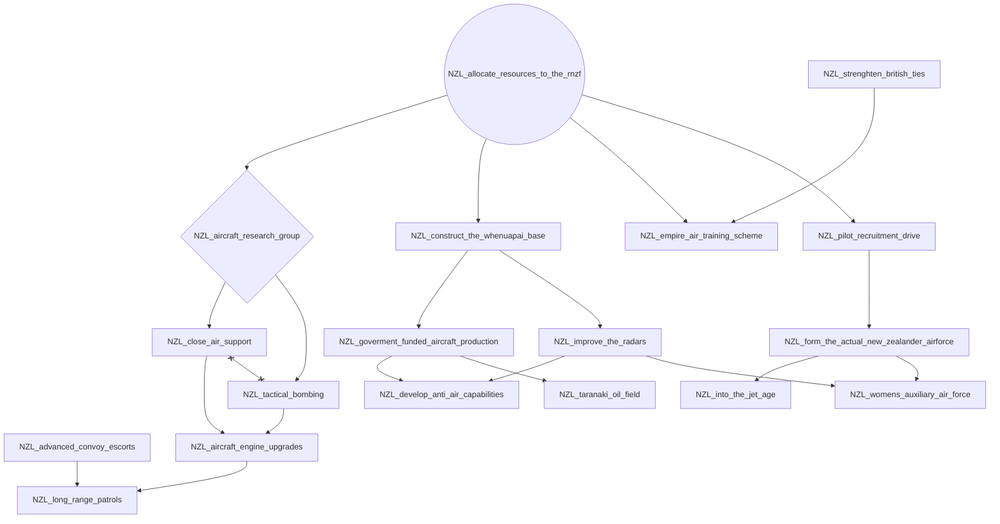

# NZL_army_review

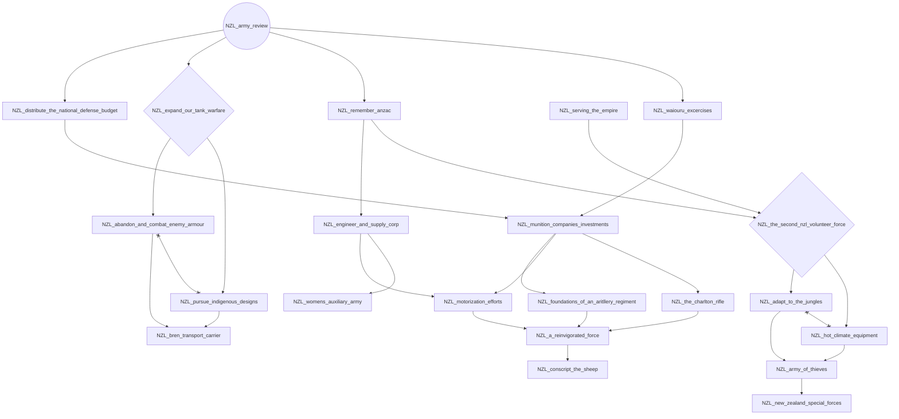

# NZL_expand_devonport

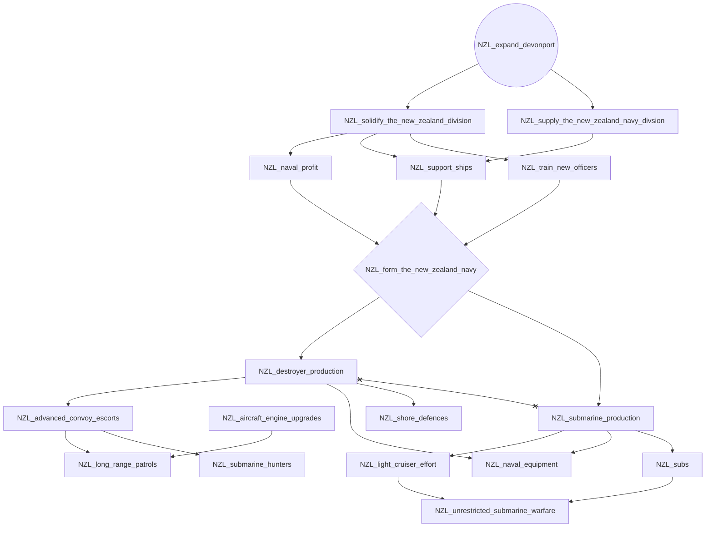

# NZL_industrialization_fund

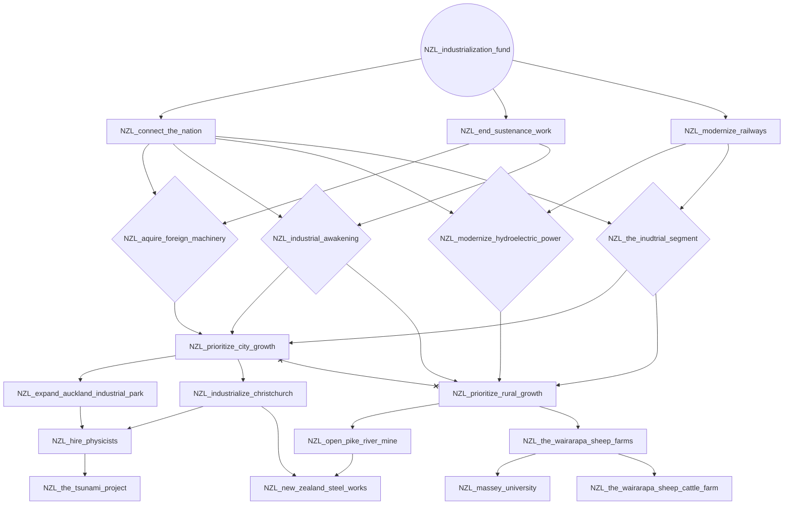

# NZL_national_party_triumphant

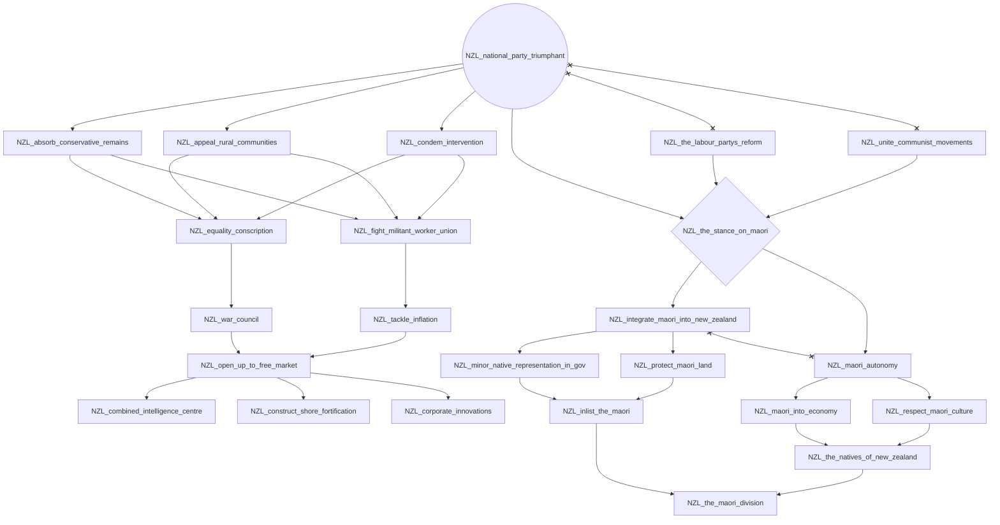

# NZL_open_ties_with_washington

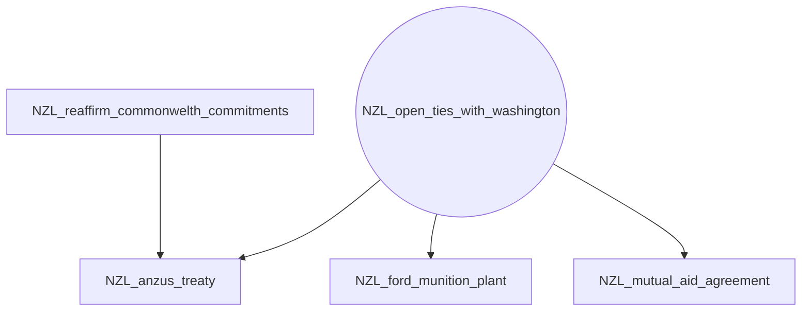

# NZL_reaffirm_commonwelth_commitments

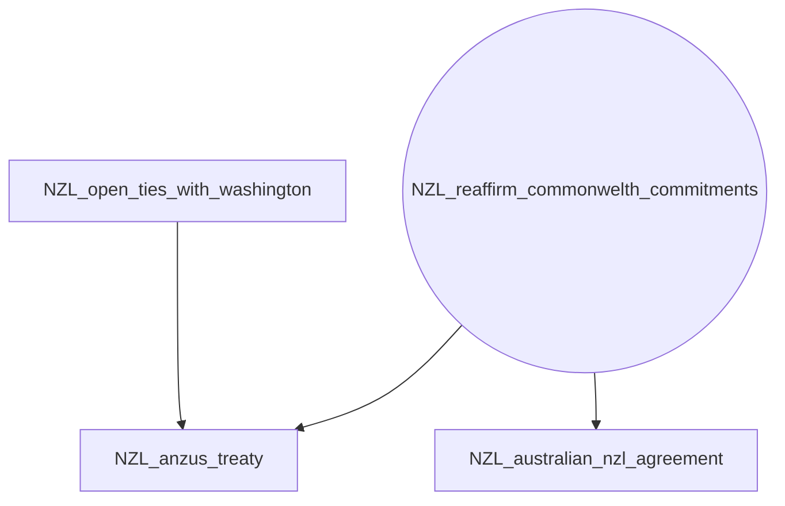

# NZL_strenghten_british_ties

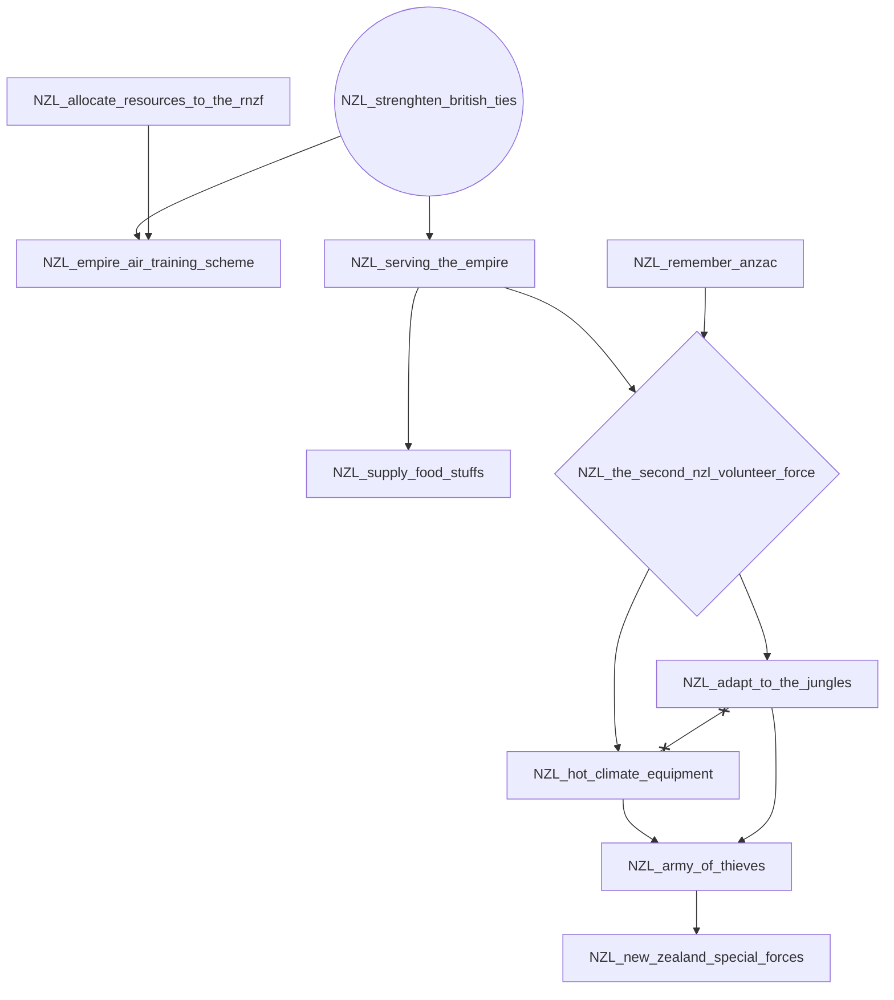

# NZL_the_goodwill_mission

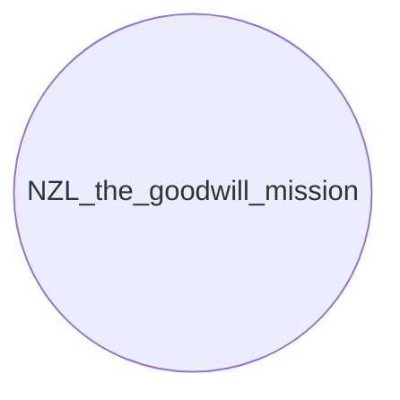

# NZL_the_labour_partys_reform

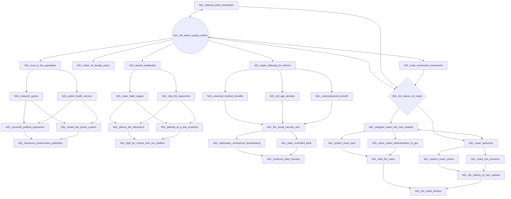

# NZL_unite_communist_movements

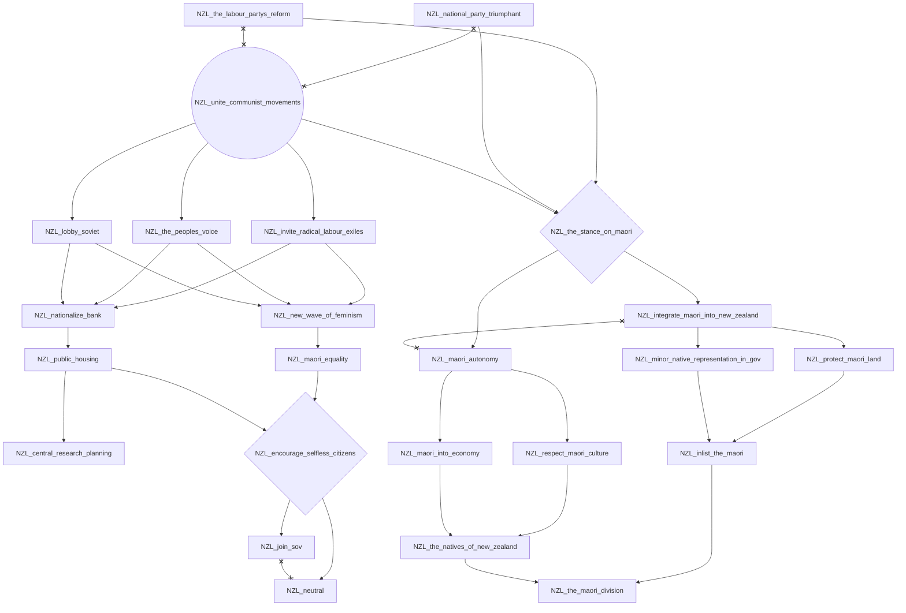
