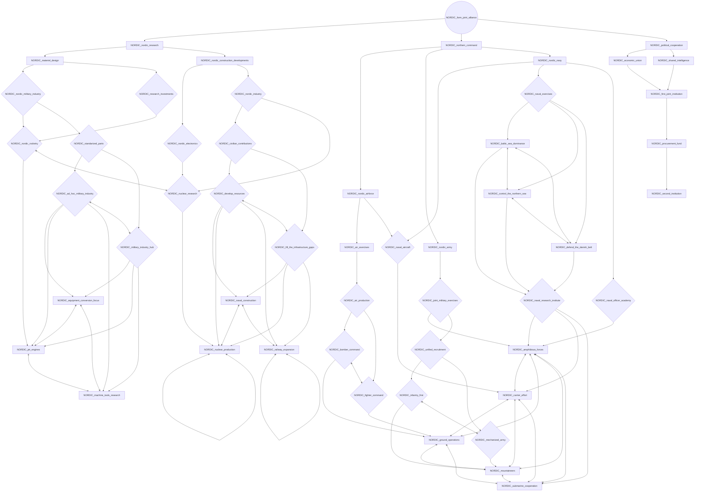

# NORDIC_form_joint_alliance

```mermaid
flowchart TD
    n1{"NORDIC_ad_hoc_military_industry"}
    n2["NORDIC_air_exercises"]
    n3{"NORDIC_air_production"}
    n4["NORDIC_amphibious_forces"]
    n5["NORDIC_baltic_sea_dominance"]
    n6{"NORDIC_bomber_command"}
    n7["NORDIC_carrier_effort"]
    n8{"NORDIC_civilian_contributions"}
    n9["NORDIC_control_the_northern_sea"]
    n10["NORDIC_defend_the_danish_belt"]
    n11{"NORDIC_develop_resources"}
    n12["NORDIC_economic_union"]
    n13["NORDIC_equipment_conversion_focus"]
    n14{"NORDIC_fighter_command"}
    n15{"NORDIC_fill_the_infrastructure_gaps"}
    n16["NORDIC_first_joint_institution"]
    n17(("NORDIC_form_joint_alliance"))
    n18["NORDIC_ground_operations"]
    n19{"NORDIC_infantry_first"}
    n20["NORDIC_jet_engines"]
    n21{"NORDIC_joint_military_exercises"}
    n22["NORDIC_machine_tools_research"]
    n23["NORDIC_materiel_design"]
    n24{"NORDIC_mechanized_army"}
    n25{"NORDIC_military_industry_hub"}
    n26["NORDIC_mountaineers"]
    n27{"NORDIC_naval_aircraft"}
    n28["NORDIC_naval_construction"]
    n29{"NORDIC_naval_exercises"}
    n30{"NORDIC_naval_officer_academy"}
    n31{"NORDIC_naval_research_institute"}
    n32["NORDIC_nordic_airforce"]
    n33["NORDIC_nordic_army"]
    n34["NORDIC_nordic_construction_developments"]
    n35{"NORDIC_nordic_electronics"}
    n36{"NORDIC_nordic_industry"}
    n37{"NORDIC_nordic_military_industry"}
    n38["NORDIC_nordic_navy"]
    n39["NORDIC_nordic_research"]
    n40{"NORDIC_nordic_rocketry"}
    n41["NORDIC_northern_command"]
    n42["NORDIC_nuclear_production"]
    n43{"NORDIC_nuclear_research"}
    n44["NORDIC_political_cooperation"]
    n45["NORDIC_procurement_fund"]
    n46["NORDIC_railway_expansion"]
    n47{"NORDIC_research_investments"}
    n48["NORDIC_second_institution"]
    n49["NORDIC_shared_intelligence"]
    n50{"NORDIC_standarized_parts"}
    n51["NORDIC_submarine_cooperation"]
    n52{"NORDIC_unified_recruitment"}
    n50 --> n1
    n32 --> n2
    n2 --> n3
    n30 --> n4
    n21 --> n4
    n31 --> n4
    n29 --> n5
    n3 --> n6
    n27 --> n7
    n31 --> n7
    n36 --> n8
    n29 --> n9
    n29 --> n10
    n8 --> n11
    n44 --> n12
    n25 --> n13
    n1 --> n13
    n3 --> n14
    n8 --> n15
    n49 --> n16
    n12 --> n16
    n14 --> n18
    n6 --> n18
    n52 --> n19
    n40 --> n20
    n25 --> n20
    n1 --> n20
    n33 --> n21
    n25 --> n22
    n1 --> n22
    n39 --> n23
    n52 --> n24
    n50 --> n25
    n24 --> n26
    n19 --> n26
    n32 --> n27
    n38 --> n27
    n15 --> n28
    n11 --> n28
    n38 --> n29
    n38 --> n30
    n10 --> n31
    n9 --> n31
    n5 --> n31
    n41 --> n32
    n41 --> n33
    n39 --> n34
    n34 --> n35
    n34 --> n36
    n23 --> n37
    n41 --> n38
    n17 --> n39
    n47 --> n40
    n37 --> n40
    n17 --> n41
    n15 --> n42
    n11 --> n42
    n43 --> n42
    n35 --> n43
    n36 --> n43
    n17 --> n44
    n16 --> n45
    n11 --> n46
    n15 --> n46
    n23 --> n47
    n45 --> n48
    n44 --> n49
    n37 --> n50
    n31 --> n51
    n21 --> n52
    n1 x--x n25
    n4 x--x n7
    n4 x--x n18
    n4 x--x n26
    n4 x--x n51
    n5 x--x n9
    n5 x--x n10
    n6 x--x n14
    n7 x--x n18
    n7 x--x n26
    n7 x--x n51
    n9 x--x n10
    n11 x--x n15
    n13 x--x n20
    n13 x--x n22
    n18 x--x n26
    n18 x--x n51
    n19 x--x n24
    n20 x--x n22
    n26 x--x n51
    n28 x--x n42
    n28 x--x n46
    n40 x--x n43
    n42 x--x n42
    n46 x--x n46
```
