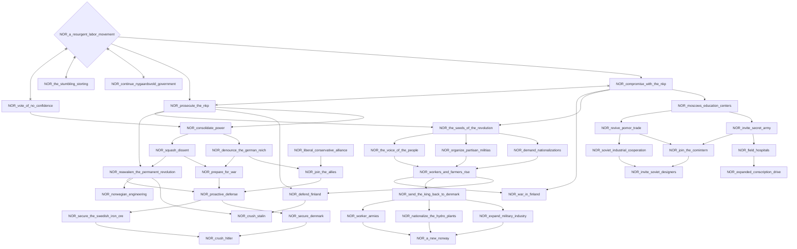
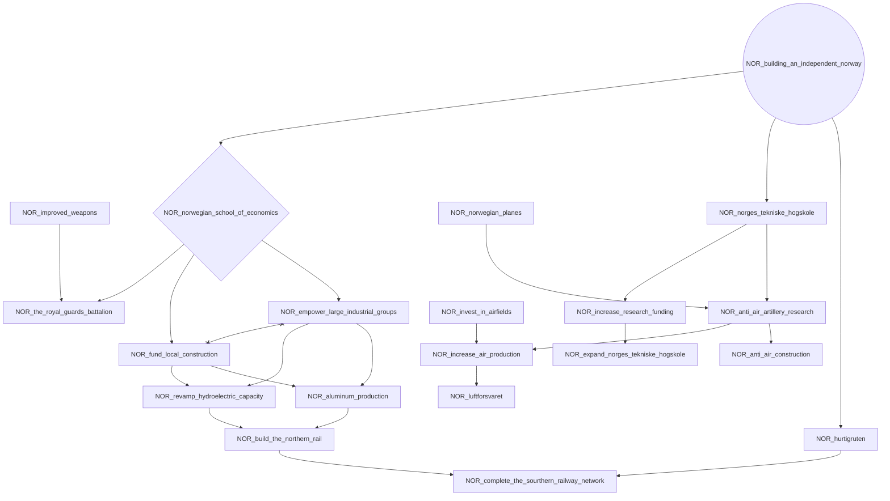
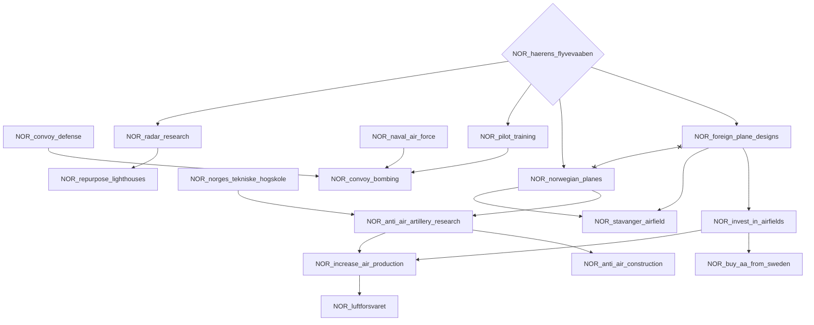
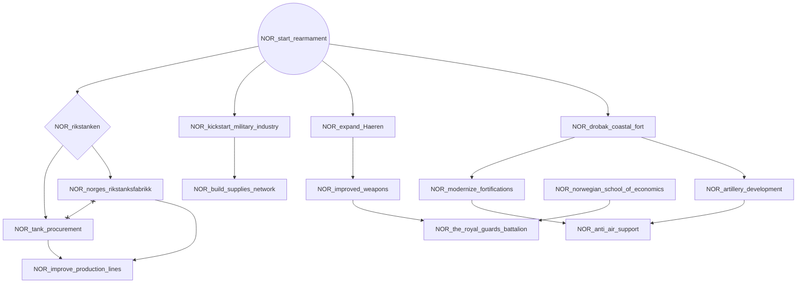
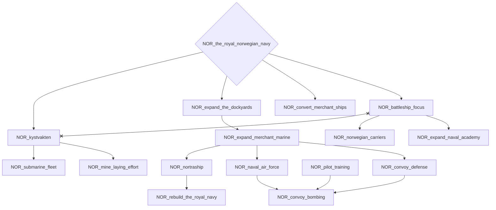
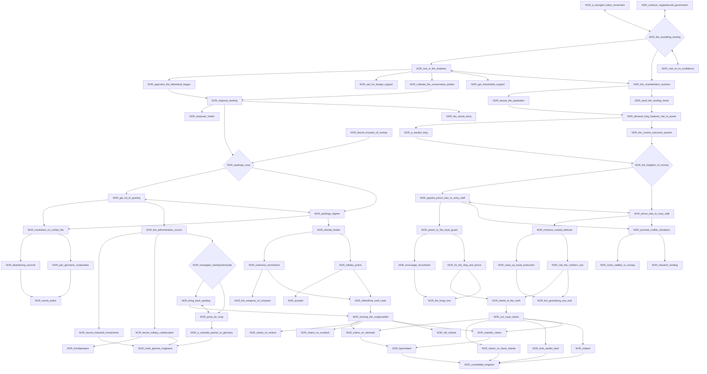
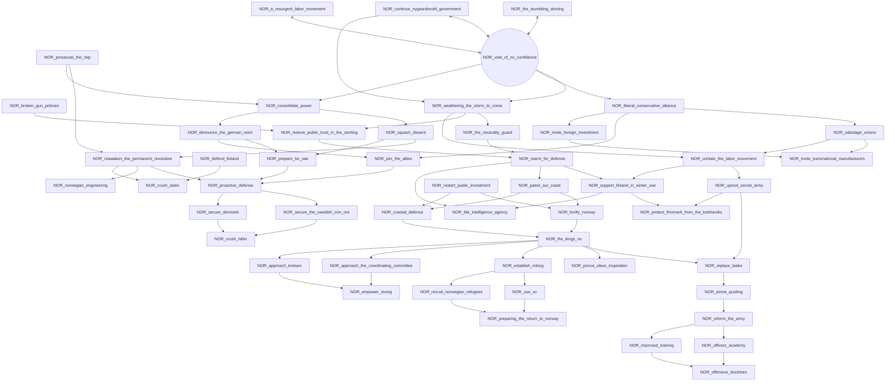

# NOR_a_resurgent_labor_movement

# NOR_building_an_independent_norway

# NOR_continue_nygaardsvold_government

```mermaid
flowchart TD
    n2["NOR_a_resurgent_labor_movement"]
    n60["NOR_a_valuable_partner_to_germany"]
    n61["NOR_abandoning_nynorsk"]
    n62["NOR_approach_kretsen"]
    n63["NOR_approach_the_coordinating_committee"]
    n64["NOR_arrest_quisling"]
    n65["NOR_bail_out_towns"]
    n66["NOR_bjarmeland"]
    n67["NOR_bring_back_quisling"]
    n68["NOR_broken_gun_policies"]
    n69["NOR_claims_on_denmark"]
    n70["NOR_claims_on_faroe_islands"]
    n71["NOR_claims_on_ireland"]
    n72["NOR_claims_on_scotland"]
    n73["NOR_coastal_defense"]
    n74["NOR_consolidate_kingdom"]
    n75["NOR_contain_the_labor_movement"]
    n5(("NOR_continue_nygaardsvold_government"))
    n76["NOR_crackdown_on_civilian_life"]
    n77["NOR_cut_military_budget"]
    n78["NOR_eirik_raudes_land"]
    n79["NOR_elevate_hirden"]
    n80["NOR_empower_sivorg"]
    n81["NOR_establish_milorg"]
    n82["NOR_extensive_recruitment"]
    n83["NOR_fascist_industrial_investments"]
    n84["NOR_fascist_invasion_of_norway"]
    n85["NOR_fascist_military_collaboration"]
    n86["NOR_fde_intelligence_agency"]
    n87["NOR_fortify_norway"]
    n88["NOR_frontkjempere"]
    n89["NOR_get_rid_of_quisling"]
    n90["NOR_iceland"]
    n91["NOR_improved_training"]
    n92["NOR_invite_german_engineers"]
    n93["NOR_jonas_lie_coup"]
    n94["NOR_leaving_the_hard_thirties_behind"]
    n95["NOR_lynrytter"]
    n96["NOR_military_police"]
    n97["NOR_nasjonal_samling"]
    n98{"NOR_norwegian_reichsprotectorate"}
    n99["NOR_offensive_doctrines"]
    n100["NOR_officers_academy"]
    n101["NOR_old_vinland"]
    n102["NOR_our_royal_claims"]
    n103["NOR_pan_germanic_cooperation"]
    n104["NOR_patrol_our_coast"]
    n105["NOR_preparing_the_return_to_norway"]
    n106["NOR_prince_olavs_inspiration"]
    n107["NOR_print_more_money"]
    n108["NOR_protect_finnmark_from_the_bolsheviks"]
    n109{"NOR_quislings_coup"}
    n110["NOR_quislings_regime"]
    n111["NOR_rearm_for_defense"]
    n112["NOR_recruit_norwegian_refugees"]
    n113["NOR_reform_the_army"]
    n114["NOR_replace_laake"]
    n115["NOR_restart_public_investment"]
    n116["NOR_restore_public_trust_in_the_storting"]
    n117["NOR_reviving_the_norgesveldet"]
    n118["NOR_sabotage_unions"]
    n119["NOR_secret_police"]
    n120["NOR_social_incrementalism"]
    n121["NOR_support_finland_in_winter_war"]
    n122["NOR_swedish_claims"]
    n123["NOR_the_administrative_council"]
    n124["NOR_the_kings_no"]
    n125["NOR_the_neutrality_guard"]
    n34["NOR_the_stumbling_storting"]
    n126["NOR_the_weapons_of_conquest"]
    n127["NOR_ulfhedhnar_wolf_coats"]
    n128["NOR_uproot_secret_army"]
    n129["NOR_use_xu"]
    n36["NOR_vote_of_no_confidence"]
    n130["NOR_weathering_the_storm_to_come"]
    n93 --> n60
    n76 --> n61
    n124 --> n62
    n124 --> n63
    n114 --> n64
    n94 --> n65
    n69 --> n66
    n122 --> n66
    n98 --> n67
    n5 --> n68
    n117 --> n69
    n102 --> n69
    n117 --> n71
    n117 --> n72
    n115 --> n73
    n104 --> n73
    n66 --> n74
    n70 --> n74
    n78 --> n74
    n90 --> n74
    n130 --> n75
    n118 --> n75
    n89 --> n76
    n110 --> n76
    n94 --> n77
    n68 --> n77
    n110 --> n79
    n63 --> n80
    n62 --> n80
    n124 --> n81
    n79 --> n82
    n123 --> n83
    n5 --> n84
    n123 --> n85
    n121 --> n86
    n111 --> n86
    n115 --> n87
    n104 --> n87
    n85 --> n88
    n109 --> n89
    n113 --> n91
    n60 --> n92
    n85 --> n92
    n83 --> n92
    n98 --> n93
    n5 --> n94
    n96 --> n95
    n79 --> n96
    n123 --> n98
    n91 --> n99
    n100 --> n99
    n113 --> n100
    n117 --> n101
    n76 --> n103
    n111 --> n104
    n129 --> n105
    n112 --> n105
    n124 --> n106
    n94 --> n107
    n128 --> n108
    n121 --> n108
    n97 --> n109
    n84 --> n109
    n109 --> n110
    n116 --> n111
    n125 --> n111
    n81 --> n112
    n64 --> n113
    n124 --> n114
    n128 --> n114
    n120 --> n115
    n107 --> n115
    n68 --> n116
    n130 --> n116
    n127 --> n117
    n67 --> n117
    n61 --> n119
    n103 --> n119
    n77 --> n120
    n75 --> n121
    n111 --> n121
    n102 --> n122
    n117 --> n122
    n89 --> n123
    n73 --> n124
    n87 --> n124
    n130 --> n125
    n82 --> n126
    n82 --> n127
    n96 --> n127
    n75 --> n128
    n81 --> n129
    n5 --> n130
    n36 --> n130
    n2 x--x n5
    n67 x--x n93
    n5 x--x n34
    n5 x--x n36
    n89 x--x n110
```

# NOR_haerens_flyvevaaben

# NOR_start_rearmament

# NOR_the_royal_norwegian_navy

# NOR_the_stumbling_storting

# NOR_vote_of_no_confidence

