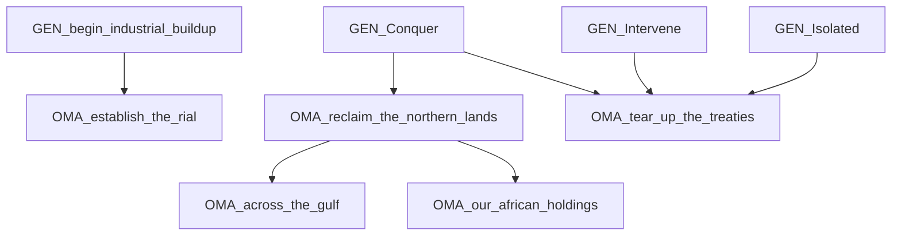

# orphans

```mermaid
flowchart TD
    n1["GEN_Conquer"]
    n2["GEN_Intervene"]
    n3["GEN_Isolated"]
    n4["GEN_begin_industrial_buildup"]
    n5["OMA_across_the_gulf"]
    n6["OMA_establish_the_rial"]
    n7["OMA_our_african_holdings"]
    n8["OMA_reclaim_the_northern_lands"]
    n9["OMA_tear_up_the_treaties"]
    n8 --> n5
    n4 --> n6
    n8 --> n7
    n1 --> n8
    n1 --> n9
    n2 --> n9
    n3 --> n9
```
