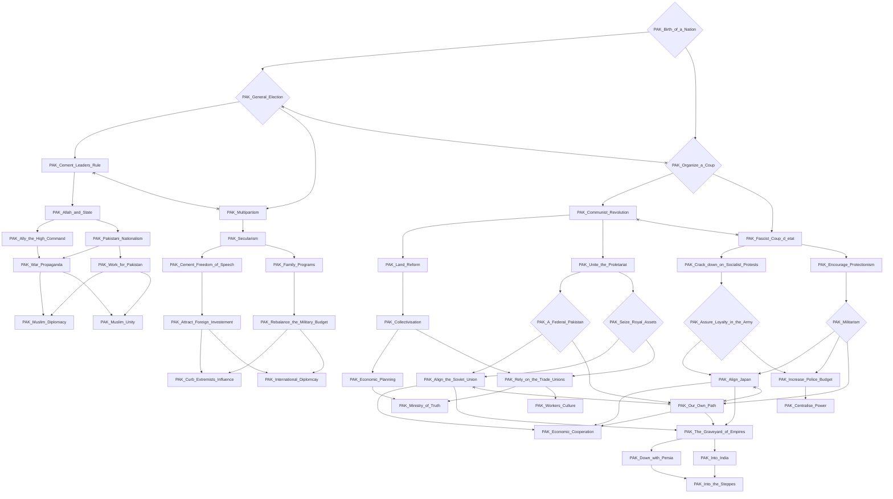
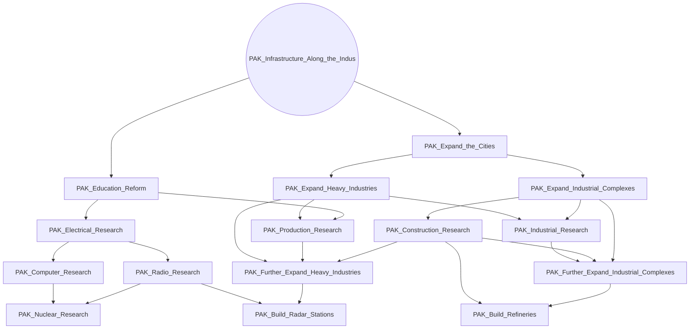
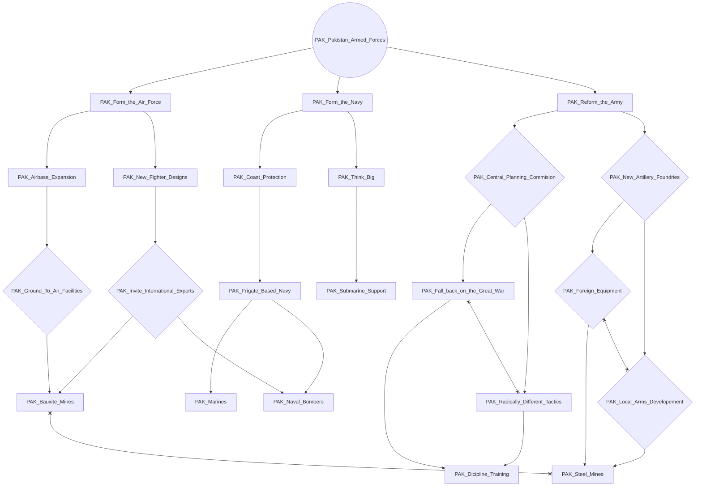

# PAK_Birth_of_a_Nation

```mermaid
flowchart TD
    n1{"PAK_A_Federal_Pakistan"}
    n2["PAK_Align_Japan"]
    n3["PAK_Align_the_Soviet_Union"]
    n4["PAK_Allah_and_State"]
    n5["PAK_Ally_the_High_Command"]
    n6{"PAK_Assure_Loyalty_in_the_Army"}
    n7["PAK_Attract_Foreign_Investement"]
    n8{"PAK_Birth_of_a_Nation"}
    n9["PAK_Cement_Freedom_of_Speech"]
    n10["PAK_Cement_Leaders_Rule"]
    n11["PAK_Centralise_Power"]
    n12["PAK_Collectivisation"]
    n13["PAK_Communist_Revolution"]
    n14["PAK_Crack_down_on_Socialist_Protests"]
    n15["PAK_Curb_Extremists_Influence"]
    n16["PAK_Down_with_Persia"]
    n17["PAK_Economic_Cooperation"]
    n18["PAK_Economic_Planning"]
    n19["PAK_Encourage_Protectionism"]
    n20["PAK_Family_Programs"]
    n21["PAK_Fascist_Coup_d_etat"]
    n22{"PAK_General_Election"}
    n23["PAK_Increase_Police_Budget"]
    n24["PAK_International_Diplomcay"]
    n25["PAK_Into_India"]
    n26["PAK_Into_the_Steppes"]
    n27["PAK_Land_Reform"]
    n28{"PAK_Militarism"}
    n29["PAK_Ministry_of_Truth"]
    n30["PAK_Multipartism"]
    n31["PAK_Muslim_Diplomacy"]
    n32["PAK_Muslim_Unity"]
    n33{"PAK_Organize_a_Coup"}
    n34["PAK_Our_Own_Path"]
    n35["PAK_Pakistani_Nationalism"]
    n36["PAK_Rebalance_the_Military_Budget"]
    n37["PAK_Rely_on_the_Trade_Unions"]
    n38["PAK_Secularism"]
    n39{"PAK_Seize_Royal_Assets"}
    n40["PAK_The_Graveyard_of_Empires"]
    n41["PAK_Unite_the_Proletariat"]
    n42["PAK_War_Propaganda"]
    n43["PAK_Work_for_Pakistan"]
    n44["PAK_Workers_Culture"]
    n41 --> n1
    n28 --> n2
    n6 --> n2
    n1 --> n3
    n39 --> n3
    n10 --> n4
    n4 --> n5
    n14 --> n6
    n9 --> n7
    n38 --> n9
    n22 --> n10
    n23 --> n11
    n27 --> n12
    n33 --> n13
    n21 --> n14
    n7 --> n15
    n36 --> n15
    n40 --> n16
    n3 --> n17
    n2 --> n17
    n34 --> n17
    n12 --> n18
    n21 --> n19
    n38 --> n20
    n33 --> n21
    n8 --> n22
    n6 --> n23
    n28 --> n23
    n7 --> n24
    n36 --> n24
    n40 --> n25
    n25 --> n26
    n16 --> n26
    n13 --> n27
    n19 --> n28
    n18 --> n29
    n37 --> n29
    n22 --> n30
    n43 --> n31
    n42 --> n31
    n43 --> n32
    n42 --> n32
    n8 --> n33
    n28 --> n34
    n1 --> n34
    n4 --> n35
    n20 --> n36
    n39 --> n37
    n12 --> n37
    n30 --> n38
    n41 --> n39
    n3 --> n40
    n2 --> n40
    n34 --> n40
    n13 --> n41
    n5 --> n42
    n35 --> n42
    n35 --> n43
    n37 --> n44
    n2 x--x n34
    n3 x--x n34
    n10 x--x n30
    n13 x--x n21
    n22 x--x n33
```

# PAK_Infrastructure_Along_the_Indus

```mermaid
flowchart TD
    n45["PAK_Build_Radar_Stations"]
    n46["PAK_Build_Refineries"]
    n47["PAK_Computer_Research"]
    n48["PAK_Construction_Research"]
    n49["PAK_Education_Reform"]
    n50["PAK_Electrical_Research"]
    n51["PAK_Expand_Heavy_Industries"]
    n52["PAK_Expand_Industrial_Complexes"]
    n53["PAK_Expand_the_Cities"]
    n54["PAK_Further_Expand_Heavy_Industries"]
    n55["PAK_Further_Expand_Industrial_Complexes"]
    n56["PAK_Industrial_Research"]
    n57(("PAK_Infrastructure_Along_the_Indus"))
    n58["PAK_Nuclear_Research"]
    n59["PAK_Production_Research"]
    n60["PAK_Radio_Research"]
    n60 --> n45
    n54 --> n45
    n48 --> n46
    n55 --> n46
    n50 --> n47
    n52 --> n48
    n57 --> n49
    n49 --> n50
    n53 --> n51
    n53 --> n52
    n57 --> n53
    n51 --> n54
    n59 --> n54
    n48 --> n54
    n56 --> n55
    n48 --> n55
    n52 --> n55
    n51 --> n56
    n52 --> n56
    n47 --> n58
    n60 --> n58
    n51 --> n59
    n49 --> n59
    n50 --> n60
```

# PAK_Pakistan_Armed_Forces

```mermaid
flowchart TD
    n61["PAK_Airbase_Expansion"]
    n62["PAK_Bauxite_Mines"]
    n63{"PAK_Central_Planning_Commision"}
    n64["PAK_Coast_Protection"]
    n65["PAK_Dicipline_Training"]
    n66["PAK_Fall_back_on_the_Great_War"]
    n67{"PAK_Foreign_Equipment"}
    n68["PAK_Form_the_Air_Force"]
    n69["PAK_Form_the_Navy"]
    n70["PAK_Frigate_Based_Navy"]
    n71{"PAK_Ground_To_Air_Facilities"}
    n72{"PAK_Invite_International_Experts"}
    n73{"PAK_Local_Arms_Developement"}
    n74["PAK_Marines"]
    n75["PAK_Naval_Bombers"]
    n76{"PAK_New_Artillery_Foundries"}
    n77["PAK_New_Fighter_Designs"]
    n78(("PAK_Pakistan_Armed_Forces"))
    n79["PAK_Radically_Different_Tactics"]
    n80["PAK_Reform_the_Army"]
    n81["PAK_Steel_Mines"]
    n82["PAK_Submarine_Support"]
    n83["PAK_Think_Big"]
    n68 --> n61
    n71 --> n62
    n72 --> n62
    n80 --> n63
    n69 --> n64
    n79 --> n65
    n66 --> n65
    n63 --> n66
    n76 --> n67
    n78 --> n68
    n78 --> n69
    n64 --> n70
    n61 --> n71
    n77 --> n72
    n76 --> n73
    n70 --> n74
    n72 --> n75
    n70 --> n75
    n80 --> n76
    n68 --> n77
    n63 --> n79
    n78 --> n80
    n73 --> n81
    n67 --> n81
    n83 --> n82
    n69 --> n83
    n62 x--x n81
    n66 x--x n79
    n67 x--x n73
```
