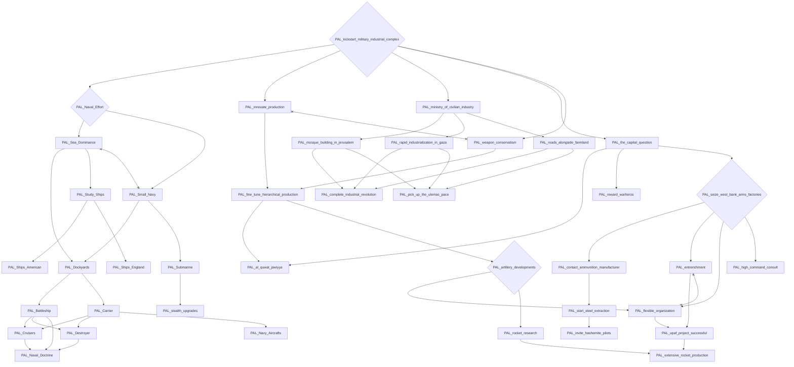
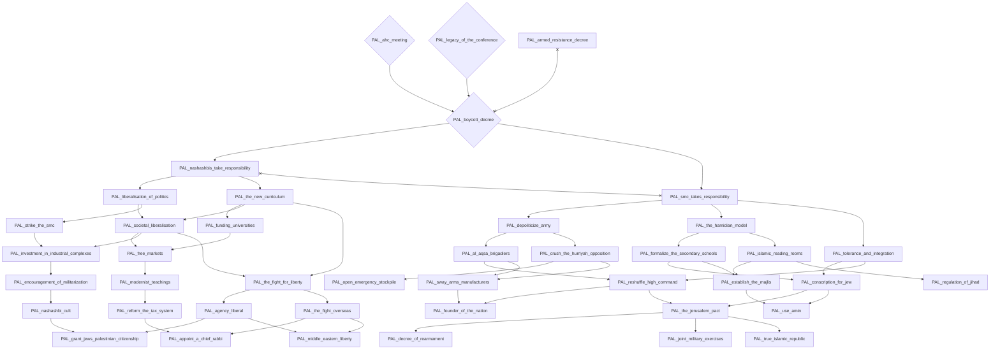

# PAL_kickstart_military_industrial_complex

```mermaid
flowchart TD
    n1["PAL_Battleship"]
    n2["PAL_Carrier"]
    n3["PAL_Cruisers"]
    n4["PAL_Destroyer"]
    n5["PAL_Dockyards"]
    n6["PAL_Naval_Doctrine"]
    n7{"PAL_Naval_Effort"}
    n8["PAL_Navy_Aircrafts"]
    n9["PAL_Sea_Dominance"]
    n10["PAL_Ships_American"]
    n11["PAL_Ships_England"]
    n12["PAL_Small_Navy"]
    n13["PAL_Study_Ships"]
    n14["PAL_Submarine"]
    n15["PAL_al_quwat_jawiyya"]
    n16{"PAL_artillery_developments"}
    n17["PAL_complete_industrial_revolution"]
    n18["PAL_contact_ammunition_manufacturer"]
    n19["PAL_entrenchment"]
    n20["PAL_extensive_rocket_production"]
    n21["PAL_fine_tune_hierarchical_production"]
    n22["PAL_flexible_organization"]
    n23["PAL_high_command_consult"]
    n24["PAL_innovate_production"]
    n25["PAL_invite_hashemite_pilots"]
    n26{"PAL_kickstart_military_industrial_complex"}
    n27["PAL_ministry_of_civilian_industry"]
    n28["PAL_mosque_building_in_jerusalem"]
    n29["PAL_pick_up_the_ulemas_pace"]
    n30["PAL_rapid_industrialization_in_gaza"]
    n31["PAL_reward_warheros"]
    n32["PAL_roads_alongside_farmland"]
    n33["PAL_rocket_research"]
    n34{"PAL_seize_west_bank_arms_factories"}
    n35["PAL_start_steel_extraction"]
    n36["PAL_stealth_upgrades"]
    n37["PAL_the_capital_question"]
    n38["PAL_upaf_project_successful"]
    n39["PAL_weapon_conservatism"]
    n5 --> n1
    n5 --> n2
    n1 --> n3
    n2 --> n3
    n1 --> n4
    n2 --> n4
    n12 --> n5
    n9 --> n5
    n3 --> n6
    n4 --> n6
    n1 --> n6
    n26 --> n7
    n2 --> n8
    n7 --> n9
    n13 --> n10
    n13 --> n11
    n7 --> n12
    n9 --> n13
    n12 --> n14
    n21 --> n15
    n37 --> n15
    n21 --> n16
    n30 --> n17
    n32 --> n17
    n28 --> n17
    n34 --> n18
    n34 --> n19
    n33 --> n20
    n38 --> n20
    n24 --> n21
    n39 --> n21
    n16 --> n22
    n34 --> n22
    n34 --> n23
    n26 --> n24
    n35 --> n25
    n26 --> n27
    n27 --> n28
    n30 --> n29
    n32 --> n29
    n28 --> n29
    n27 --> n30
    n37 --> n31
    n27 --> n32
    n16 --> n33
    n37 --> n34
    n18 --> n35
    n14 --> n36
    n26 --> n37
    n22 --> n38
    n19 --> n38
    n26 --> n39
    n9 x--x n12
    n19 x--x n22
    n24 x--x n39
```

# PAL_legacy_of_the_conference

```mermaid
flowchart TD
    n40["PAL_agency_liberal"]
    n41{"PAL_ahc_meeting"}
    n42["PAL_al_aqsa_brigadiers"]
    n43["PAL_appoint_a_chief_rabbi"]
    n44["PAL_armed_resistance_decree"]
    n45{"PAL_boycott_decree"}
    n46["PAL_conscription_for_jew"]
    n47["PAL_crush_the_hurriyah_opposition"]
    n48["PAL_decree_of_rearmament"]
    n49["PAL_depoliticize_army"]
    n50["PAL_encouragement_of_militarization"]
    n51["PAL_establish_the_majlis"]
    n52["PAL_formalize_the_secondary_schools"]
    n53["PAL_founder_of_the_nation"]
    n54["PAL_free_markets"]
    n55["PAL_funding_universities"]
    n56["PAL_grant_jews_palestinian_citizenship"]
    n57["PAL_investment_in_industrial_complexes"]
    n58["PAL_islamic_reading_rooms"]
    n59["PAL_joint_military_exercises"]
    n60{"PAL_legacy_of_the_conference"}
    n61["PAL_liberalisation_of_politics"]
    n62["PAL_middle_eastern_liberty"]
    n63["PAL_modernist_teachings"]
    n64["PAL_nashashbi_cult"]
    n65["PAL_nashashbis_take_responsibility"]
    n66["PAL_open_emergency_stockpile"]
    n67["PAL_reform_the_tax_system"]
    n68["PAL_regulation_of_jihad"]
    n69["PAL_reshuffle_high_command"]
    n70["PAL_smc_takes_responsibility"]
    n71["PAL_societal_liberalisation"]
    n72["PAL_strike_the_smc"]
    n73["PAL_sway_arms_manufacturers"]
    n74["PAL_the_fight_for_liberty"]
    n75["PAL_the_fight_overseas"]
    n76["PAL_the_hamidian_model"]
    n77["PAL_the_jerusalem_pact"]
    n78["PAL_the_new_curriculum"]
    n79["PAL_tolerance_and_integration"]
    n80["PAL_true_islamic_republic"]
    n81["PAL_use_amin"]
    n74 --> n40
    n49 --> n42
    n67 --> n43
    n75 --> n43
    n41 --> n45
    n60 --> n45
    n79 --> n46
    n52 --> n46
    n49 --> n47
    n77 --> n48
    n70 --> n49
    n57 --> n50
    n58 --> n51
    n52 --> n51
    n76 --> n52
    n73 --> n53
    n69 --> n53
    n55 --> n54
    n71 --> n54
    n78 --> n55
    n40 --> n56
    n64 --> n56
    n72 --> n57
    n71 --> n57
    n76 --> n58
    n77 --> n59
    n65 --> n61
    n75 --> n62
    n40 --> n62
    n54 --> n63
    n50 --> n64
    n45 --> n65
    n47 --> n66
    n63 --> n67
    n58 --> n68
    n79 --> n69
    n42 --> n69
    n45 --> n70
    n78 --> n71
    n61 --> n71
    n61 --> n72
    n47 --> n73
    n42 --> n73
    n78 --> n74
    n71 --> n74
    n74 --> n75
    n70 --> n76
    n69 --> n77
    n46 --> n77
    n65 --> n78
    n70 --> n79
    n77 --> n80
    n46 --> n81
    n51 --> n81
    n44 x--x n45
    n65 x--x n70
```

# PAL_unified_high_command

```mermaid
flowchart TD
    n82["PAL_abdulqadir"]
    n83["PAL_across_the_bank"]
    n40["PAL_agency_liberal"]
    n41{"PAL_ahc_meeting"}
    n42["PAL_al_aqsa_brigadiers"]
    n84["PAL_al_futuwa"]
    n85["PAL_al_ittihad"]
    n86["PAL_alliance_with_salama"]
    n87["PAL_antijew_army"]
    n88["PAL_appease_military_complex"]
    n43["PAL_appoint_a_chief_rabbi"]
    n89["PAL_arab_immigration"]
    n90["PAL_arab_peninsula"]
    n91["PAL_arab_weapons"]
    n92["PAL_arabistan"]
    n93["PAL_arm_the_civilians"]
    n44["PAL_armed_resistance_decree"]
    n94["PAL_arrest_nashashbi_figures"]
    n95["PAL_avenge_sykes_picot"]
    n45{"PAL_boycott_decree"}
    n96["PAL_bring_back_into_fold"]
    n97["PAL_call_foreign_revolutionaries"]
    n98["PAL_cement_fawzis_legacy"]
    n99["PAL_centralization_of_power"]
    n100["PAL_centralize_command_structure"]
    n101["PAL_centralize_power"]
    n102["PAL_concessions_to_civilians"]
    n103["PAL_confiscate_civilian_arms"]
    n104["PAL_congress_of_educated_muslims"]
    n46["PAL_conscription_for_jew"]
    n105["PAL_cooperate_with_muslim_brotherhood"]
    n106["PAL_cooperate_with_the_ccnjp"]
    n107["PAL_cooperation_with_the_nasserists"]
    n108["PAL_crackdown_on_military_nitham"]
    n109["PAL_create_jewish_brigade"]
    n110["PAL_create_quwat_al_bahriyah"]
    n47["PAL_crush_the_hurriyah_opposition"]
    n111["PAL_cult_speed"]
    n112["PAL_culture_of_militarism"]
    n113["PAL_dealing_with_husseinis"]
    n48["PAL_decree_of_rearmament"]
    n114["PAL_defend_the_fortress"]
    n115["PAL_demand_iranian_islam"]
    n49["PAL_depoliticize_army"]
    n116["PAL_desert"]
    n117["PAL_destroying_the_zionist_movement"]
    n118["PAL_disarm_civilians"]
    n119["PAL_dismantle_khedive"]
    n120["PAL_dismantle_secular_nationalism"]
    n121["PAL_doctrine_of_initiative"]
    n122["PAL_down_the_sands_of_arabia"]
    n123{"PAL_dream_arabia"}
    n124["PAL_emphasize_speed"]
    n125{"PAL_empower_military"}
    n50["PAL_encouragement_of_militarization"]
    n126["PAL_end_jewish_question"]
    n127["PAL_end_the_murtadeen_reign"]
    n128["PAL_establish_majlis"]
    n51["PAL_establish_the_majlis"]
    n129["PAL_expand_the_use_of_reconnaissance"]
    n130["PAL_expanding_the_borders"]
    n131["PAL_extreme_confidentiality"]
    n132["PAL_fascist_coup"]
    n133["PAL_fawzi"]
    n134["PAL_fawzi_assumes_power"]
    n135["PAL_force_smc"]
    n136["PAL_forcefully_remove_settler"]
    n137{"PAL_formalize_al_khilafa"}
    n138["PAL_formalize_hwa"]
    n52["PAL_formalize_the_secondary_schools"]
    n139["PAL_fortify_jerusalem"]
    n53["PAL_founder_of_the_nation"]
    n140["PAL_free_arab_legion"]
    n54["PAL_free_markets"]
    n141["PAL_from_the_nile"]
    n142["PAL_frontsmen_death"]
    n143["PAL_fund_education_ministries"]
    n55["PAL_funding_universities"]
    n144["PAL_gaza"]
    n145["PAL_golani_assumes_power"]
    n146["PAL_golani_runs_power"]
    n147["PAL_grand_jihad"]
    n56["PAL_grant_jews_palestinian_citizenship"]
    n148["PAL_greater_palestine"]
    n149["PAL_hashemite"]
    n150["PAL_help_akh_banna"]
    n151["PAL_into_the_atlantic"]
    n57["PAL_investment_in_industrial_complexes"]
    n152["PAL_investments_into_state"]
    n153["PAL_invite_iraq"]
    n154["PAL_invite_the_saudis"]
    n155["PAL_islamic_palestine"]
    n58["PAL_islamic_reading_rooms"]
    n156["PAL_islamic_school_project"]
    n157["PAL_islamists"]
    n158["PAL_jamia_al_jaysh_al_shuyuiyya"]
    n159["PAL_jamia_islamiyya_replacement"]
    n160{"PAL_jewish_question"}
    n161{"PAL_jihad"}
    n162["PAL_jizya"]
    n163["PAL_join_axis"]
    n59["PAL_joint_military_exercises"]
    n164["PAL_legacy_of_quasi_state"]
    n60{"PAL_legacy_of_the_conference"}
    n61["PAL_liberalisation_of_politics"]
    n165["PAL_lightning_war"]
    n166{"PAL_majlis_elections"}
    n167["PAL_march_forwards"]
    n168["PAL_march_on_al_quds"]
    n169["PAL_mass_production_of_guns"]
    n62["PAL_middle_eastern_liberty"]
    n170{"PAL_militarism"}
    n171["PAL_militarize_zaseen"]
    n63["PAL_modernist_teachings"]
    n172["PAL_mountaineers"]
    n64["PAL_nashashbi_cult"]
    n65["PAL_nashashbis_take_responsibility"]
    n173["PAL_nasr_ahmar"]
    n174["PAL_nationalize_arms"]
    n175["PAL_naval_preperations"]
    n66["PAL_open_emergency_stockpile"]
    n176["PAL_operation_ammon"]
    n177["PAL_operation_crossing"]
    n178["PAL_operation_hejaz_begins"]
    n179["PAL_operation_hejazi"]
    n180["PAL_operation_intisar"]
    n181["PAL_operation_tyre"]
    n182["PAL_organize_raids_jordan"]
    n183["PAL_organize_raids_lebanon"]
    n184["PAL_pacts_for_damascus"]
    n185["PAL_panislamism"]
    n186["PAL_peoples_movement"]
    n187["PAL_prepare_for_everything"]
    n188["PAL_prepare_the_crossing"]
    n189["PAL_pride_of_family"]
    n190["PAL_public_fatwas"]
    n191["PAL_purchase_egyptian_tanks"]
    n192["PAL_pursue_irredentism"]
    n193["PAL_push_for_a_united_arab_dinar"]
    n194["PAL_push_revanchist_agenda"]
    n195["PAL_qadir"]
    n196["PAL_qadirs_third_decree"]
    n197["PAL_raid_zionist_militias"]
    n198["PAL_raise_army_barracks"]
    n199["PAL_raise_red_banner"]
    n200["PAL_reaching_out"]
    n201["PAL_reclaim_mecca"]
    n67["PAL_reform_the_tax_system"]
    n202["PAL_refurbish_al_aqsa"]
    n203["PAL_regulate_border_raids"]
    n204["PAL_regulate_militia_raids"]
    n68["PAL_regulation_of_jihad"]
    n205["PAL_repay_ottoman_suffering"]
    n206["PAL_request_axis_membership"]
    n69["PAL_reshuffle_high_command"]
    n207["PAL_restore_sicilyan_emirate"]
    n208["PAL_restoring_al_andalus"]
    n209["PAL_restructure_southern_army"]
    n210["PAL_revenge_on_nejd"]
    n211["PAL_reverse_engineer"]
    n212["PAL_revolution_realized"]
    n213["PAL_road_to_suez"]
    n214["PAL_salvage_national_fund"]
    n215["PAL_scorched_earth"]
    n216["PAL_second_general_meeting"]
    n217["PAL_second_hebron_march"]
    n218["PAL_secure_lebanon"]
    n219["PAL_seize_british_assets"]
    n220["PAL_seize_estates"]
    n221["PAL_seize_production_means"]
    n222["PAL_sharia"]
    n223["PAL_smc_crackdowns"]
    n70["PAL_smc_takes_responsibility"]
    n71["PAL_societal_liberalisation"]
    n224["PAL_solidify_hakim"]
    n225["PAL_spread_revolution"]
    n226["PAL_strengthen_the_military_complex"]
    n227["PAL_strict_military_nitham"]
    n228["PAL_strike_jerusalem"]
    n229["PAL_strike_telaviv"]
    n230["PAL_strike_the_hashemites"]
    n72["PAL_strike_the_smc"]
    n231["PAL_study_german_paratroopers"]
    n232["PAL_summer_preperations"]
    n73["PAL_sway_arms_manufacturers"]
    n233["PAL_the_antiprotest_act"]
    n234["PAL_the_defence_of_state"]
    n235["PAL_the_fifty_men_decree"]
    n74["PAL_the_fight_for_liberty"]
    n75["PAL_the_fight_overseas"]
    n76["PAL_the_hamidian_model"]
    n77["PAL_the_jerusalem_pact"]
    n236["PAL_the_legacy_of_mughals"]
    n78["PAL_the_new_curriculum"]
    n237["PAL_the_political_question"]
    n238["PAL_the_russian_devil"]
    n239["PAL_the_second_arab_revolt"]
    n240["PAL_the_token_of_arabistan"]
    n241["PAL_theyre_bourgeoisie"]
    n242["PAL_theyre_brothers"]
    n243["PAL_throughout_the_tigris"]
    n244["PAL_tight_organization"]
    n245["PAL_to_the_resources_of_halab"]
    n79["PAL_tolerance_and_integration"]
    n80["PAL_true_islamic_republic"]
    n246(("PAL_unified_high_command"))
    n81["PAL_use_amin"]
    n247{"PAL_victory_through_faith"}
    n248{"PAL_victory_through_pride"}
    n249["PAL_weapons_for_jihad"]
    n250["PAL_west_bank"]
    n251["PAL_with_the_desert"]
    n252["PAL_workers_councils"]
    n253["PAL_write_rifle"]
    n254["PAL_yaeesh_al_shalaf"]
    n255["PAL_youth_leagues"]
    n161 --> n82
    n225 --> n83
    n74 --> n40
    n186 --> n41
    n49 --> n42
    n222 --> n84
    n138 --> n84
    n158 --> n85
    n101 --> n85
    n129 --> n86
    n194 --> n86
    n241 --> n87
    n235 --> n88
    n67 --> n43
    n75 --> n43
    n94 --> n89
    n156 --> n89
    n110 --> n90
    n154 --> n90
    n228 --> n91
    n250 --> n91
    n163 --> n92
    n107 --> n92
    n98 --> n93
    n41 --> n44
    n249 --> n94
    n149 --> n95
    n41 --> n45
    n60 --> n45
    n200 --> n96
    n202 --> n96
    n199 --> n97
    n233 --> n98
    n99 --> n98
    n134 --> n99
    n120 --> n100
    n173 --> n101
    n216 --> n102
    n143 --> n102
    n152 --> n102
    n145 --> n103
    n195 --> n104
    n79 --> n46
    n52 --> n46
    n157 --> n105
    n146 --> n106
    n123 --> n107
    n136 --> n108
    n242 --> n109
    n163 --> n110
    n49 --> n47
    n165 --> n111
    n102 --> n112
    n173 --> n113
    n77 --> n48
    n192 --> n114
    n185 --> n115
    n70 --> n49
    n137 --> n116
    n103 --> n117
    n132 --> n118
    n239 --> n119
    n95 --> n119
    n247 --> n120
    n226 --> n121
    n243 --> n122
    n183 --> n123
    n108 --> n123
    n182 --> n123
    n191 --> n123
    n179 --> n124
    n248 --> n125
    n57 --> n50
    n87 --> n126
    n109 --> n126
    n185 --> n127
    n180 --> n128
    n58 --> n51
    n52 --> n51
    n204 --> n129
    n100 --> n129
    n103 --> n130
    n235 --> n130
    n232 --> n131
    n166 --> n132
    n161 --> n133
    n125 --> n134
    n223 --> n135
    n93 --> n136
    n185 --> n137
    n128 --> n138
    n76 --> n52
    n187 --> n139
    n73 --> n53
    n69 --> n53
    n84 --> n140
    n55 --> n54
    n71 --> n54
    n245 --> n141
    n199 --> n142
    n253 --> n142
    n169 --> n143
    n78 --> n55
    n133 --> n144
    n106 --> n145
    n217 --> n145
    n125 --> n146
    n166 --> n147
    n40 --> n56
    n64 --> n56
    n184 --> n148
    n181 --> n148
    n114 --> n148
    n170 --> n149
    n147 --> n150
    n240 --> n151
    n122 --> n151
    n245 --> n151
    n72 --> n57
    n71 --> n57
    n209 --> n152
    n107 --> n153
    n107 --> n154
    n201 --> n155
    n210 --> n155
    n76 --> n58
    n249 --> n156
    n247 --> n157
    n214 --> n158
    n223 --> n159
    n199 --> n160
    n246 --> n161
    n220 --> n162
    n190 --> n162
    n123 --> n163
    n77 --> n59
    n235 --> n164
    n65 --> n61
    n206 --> n165
    n118 --> n165
    n171 --> n166
    n140 --> n166
    n253 --> n167
    n199 --> n167
    n157 --> n168
    n117 --> n169
    n164 --> n169
    n75 --> n62
    n40 --> n62
    n86 --> n170
    n84 --> n171
    n54 --> n63
    n137 --> n172
    n50 --> n64
    n45 --> n65
    n167 --> n173
    n142 --> n173
    n255 --> n174
    n179 --> n175
    n110 --> n175
    n47 --> n66
    n192 --> n176
    n192 --> n177
    n175 --> n178
    n188 --> n178
    n124 --> n178
    n163 --> n179
    n168 --> n180
    n105 --> n180
    n176 --> n181
    n139 --> n182
    n139 --> n183
    n177 --> n184
    n147 --> n185
    n248 --> n186
    n98 --> n187
    n179 --> n188
    n200 --> n189
    n180 --> n190
    n174 --> n191
    n195 --> n192
    n149 --> n192
    n154 --> n193
    n153 --> n193
    n223 --> n194
    n204 --> n194
    n170 --> n195
    n237 --> n196
    n104 --> n196
    n100 --> n197
    n226 --> n198
    n104 --> n198
    n44 --> n199
    n149 --> n200
    n121 --> n201
    n198 --> n201
    n196 --> n201
    n63 --> n67
    n149 --> n202
    n208 --> n203
    n120 --> n204
    n58 --> n68
    n154 --> n205
    n153 --> n205
    n132 --> n206
    n79 --> n69
    n42 --> n69
    n150 --> n207
    n147 --> n208
    n117 --> n209
    n189 --> n210
    n96 --> n210
    n162 --> n211
    n251 --> n212
    n151 --> n212
    n141 --> n212
    n218 --> n213
    n230 --> n213
    n167 --> n214
    n229 --> n215
    n144 --> n215
    n164 --> n216
    n117 --> n216
    n146 --> n217
    n111 --> n218
    n231 --> n218
    n232 --> n218
    n100 --> n219
    n180 --> n220
    n252 --> n221
    n224 --> n221
    n128 --> n222
    n120 --> n223
    n45 --> n70
    n78 --> n71
    n61 --> n71
    n97 --> n224
    n113 --> n225
    n101 --> n225
    n195 --> n226
    n102 --> n227
    n82 --> n228
    n133 --> n229
    n111 --> n230
    n231 --> n230
    n232 --> n230
    n61 --> n72
    n165 --> n231
    n165 --> n232
    n47 --> n73
    n42 --> n73
    n134 --> n233
    n103 --> n234
    n145 --> n235
    n78 --> n74
    n71 --> n74
    n74 --> n75
    n70 --> n76
    n69 --> n77
    n46 --> n77
    n150 --> n236
    n65 --> n78
    n195 --> n237
    n208 --> n238
    n149 --> n239
    n243 --> n240
    n83 --> n240
    n160 --> n241
    n160 --> n242
    n225 --> n243
    n231 --> n244
    n83 --> n245
    n70 --> n79
    n77 --> n80
    n46 --> n81
    n51 --> n81
    n250 --> n247
    n144 --> n248
    n211 --> n249
    n82 --> n250
    n122 --> n251
    n97 --> n252
    n44 --> n253
    n227 --> n254
    n112 --> n254
    n98 --> n255
    n82 x--x n133
    n44 x--x n45
    n107 x--x n163
    n116 x--x n172
    n120 x--x n157
    n125 x--x n186
    n132 x--x n147
    n134 x--x n146
    n149 x--x n195
    n65 x--x n70
    n241 x--x n242
```
