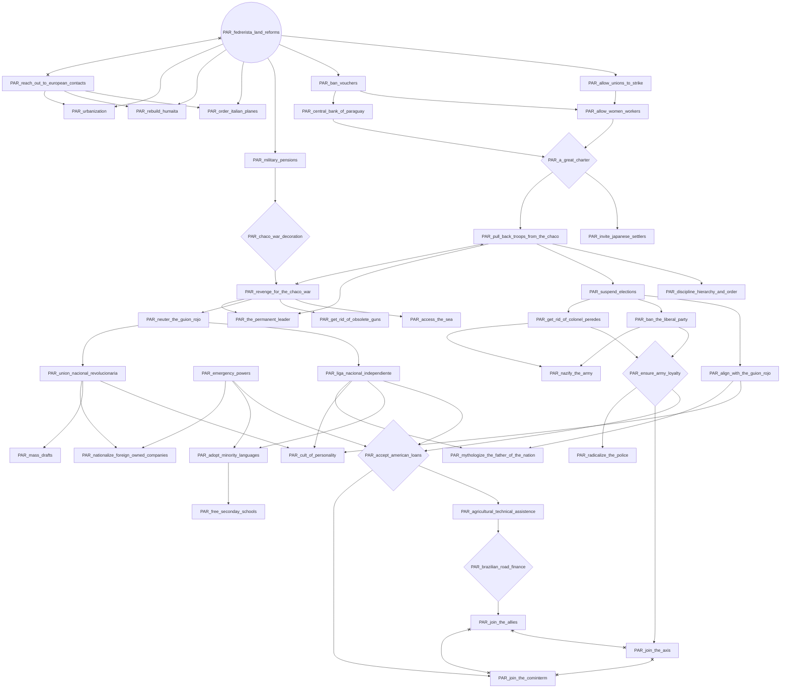
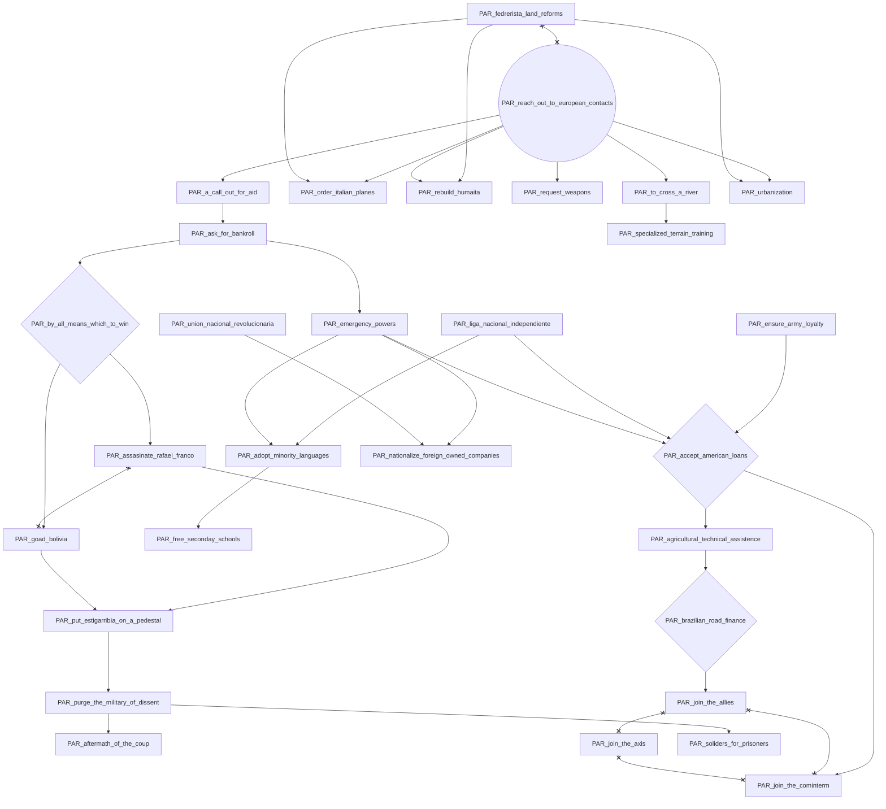

# PAR_fedrerista_land_reforms

```mermaid
flowchart TD
    n1{"PAR_a_great_charter"}
    n2{"PAR_accept_american_loans"}
    n3["PAR_access_the_sea"]
    n4["PAR_adopt_minority_languages"]
    n5["PAR_agricultural_technical_assistence"]
    n6["PAR_align_with_the_guion_rojo"]
    n7["PAR_allow_unions_to_strike"]
    n8["PAR_allow_women_workers"]
    n9["PAR_ban_the_liberal_party"]
    n10["PAR_ban_vouchers"]
    n11{"PAR_brazilian_road_finance"}
    n12["PAR_central_bank_of_paraguay"]
    n13{"PAR_chaco_war_decoration"}
    n14["PAR_cult_of_personality"]
    n15["PAR_discipline_hierarchy_and_order"]
    n16["PAR_emergency_powers"]
    n17{"PAR_ensure_army_loyalty"}
    n18(("PAR_fedrerista_land_reforms"))
    n19["PAR_free_seconday_schools"]
    n20["PAR_get_rid_of_colonel_peredes"]
    n21["PAR_get_rid_of_obsolete_guns"]
    n22["PAR_invite_japanese_settlers"]
    n23["PAR_join_the_allies"]
    n24["PAR_join_the_axis"]
    n25["PAR_join_the_cominterm"]
    n26["PAR_liga_nacional_independiente"]
    n27["PAR_mass_drafts"]
    n28["PAR_military_pensions"]
    n29["PAR_mythologize_the_father_of_the_nation"]
    n30["PAR_nationalize_foreign_owned_companies"]
    n31["PAR_nazify_the_army"]
    n32["PAR_neuter_the_guion_rojo"]
    n33["PAR_order_italian_planes"]
    n34["PAR_pull_back_troops_from_the_chaco"]
    n35["PAR_radicalize_the_police"]
    n36["PAR_reach_out_to_european_contacts"]
    n37["PAR_rebuild_humaita"]
    n38["PAR_revenge_for_the_chaco_war"]
    n39["PAR_suspend_elections"]
    n40["PAR_the_permanent_leader"]
    n41["PAR_union_nacional_revolucionaria"]
    n42["PAR_urbanization"]
    n12 --> n1
    n8 --> n1
    n17 --> n2
    n26 --> n2
    n16 --> n2
    n38 --> n3
    n26 --> n4
    n16 --> n4
    n2 --> n5
    n39 --> n6
    n18 --> n7
    n7 --> n8
    n10 --> n8
    n39 --> n9
    n18 --> n10
    n5 --> n11
    n10 --> n12
    n28 --> n13
    n26 --> n14
    n41 --> n14
    n6 --> n14
    n34 --> n15
    n20 --> n17
    n9 --> n17
    n4 --> n19
    n39 --> n20
    n38 --> n21
    n1 --> n22
    n11 --> n23
    n17 --> n24
    n2 --> n25
    n32 --> n26
    n41 --> n27
    n18 --> n28
    n26 --> n29
    n6 --> n29
    n16 --> n30
    n41 --> n30
    n20 --> n31
    n9 --> n31
    n38 --> n32
    n36 --> n33
    n18 --> n33
    n1 --> n34
    n17 --> n35
    n18 --> n37
    n36 --> n37
    n13 --> n38
    n34 --> n39
    n34 --> n40
    n38 --> n40
    n32 --> n41
    n36 --> n42
    n18 --> n42
    n18 x--x n36
    n23 x--x n24
    n23 x--x n25
    n24 x--x n25
    n34 x--x n38
```

# PAR_reach_out_to_european_contacts

```mermaid
flowchart TD
    n43["PAR_a_call_out_for_aid"]
    n2{"PAR_accept_american_loans"}
    n4["PAR_adopt_minority_languages"]
    n44["PAR_aftermath_of_the_coup"]
    n5["PAR_agricultural_technical_assistence"]
    n45["PAR_ask_for_bankroll"]
    n46["PAR_assasinate_rafael_franco"]
    n11{"PAR_brazilian_road_finance"}
    n47{"PAR_by_all_means_which_to_win"}
    n16["PAR_emergency_powers"]
    n17["PAR_ensure_army_loyalty"]
    n18["PAR_fedrerista_land_reforms"]
    n19["PAR_free_seconday_schools"]
    n48["PAR_goad_bolivia"]
    n23["PAR_join_the_allies"]
    n24["PAR_join_the_axis"]
    n25["PAR_join_the_cominterm"]
    n26["PAR_liga_nacional_independiente"]
    n30["PAR_nationalize_foreign_owned_companies"]
    n33["PAR_order_italian_planes"]
    n49["PAR_purge_the_military_of_dissent"]
    n50["PAR_put_estigarribia_on_a_pedestal"]
    n36(("PAR_reach_out_to_european_contacts"))
    n37["PAR_rebuild_humaita"]
    n51["PAR_request_weapons"]
    n52["PAR_soliders_for_prisoners"]
    n53["PAR_specialized_terrain_training"]
    n54["PAR_to_cross_a_river"]
    n41["PAR_union_nacional_revolucionaria"]
    n42["PAR_urbanization"]
    n36 --> n43
    n17 --> n2
    n26 --> n2
    n16 --> n2
    n26 --> n4
    n16 --> n4
    n49 --> n44
    n2 --> n5
    n43 --> n45
    n47 --> n46
    n5 --> n11
    n45 --> n47
    n45 --> n16
    n4 --> n19
    n47 --> n48
    n11 --> n23
    n2 --> n25
    n16 --> n30
    n41 --> n30
    n36 --> n33
    n18 --> n33
    n50 --> n49
    n46 --> n50
    n48 --> n50
    n18 --> n37
    n36 --> n37
    n36 --> n51
    n49 --> n52
    n54 --> n53
    n36 --> n54
    n36 --> n42
    n18 --> n42
    n46 x--x n48
    n18 x--x n36
    n23 x--x n24
    n23 x--x n25
    n24 x--x n25
```
