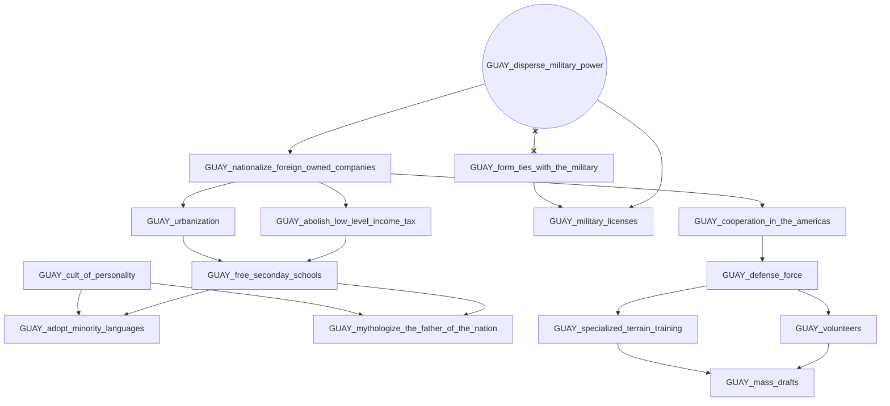
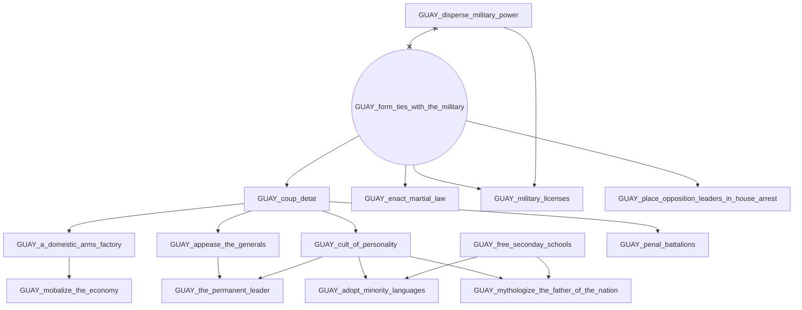
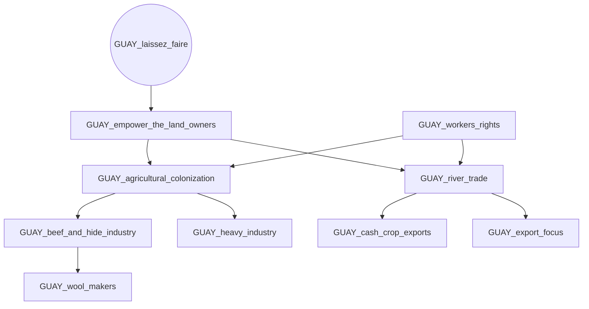
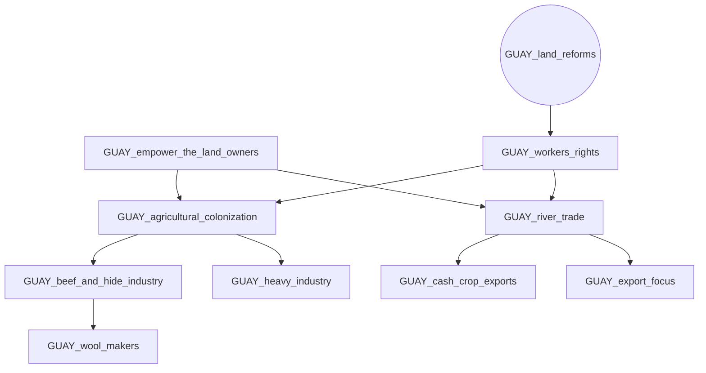
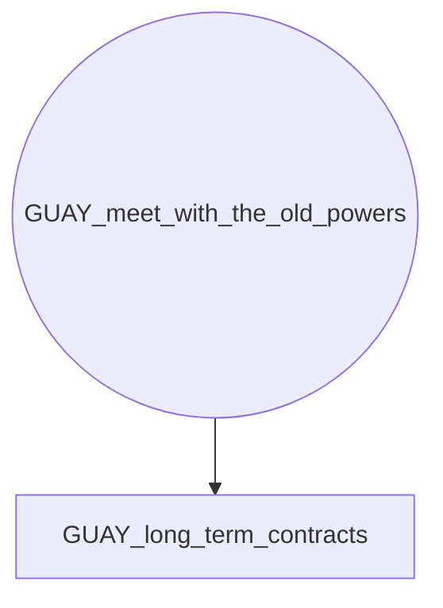
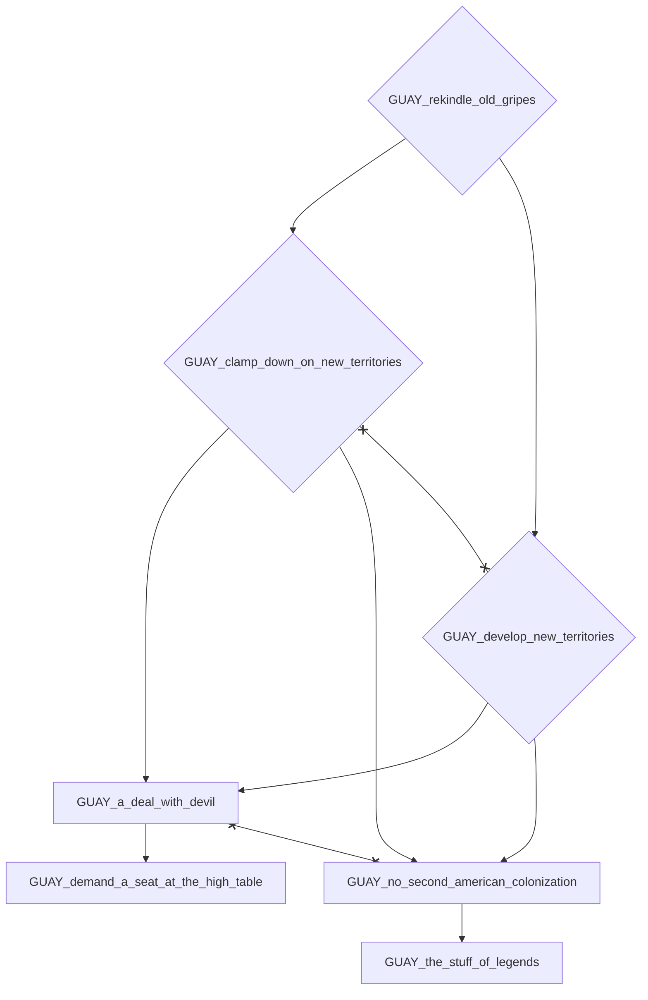
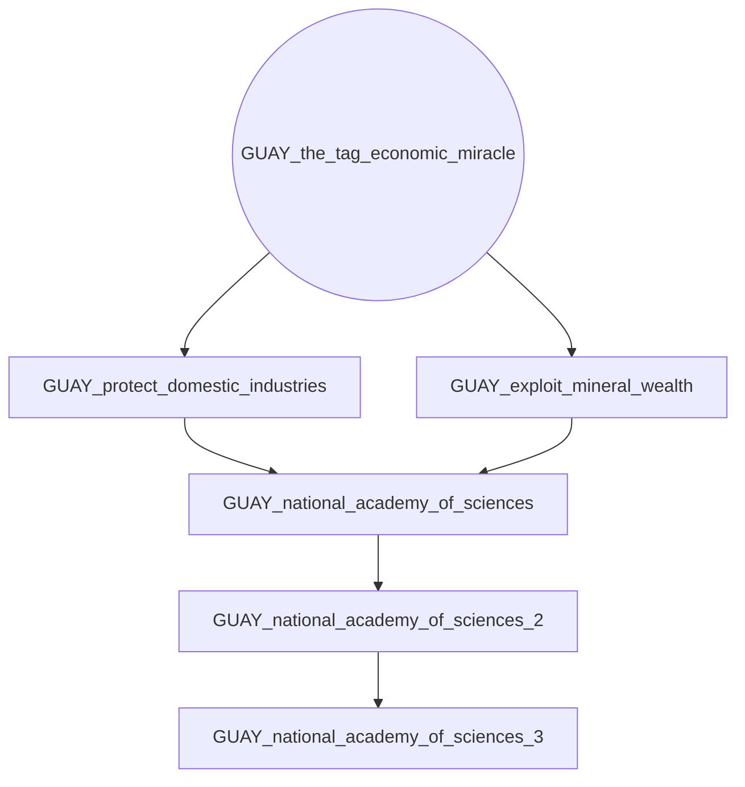

# GUAY_disperse_military_power

# GUAY_form_ties_with_the_military

# GUAY_laissez_faire

# GUAY_land_reforms

# GUAY_meet_with_the_old_powers

# GUAY_rekindle_old_gripes

# GUAY_the_tag_economic_miracle

