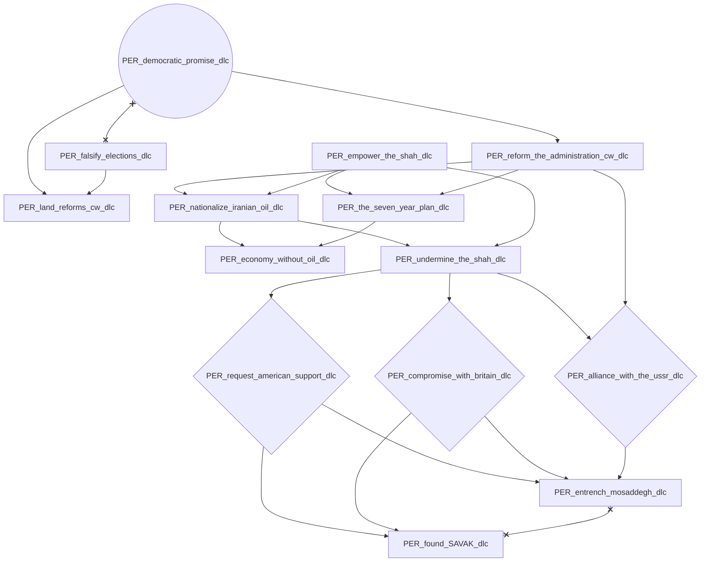
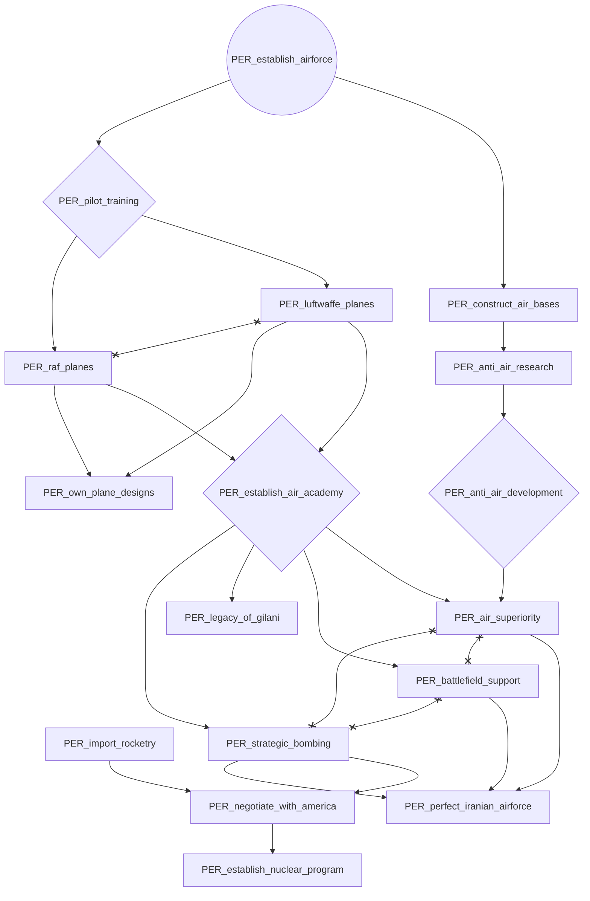
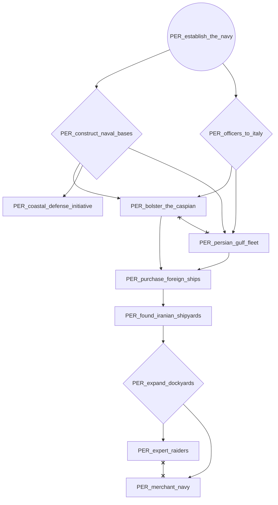
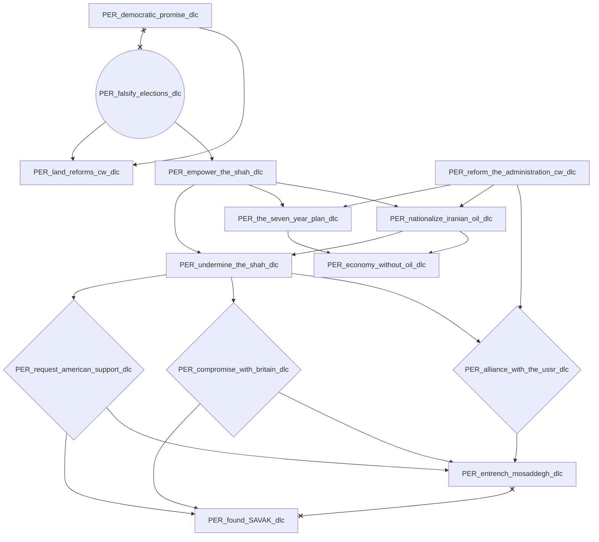
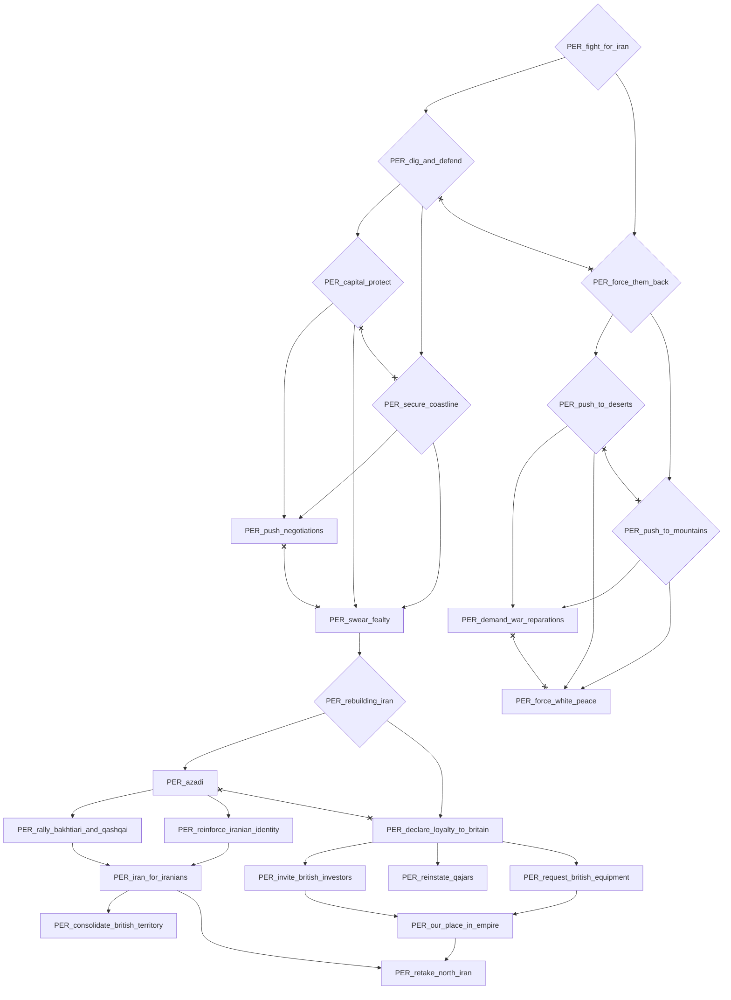
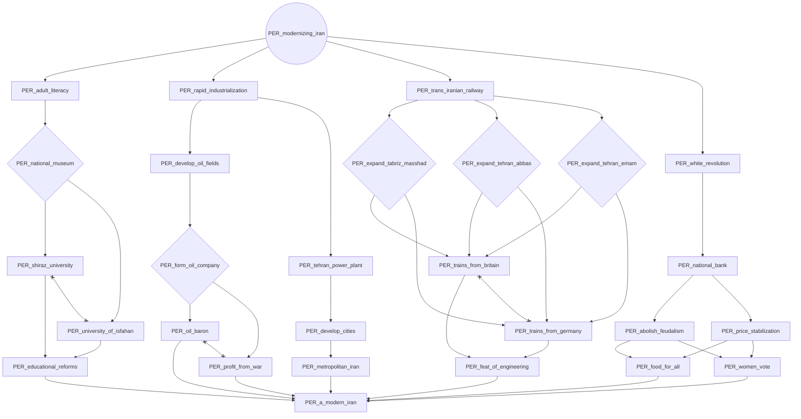
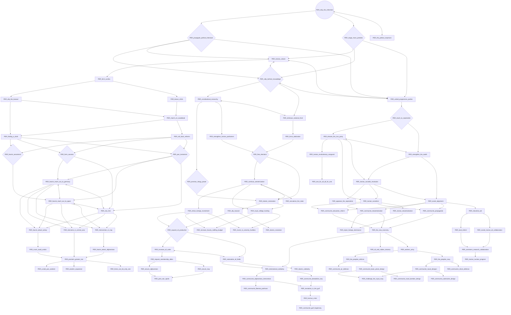
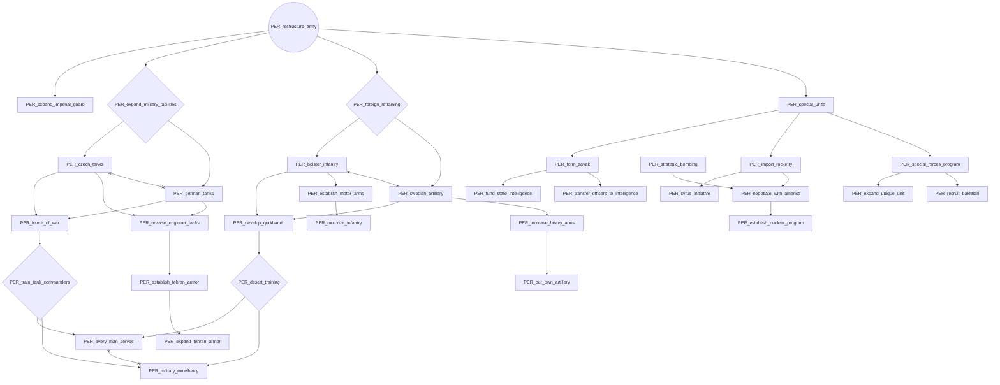

# PER_democratic_promise_dlc

# PER_establish_airforce

# PER_establish_the_navy

# PER_falsify_elections_dlc

# PER_fight_for_iran

# PER_modernizing_iran

# PER_rally_the_reformers

# PER_restructure_army

# PER_the_pahlavi_imperium

```mermaid
flowchart TD
    n212["PER_absolute_monarchy"]
    n213["PER_absorb_byzantines"]
    n214["PER_align_with_axis"]
    n215["PER_assassinate_reza_shah"]
    n216["PER_assessing_the_opposition"]
    n217["PER_bolster_civilian_industry"]
    n218{"PER_choose_a_shahbanu"}
    n219{"PER_clamp_azerbaijani_dissidence"}
    n220{"PER_clamp_kurdish_dissidence"}
    n221["PER_clash_of_titans"]
    n222["PER_demand_afghan_territory"]
    n223["PER_demand_iraqi_territory"]
    n224["PER_demand_west_asia"]
    n225["PER_donate_oil_fields"]
    n226["PER_embrace_industrial_powers"]
    n227["PER_embrace_opulence"]
    n228["PER_emperor_for_people"]
    n229["PER_establish_northern_buffer_states"]
    n230["PER_establish_special_unit"]
    n231["PER_first_iranian_empire"]
    n232["PER_foothold_in_indus"]
    n233["PER_forced_secularization"]
    n234["PER_fund_imperial_excellency"]
    n235["PER_glory_of_cyrus"]
    n236["PER_his_fathers_footsteps"]
    n237["PER_imperial_expansionism"]
    n238["PER_imperial_funded_universities"]
    n239["PER_increase_education_funding"]
    n240["PER_increase_military_funding"]
    n241["PER_invasion_of_india"]
    n242["PER_last_thousand_years"]
    n243{"PER_legacy_of_greatness"}
    n244["PER_limit_foreign_influence"]
    n245["PER_march_to_nile"]
    n246["PER_middle_east_protectorate"]
    n247["PER_military_high_schools"]
    n248["PER_modernize_iran_economy"]
    n249["PER_open_abadan"]
    n250["PER_path_through_iraq"]
    n251["PER_persian_german_trade"]
    n252["PER_plant_resistance_cells"]
    n253["PER_preemptive_strike"]
    n254["PER_preparatory_mobilization"]
    n255["PER_prepare_for_worst"]
    n256["PER_question_of_resources"]
    n257["PER_rally_ancient_history"]
    n161["PER_rally_the_reformers"]
    n258["PER_rebuild_persepolis"]
    n259["PER_reclaim_turkish_peninsula"]
    n260["PER_reintegrate_anatolia"]
    n261["PER_revive_old_ways"]
    n262["PER_root_out_conspiracies"]
    n263["PER_royal_visit_germany"]
    n264["PER_shahanshah"]
    n265["PER_spoils_of_war"]
    n266["PER_stand_our_ground"]
    n267["PER_stand_with_germany"]
    n268["PER_stand_with_giants"]
    n269["PER_state_atheism"]
    n270["PER_subserviant_to_noone"]
    n271{"PER_take_regional_tour"}
    n272["PER_tehran_moscow_pact"]
    n273["PER_the_memphis_initiative"]
    n177{"PER_the_pahlavi_imperium"}
    n274["PER_the_unification_initiative"]
    n275["PER_third_persian_empire"]
    n276["PER_trial_fifty_three"]
    n277["PER_uphold_civil_rights"]
    n278["PER_upscale_military_production"]
    n279["PER_usurp_afghanistan"]
    n280["PER_venerate_islam"]
    n281["PER_war_plan_cambyses"]
    n282["PER_war_plan_darius"]
    n283["PER_war_plan_xerxes"]
    n284["PER_we_survived"]
    n285["PER_we_will_survive"]
    n286{"PER_wether_the_storm"}
    n262 --> n212
    n221 --> n213
    n267 --> n214
    n243 --> n215
    n243 --> n216
    n266 --> n217
    n275 --> n218
    n274 --> n219
    n274 --> n220
    n259 --> n221
    n272 --> n222
    n272 --> n223
    n281 --> n224
    n214 --> n225
    n271 --> n226
    n218 --> n227
    n218 --> n228
    n253 --> n229
    n237 --> n230
    n212 --> n231
    n282 --> n232
    n268 --> n233
    n243 --> n233
    n227 --> n234
    n241 --> n235
    n260 --> n235
    n245 --> n235
    n215 --> n236
    n216 --> n237
    n243 --> n238
    n268 --> n239
    n268 --> n240
    n232 --> n241
    n279 --> n241
    n270 --> n242
    n234 --> n242
    n277 --> n242
    n248 --> n242
    n177 --> n243
    n271 --> n244
    n250 --> n245
    n265 --> n246
    n240 --> n247
    n226 --> n248
    n239 --> n249
    n281 --> n250
    n268 --> n251
    n256 --> n252
    n252 --> n253
    n255 --> n253
    n278 --> n254
    n217 --> n254
    n256 --> n255
    n286 --> n256
    n264 --> n257
    n257 --> n258
    n283 --> n259
    n259 --> n260
    n219 --> n261
    n220 --> n261
    n243 --> n262
    n251 --> n263
    n275 --> n264
    n231 --> n264
    n214 --> n265
    n286 --> n266
    n226 --> n267
    n177 --> n268
    n219 --> n269
    n220 --> n269
    n244 --> n270
    n231 --> n271
    n237 --> n272
    n245 --> n273
    n216 --> n274
    n236 --> n275
    n268 --> n276
    n228 --> n277
    n266 --> n278
    n282 --> n279
    n219 --> n280
    n220 --> n280
    n223 --> n281
    n222 --> n281
    n223 --> n282
    n222 --> n282
    n223 --> n283
    n222 --> n283
    n285 --> n284
    n229 --> n284
    n254 --> n285
    n263 --> n286
    n247 --> n286
    n215 x--x n262
    n226 x--x n244
    n227 x--x n228
    n243 x--x n268
    n256 x--x n266
    n161 x--x n177
    n261 x--x n269
    n261 x--x n280
    n269 x--x n280
```

