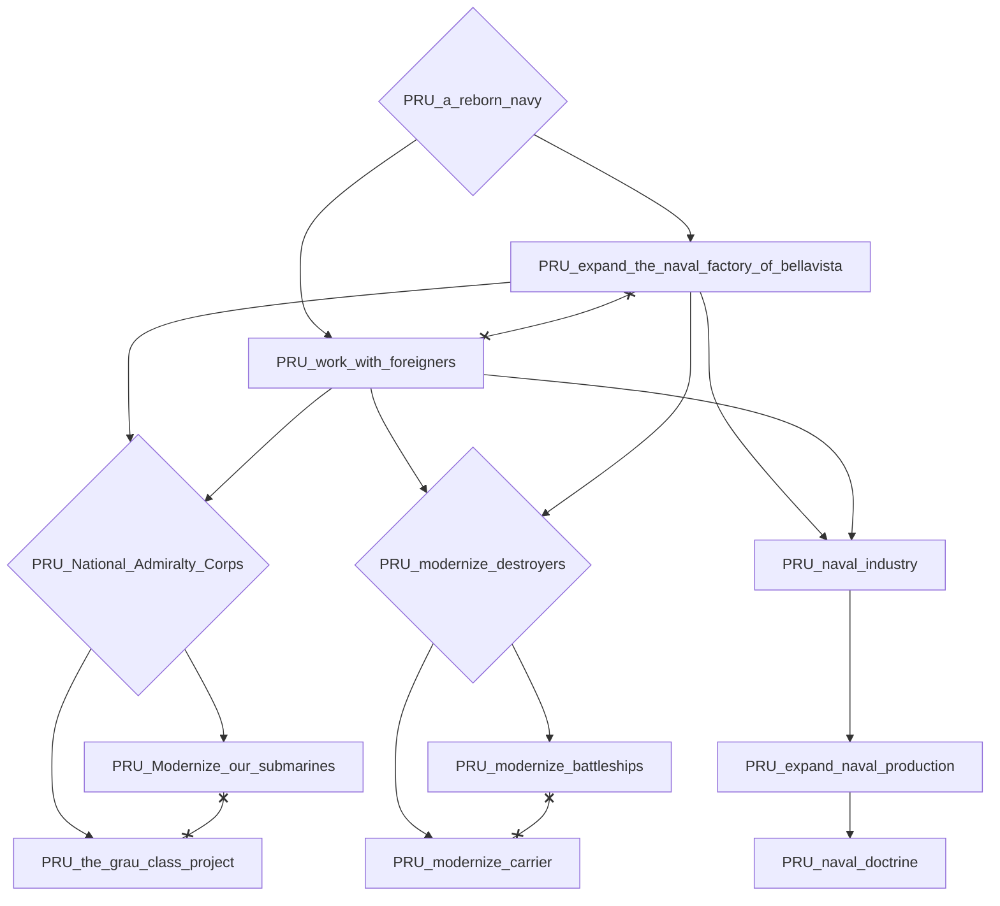
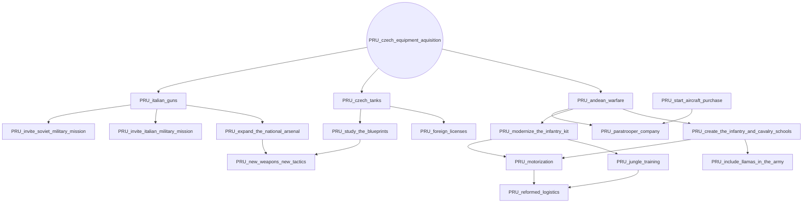
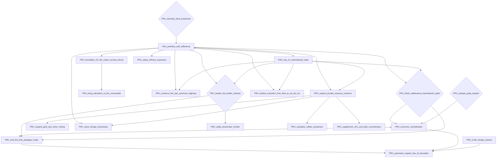
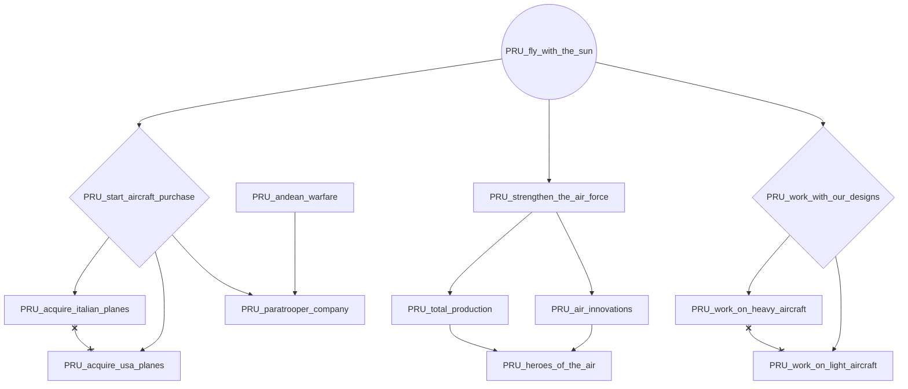
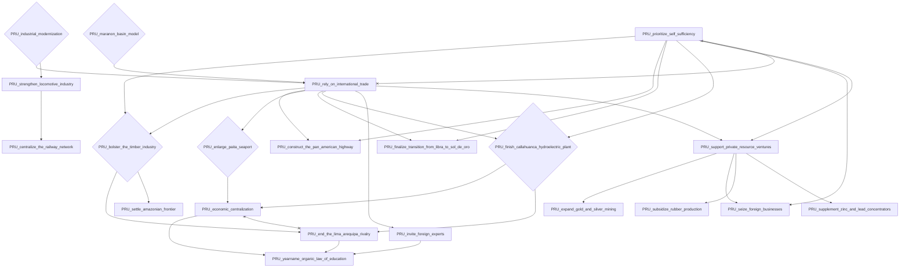
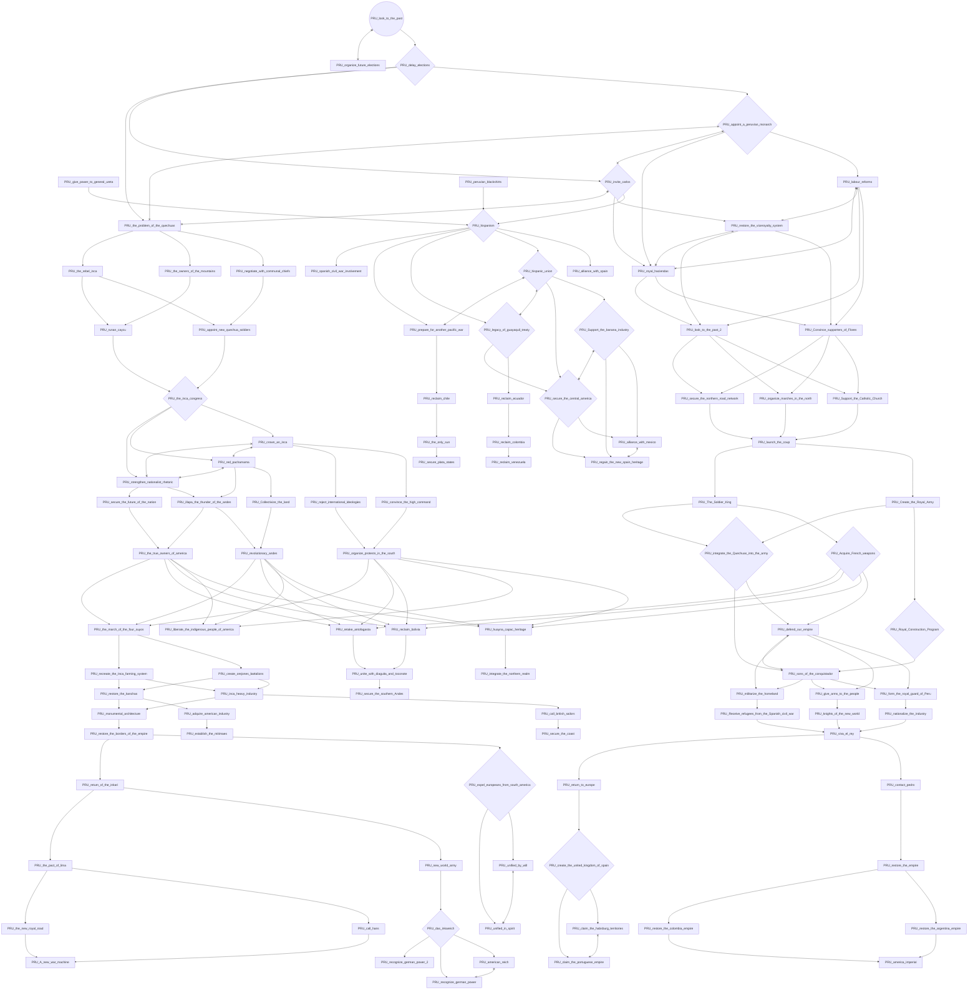
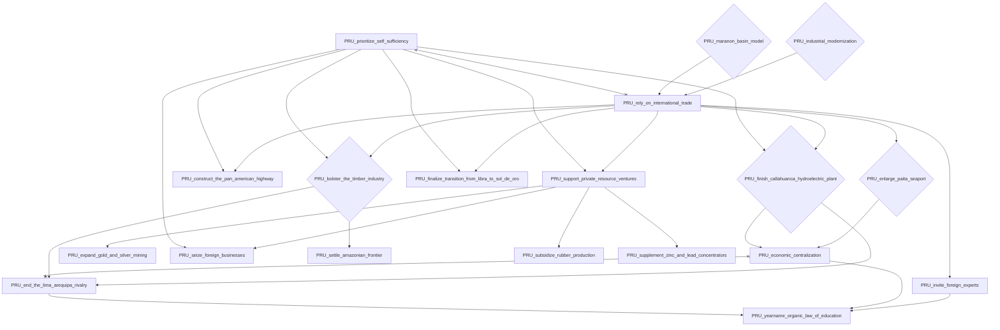

# PRU_a_reborn_navy

# PRU_czech_equipment_aquisition

# PRU_diversify_steel_production

# PRU_fly_with_the_sun

# PRU_industrial_modernization

# PRU_look_to_the_past

# PRU_maranon_basin_model

# PRU_organize_future_elections

```mermaid
flowchart TD
    n170["PRU_Acquire_Japanese_weapons"]
    n171["PRU_Bring_the_revolution_to_all_America"]
    n172["PRU_Eradicate_the_traitors"]
    n173["PRU_German_investment_in_the_military_industry"]
    n174["PRU_Legion_Peruana"]
    n175["PRU_Military_Universities"]
    n176["PRU_Nationalize_the_brea_y_parinas"]
    n177["PRU_Promote_immigration"]
    n178["PRU_Recovering_from_the_civil_war"]
    n179["PRU_Return_to_Negotiate_with_Caproni"]
    n180["PRU_Sovereign_Industrial_Expansion"]
    n74{"PRU_Support_the_banana_industry"}
    n181["PRU_The_People_General"]
    n182["PRU_The_new_South_american_axis"]
    n183["PRU_a_new_military_doctrine"]
    n184["PRU_a_new_peru"]
    n185["PRU_acquire_soviet_plane_factories"]
    n186["PRU_acquire_soviet_tanks"]
    n187["PRU_adean_commissars"]
    n188["PRU_alerta_en_la_frontera"]
    n189["PRU_alliance_with_bolivia"]
    n77["PRU_alliance_with_mexico"]
    n78["PRU_alliance_with_spain"]
    n190["PRU_american_fascist_union"]
    n191["PRU_american_naval_doctrine"]
    n192["PRU_aprista_guerrilla"]
    n193["PRU_arm_the_people"]
    n194["PRU_ask_for_enter_to_comintern"]
    n195["PRU_attack_germany"]
    n196["PRU_attack_japan"]
    n197{"PRU_benavides_is_dead"}
    n198{"PRU_benavides_nightmare"}
    n199["PRU_british_airports"]
    n200["PRU_celebration_of_the_andean_past"]
    n201["PRU_collective_agriculture"]
    n202["PRU_commit_to_democratic_election"]
    n203["PRU_conservative_coalition"]
    n204["PRU_consolidate_borders"]
    n205["PRU_control_the_economy"]
    n206["PRU_create_apra"]
    n207{"PRU_create_the_Lima_group"}
    n208["PRU_create_the_national_education_fund"]
    n209["PRU_crusade_against_radicalism_in_america"]
    n210["PRU_develop_the_provinces"]
    n211["PRU_drive_out_the_banana_companies"]
    n212["PRU_eliminate_the_competition"]
    n213{"PRU_empower_benavides"}
    n214["PRU_end_capitalism"]
    n215["PRU_exile_haya_de_la_torre"]
    n216["PRU_exile_luis_alberto_flores"]
    n217["PRU_expand_the_agricultural_sector"]
    n218["PRU_expand_the_military_industry"]
    n219["PRU_expand_the_oil_industry"]
    n220["PRU_expand_the_volunteer_program"]
    n221{"PRU_expel_the_reds_from_america"}
    n222["PRU_follow_in_the_footsteps_of_tupac_amaru"]
    n223{"PRU_food_importation"}
    n224["PRU_freedom_defenders"]
    n225["PRU_german_aeronautic_cooperation"]
    n226{"PRU_give_asylum_to_the_jews"}
    n227["PRU_give_power_to_cgtp"]
    n99{"PRU_give_power_to_general_ureta"}
    n228["PRU_give_rights_to_indigenous_people"]
    n229["PRU_god_country_and_family"]
    n230["PRU_great_national_construction_program"]
    n231{"PRU_hasta_quemar_el_ultimo_cartucho"}
    n232["PRU_help_our_brothers"]
    n100{"PRU_hispanic_union"}
    n101{"PRU_hispanism"}
    n233["PRU_hit_argentina"]
    n234["PRU_hit_bolivia"]
    n235["PRU_hit_chile"]
    n236["PRU_hit_colombia"]
    n237["PRU_hit_ecuador"]
    n238["PRU_hit_venezuela"]
    n239["PRU_inca_industry"]
    n240{"PRU_incaism"}
    n241["PRU_increase_social_spending"]
    n242["PRU_industrial_cooperation"]
    n243["PRU_integrate_the_church"]
    n244["PRU_integrate_the_indigenous"]
    n245{"PRU_integrate_women"}
    n246["PRU_inti_raymi"]
    n107["PRU_invite_carlos"]
    n247["PRU_invite_german_military_advisors"]
    n248["PRU_invite_japanese_naval_advisors"]
    n249["PRU_japanece_naval_doctrine"]
    n250["PRU_japanese_investment_in_the_naval_industry"]
    n251{"PRU_join_allies"}
    n252["PRU_join_axis"]
    n253["PRU_leacy_of_Benavides"]
    n254["PRU_left_and_right_united"]
    n111{"PRU_legacy_of_guayaquil_treaty"}
    n255["PRU_legacy_of_pachacutec"]
    n256["PRU_legacy_of_sachez_cerro"]
    n257["PRU_legacy_of_the_war_with_ecuador"]
    n258["PRU_liberate_all_cab"]
    n259["PRU_liberate_brazil"]
    n260["PRU_liberate_cub"]
    n261["PRU_long_live_our_caudillo"]
    n113["PRU_look_to_the_past"]
    n262["PRU_mandatory_social_security"]
    n263["PRU_mediate_between_the_parties"]
    n264["PRU_mobilize_womans"]
    n265["PRU_national_investigation"]
    n266["PRU_national_literacy_programs"]
    n267["PRU_nationalize_banking_sector"]
    n268["PRU_nationalize_the_banking_sector"]
    n269["PRU_neo_incaic_unification"]
    n270["PRU_new_road_conscription_law"]
    n271["PRU_ochenio_de_Odria"]
    n272["PRU_oil_deal_with_the_united_states"]
    n273["PRU_oil_infrastructure_expansion"]
    n274["PRU_open_universities_to_indigenous_people"]
    n120(("PRU_organize_future_elections"))
    n275["PRU_our_revolution"]
    n123{"PRU_peruvian_blackshirts"}
    n276["PRU_peruvian_military_youth"]
    n277["PRU_place_odria_as_adviser"]
    n124["PRU_prepare_for_another_pacific_war"]
    n278["PRU_privatize_the_public_service"]
    n279{"PRU_prolong_benavides_presidency"}
    n280["PRU_promote_the_military_industry"]
    n281["PRU_promote_the_national_industry"]
    n282["PRU_protect_democratic_institutions"]
    n283["PRU_protect_our_businesses"]
    n284["PRU_protest_against_the_cancellation"]
    n285["PRU_public_universities"]
    n286["PRU_radicalize_the_pcp"]
    n287["PRU_rallying_the_peasants"]
    n126["PRU_reclaim_chile"]
    n127["PRU_reclaim_colombia"]
    n128["PRU_reclaim_ecuador"]
    n129["PRU_reclaim_venezuela"]
    n288["PRU_recover_from_the_economic_crisis"]
    n289["PRU_reform_the_constitution"]
    n290["PRU_reforma_agraria"]
    n134["PRU_regain_the_new_spain_heritage"]
    n291["PRU_remember_the_Trujillo_revolution"]
    n292["PRU_request_soviet_support"]
    n293["PRU_research_cooperation"]
    n294["PRU_revive_the_bolivarian_dream"]
    n295["PRU_revolucion_restauradora"]
    n296["PRU_revolutionary_goverment"]
    n297["PRU_revolutionary_vanguard"]
    n298["PRU_riva_agueros_dream"]
    n148["PRU_secure_plata_states"]
    n149{"PRU_secure_the_central_america"}
    n299{"PRU_select_a_successor_for_benavides"}
    n300["PRU_select_montagne_as_successor"]
    n301["PRU_social_democratic_coalition"]
    n155["PRU_spanish_civil_war_involvement"]
    n302["PRU_standard_oil_refinery_initiative"]
    n303["PRU_state_serves_the_people"]
    n304["PRU_strengthen_the_national_industry"]
    n305["PRU_tax_reform"]
    n306["PRU_the_empire_of_the_constitution"]
    n307["PRU_the_final_march"]
    n308["PRU_the_great_peruvian_red_army"]
    n309["PRU_the_great_world_revolution"]
    n310["PRU_the_memory_of_benavides"]
    n311["PRU_the_new_oil_law"]
    n160["PRU_the_only_sun"]
    n312["PRU_the_peruvian_five_year_plan"]
    n313{"PRU_the_teachings_the_amauta"}
    n314["PRU_the_victory_of_our_caudillo"]
    n315["PRU_trans_pacific_alliance"]
    n316["PRU_union_with_the_pcv"]
    n317["PRU_unite_the_andes"]
    n318["PRU_unite_the_ecuadorian_proletariat"]
    n319{"PRU_wake_up_a_giant"}
    n320["PRU_womens_right_to_vote"]
    n321{"PRU_workers_protection"}
    n322["PRU_workers_rights_act"]
    n99 --> n170
    n123 --> n170
    n285 --> n171
    n123 --> n172
    n225 --> n173
    n255 --> n174
    n301 --> n175
    n187 --> n176
    n201 --> n176
    n170 --> n177
    n179 --> n177
    n216 --> n178
    n99 --> n179
    n123 --> n179
    n205 --> n180
    n100 --> n74
    n99 --> n181
    n221 --> n182
    n249 --> n183
    n225 --> n183
    n244 --> n184
    n308 --> n185
    n308 --> n186
    n194 --> n187
    n263 --> n188
    n240 --> n189
    n149 --> n77
    n74 --> n77
    n101 --> n78
    n261 --> n190
    n182 --> n190
    n224 --> n191
    n206 --> n192
    n287 --> n193
    n313 --> n194
    n226 --> n194
    n251 --> n195
    n207 --> n195
    n251 --> n196
    n207 --> n196
    n280 --> n197
    n281 --> n197
    n284 --> n198
    n203 --> n199
    n189 --> n200
    n194 --> n201
    n279 --> n202
    n263 --> n203
    n239 --> n204
    n239 --> n205
    n293 --> n205
    n275 --> n206
    n245 --> n207
    n223 --> n207
    n271 --> n208
    n215 --> n209
    n216 --> n209
    n317 --> n210
    n318 --> n211
    n283 --> n212
    n307 --> n212
    n120 --> n213
    n286 --> n214
    n202 --> n215
    n202 --> n216
    n178 --> n217
    n290 --> n218
    n283 --> n219
    n304 --> n220
    n246 --> n221
    n275 --> n222
    n220 --> n223
    n265 --> n223
    n263 --> n224
    n252 --> n225
    n228 --> n226
    n312 --> n227
    n256 --> n99
    n301 --> n228
    n305 --> n229
    n311 --> n230
    n208 --> n230
    n204 --> n231
    n267 --> n231
    n198 --> n232
    n101 --> n100
    n123 --> n101
    n99 --> n101
    n107 --> n101
    n234 --> n233
    n319 --> n234
    n171 --> n234
    n197 --> n234
    n234 --> n235
    n233 --> n236
    n235 --> n236
    n233 --> n237
    n235 --> n237
    n233 --> n238
    n235 --> n238
    n210 --> n239
    n123 --> n240
    n99 --> n240
    n291 --> n241
    n189 --> n242
    n199 --> n243
    n289 --> n244
    n220 --> n245
    n265 --> n245
    n231 --> n246
    n173 --> n247
    n183 --> n247
    n250 --> n248
    n183 --> n248
    n315 --> n249
    n249 --> n250
    n245 --> n251
    n223 --> n251
    n231 --> n252
    n264 --> n253
    n321 --> n254
    n226 --> n254
    n101 --> n111
    n317 --> n255
    n300 --> n255
    n296 --> n255
    n120 --> n256
    n191 --> n257
    n288 --> n257
    n260 --> n258
    n171 --> n259
    n259 --> n260
    n193 --> n260
    n221 --> n261
    n208 --> n262
    n120 --> n263
    n203 --> n264
    n304 --> n265
    n186 --> n266
    n185 --> n266
    n239 --> n267
    n293 --> n267
    n313 --> n268
    n242 --> n269
    n200 --> n269
    n263 --> n270
    n295 --> n271
    n311 --> n272
    n314 --> n273
    n205 --> n274
    n291 --> n275
    n256 --> n123
    n178 --> n276
    n289 --> n276
    n319 --> n277
    n101 --> n124
    n302 --> n278
    n273 --> n278
    n213 --> n279
    n217 --> n280
    n217 --> n281
    n270 --> n282
    n278 --> n283
    n213 --> n284
    n222 --> n285
    n201 --> n286
    n285 --> n287
    n124 --> n126
    n128 --> n127
    n111 --> n128
    n127 --> n129
    n224 --> n288
    n300 --> n289
    n296 --> n289
    n268 --> n290
    n241 --> n290
    n149 --> n134
    n74 --> n134
    n198 --> n291
    n312 --> n292
    n242 --> n293
    n200 --> n293
    n222 --> n294
    n292 --> n294
    n231 --> n295
    n319 --> n295
    n197 --> n295
    n299 --> n296
    n292 --> n297
    n227 --> n297
    n222 --> n297
    n184 --> n298
    n160 --> n148
    n100 --> n149
    n111 --> n149
    n279 --> n299
    n299 --> n300
    n263 --> n301
    n101 --> n155
    n314 --> n302
    n254 --> n303
    n254 --> n304
    n305 --> n304
    n243 --> n305
    n253 --> n305
    n262 --> n306
    n237 --> n307
    n236 --> n307
    n238 --> n307
    n187 --> n308
    n307 --> n309
    n258 --> n309
    n197 --> n310
    n271 --> n311
    n126 --> n160
    n194 --> n312
    n198 --> n313
    n319 --> n314
    n231 --> n315
    n211 --> n316
    n240 --> n317
    n294 --> n318
    n184 --> n319
    n230 --> n320
    n272 --> n320
    n175 --> n321
    n282 --> n322
    n288 --> n322
    n170 x--x n179
    n74 x--x n149
    n182 x--x n261
    n189 x--x n317
    n77 x--x n134
    n194 x--x n254
    n195 x--x n196
    n202 x--x n299
    n207 x--x n251
    n100 x--x n111
    n100 x--x n124
    n246 x--x n252
    n246 x--x n295
    n246 x--x n315
    n252 x--x n295
    n252 x--x n315
    n113 x--x n120
    n277 x--x n295
    n279 x--x n284
    n291 x--x n313
    n295 x--x n315
    n296 x--x n300
```

