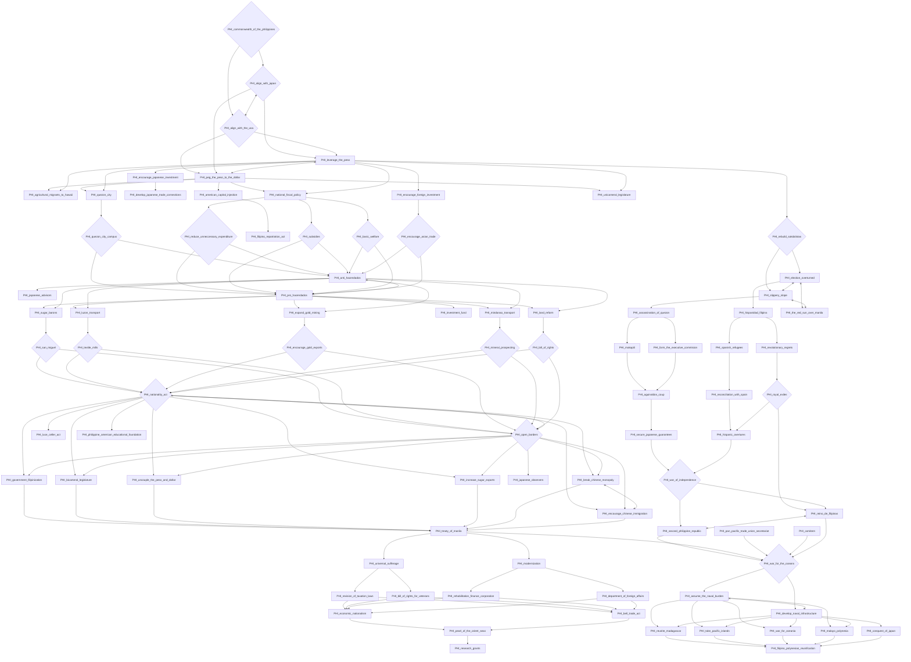
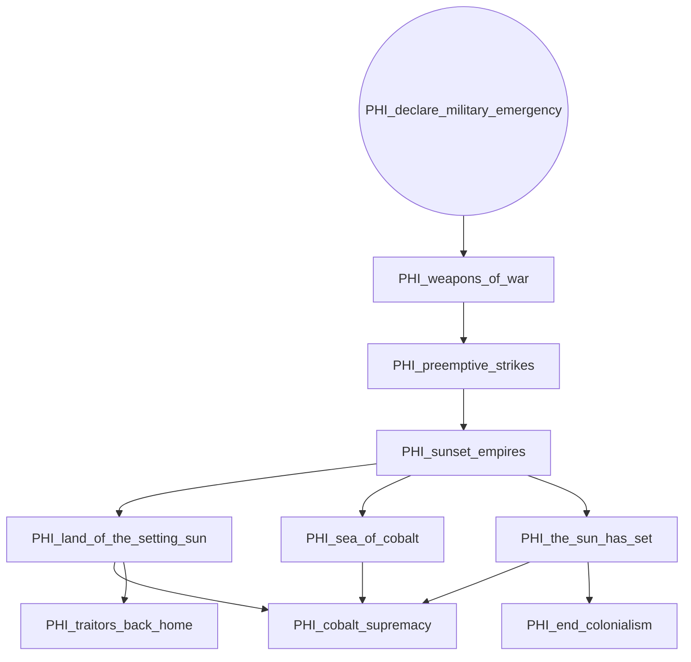
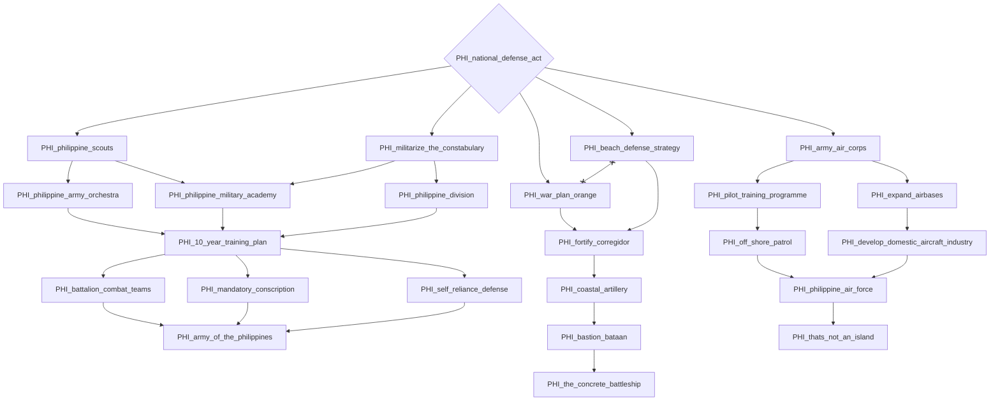
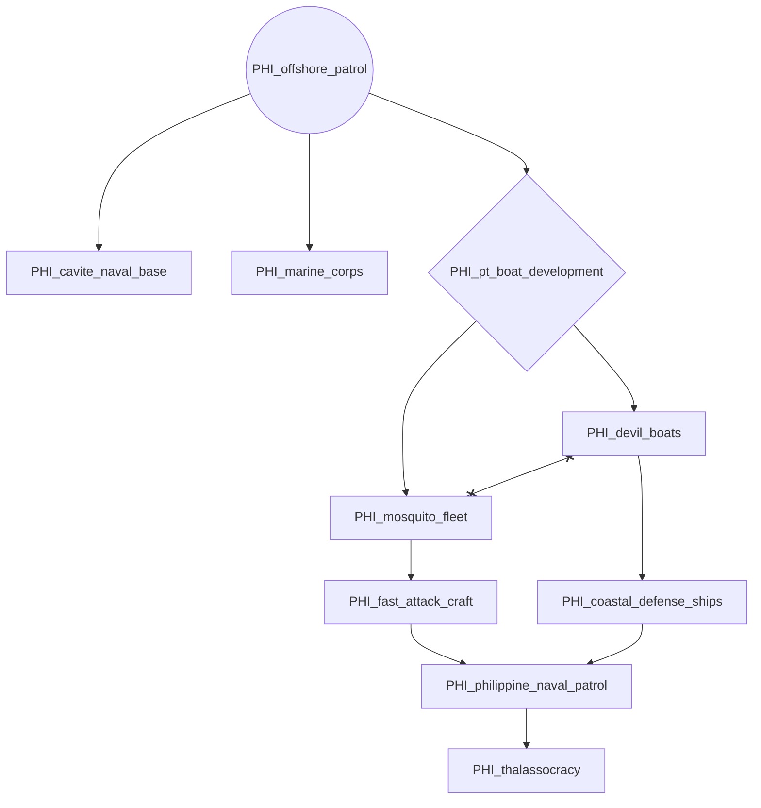
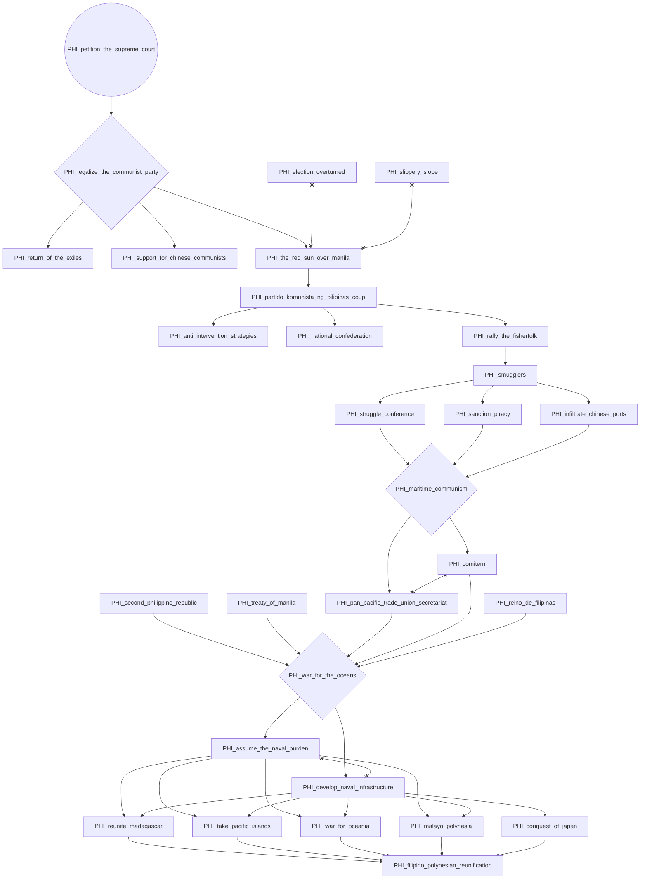
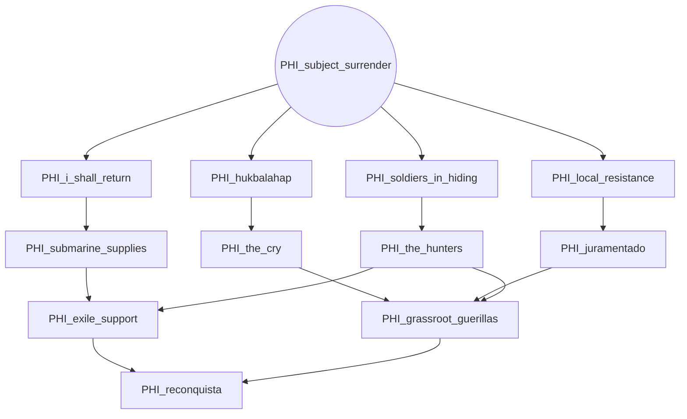
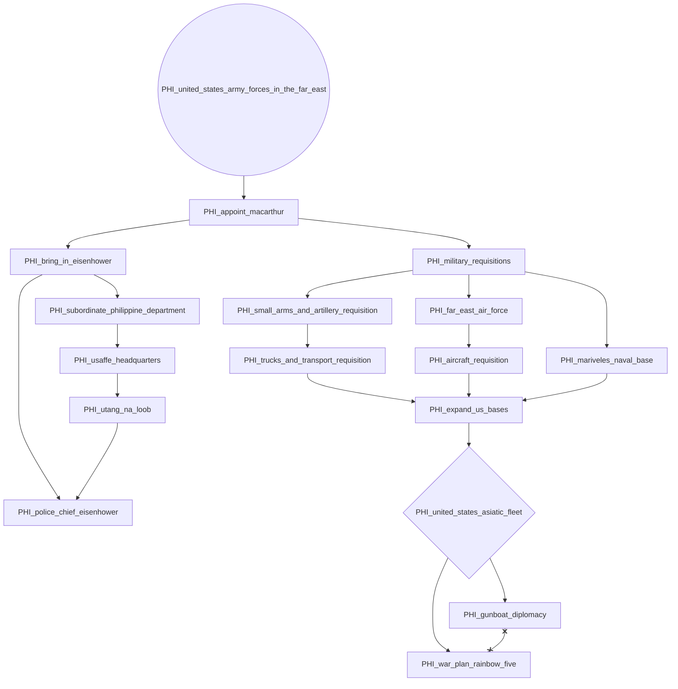

# PHI_commonwealth_of_the_philippines

# PHI_declare_military_emergency

# PHI_national_defense_act

# PHI_offshore_patrol

# PHI_petition_the_supreme_court

# PHI_subject_surrender

# PHI_united_states_army_forces_in_the_far_east

