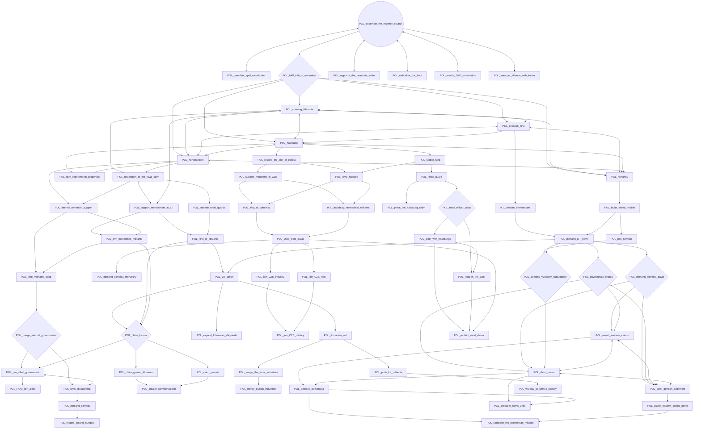
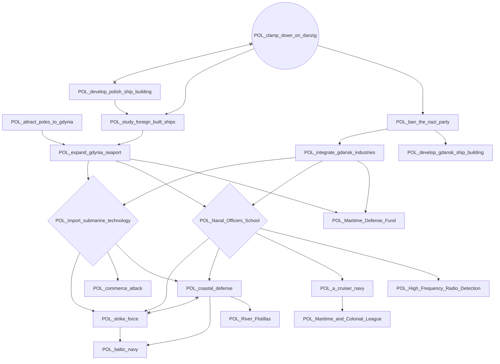
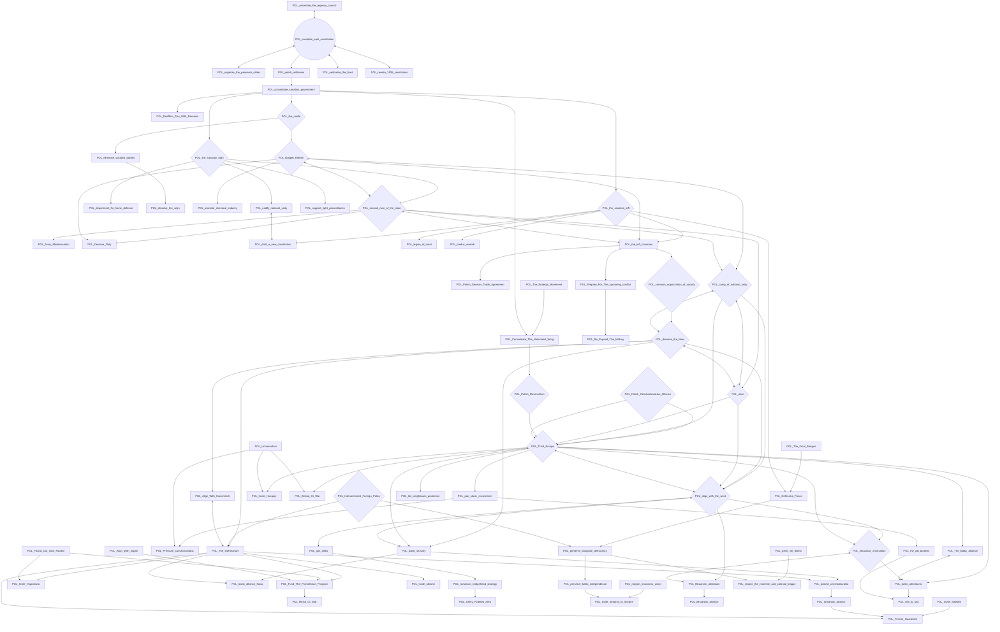
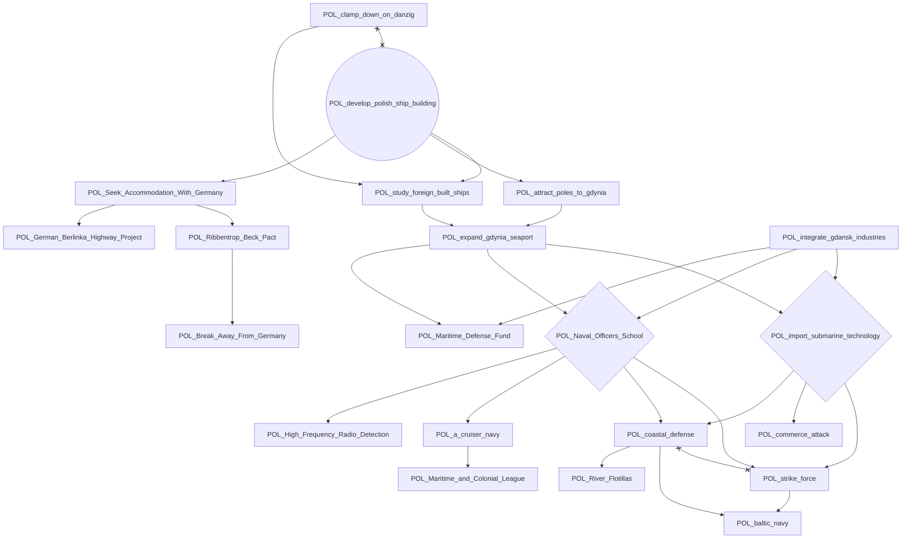
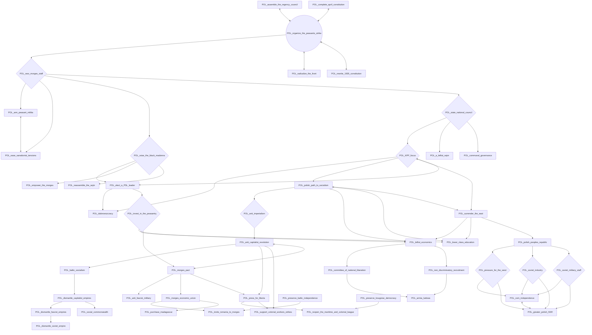
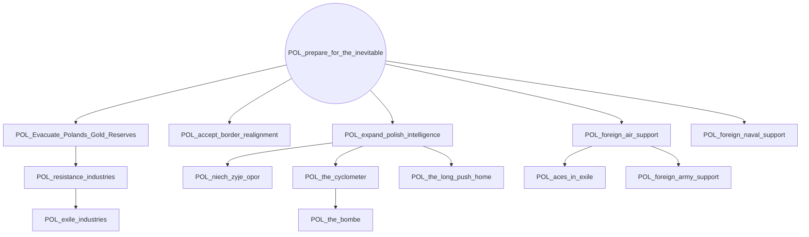
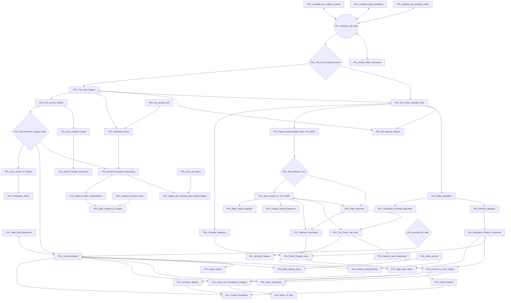
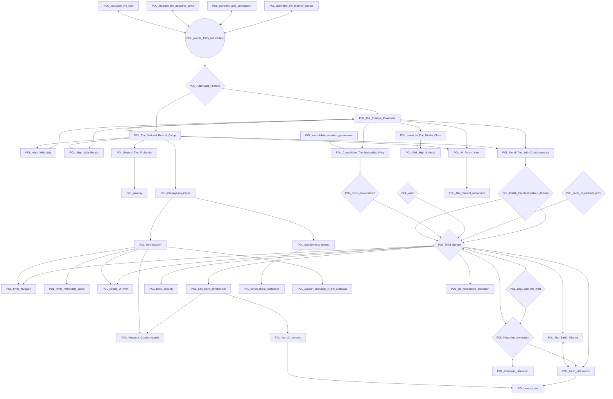
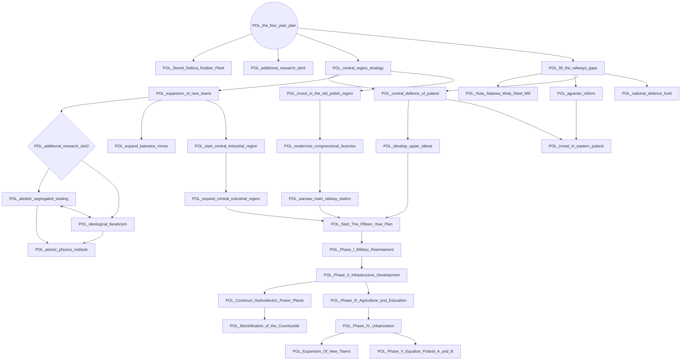

# POL_assemble_the_regency_council

# POL_clamp_down_on_danzig

# POL_complete_april_constitution

# POL_develop_polish_ship_building

# POL_organize_the_peasants_strike

# POL_prepare_for_the_inevitable

# POL_prepare_for_the_next_war

```mermaid
flowchart TD
    n215["POL_Artillery_Motorization"]
    n216["POL_Cegielski_Artillery_Factory"]
    n217["POL_Class_A_Reservists"]
    n218["POL_Expand_the_Lucznik_State_Arms_Factory"]
    n219["POL_Gundlach_Periscope"]
    n220["POL_Independent_Parachute_Brigades"]
    n221["POL_KOR_Committee_For_Defense"]
    n222["POL_Kasprzycki_Gamelin_Convention"]
    n223["POL_Land_Mine_Detectors"]
    n224["POL_Mielec_Aircraft_Factory"]
    n225["POL_Military_Aviation_Exports"]
    n226["POL_Modernize_The_Starachowice_Works"]
    n227["POL_Modlin_Fortress"]
    n228["POL_Plan_W"]
    n229["POL_Plan_Z"]
    n230["POL_Swiatecki_Bomb_Slip"]
    n231["POL_Wartime_Industry"]
    n232["POL_Wz_35_Anti_Tank_Rifle"]
    n233["POL_adaptive_designs"]
    n234{"POL_air_innovations"}
    n235["POL_air_modernisations_programme"]
    n236["POL_anti_blitz_vehicles"]
    n237{"POL_army_modernisation"}
    n238["POL_attract_foreign_motors"]
    n239["POL_belorussian_army"]
    n240["POL_complete_plan_east"]
    n241["POL_complete_plan_west"]
    n242["POL_cruiser_tank_experiments"]
    n243["POL_eastern_conscripts"]
    n244["POL_expand_poznan_forts"]
    n245{"POL_fighter_modernisation"}
    n246["POL_fortification_of_belarus"]
    n247["POL_fortification_of_ukraine"]
    n248{"POL_heavy_fighter_concept"}
    n249["POL_hel_fortified_area"]
    n250["POL_invest_anti_air"]
    n251["POL_light_bomber_focus"]
    n252["POL_local_eastern_plans"]
    n253["POL_local_western_plans"]
    n254["POL_medium_bomber_focus"]
    n255["POL_modernising_the_cavalry"]
    n256["POL_naval_bomber_experiments"]
    n257["POL_new_military_academy"]
    n258["POL_plan_east"]
    n259["POL_plan_west"]
    n260(("POL_prepare_for_the_next_war"))
    n261["POL_rocket_development"]
    n262["POL_ruthenian_army"]
    n263["POL_sabotage_polish_industry"]
    n264["POL_silesia_fortified_area"]
    n265["POL_standardisation_of_equipment"]
    n266["POL_study_foreign_tanks"]
    n267["POL_sudeten_mountaineers"]
    n268["POL_supply_the_rail_nexus"]
    n269["POL_the_prusya_army"]
    n270["POL_the_prusya_line"]
    n237 --> n215
    n215 --> n216
    n228 --> n217
    n260 --> n218
    n266 --> n219
    n234 --> n220
    n257 --> n221
    n260 --> n222
    n265 --> n223
    n251 --> n224
    n265 --> n225
    n215 --> n226
    n260 --> n227
    n260 --> n228
    n228 --> n229
    n254 --> n230
    n217 --> n231
    n229 --> n231
    n237 --> n232
    n238 --> n233
    n232 --> n233
    n225 --> n234
    n251 --> n235
    n254 --> n235
    n266 --> n236
    n232 --> n236
    n265 --> n237
    n237 --> n238
    n258 --> n239
    n246 --> n240
    n247 --> n240
    n268 --> n240
    n243 --> n240
    n239 --> n240
    n262 --> n240
    n252 --> n240
    n269 --> n241
    n264 --> n241
    n253 --> n241
    n267 --> n241
    n250 --> n241
    n270 --> n241
    n244 --> n241
    n249 --> n241
    n266 --> n242
    n258 --> n243
    n259 --> n244
    n225 --> n245
    n258 --> n246
    n258 --> n247
    n234 --> n248
    n245 --> n248
    n259 --> n249
    n259 --> n250
    n248 --> n251
    n245 --> n251
    n258 --> n252
    n259 --> n253
    n248 --> n254
    n234 --> n254
    n237 --> n255
    n234 --> n256
    n260 --> n257
    n260 --> n258
    n260 --> n259
    n235 --> n261
    n258 --> n262
    n258 --> n263
    n259 --> n263
    n259 --> n264
    n257 --> n265
    n255 --> n266
    n238 --> n266
    n259 --> n267
    n258 --> n268
    n259 --> n269
    n259 --> n270
    n238 x--x n255
    n251 x--x n254
```

# POL_radicalize_the_front

# POL_rewrite_1935_constitution

# POL_the_four_year_plan

