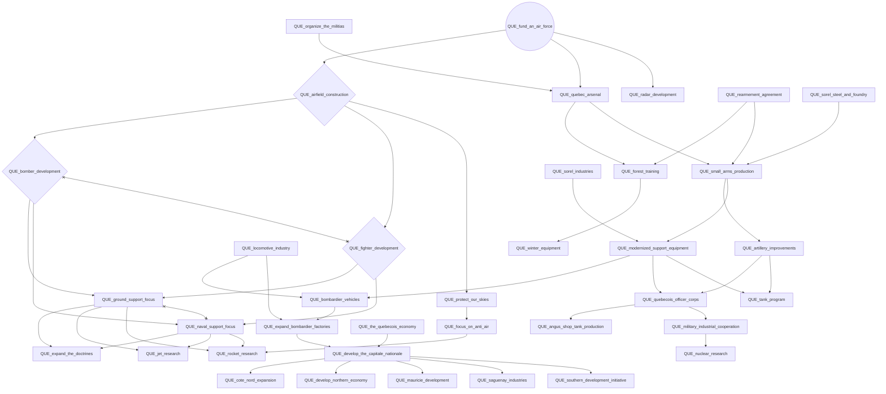
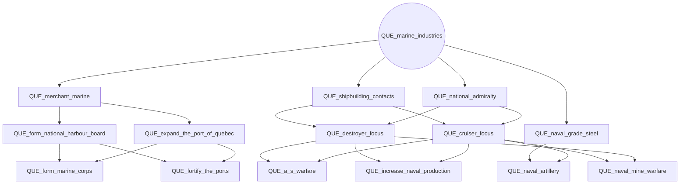
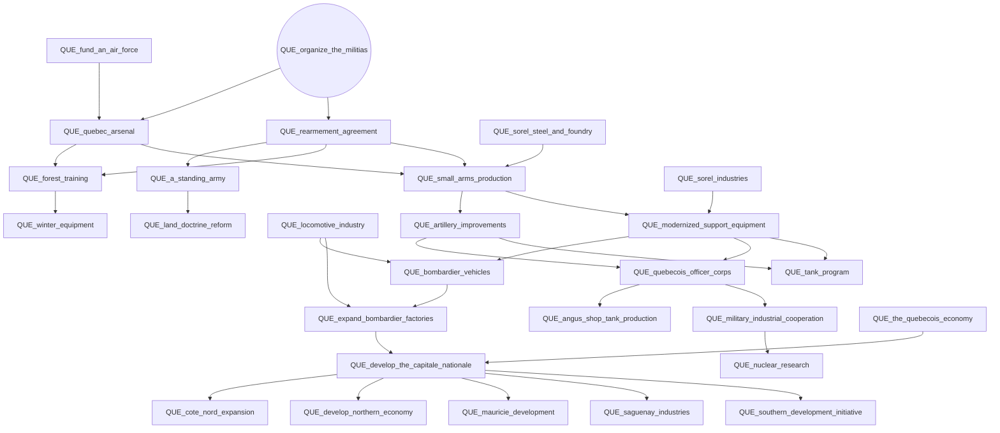
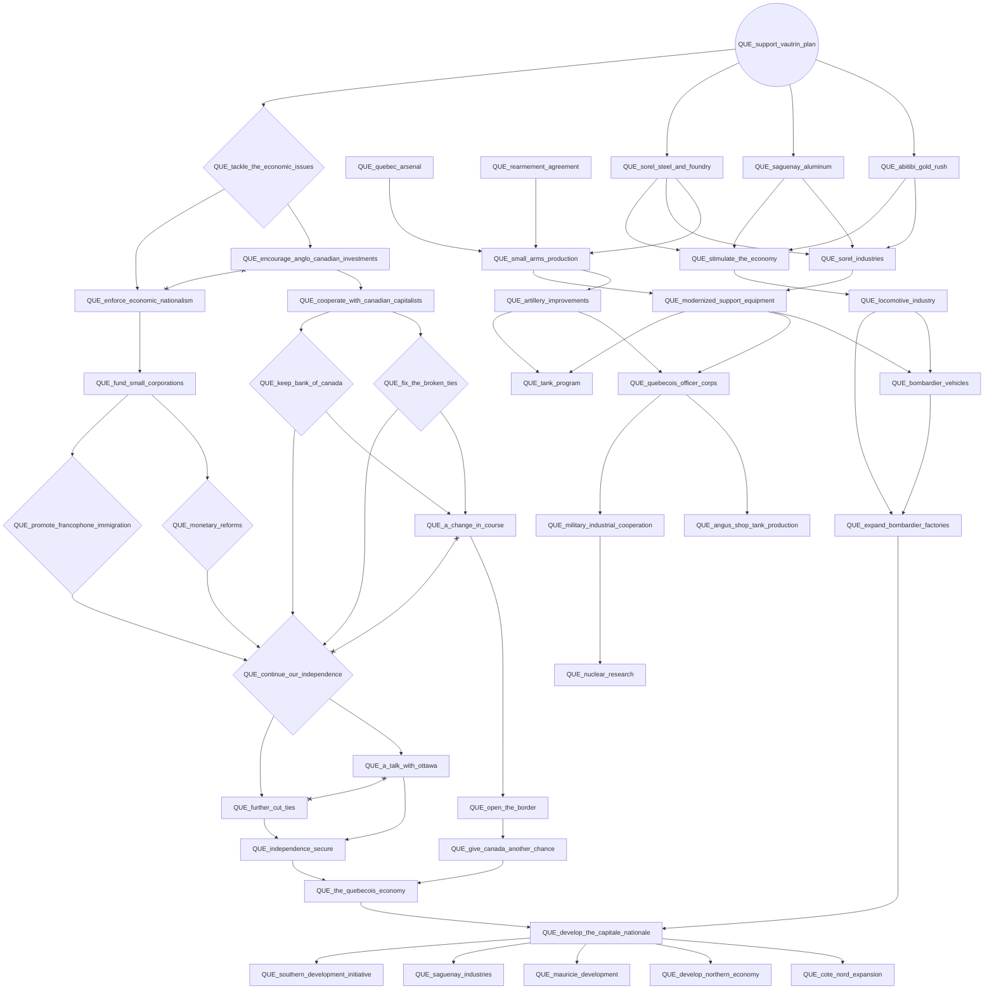

# QUE_fund_an_air_force

```mermaid
flowchart TD
    n1{"QUE_airfield_construction"}
    n2["QUE_angus_shop_tank_production"]
    n3["QUE_artillery_improvements"]
    n4["QUE_bombardier_vehicles"]
    n5{"QUE_bomber_development"}
    n6["QUE_cote_nord_expansion"]
    n7["QUE_develop_northern_economy"]
    n8["QUE_develop_the_capitale_nationale"]
    n9["QUE_expand_bombardier_factories"]
    n10["QUE_expand_the_doctrines"]
    n11{"QUE_fighter_development"}
    n12["QUE_focus_on_anti_air"]
    n13["QUE_forest_training"]
    n14(("QUE_fund_an_air_force"))
    n15["QUE_ground_support_focus"]
    n16["QUE_jet_research"]
    n17["QUE_locomotive_industry"]
    n18["QUE_mauricie_development"]
    n19["QUE_military_industrial_cooperation"]
    n20["QUE_modernized_support_equipment"]
    n21["QUE_naval_support_focus"]
    n22["QUE_nuclear_research"]
    n23["QUE_organize_the_militias"]
    n24["QUE_protect_our_skies"]
    n25["QUE_quebec_arsenal"]
    n26["QUE_quebecois_officer_corps"]
    n27["QUE_radar_development"]
    n28["QUE_rearmement_agreement"]
    n29["QUE_rocket_research"]
    n30["QUE_saguenay_industries"]
    n31["QUE_small_arms_production"]
    n32["QUE_sorel_industries"]
    n33["QUE_sorel_steel_and_foundry"]
    n34["QUE_southern_development_initiative"]
    n35["QUE_tank_program"]
    n36["QUE_the_quebecois_economy"]
    n37["QUE_winter_equipment"]
    n14 --> n1
    n26 --> n2
    n31 --> n3
    n17 --> n4
    n20 --> n4
    n1 --> n5
    n8 --> n6
    n8 --> n7
    n36 --> n8
    n9 --> n8
    n4 --> n9
    n17 --> n9
    n21 --> n10
    n15 --> n10
    n1 --> n11
    n24 --> n12
    n25 --> n13
    n28 --> n13
    n11 --> n15
    n5 --> n15
    n21 --> n16
    n15 --> n16
    n8 --> n18
    n26 --> n19
    n31 --> n20
    n32 --> n20
    n11 --> n21
    n5 --> n21
    n19 --> n22
    n1 --> n24
    n23 --> n25
    n14 --> n25
    n3 --> n26
    n20 --> n26
    n14 --> n27
    n21 --> n29
    n15 --> n29
    n12 --> n29
    n8 --> n30
    n25 --> n31
    n33 --> n31
    n28 --> n31
    n8 --> n34
    n20 --> n35
    n3 --> n35
    n13 --> n37
    n5 x--x n11
    n15 x--x n21
```

# QUE_marine_industries

```mermaid
flowchart TD
    n38["QUE_a_s_warfare"]
    n39["QUE_cruiser_focus"]
    n40["QUE_destroyer_focus"]
    n41["QUE_expand_the_port_of_quebec"]
    n42["QUE_form_marine_corps"]
    n43["QUE_form_national_harbour_board"]
    n44["QUE_fortify_the_ports"]
    n45["QUE_increase_naval_production"]
    n46(("QUE_marine_industries"))
    n47["QUE_merchant_marine"]
    n48["QUE_national_admiralty"]
    n49["QUE_naval_artillery"]
    n50["QUE_naval_grade_steel"]
    n51["QUE_naval_mine_warfare"]
    n52["QUE_shipbuilding_contacts"]
    n40 --> n38
    n39 --> n38
    n52 --> n39
    n48 --> n39
    n52 --> n40
    n48 --> n40
    n47 --> n41
    n43 --> n42
    n41 --> n42
    n47 --> n43
    n43 --> n44
    n41 --> n44
    n40 --> n45
    n39 --> n45
    n46 --> n47
    n46 --> n48
    n50 --> n49
    n39 --> n49
    n46 --> n50
    n39 --> n51
    n40 --> n51
    n46 --> n52
```

# QUE_organize_the_militias

```mermaid
flowchart TD
    n53["QUE_a_standing_army"]
    n2["QUE_angus_shop_tank_production"]
    n3["QUE_artillery_improvements"]
    n4["QUE_bombardier_vehicles"]
    n6["QUE_cote_nord_expansion"]
    n7["QUE_develop_northern_economy"]
    n8["QUE_develop_the_capitale_nationale"]
    n9["QUE_expand_bombardier_factories"]
    n13["QUE_forest_training"]
    n14["QUE_fund_an_air_force"]
    n54["QUE_land_doctrine_reform"]
    n17["QUE_locomotive_industry"]
    n18["QUE_mauricie_development"]
    n19["QUE_military_industrial_cooperation"]
    n20["QUE_modernized_support_equipment"]
    n22["QUE_nuclear_research"]
    n23(("QUE_organize_the_militias"))
    n25["QUE_quebec_arsenal"]
    n26["QUE_quebecois_officer_corps"]
    n28["QUE_rearmement_agreement"]
    n30["QUE_saguenay_industries"]
    n31["QUE_small_arms_production"]
    n32["QUE_sorel_industries"]
    n33["QUE_sorel_steel_and_foundry"]
    n34["QUE_southern_development_initiative"]
    n35["QUE_tank_program"]
    n36["QUE_the_quebecois_economy"]
    n37["QUE_winter_equipment"]
    n28 --> n53
    n26 --> n2
    n31 --> n3
    n17 --> n4
    n20 --> n4
    n8 --> n6
    n8 --> n7
    n36 --> n8
    n9 --> n8
    n4 --> n9
    n17 --> n9
    n25 --> n13
    n28 --> n13
    n53 --> n54
    n8 --> n18
    n26 --> n19
    n31 --> n20
    n32 --> n20
    n19 --> n22
    n23 --> n25
    n14 --> n25
    n3 --> n26
    n20 --> n26
    n23 --> n28
    n8 --> n30
    n25 --> n31
    n33 --> n31
    n28 --> n31
    n8 --> n34
    n20 --> n35
    n3 --> n35
    n13 --> n37
```

# QUE_political_effort

```mermaid
flowchart TD
    n55["QUE_a_bright_future_ahead"]
    n56["QUE_abandon_electorialism"]
    n57["QUE_abandon_ultramontanism"]
    n58["QUE_advantage_francophones"]
    n59["QUE_advatageous_foreign_trade_deal"]
    n60["QUE_aggressive_economic_protectionism"]
    n61["QUE_align_with_mexico"]
    n62["QUE_align_with_moscow"]
    n63["QUE_all_power_to_the_leader"]
    n64["QUE_approach_berlin"]
    n65["QUE_approach_paris"]
    n66["QUE_approach_rome"]
    n67{"QUE_aspirations_of_new_france"}
    n68["QUE_avenge_the_seven_year_war"]
    n69["QUE_bust_down_the_unions"]
    n70["QUE_carry_on_the_work"]
    n71["QUE_cement_catholic_faith"]
    n72{"QUE_christian_social_security"}
    n73["QUE_claim_new_bruinswick"]
    n74["QUE_collectivism"]
    n75["QUE_collectivize_the_means_of_production"]
    n76{"QUE_colonize_the_north"}
    n77{"QUE_communial_defense"}
    n78["QUE_communist_uprising"]
    n79["QUE_consolidate_american_holdings"]
    n80["QUE_consolidate_le_chefs_rule"]
    n81["QUE_contact_blueshirts"]
    n82["QUE_control_literature"]
    n83["QUE_control_the_medias"]
    n84["QUE_corporatisme_ensuite"]
    n85["QUE_councilism"]
    n86["QUE_deal_with_opposition"]
    n87["QUE_demand_new_brunswick"]
    n88["QUE_demand_newfoundlands"]
    n89["QUE_demand_newfoundlands_fascism"]
    n90["QUE_democratic_diplomacy"]
    n91["QUE_diplomatic_neutrality"]
    n92["QUE_disband_parlimentarism"]
    n93["QUE_educate_the_masses"]
    n94["QUE_electrify_the_countryside"]
    n95["QUE_encourage_christian_mutualism"]
    n96["QUE_encourage_local_participation"]
    n97["QUE_encourage_traditionalist_economics"]
    n98["QUE_enforce_compulsory_education"]
    n99["QUE_enforce_local_ressource_exploitation"]
    n100["QUE_enforce_quotas"]
    n101["QUE_enforce_religious_morality"]
    n102{"QUE_enshrine_women_rights"}
    n103{"QUE_establish_farmers_coops"}
    n104["QUE_establish_republican_canada"]
    n105["QUE_everything_for_the_state"]
    n106["QUE_expand_into_america"]
    n107{"QUE_expansionism"}
    n108{"QUE_exploit_hydroelectricity"}
    n109["QUE_fight_against_the_ideological_enemy"]
    n110["QUE_first_nationalist_congress"]
    n111["QUE_focus_on_family"]
    n112["QUE_for_the_good_of_the_nation"]
    n113{"QUE_forced_industrialisation"}
    n114["QUE_found_hydro_quebec"]
    n115{"QUE_found_the_conseil_superieur_du_travail"}
    n116["QUE_free_the_canadian_workers"]
    n117["QUE_further_funding_to_culture"]
    n118["QUE_give_power_to_the_clergy"]
    n119["QUE_glorify_clerical_past"]
    n120["QUE_greater_quebec_concept"]
    n121["QUE_improve_agrarian_laws"]
    n122["QUE_incorporate_hydroquebec_in_the_state"]
    n123["QUE_institute_social_welfare"]
    n124["QUE_integrate_new_england"]
    n125["QUE_invade_canada"]
    n126["QUE_labor_laws"]
    n127["QUE_let_the_church_control_education_and_healthcare"]
    n128{"QUE_liberal_in_charge"}
    n129["QUE_liberals_legacy_saved"]
    n130["QUE_limit_economic_government_interference"]
    n131["QUE_maitres_chez_nous"]
    n132["QUE_mandatory_minimum_wage"]
    n133["QUE_militaristic_society"]
    n134["QUE_national_free_market"]
    n135["QUE_national_identity_propaganda"]
    n136["QUE_nationalize_key_industries"]
    n137["QUE_order_authority_nation"]
    n138["QUE_our_own_way"]
    n139["QUE_patriotic_education"]
    n140{"QUE_political_effort"}
    n141{"QUE_political_effort_puppet"}
    n142["QUE_political_nationalism"]
    n143["QUE_politique_dabord"]
    n144["QUE_prepare_the_southern_front"]
    n145["QUE_proclaim_french_canada"]
    n146["QUE_proclaim_new_france"]
    n147["QUE_promote_french_language"]
    n148["QUE_promote_interventionism"]
    n149["QUE_provide_to_the_people"]
    n150["QUE_purge_clerical_elements"]
    n151["QUE_purge_the_anglophone"]
    n152["QUE_push_westward"]
    n153["QUE_quebecois_peoples_republic"]
    n154{"QUE_radical_changes"}
    n155["QUE_reclaim_france"]
    n156["QUE_reclaim_southern_land"]
    n157{"QUE_redistribute_the_church_wealth"}
    n158["QUE_reform_the_party"]
    n159["QUE_remove_the_aristocracy"]
    n160{"QUE_revolutionary_patriotism"}
    n161["QUE_safeguard_the_rights_to_unionize"]
    n162["QUE_secret_police"]
    n163["QUE_seize_opponents_assets"]
    n164["QUE_seize_the_royal_assets"]
    n165["QUE_shatter_the_dream"]
    n166["QUE_soviet_tank_program"]
    n167["QUE_spy_the_opposition"]
    n168["QUE_state_led_labor_unions"]
    n169["QUE_storm_the_parliament"]
    n170["QUE_subjugate_mexico"]
    n171{"QUE_subsidies_to_corporations"}
    n172["QUE_the_padlock_law"]
    n173{"QUE_the_quebec_red_army"}
    n174{"QUE_the_union_nationale_wins"}
    n175["QUE_total_self_sufficiency"]
    n176["QUE_toward_utopian_socialism"]
    n177{"QUE_trust_in_democracy"}
    n178["QUE_united_in_communism"]
    n179["QUE_universal_suffrage"]
    n180["QUE_use_the_quebecois_nationalists"]
    n181["QUE_vilify_federalists"]
    n182["QUE_wartime_rationing"]
    n183["QUE_weaponize_mysticism"]
    n176 --> n55
    n153 --> n55
    n76 --> n56
    n110 --> n57
    n183 --> n58
    n82 --> n58
    n172 --> n59
    n131 --> n60
    n67 --> n61
    n108 --> n62
    n173 --> n62
    n77 --> n62
    n157 --> n62
    n169 --> n63
    n107 --> n64
    n67 --> n65
    n107 --> n66
    n58 --> n67
    n95 --> n67
    n146 --> n68
    n172 --> n69
    n76 --> n70
    n131 --> n71
    n118 --> n72
    n127 --> n72
    n138 --> n73
    n65 --> n73
    n61 --> n73
    n154 --> n74
    n78 --> n75
    n59 --> n76
    n83 --> n76
    n69 --> n76
    n160 --> n77
    n74 --> n78
    n106 --> n79
    n56 --> n80
    n148 --> n81
    n63 --> n81
    n71 --> n82
    n172 --> n83
    n180 --> n83
    n181 --> n84
    n96 --> n85
    n63 --> n86
    n55 --> n87
    n55 --> n88
    n90 --> n88
    n107 --> n89
    n67 --> n89
    n171 --> n90
    n72 --> n90
    n102 --> n90
    n72 --> n91
    n171 --> n91
    n102 --> n91
    n86 --> n92
    n178 --> n93
    n151 --> n93
    n147 --> n94
    n134 --> n95
    n175 --> n96
    n56 --> n97
    n158 --> n98
    n121 --> n98
    n75 --> n99
    n166 --> n100
    n174 --> n101
    n122 --> n102
    n117 --> n102
    n175 --> n103
    n152 --> n104
    n136 --> n105
    n168 --> n105
    n125 --> n106
    n133 --> n107
    n137 --> n107
    n105 --> n107
    n99 --> n108
    n79 --> n109
    n170 --> n109
    n111 --> n110
    n139 --> n110
    n92 --> n110
    n135 --> n111
    n97 --> n112
    n62 --> n113
    n126 --> n114
    n172 --> n114
    n128 --> n115
    n87 --> n116
    n161 --> n117
    n123 --> n117
    n112 --> n118
    n167 --> n118
    n110 --> n119
    n116 --> n120
    n115 --> n121
    n129 --> n122
    n129 --> n123
    n165 --> n124
    n138 --> n125
    n64 --> n125
    n66 --> n125
    n115 --> n126
    n94 --> n127
    n130 --> n127
    n177 --> n128
    n179 --> n129
    n147 --> n130
    n119 --> n131
    n174 --> n132
    n150 --> n133
    n60 --> n134
    n148 --> n135
    n84 --> n136
    n150 --> n137
    n107 --> n138
    n67 --> n138
    n135 --> n139
    n154 --> n142
    n181 --> n143
    n152 --> n144
    n125 --> n145
    n156 --> n146
    n70 --> n147
    n169 --> n148
    n96 --> n149
    n143 --> n150
    n103 --> n151
    n113 --> n151
    n73 --> n152
    n162 --> n153
    n100 --> n153
    n140 --> n154
    n141 --> n154
    n146 --> n155
    n144 --> n156
    n104 --> n156
    n164 --> n157
    n128 --> n158
    n78 --> n159
    n159 --> n160
    n129 --> n161
    n166 --> n162
    n136 --> n163
    n134 --> n163
    n75 --> n164
    n55 --> n165
    n62 --> n166
    n80 --> n167
    n84 --> n168
    n142 --> n169
    n106 --> n170
    n118 --> n171
    n127 --> n171
    n128 --> n172
    n174 --> n172
    n160 --> n173
    n177 --> n174
    n108 --> n175
    n173 --> n175
    n77 --> n175
    n157 --> n175
    n85 --> n176
    n149 --> n176
    n140 --> n177
    n141 --> n177
    n103 --> n178
    n113 --> n178
    n114 --> n179
    n69 --> n179
    n98 --> n179
    n101 --> n180
    n132 --> n180
    n57 --> n181
    n163 --> n182
    n71 --> n183
    n56 x--x n70
    n61 x--x n64
    n61 x--x n65
    n61 x--x n66
    n61 x--x n138
    n62 x--x n175
    n64 x--x n65
    n64 x--x n66
    n64 x--x n138
    n65 x--x n66
    n65 x--x n138
    n66 x--x n138
    n74 x--x n142
    n77 x--x n173
    n90 x--x n91
    n126 x--x n172
    n128 x--x n174
    n140 x--x n141
    n151 x--x n178
    n154 x--x n177
```

# QUE_political_effort_puppet

```mermaid
flowchart TD
    n55["QUE_a_bright_future_ahead"]
    n56["QUE_abandon_electorialism"]
    n57["QUE_abandon_ultramontanism"]
    n58["QUE_advantage_francophones"]
    n59["QUE_advatageous_foreign_trade_deal"]
    n60["QUE_aggressive_economic_protectionism"]
    n61["QUE_align_with_mexico"]
    n62["QUE_align_with_moscow"]
    n63["QUE_all_power_to_the_leader"]
    n64["QUE_approach_berlin"]
    n65["QUE_approach_paris"]
    n66["QUE_approach_rome"]
    n67{"QUE_aspirations_of_new_france"}
    n68["QUE_avenge_the_seven_year_war"]
    n69["QUE_bust_down_the_unions"]
    n70["QUE_carry_on_the_work"]
    n71["QUE_cement_catholic_faith"]
    n72{"QUE_christian_social_security"}
    n73["QUE_claim_new_bruinswick"]
    n74["QUE_collectivism"]
    n75["QUE_collectivize_the_means_of_production"]
    n76{"QUE_colonize_the_north"}
    n77{"QUE_communial_defense"}
    n78["QUE_communist_uprising"]
    n79["QUE_consolidate_american_holdings"]
    n80["QUE_consolidate_le_chefs_rule"]
    n81["QUE_contact_blueshirts"]
    n82["QUE_control_literature"]
    n83["QUE_control_the_medias"]
    n84["QUE_corporatisme_ensuite"]
    n85["QUE_councilism"]
    n86["QUE_deal_with_opposition"]
    n87["QUE_demand_new_brunswick"]
    n88["QUE_demand_newfoundlands"]
    n89["QUE_demand_newfoundlands_fascism"]
    n90["QUE_democratic_diplomacy"]
    n91["QUE_diplomatic_neutrality"]
    n92["QUE_disband_parlimentarism"]
    n93["QUE_educate_the_masses"]
    n94["QUE_electrify_the_countryside"]
    n95["QUE_encourage_christian_mutualism"]
    n96["QUE_encourage_local_participation"]
    n97["QUE_encourage_traditionalist_economics"]
    n98["QUE_enforce_compulsory_education"]
    n99["QUE_enforce_local_ressource_exploitation"]
    n100["QUE_enforce_quotas"]
    n101["QUE_enforce_religious_morality"]
    n102{"QUE_enshrine_women_rights"}
    n103{"QUE_establish_farmers_coops"}
    n104["QUE_establish_republican_canada"]
    n105["QUE_everything_for_the_state"]
    n106["QUE_expand_into_america"]
    n107{"QUE_expansionism"}
    n108{"QUE_exploit_hydroelectricity"}
    n109["QUE_fight_against_the_ideological_enemy"]
    n110["QUE_first_nationalist_congress"]
    n111["QUE_focus_on_family"]
    n112["QUE_for_the_good_of_the_nation"]
    n113{"QUE_forced_industrialisation"}
    n114["QUE_found_hydro_quebec"]
    n115{"QUE_found_the_conseil_superieur_du_travail"}
    n116["QUE_free_the_canadian_workers"]
    n117["QUE_further_funding_to_culture"]
    n118["QUE_give_power_to_the_clergy"]
    n119["QUE_glorify_clerical_past"]
    n120["QUE_greater_quebec_concept"]
    n121["QUE_improve_agrarian_laws"]
    n122["QUE_incorporate_hydroquebec_in_the_state"]
    n123["QUE_institute_social_welfare"]
    n124["QUE_integrate_new_england"]
    n125["QUE_invade_canada"]
    n126["QUE_labor_laws"]
    n127["QUE_let_the_church_control_education_and_healthcare"]
    n128{"QUE_liberal_in_charge"}
    n129["QUE_liberals_legacy_saved"]
    n130["QUE_limit_economic_government_interference"]
    n131["QUE_maitres_chez_nous"]
    n132["QUE_mandatory_minimum_wage"]
    n133["QUE_militaristic_society"]
    n134["QUE_national_free_market"]
    n135["QUE_national_identity_propaganda"]
    n136["QUE_nationalize_key_industries"]
    n137["QUE_order_authority_nation"]
    n138["QUE_our_own_way"]
    n139["QUE_patriotic_education"]
    n140{"QUE_political_effort"}
    n141{"QUE_political_effort_puppet"}
    n142["QUE_political_nationalism"]
    n143["QUE_politique_dabord"]
    n144["QUE_prepare_the_southern_front"]
    n145["QUE_proclaim_french_canada"]
    n146["QUE_proclaim_new_france"]
    n147["QUE_promote_french_language"]
    n148["QUE_promote_interventionism"]
    n149["QUE_provide_to_the_people"]
    n150["QUE_purge_clerical_elements"]
    n151["QUE_purge_the_anglophone"]
    n152["QUE_push_westward"]
    n153["QUE_quebecois_peoples_republic"]
    n154{"QUE_radical_changes"}
    n155["QUE_reclaim_france"]
    n156["QUE_reclaim_southern_land"]
    n157{"QUE_redistribute_the_church_wealth"}
    n158["QUE_reform_the_party"]
    n159["QUE_remove_the_aristocracy"]
    n160{"QUE_revolutionary_patriotism"}
    n161["QUE_safeguard_the_rights_to_unionize"]
    n162["QUE_secret_police"]
    n163["QUE_seize_opponents_assets"]
    n164["QUE_seize_the_royal_assets"]
    n165["QUE_shatter_the_dream"]
    n166["QUE_soviet_tank_program"]
    n167["QUE_spy_the_opposition"]
    n168["QUE_state_led_labor_unions"]
    n169["QUE_storm_the_parliament"]
    n170["QUE_subjugate_mexico"]
    n171{"QUE_subsidies_to_corporations"}
    n172["QUE_the_padlock_law"]
    n173{"QUE_the_quebec_red_army"}
    n174{"QUE_the_union_nationale_wins"}
    n175["QUE_total_self_sufficiency"]
    n176["QUE_toward_utopian_socialism"]
    n177{"QUE_trust_in_democracy"}
    n178["QUE_united_in_communism"]
    n179["QUE_universal_suffrage"]
    n180["QUE_use_the_quebecois_nationalists"]
    n181["QUE_vilify_federalists"]
    n182["QUE_wartime_rationing"]
    n183["QUE_weaponize_mysticism"]
    n176 --> n55
    n153 --> n55
    n76 --> n56
    n110 --> n57
    n183 --> n58
    n82 --> n58
    n172 --> n59
    n131 --> n60
    n67 --> n61
    n108 --> n62
    n173 --> n62
    n77 --> n62
    n157 --> n62
    n169 --> n63
    n107 --> n64
    n67 --> n65
    n107 --> n66
    n58 --> n67
    n95 --> n67
    n146 --> n68
    n172 --> n69
    n76 --> n70
    n131 --> n71
    n118 --> n72
    n127 --> n72
    n138 --> n73
    n65 --> n73
    n61 --> n73
    n154 --> n74
    n78 --> n75
    n59 --> n76
    n83 --> n76
    n69 --> n76
    n160 --> n77
    n74 --> n78
    n106 --> n79
    n56 --> n80
    n148 --> n81
    n63 --> n81
    n71 --> n82
    n172 --> n83
    n180 --> n83
    n181 --> n84
    n96 --> n85
    n63 --> n86
    n55 --> n87
    n55 --> n88
    n90 --> n88
    n107 --> n89
    n67 --> n89
    n171 --> n90
    n72 --> n90
    n102 --> n90
    n72 --> n91
    n171 --> n91
    n102 --> n91
    n86 --> n92
    n178 --> n93
    n151 --> n93
    n147 --> n94
    n134 --> n95
    n175 --> n96
    n56 --> n97
    n158 --> n98
    n121 --> n98
    n75 --> n99
    n166 --> n100
    n174 --> n101
    n122 --> n102
    n117 --> n102
    n175 --> n103
    n152 --> n104
    n136 --> n105
    n168 --> n105
    n125 --> n106
    n133 --> n107
    n137 --> n107
    n105 --> n107
    n99 --> n108
    n79 --> n109
    n170 --> n109
    n111 --> n110
    n139 --> n110
    n92 --> n110
    n135 --> n111
    n97 --> n112
    n62 --> n113
    n126 --> n114
    n172 --> n114
    n128 --> n115
    n87 --> n116
    n161 --> n117
    n123 --> n117
    n112 --> n118
    n167 --> n118
    n110 --> n119
    n116 --> n120
    n115 --> n121
    n129 --> n122
    n129 --> n123
    n165 --> n124
    n138 --> n125
    n64 --> n125
    n66 --> n125
    n115 --> n126
    n94 --> n127
    n130 --> n127
    n177 --> n128
    n179 --> n129
    n147 --> n130
    n119 --> n131
    n174 --> n132
    n150 --> n133
    n60 --> n134
    n148 --> n135
    n84 --> n136
    n150 --> n137
    n107 --> n138
    n67 --> n138
    n135 --> n139
    n154 --> n142
    n181 --> n143
    n152 --> n144
    n125 --> n145
    n156 --> n146
    n70 --> n147
    n169 --> n148
    n96 --> n149
    n143 --> n150
    n103 --> n151
    n113 --> n151
    n73 --> n152
    n162 --> n153
    n100 --> n153
    n140 --> n154
    n141 --> n154
    n146 --> n155
    n144 --> n156
    n104 --> n156
    n164 --> n157
    n128 --> n158
    n78 --> n159
    n159 --> n160
    n129 --> n161
    n166 --> n162
    n136 --> n163
    n134 --> n163
    n75 --> n164
    n55 --> n165
    n62 --> n166
    n80 --> n167
    n84 --> n168
    n142 --> n169
    n106 --> n170
    n118 --> n171
    n127 --> n171
    n128 --> n172
    n174 --> n172
    n160 --> n173
    n177 --> n174
    n108 --> n175
    n173 --> n175
    n77 --> n175
    n157 --> n175
    n85 --> n176
    n149 --> n176
    n140 --> n177
    n141 --> n177
    n103 --> n178
    n113 --> n178
    n114 --> n179
    n69 --> n179
    n98 --> n179
    n101 --> n180
    n132 --> n180
    n57 --> n181
    n163 --> n182
    n71 --> n183
    n56 x--x n70
    n61 x--x n64
    n61 x--x n65
    n61 x--x n66
    n61 x--x n138
    n62 x--x n175
    n64 x--x n65
    n64 x--x n66
    n64 x--x n138
    n65 x--x n66
    n65 x--x n138
    n66 x--x n138
    n74 x--x n142
    n77 x--x n173
    n90 x--x n91
    n126 x--x n172
    n128 x--x n174
    n140 x--x n141
    n151 x--x n178
    n154 x--x n177
```

# QUE_support_vautrin_plan

```mermaid
flowchart TD
    n184["QUE_a_change_in_course"]
    n185["QUE_a_talk_with_ottawa"]
    n186["QUE_abitibi_gold_rush"]
    n2["QUE_angus_shop_tank_production"]
    n3["QUE_artillery_improvements"]
    n4["QUE_bombardier_vehicles"]
    n187{"QUE_continue_our_independence"}
    n188["QUE_cooperate_with_canadian_capitalists"]
    n6["QUE_cote_nord_expansion"]
    n7["QUE_develop_northern_economy"]
    n8["QUE_develop_the_capitale_nationale"]
    n189["QUE_encourage_anglo_canadian_investments"]
    n190["QUE_enforce_economic_nationalism"]
    n9["QUE_expand_bombardier_factories"]
    n191{"QUE_fix_the_broken_ties"}
    n192["QUE_fund_small_corporations"]
    n193["QUE_further_cut_ties"]
    n194["QUE_give_canada_another_chance"]
    n195["QUE_independence_secure"]
    n196{"QUE_keep_bank_of_canada"}
    n17["QUE_locomotive_industry"]
    n18["QUE_mauricie_development"]
    n19["QUE_military_industrial_cooperation"]
    n20["QUE_modernized_support_equipment"]
    n197{"QUE_monetary_reforms"}
    n22["QUE_nuclear_research"]
    n198["QUE_open_the_border"]
    n199{"QUE_promote_francophone_immigration"}
    n25["QUE_quebec_arsenal"]
    n26["QUE_quebecois_officer_corps"]
    n28["QUE_rearmement_agreement"]
    n200["QUE_saguenay_aluminum"]
    n30["QUE_saguenay_industries"]
    n31["QUE_small_arms_production"]
    n32["QUE_sorel_industries"]
    n33["QUE_sorel_steel_and_foundry"]
    n34["QUE_southern_development_initiative"]
    n201["QUE_stimulate_the_economy"]
    n202(("QUE_support_vautrin_plan"))
    n203{"QUE_tackle_the_economic_issues"}
    n35["QUE_tank_program"]
    n36["QUE_the_quebecois_economy"]
    n191 --> n184
    n196 --> n184
    n187 --> n185
    n202 --> n186
    n26 --> n2
    n31 --> n3
    n17 --> n4
    n20 --> n4
    n191 --> n187
    n196 --> n187
    n199 --> n187
    n197 --> n187
    n189 --> n188
    n8 --> n6
    n8 --> n7
    n36 --> n8
    n9 --> n8
    n203 --> n189
    n203 --> n190
    n4 --> n9
    n17 --> n9
    n188 --> n191
    n190 --> n192
    n187 --> n193
    n198 --> n194
    n185 --> n195
    n193 --> n195
    n188 --> n196
    n201 --> n17
    n8 --> n18
    n26 --> n19
    n31 --> n20
    n32 --> n20
    n192 --> n197
    n19 --> n22
    n184 --> n198
    n192 --> n199
    n3 --> n26
    n20 --> n26
    n202 --> n200
    n8 --> n30
    n25 --> n31
    n33 --> n31
    n28 --> n31
    n33 --> n32
    n200 --> n32
    n186 --> n32
    n202 --> n33
    n8 --> n34
    n33 --> n201
    n200 --> n201
    n186 --> n201
    n202 --> n203
    n20 --> n35
    n3 --> n35
    n194 --> n36
    n195 --> n36
    n184 x--x n187
    n185 x--x n193
    n189 x--x n190
```
