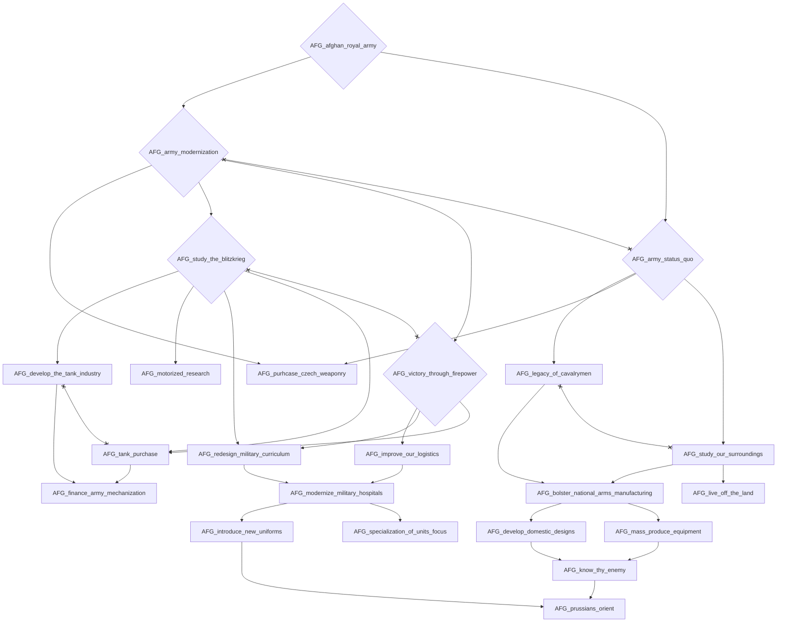
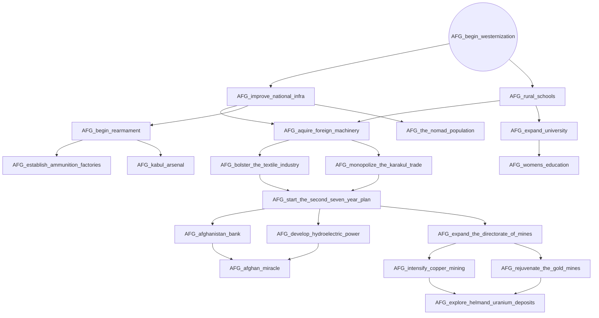
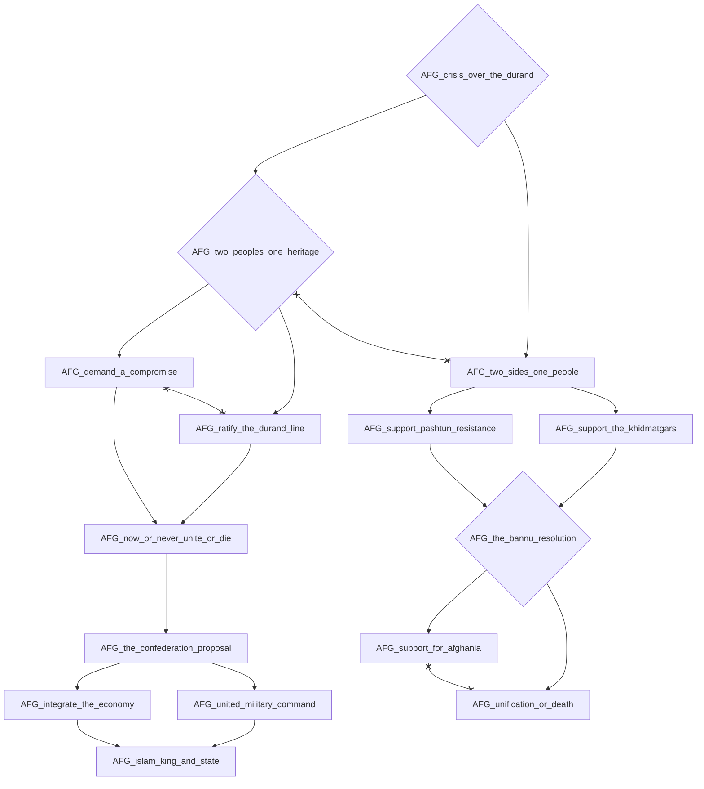
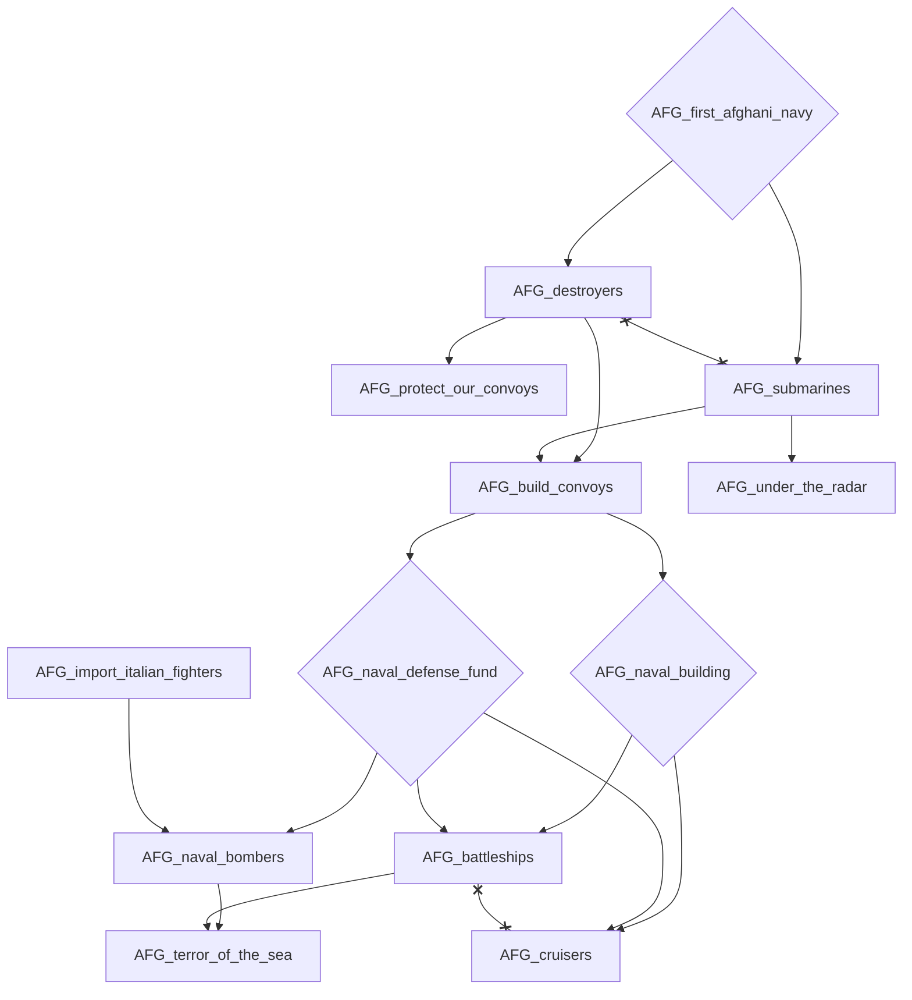
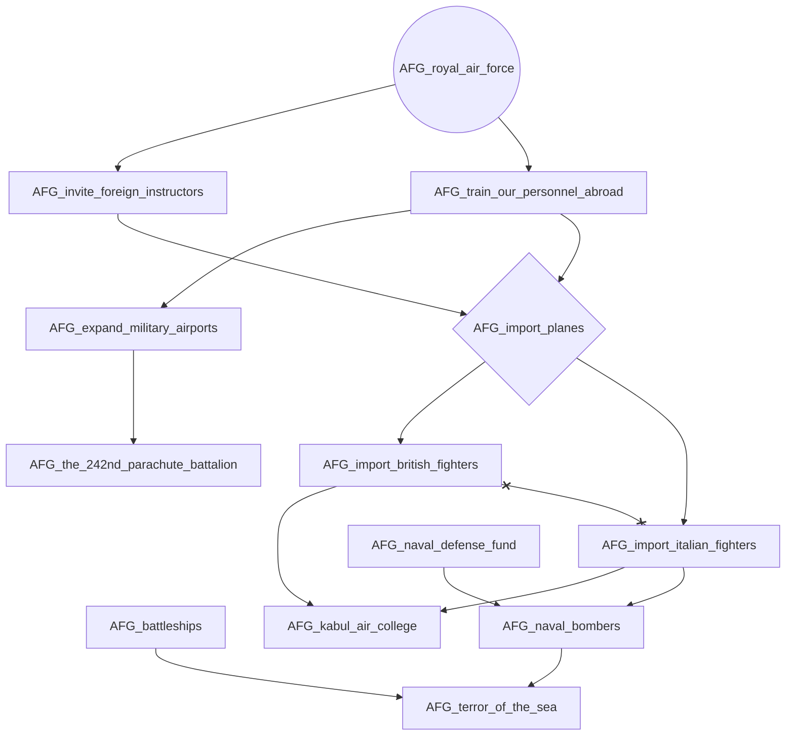

# AFG_afghan_royal_army

```mermaid
flowchart TD
    n1{"AFG_afghan_royal_army"}
    n2{"AFG_army_modernization"}
    n3{"AFG_army_status_quo"}
    n4["AFG_bolster_national_arms_manufacturing"]
    n5["AFG_develop_domestic_designs"]
    n6["AFG_develop_the_tank_industry"]
    n7["AFG_finance_army_mechanization"]
    n8["AFG_improve_our_logistics"]
    n9["AFG_introduce_new_uniforms"]
    n10["AFG_know_thy_enemy"]
    n11["AFG_legacy_of_cavalrymen"]
    n12["AFG_live_off_the_land"]
    n13["AFG_mass_produce_equipment"]
    n14["AFG_modernize_military_hospitals"]
    n15["AFG_motorized_research"]
    n16["AFG_prussians_orient"]
    n17["AFG_purhcase_czech_weaponry"]
    n18["AFG_redesign_military_curriculum"]
    n19["AFG_specialization_of_units_focus"]
    n20["AFG_study_our_surroundings"]
    n21{"AFG_study_the_blitzkrieg"}
    n22["AFG_tank_purchase"]
    n23{"AFG_victory_through_firepower"}
    n1 --> n2
    n1 --> n3
    n20 --> n4
    n11 --> n4
    n4 --> n5
    n21 --> n6
    n6 --> n7
    n22 --> n7
    n23 --> n8
    n14 --> n9
    n5 --> n10
    n13 --> n10
    n3 --> n11
    n20 --> n12
    n4 --> n13
    n8 --> n14
    n18 --> n14
    n21 --> n15
    n9 --> n16
    n10 --> n16
    n2 --> n17
    n3 --> n17
    n23 --> n18
    n21 --> n18
    n14 --> n19
    n3 --> n20
    n2 --> n21
    n21 --> n22
    n23 --> n22
    n2 --> n23
    n2 x--x n3
    n6 x--x n22
    n11 x--x n20
    n21 x--x n23
```

# AFG_begin_westernization

```mermaid
flowchart TD
    n24["AFG_afghan_miracle"]
    n25["AFG_afghanistan_bank"]
    n26["AFG_aquire_foreign_machinery"]
    n27["AFG_begin_rearmament"]
    n28(("AFG_begin_westernization"))
    n29["AFG_bolster_the_textile_industry"]
    n30["AFG_develop_hydroelectric_power"]
    n31["AFG_establish_ammunition_factories"]
    n32["AFG_expand_the_directorate_of_mines"]
    n33["AFG_expand_university"]
    n34["AFG_explore_helmand_uranium_deposits"]
    n35["AFG_improve_national_infra"]
    n36["AFG_intensify_copper_mining"]
    n37["AFG_kabul_arsenal"]
    n38["AFG_monopolize_the_karakul_trade"]
    n39["AFG_rejuvenate_the_gold_mines"]
    n40["AFG_rural_schools"]
    n41["AFG_start_the_second_seven_year_plan"]
    n42["AFG_the_nomad_population"]
    n43["AFG_womens_education"]
    n25 --> n24
    n30 --> n24
    n41 --> n25
    n35 --> n26
    n40 --> n26
    n35 --> n27
    n26 --> n29
    n41 --> n30
    n27 --> n31
    n41 --> n32
    n40 --> n33
    n36 --> n34
    n39 --> n34
    n28 --> n35
    n32 --> n36
    n27 --> n37
    n26 --> n38
    n32 --> n39
    n28 --> n40
    n29 --> n41
    n38 --> n41
    n35 --> n42
    n33 --> n43
```

# AFG_crisis_over_the_durand

```mermaid
flowchart TD
    n44{"AFG_crisis_over_the_durand"}
    n45["AFG_demand_a_compromise"]
    n46["AFG_integrate_the_economy"]
    n47["AFG_islam_king_and_state"]
    n48["AFG_now_or_never_unite_or_die"]
    n49["AFG_ratify_the_durand_line"]
    n50["AFG_support_for_afghania"]
    n51["AFG_support_pashtun_resistance"]
    n52["AFG_support_the_khidmatgars"]
    n53{"AFG_the_bannu_resolution"}
    n54["AFG_the_confederation_proposal"]
    n55{"AFG_two_peoples_one_heritage"}
    n56["AFG_two_sides_one_people"]
    n57["AFG_unification_or_death"]
    n58["AFG_united_military_command"]
    n55 --> n45
    n54 --> n46
    n46 --> n47
    n58 --> n47
    n45 --> n48
    n49 --> n48
    n55 --> n49
    n53 --> n50
    n56 --> n51
    n56 --> n52
    n51 --> n53
    n52 --> n53
    n48 --> n54
    n44 --> n55
    n44 --> n56
    n53 --> n57
    n54 --> n58
    n45 x--x n49
    n50 x--x n57
    n55 x--x n56
```

# AFG_first_afghani_navy

```mermaid
flowchart TD
    n59["AFG_battleships"]
    n60["AFG_build_convoys"]
    n61["AFG_cruisers"]
    n62["AFG_destroyers"]
    n63{"AFG_first_afghani_navy"}
    n64["AFG_import_italian_fighters"]
    n65["AFG_naval_bombers"]
    n66{"AFG_naval_building"}
    n67{"AFG_naval_defense_fund"}
    n68["AFG_protect_our_convoys"]
    n69["AFG_submarines"]
    n70["AFG_terror_of_the_sea"]
    n71["AFG_under_the_radar"]
    n66 --> n59
    n67 --> n59
    n62 --> n60
    n69 --> n60
    n66 --> n61
    n67 --> n61
    n63 --> n62
    n67 --> n65
    n64 --> n65
    n60 --> n66
    n60 --> n67
    n62 --> n68
    n63 --> n69
    n65 --> n70
    n59 --> n70
    n69 --> n71
    n59 x--x n61
    n62 x--x n69
```

# AFG_first_loya_jirga

```mermaid
flowchart TD
    n72{"AFG_abolish_the_regency"}
    n73["AFG_acquire_german_radios"]
    n74["AFG_adopt_constitutional_monarchy"]
    n75["AFG_afghan_ssr"]
    n76["AFG_afghan_workers_program"]
    n77["AFG_ally_with_the_young_afghans"]
    n78["AFG_amanullahs_visit_to_europe"]
    n79{"AFG_amend_the_constitution"}
    n80["AFG_annul_the_hasht_nafari"]
    n81["AFG_anti_fascist_league"]
    n82["AFG_appoint_hashim"]
    n83["AFG_appoint_mahmud"]
    n84["AFG_approach_mubashir"]
    n85["AFG_approach_pakistani_resistance"]
    n86["AFG_approach_the_soviets"]
    n87["AFG_aquire_british_ships"]
    n88["AFG_army_reform"]
    n89["AFG_arrest_qiamuddin"]
    n90{"AFG_attaturks_legacy"}
    n91["AFG_backtrack_on_reforms"]
    n92["AFG_ban_political_parties"]
    n93["AFG_beacon_of_the_orient"]
    n94["AFG_begin_colectivization"]
    n95["AFG_bolster_the_nationalists"]
    n96["AFG_break_the_six_arrows"]
    n97["AFG_british_exchange_program"]
    n98["AFG_build_up_roads"]
    n99["AFG_centralize_the_bank_of_afg"]
    n100["AFG_combat_foreign_influence"]
    n101["AFG_combined_training"]
    n102["AFG_construct_the_great_north_road"]
    n103["AFG_contact_faqir"]
    n104["AFG_contact_tribes"]
    n105["AFG_continue_railway_development"]
    n106["AFG_continute_nadir_shahs_reforms"]
    n107["AFG_crush_hazara_nationalism"]
    n108["AFG_deal_with_the_devil"]
    n109{"AFG_depose_the_king"}
    n110["AFG_deterrence_focus"]
    n111["AFG_disband_the_jirga"]
    n112["AFG_economic_privatization"]
    n113["AFG_enact_censorship"]
    n114["AFG_end_soviet_rule"]
    n115["AFG_end_the_revolution"]
    n116["AFG_enforce_the_pashtunwali_r56"]
    n117["AFG_eradicate_communism"]
    n118["AFG_establish_radio_kabul"]
    n119["AFG_export_based_economy"]
    n120["AFG_fatherland_party_triumph"]
    n121{"AFG_first_loya_jirga"}
    n122["AFG_five_year_plan"]
    n123["AFG_foreign_economic_aid"]
    n124["AFG_form_khad"]
    n125["AFG_form_muslim_youth"]
    n126["AFG_form_the_afghan_red_crescent"]
    n127{"AFG_form_the_turkestan_legion_r56"}
    n128["AFG_form_watan_party"]
    n129["AFG_form_weekh_zalmian"]
    n130["AFG_form_worker_communes"]
    n131["AFG_fortify_the_durand_line"]
    n132["AFG_from_the_leopard_corps"]
    n133["AFG_fund_the_army"]
    n134{"AFG_german_equipment"}
    n135["AFG_german_investments_program"]
    n136["AFG_german_junker_purchase"]
    n137["AFG_give_hazara_rights"]
    n138["AFG_global_islamic_revolution"]
    n139["AFG_grant_land_concessions"]
    n140["AFG_greater_afghanistan"]
    n141{"AFG_handle_the_king"}
    n142["AFG_implement_autarky"]
    n143["AFG_implement_autarky_daoud"]
    n144["AFG_in_alexanders_footsteps"]
    n145{"AFG_incorporate_tajikistan"}
    n146["AFG_increase_school_funding"]
    n147["AFG_infrastructure_privatization"]
    n148{"AFG_institutionalize_pashto"}
    n149["AFG_international_mujahideen"]
    n150["AFG_into_pakistan"]
    n151["AFG_introduce_new_taxes"]
    n152{"AFG_invite_abwehr_agents"}
    n153["AFG_invite_amin_al_husseini"]
    n154["AFG_invite_jamaat_islami"]
    n155["AFG_invite_pakistani_military"]
    n156["AFG_invite_wehrmacht_officers"]
    n157["AFG_irrigation_scheme"]
    n158["AFG_islamic_cooperation"]
    n159["AFG_join_allies"]
    n160["AFG_join_the_axis"]
    n161["AFG_kabul_military_college"]
    n162["AFG_land_redistribution"]
    n163["AFG_legacy_of_the_yellow_expedition"]
    n164["AFG_liberal_constitution"]
    n165["AFG_loyalty_to_moscow"]
    n166["AFG_maintain_neutrality_r56"]
    n167["AFG_marxist_thought"]
    n168["AFG_maududi_as_sheikhulislam"]
    n169{"AFG_ministry_for_propogation_of_virtue"}
    n170["AFG_mirzali_as_emir"]
    n171["AFG_mix_sciences_with_religion"]
    n172["AFG_national_front"]
    n173["AFG_nationalize_banks"]
    n174["AFG_nationalize_spiznar"]
    n175["AFG_neutrality_reaffirmed"]
    n176["AFG_operation_blue_mosque"]
    n177["AFG_operation_coutenance"]
    n178["AFG_operation_red_mosque"]
    n179["AFG_operation_tiger"]
    n180["AFG_our_own_path"]
    n181["AFG_peace_through_islam"]
    n182["AFG_persecute_believers"]
    n183["AFG_persecute_hazaras"]
    n184{"AFG_persian_socialism"}
    n185["AFG_pillars_of_islam"]
    n186{"AFG_power_to_the_king"}
    n187["AFG_press_for_pakistan"]
    n188["AFG_proclaim_pashtunistan"]
    n189["AFG_purge_the_bourgeoisie"]
    n190{"AFG_purge_the_nationalists"}
    n191["AFG_push_army_reforms"]
    n192{"AFG_reapproachment_with_RAJ"}
    n193["AFG_reclaim_our_land"]
    n194["AFG_reform_the_education_system"]
    n195["AFG_request_german_reinforcements"]
    n196["AFG_restore_the_constitution"]
    n197{"AFG_return_of_the_king"}
    n198["AFG_revive_the_basmachi_movement"]
    n199["AFG_revolution_through_belief"]
    n200["AFG_revolution_through_force"]
    n201["AFG_sabotage_soviet_railways"]
    n202["AFG_secular_education"]
    n203["AFG_secure_the_corridor"]
    n204["AFG_seize_gun_stockpiles"]
    n205["AFG_seize_royal_assets"]
    n206{"AFG_self_determination_for_pakistan"}
    n207["AFG_shah_mahmud_prevails"]
    n208{"AFG_socialist_constitution"}
    n209["AFG_socialist_economic_union"]
    n210["AFG_socialist_education"]
    n211["AFG_socialist_welfare"]
    n212["AFG_soviet_expedition"]
    n213["AFG_soviet_menace"]
    n214["AFG_stabilize_the_currency"]
    n215["AFG_subvert_soviet_influence_focus"]
    n216["AFG_support_the_palestinians"]
    n217["AFG_the_afghan_new_deal"]
    n218["AFG_the_constitution_question"]
    n219["AFG_the_exiled_king"]
    n220["AFG_the_fate_of_imperialism"]
    n221["AFG_the_generals_coup"]
    n222{"AFG_the_getyear_general_elections"}
    n223["AFG_the_hazara_question"]
    n224["AFG_the_kabul_pact"]
    n225["AFG_the_non_aligned_movement"]
    n226["AFG_the_perso_afghan_union"]
    n227{"AFG_the_regency"}
    n228["AFG_the_ten_lost_tribes"]
    n229["AFG_the_uneasey_border"]
    n230["AFG_treaty_of_saadabad"]
    n231["AFG_treaty_of_saadabad_hist"]
    n232["AFG_tulaia_mutaharrika"]
    n233["AFG_tunganistan"]
    n234["AFG_turkish_subsidized_factories"]
    n235["AFG_undermine_moscow"]
    n236["AFG_universal_suffarage"]
    n237["AFG_university_in_herat"]
    n238["AFG_utilize_the_military"]
    n239["AFG_utilize_the_sufis"]
    n240["AFG_visit_berlin"]
    n241{"AFG_waaidu"}
    n242["AFG_widen_perspective_of_religion"]
    n243["AFG_you_cannot_kill_a_believer"]
    n186 --> n72
    n160 --> n73
    n175 --> n73
    n123 --> n74
    n124 --> n75
    n165 --> n76
    n78 --> n77
    n219 --> n78
    n151 --> n79
    n80 --> n79
    n91 --> n80
    n101 --> n81
    n114 --> n81
    n227 --> n82
    n227 --> n83
    n239 --> n84
    n181 --> n85
    n129 --> n86
    n93 --> n87
    n215 --> n88
    n119 --> n88
    n124 --> n89
    n202 --> n90
    n234 --> n90
    n72 --> n91
    n221 --> n92
    n159 --> n93
    n189 --> n94
    n148 --> n95
    n233 --> n96
    n185 --> n96
    n147 --> n97
    n240 --> n98
    n123 --> n99
    n110 --> n100
    n165 --> n101
    n76 --> n101
    n106 --> n102
    n141 --> n103
    n103 --> n104
    n74 --> n105
    n72 --> n106
    n208 --> n107
    n88 --> n108
    n238 --> n109
    n130 --> n109
    n86 --> n109
    n175 --> n110
    n92 --> n111
    n173 --> n111
    n147 --> n112
    n82 --> n113
    n201 --> n114
    n204 --> n114
    n138 --> n115
    n179 --> n115
    n170 --> n116
    n168 --> n117
    n74 --> n118
    n77 --> n119
    n111 --> n119
    n222 --> n120
    n94 --> n122
    n191 --> n123
    n102 --> n123
    n212 --> n124
    n183 --> n125
    n166 --> n126
    n224 --> n126
    n84 --> n127
    n216 --> n127
    n83 --> n128
    n141 --> n129
    n129 --> n130
    n100 --> n131
    n160 --> n132
    n175 --> n132
    n190 --> n133
    n95 --> n133
    n195 --> n134
    n98 --> n135
    n134 --> n136
    n152 --> n136
    n208 --> n137
    n197 --> n138
    n157 --> n139
    n108 --> n140
    n121 --> n141
    n110 --> n142
    n88 --> n143
    n233 --> n144
    n75 --> n145
    n97 --> n146
    n112 --> n146
    n120 --> n147
    n207 --> n147
    n98 --> n148
    n156 --> n148
    n185 --> n149
    n165 --> n150
    n200 --> n150
    n91 --> n151
    n95 --> n152
    n127 --> n153
    n103 --> n154
    n180 --> n155
    n240 --> n156
    n83 --> n157
    n198 --> n158
    n164 --> n159
    n152 --> n160
    n134 --> n160
    n195 --> n161
    n172 --> n162
    n212 --> n162
    n93 --> n163
    n120 --> n164
    n145 --> n165
    n206 --> n166
    n137 --> n167
    n107 --> n167
    n241 --> n168
    n170 --> n169
    n168 --> n169
    n241 --> n170
    n218 --> n171
    n109 --> n172
    n221 --> n173
    n219 --> n173
    n168 --> n174
    n190 --> n175
    n192 --> n175
    n160 --> n176
    n101 --> n177
    n93 --> n178
    n160 --> n179
    n210 --> n180
    n127 --> n181
    n124 --> n182
    n169 --> n183
    n180 --> n184
    n85 --> n185
    n198 --> n185
    n121 --> n186
    n159 --> n187
    n175 --> n187
    n138 --> n188
    n172 --> n189
    n212 --> n189
    n148 --> n190
    n106 --> n191
    n207 --> n192
    n108 --> n193
    n224 --> n193
    n180 --> n194
    n170 --> n195
    n77 --> n196
    n205 --> n197
    n181 --> n198
    n138 --> n198
    n184 --> n199
    n184 --> n200
    n235 --> n201
    n196 --> n202
    n200 --> n203
    n235 --> n204
    n170 --> n205
    n105 --> n206
    n222 --> n207
    n236 --> n208
    n94 --> n208
    n199 --> n209
    n172 --> n210
    n209 --> n211
    n109 --> n212
    n150 --> n213
    n203 --> n213
    n95 --> n214
    n190 --> n214
    n192 --> n214
    n111 --> n215
    n239 --> n216
    n164 --> n217
    n183 --> n218
    n242 --> n218
    n79 --> n219
    n138 --> n220
    n79 --> n221
    n157 --> n222
    n128 --> n222
    n105 --> n223
    n118 --> n223
    n206 --> n224
    n90 --> n224
    n166 --> n225
    n209 --> n226
    n186 --> n227
    n233 --> n228
    n185 --> n228
    n100 --> n229
    n93 --> n229
    n78 --> n230
    n74 --> n230
    n82 --> n231
    n83 --> n231
    n218 --> n232
    n220 --> n233
    n115 --> n233
    n230 --> n234
    n196 --> n234
    n145 --> n235
    n189 --> n236
    n80 --> n237
    n102 --> n237
    n129 --> n238
    n168 --> n239
    n82 --> n240
    n154 --> n241
    n104 --> n241
    n169 --> n242
    n197 --> n243
    n72 x--x n227
    n82 x--x n83
    n91 x--x n106
    n95 x--x n190
    n103 x--x n129
    n107 x--x n137
    n120 x--x n207
    n138 x--x n181
    n141 x--x n186
    n160 x--x n175
    n165 x--x n235
    n166 x--x n224
    n168 x--x n170
    n172 x--x n212
    n183 x--x n242
    n199 x--x n200
    n219 x--x n221
```

# AFG_royal_air_force

```mermaid
flowchart TD
    n59["AFG_battleships"]
    n244["AFG_expand_military_airports"]
    n245["AFG_import_british_fighters"]
    n64["AFG_import_italian_fighters"]
    n246{"AFG_import_planes"}
    n247["AFG_invite_foreign_instructors"]
    n248["AFG_kabul_air_college"]
    n65["AFG_naval_bombers"]
    n67["AFG_naval_defense_fund"]
    n249(("AFG_royal_air_force"))
    n70["AFG_terror_of_the_sea"]
    n250["AFG_the_242nd_parachute_battalion"]
    n251["AFG_train_our_personnel_abroad"]
    n251 --> n244
    n246 --> n245
    n246 --> n64
    n247 --> n246
    n251 --> n246
    n249 --> n247
    n245 --> n248
    n64 --> n248
    n67 --> n65
    n64 --> n65
    n65 --> n70
    n59 --> n70
    n244 --> n250
    n249 --> n251
    n245 x--x n64
```
