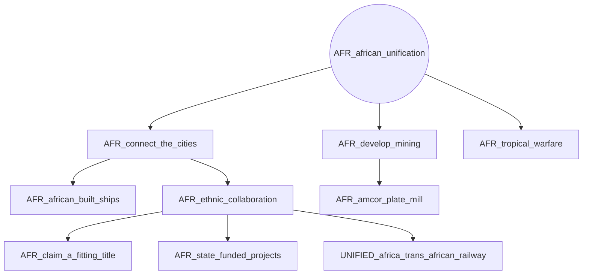

# AFR_african_unification

```mermaid
flowchart TD
    n1["AFR_african_built_ships"]
    n2(("AFR_african_unification"))
    n3["AFR_amcor_plate_mill"]
    n4["AFR_claim_a_fitting_title"]
    n5["AFR_connect_the_cities"]
    n6["AFR_develop_mining"]
    n7["AFR_ethnic_collaboration"]
    n8["AFR_state_funded_projects"]
    n9["AFR_tropical_warfare"]
    n10["UNIFIED_africa_trans_african_railway"]
    n5 --> n1
    n6 --> n3
    n7 --> n4
    n2 --> n5
    n2 --> n6
    n5 --> n7
    n7 --> n8
    n2 --> n9
    n7 --> n10
```
