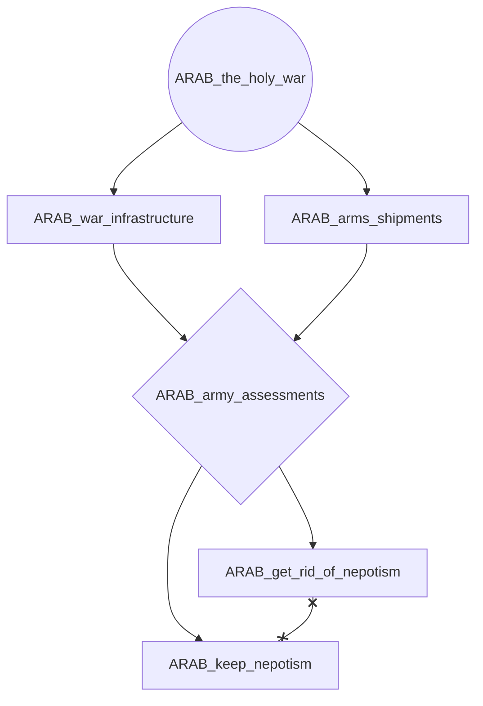
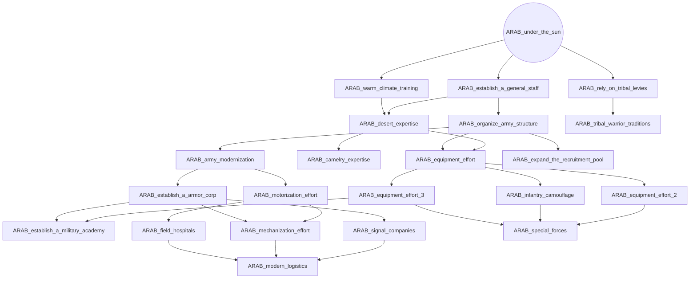

# ARAB_the_holy_war

```mermaid
flowchart TD
    n1["ARAB_arms_shipments"]
    n2{"ARAB_army_assessments"}
    n3["ARAB_get_rid_of_nepotism"]
    n4["ARAB_keep_nepotism"]
    n5(("ARAB_the_holy_war"))
    n6["ARAB_war_infrastructure"]
    n5 --> n1
    n6 --> n2
    n1 --> n2
    n2 --> n3
    n2 --> n4
    n5 --> n6
    n3 x--x n4
```

# ARAB_under_the_sun

```mermaid
flowchart TD
    n7["ARAB_army_modernization"]
    n8["ARAB_camelry_expertise"]
    n9["ARAB_desert_expertise"]
    n10["ARAB_equipment_effort"]
    n11["ARAB_equipment_effort_2"]
    n12["ARAB_equipment_effort_3"]
    n13["ARAB_establish_a_armor_corp"]
    n14["ARAB_establish_a_general_staff"]
    n15["ARAB_establish_a_military_academy"]
    n16["ARAB_expand_the_recruitment_pool"]
    n17["ARAB_field_hospitals"]
    n18["ARAB_infantry_camouflage"]
    n19["ARAB_mechanization_effort"]
    n20["ARAB_modern_logistics"]
    n21["ARAB_motorization_effort"]
    n22["ARAB_organize_army_structure"]
    n23["ARAB_rely_on_tribal_levies"]
    n24["ARAB_signal_companies"]
    n25["ARAB_special_forces"]
    n26["ARAB_tribal_warrior_traditions"]
    n27(("ARAB_under_the_sun"))
    n28["ARAB_warm_climate_training"]
    n22 --> n7
    n9 --> n8
    n28 --> n9
    n14 --> n9
    n22 --> n10
    n9 --> n10
    n10 --> n11
    n10 --> n12
    n7 --> n13
    n27 --> n14
    n13 --> n15
    n12 --> n15
    n22 --> n16
    n21 --> n17
    n10 --> n18
    n13 --> n19
    n21 --> n19
    n17 --> n20
    n19 --> n20
    n24 --> n20
    n7 --> n21
    n14 --> n22
    n27 --> n23
    n13 --> n24
    n12 --> n25
    n18 --> n25
    n11 --> n25
    n23 --> n26
    n27 --> n28
```
