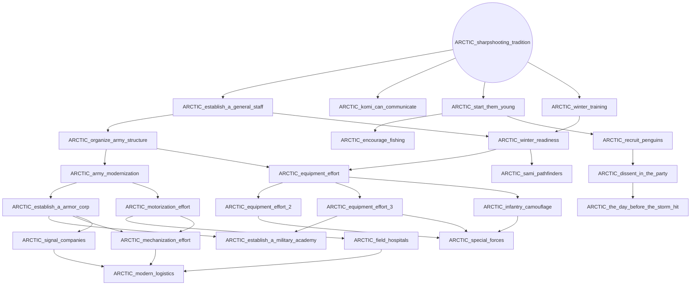

# ARCTIC_sharpshooting_tradition

```mermaid
flowchart TD
    n1["ARCTIC_army_modernization"]
    n2["ARCTIC_dissent_in_the_party"]
    n3["ARCTIC_encourage_fishing"]
    n4["ARCTIC_equipment_effort"]
    n5["ARCTIC_equipment_effort_2"]
    n6["ARCTIC_equipment_effort_3"]
    n7["ARCTIC_establish_a_armor_corp"]
    n8["ARCTIC_establish_a_general_staff"]
    n9["ARCTIC_establish_a_military_academy"]
    n10["ARCTIC_field_hospitals"]
    n11["ARCTIC_infantry_camouflage"]
    n12["ARCTIC_komi_can_communicate"]
    n13["ARCTIC_mechanization_effort"]
    n14["ARCTIC_modern_logistics"]
    n15["ARCTIC_motorization_effort"]
    n16["ARCTIC_organize_army_structure"]
    n17["ARCTIC_recruit_penguins"]
    n18["ARCTIC_sami_pathfinders"]
    n19(("ARCTIC_sharpshooting_tradition"))
    n20["ARCTIC_signal_companies"]
    n21["ARCTIC_special_forces"]
    n22["ARCTIC_start_them_young"]
    n23["ARCTIC_the_day_before_the_storm_hit"]
    n24["ARCTIC_winter_readiness"]
    n25["ARCTIC_winter_training"]
    n16 --> n1
    n17 --> n2
    n22 --> n3
    n16 --> n4
    n24 --> n4
    n4 --> n5
    n4 --> n6
    n1 --> n7
    n19 --> n8
    n7 --> n9
    n6 --> n9
    n15 --> n10
    n4 --> n11
    n19 --> n12
    n7 --> n13
    n15 --> n13
    n10 --> n14
    n13 --> n14
    n20 --> n14
    n1 --> n15
    n8 --> n16
    n22 --> n17
    n24 --> n18
    n7 --> n20
    n6 --> n21
    n11 --> n21
    n5 --> n21
    n19 --> n22
    n2 --> n23
    n25 --> n24
    n8 --> n24
    n19 --> n25
```
