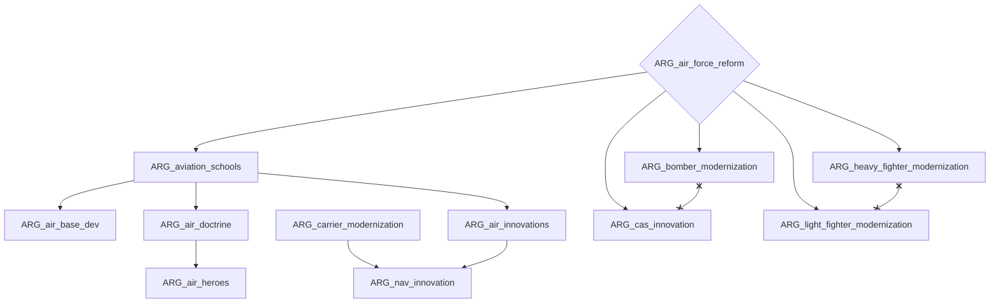
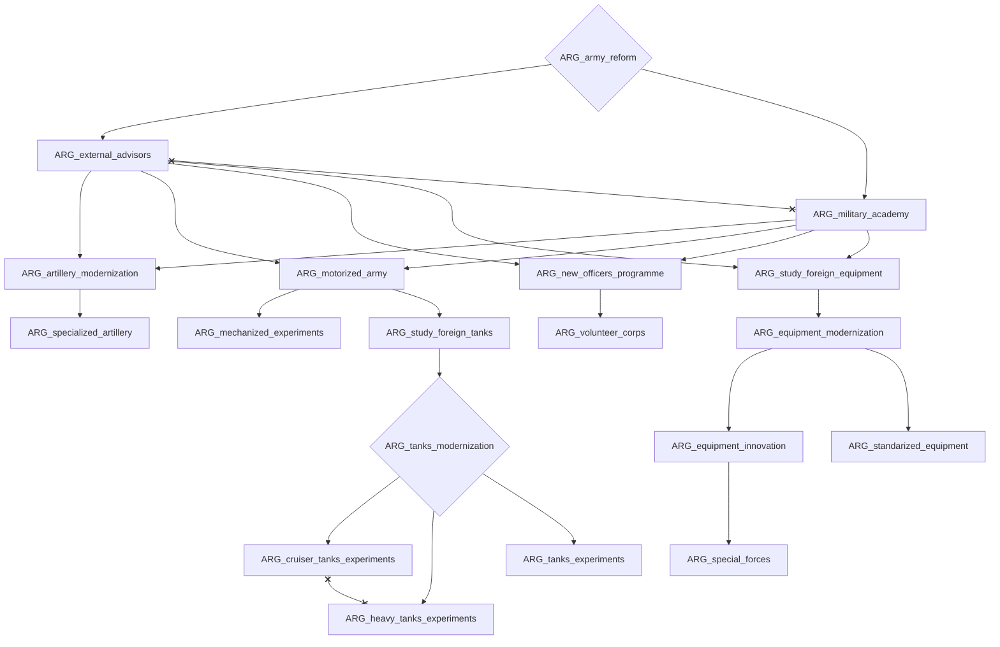
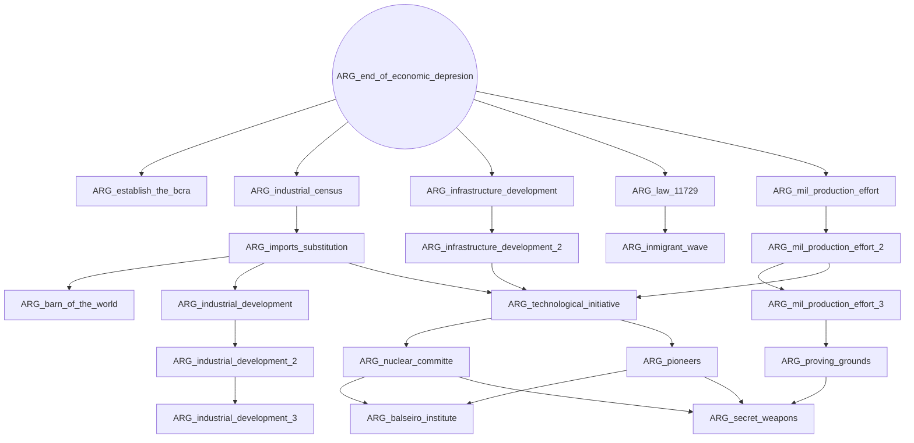
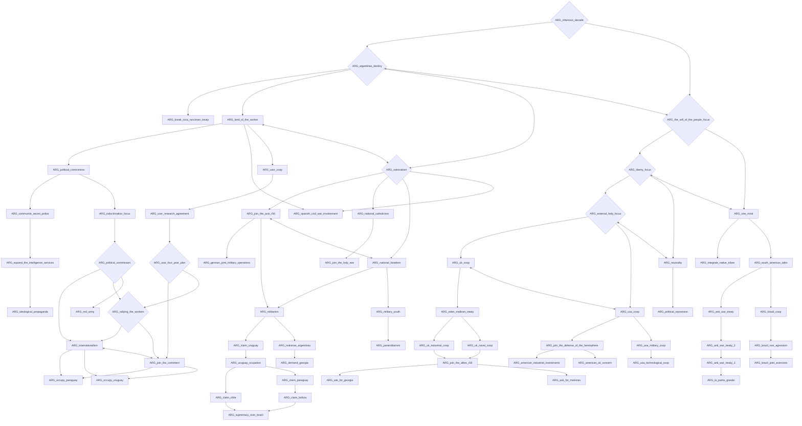
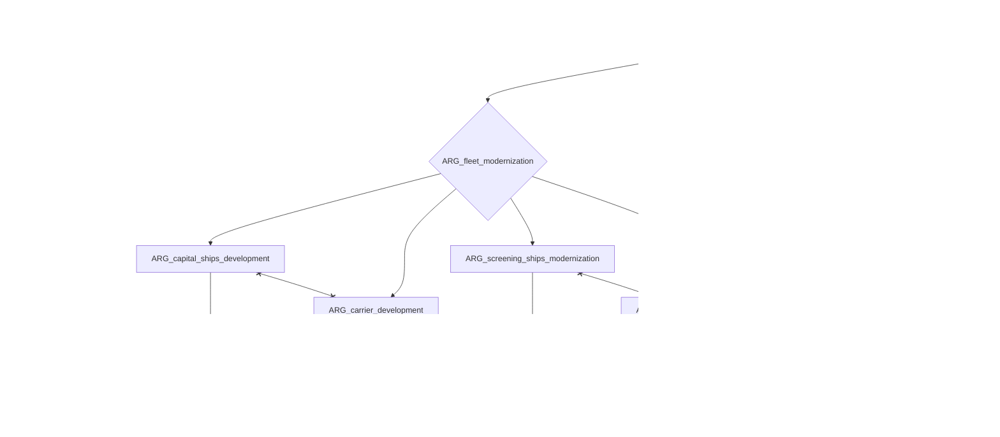

# ARG_air_force_reform

```mermaid
flowchart TD
    n1["ARG_air_base_dev"]
    n2["ARG_air_doctrine"]
    n3{"ARG_air_force_reform"}
    n4["ARG_air_heroes"]
    n5["ARG_air_innovations"]
    n6["ARG_aviation_schools"]
    n7["ARG_bomber_modernization"]
    n8["ARG_carrier_modernization"]
    n9["ARG_cas_innovation"]
    n10["ARG_heavy_fighter_modernization"]
    n11["ARG_light_fighter_modernization"]
    n12["ARG_nav_innovation"]
    n6 --> n1
    n6 --> n2
    n2 --> n4
    n6 --> n5
    n3 --> n6
    n3 --> n7
    n3 --> n9
    n3 --> n10
    n3 --> n11
    n8 --> n12
    n5 --> n12
    n7 x--x n9
    n10 x--x n11
```

# ARG_army_reform

```mermaid
flowchart TD
    n13{"ARG_army_reform"}
    n14["ARG_artillery_modernization"]
    n15["ARG_cruiser_tanks_experiments"]
    n16["ARG_equipment_innovation"]
    n17["ARG_equipment_modernization"]
    n18["ARG_external_advisors"]
    n19["ARG_heavy_tanks_experiments"]
    n20["ARG_mechanized_experiments"]
    n21["ARG_military_academy"]
    n22["ARG_motorized_army"]
    n23["ARG_new_officers_programme"]
    n24["ARG_special_forces"]
    n25["ARG_specialized_artillery"]
    n26["ARG_standarized_equipment"]
    n27["ARG_study_foreign_equipment"]
    n28["ARG_study_foreign_tanks"]
    n29["ARG_tanks_experiments"]
    n30{"ARG_tanks_modernization"}
    n31["ARG_volunteer_corps"]
    n18 --> n14
    n21 --> n14
    n30 --> n15
    n17 --> n16
    n27 --> n17
    n13 --> n18
    n30 --> n19
    n22 --> n20
    n13 --> n21
    n18 --> n22
    n21 --> n22
    n18 --> n23
    n21 --> n23
    n16 --> n24
    n14 --> n25
    n17 --> n26
    n18 --> n27
    n21 --> n27
    n22 --> n28
    n30 --> n29
    n28 --> n30
    n23 --> n31
    n15 x--x n19
    n18 x--x n21
```

# ARG_end_of_economic_depresion

```mermaid
flowchart TD
    n32["ARG_balseiro_institute"]
    n33["ARG_barn_of_the_world"]
    n34(("ARG_end_of_economic_depresion"))
    n35["ARG_establish_the_bcra"]
    n36["ARG_imports_substitution"]
    n37["ARG_industrial_census"]
    n38["ARG_industrial_development"]
    n39["ARG_industrial_development_2"]
    n40["ARG_industrial_development_3"]
    n41["ARG_infrastructure_development"]
    n42["ARG_infrastructure_development_2"]
    n43["ARG_inmigrant_wave"]
    n44["ARG_law_11729"]
    n45["ARG_mil_production_effort"]
    n46["ARG_mil_production_effort_2"]
    n47["ARG_mil_production_effort_3"]
    n48["ARG_nuclear_committe"]
    n49["ARG_pioneers"]
    n50["ARG_proving_grounds"]
    n51["ARG_secret_weapons"]
    n52["ARG_technological_initiative"]
    n48 --> n32
    n49 --> n32
    n36 --> n33
    n34 --> n35
    n37 --> n36
    n34 --> n37
    n36 --> n38
    n38 --> n39
    n39 --> n40
    n34 --> n41
    n41 --> n42
    n44 --> n43
    n34 --> n44
    n34 --> n45
    n45 --> n46
    n46 --> n47
    n52 --> n48
    n52 --> n49
    n47 --> n50
    n49 --> n51
    n48 --> n51
    n50 --> n51
    n42 --> n52
    n36 --> n52
    n46 --> n52
```

# ARG_infamous_decade

```mermaid
flowchart TD
    n53["ARG_american_industrial_investments"]
    n54["ARG_american_oil_concern"]
    n55["ARG_anti_war_treaty"]
    n56["ARG_anti_war_treaty_2"]
    n57["ARG_anti_war_treaty_3"]
    n58{"ARG_argentinas_destiny"}
    n59["ARG_ask_for_georgia"]
    n60["ARG_ask_for_malvinas"]
    n61["ARG_brazil_coop"]
    n62["ARG_brazil_joint_exercises"]
    n63["ARG_brazil_non_agression"]
    n64["ARG_break_roca_runciman_treaty"]
    n65["ARG_claim_bolivia"]
    n66["ARG_claim_chile"]
    n67["ARG_claim_paraguay"]
    n68["ARG_claim_uruguay"]
    n69["ARG_communist_secret_police"]
    n70["ARG_demand_georgia"]
    n71["ARG_eden_malbran_treaty"]
    n72["ARG_expand_the_intelligence_services"]
    n73{"ARG_external_help_focus"}
    n74["ARG_german_joint_military_operations"]
    n75["ARG_ideological_propaganda"]
    n76["ARG_indoctrination_focus"]
    n77{"ARG_infamous_decade"}
    n78["ARG_integrate_native_tribes"]
    n79["ARG_internationalism"]
    n80["ARG_join_the_allies_r56"]
    n81["ARG_join_the_axis_r56"]
    n82["ARG_join_the_comintern"]
    n83["ARG_join_the_defense_of_the_hemisphere"]
    n84["ARG_join_the_holy_see"]
    n85["ARG_la_patria_grande"]
    n86["ARG_land_of_the_worker"]
    n87{"ARG_liberty_focus"}
    n88["ARG_malvinas_argentinas"]
    n89["ARG_militarism"]
    n90["ARG_military_youth"]
    n91["ARG_national_catholicism"]
    n92["ARG_national_fanatism"]
    n93{"ARG_nationalism"}
    n94["ARG_neutrality"]
    n95["ARG_occupy_paraguay"]
    n96["ARG_occupy_uruguay"]
    n97["ARG_one_mind"]
    n98["ARG_paramilitarism"]
    n99{"ARG_political_commissars"}
    n100["ARG_political_correctness"]
    n101["ARG_political_repression"]
    n102{"ARG_rallying_the_workers"}
    n103["ARG_red_army"]
    n104["ARG_south_americas_talks"]
    n105["ARG_spanish_civil_war_involvement"]
    n106["ARG_supremacy_over_brazil"]
    n107{"ARG_the_will_of_the_people_focus"}
    n108["ARG_uk_coop"]
    n109["ARG_uk_industrial_coop"]
    n110["ARG_uk_naval_coop"]
    n111["ARG_uruguay_ocupation"]
    n112["ARG_usa_coop"]
    n113["ARG_usa_military_coop"]
    n114["ARG_usa_technological_coop"]
    n115["ARG_ussr_coop"]
    n116{"ARG_ussr_four_year_plan"}
    n117["ARG_ussr_research_agreement"]
    n83 --> n53
    n83 --> n54
    n104 --> n55
    n55 --> n56
    n56 --> n57
    n77 --> n58
    n80 --> n59
    n80 --> n60
    n104 --> n61
    n63 --> n62
    n61 --> n63
    n58 --> n64
    n67 --> n65
    n111 --> n66
    n111 --> n67
    n89 --> n68
    n100 --> n69
    n88 --> n70
    n108 --> n71
    n69 --> n72
    n87 --> n73
    n81 --> n74
    n72 --> n75
    n100 --> n76
    n97 --> n78
    n99 --> n79
    n102 --> n79
    n109 --> n80
    n110 --> n80
    n93 --> n81
    n116 --> n82
    n102 --> n82
    n112 --> n83
    n91 --> n84
    n57 --> n85
    n58 --> n86
    n107 --> n87
    n89 --> n88
    n92 --> n89
    n81 --> n89
    n92 --> n90
    n93 --> n91
    n93 --> n92
    n58 --> n93
    n87 --> n94
    n79 --> n95
    n82 --> n95
    n79 --> n96
    n82 --> n96
    n107 --> n97
    n90 --> n98
    n76 --> n99
    n86 --> n100
    n94 --> n101
    n99 --> n102
    n116 --> n102
    n99 --> n103
    n97 --> n104
    n93 --> n105
    n86 --> n105
    n66 --> n106
    n65 --> n106
    n77 --> n107
    n73 --> n108
    n71 --> n109
    n71 --> n110
    n68 --> n111
    n73 --> n112
    n112 --> n113
    n113 --> n114
    n86 --> n115
    n117 --> n116
    n115 --> n117
    n58 x--x n107
    n73 x--x n94
    n79 x--x n82
    n81 x--x n92
    n86 x--x n93
    n87 x--x n97
    n108 x--x n112
```

# ARG_navy_reform

```mermaid
flowchart TD
    n5["ARG_air_innovations"]
    n118["ARG_capital_ships_development"]
    n119["ARG_capital_ships_modernization"]
    n120["ARG_carrier_development"]
    n8["ARG_carrier_modernization"]
    n121["ARG_cruisers_modernization"]
    n122{"ARG_fleet_modernization"}
    n12["ARG_nav_innovation"]
    n123["ARG_naval_development_I"]
    n124["ARG_naval_doctrine"]
    n125["ARG_naval_exercises"]
    n126(("ARG_navy_reform"))
    n127["ARG_overseas_officer_training"]
    n128["ARG_screening_ships_modernization"]
    n129["ARG_state_dockyards"]
    n130["ARG_submarines_experiments"]
    n131["ARG_submarines_modernization"]
    n122 --> n118
    n118 --> n119
    n122 --> n120
    n120 --> n8
    n128 --> n121
    n126 --> n122
    n8 --> n12
    n5 --> n12
    n129 --> n123
    n121 --> n124
    n130 --> n124
    n119 --> n124
    n8 --> n124
    n127 --> n125
    n126 --> n127
    n122 --> n128
    n126 --> n129
    n131 --> n130
    n122 --> n131
    n118 x--x n120
    n128 x--x n131
```
