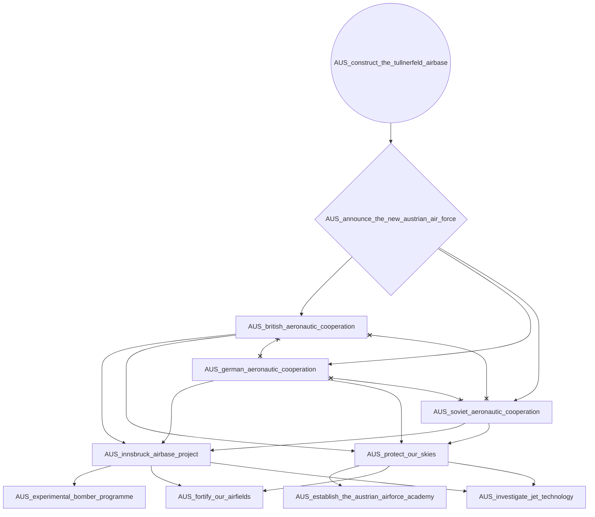
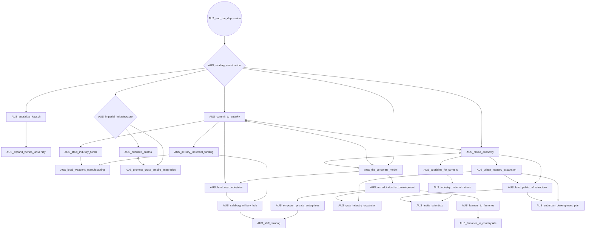
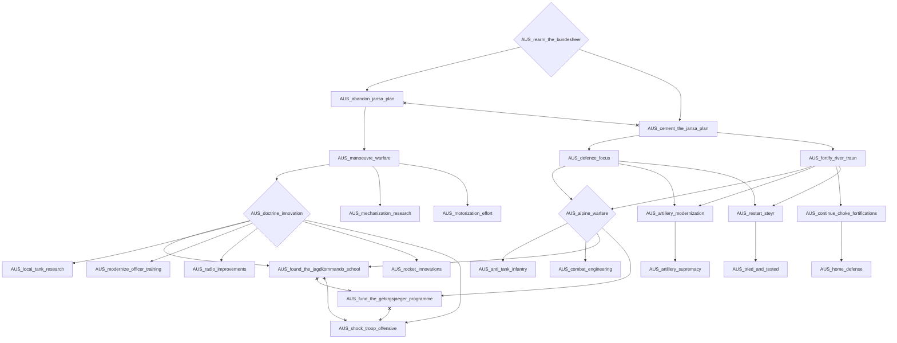
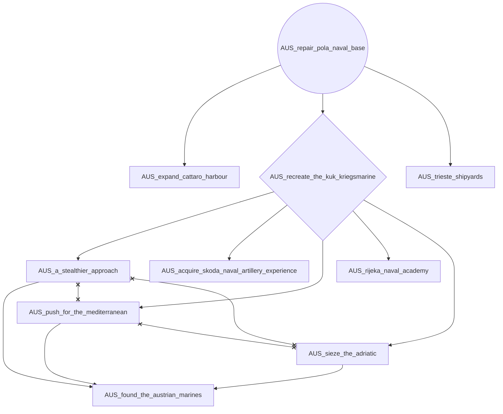

# AUS_clock_ticks_down

```mermaid
flowchart TD
    n1{"AUS_a_danubian_association"}
    n2{"AUS_a_good_show"}
    n3{"AUS_a_modern_empire"}
    n4["AUS_a_new_austria"]
    n5["AUS_accept_inevitable"]
    n6["AUS_ally_albania"]
    n7["AUS_ally_bulgaria"]
    n8["AUS_ally_bulgaria_empire"]
    n9["AUS_ally_bulgaria_renner"]
    n10["AUS_ally_italy"]
    n11["AUS_ally_poland"]
    n12["AUS_ally_poland_empire"]
    n13["AUS_ally_poland_renner"]
    n14["AUS_ally_romania_empire"]
    n15["AUS_ally_romania_renner"]
    n16["AUS_ally_yugoslavia_empire"]
    n17["AUS_ally_yugoslavia_renner"]
    n18["AUS_anschluss"]
    n19["AUS_antifascist_bulwark"]
    n20{"AUS_appoint_inquart"}
    n21["AUS_appoint_loyal_judges"]
    n22["AUS_arm_german_resistance"]
    n23{"AUS_arm_sudeten_germans"}
    n24["AUS_arrest_nazis"]
    n25["AUS_austria_alone"]
    n26{"AUS_austria_awaken"}
    n27["AUS_austria_is_austrian"]
    n28{"AUS_austrian_catholic_identity"}
    n29{"AUS_austrofascism_not_nazism"}
    n30["AUS_avenge_brother_war_empire"]
    n31["AUS_avenge_yugoslav_humiliation"]
    n32["AUS_ban_paramilitary_organizations"]
    n33["AUS_bauer_government"]
    n34{"AUS_begin_election_campaigns"}
    n35["AUS_better_germany"]
    n36["AUS_bolshevik_reconciliation"]
    n37{"AUS_bolster_defences"}
    n38["AUS_bring_exiled_monarchists"]
    n39["AUS_bring_in_left"]
    n40{"AUS_cast_the_die"}
    n41["AUS_catholic_education"]
    n42["AUS_catholic_german_identity"]
    n43["AUS_cement_kaiser_power"]
    n44["AUS_centralize_imperial_army"]
    n45["AUS_centralize_power"]
    n46["AUS_claims_on_galicia_empire"]
    n47(("AUS_clock_ticks_down"))
    n48["AUS_compromise_miklas"]
    n49["AUS_compromise_with_conservatives"]
    n50["AUS_compromise_with_fey"]
    n51["AUS_consolidate_bundesheer"]
    n52["AUS_constrict_the_parliament"]
    n53["AUS_convince_miklas"]
    n54["AUS_corporate_industrialization"]
    n55{"AUS_crack_down_nazis"}
    n56{"AUS_crackdown_on_socialists"}
    n57["AUS_crush_heimwehr_remnants"]
    n58["AUS_crush_the_heimwehr"]
    n59{"AUS_cs_victory"}
    n60{"AUS_danubian_defensive_pact"}
    n61{"AUS_danubian_economic_alliance"}
    n62["AUS_defence_of_the_republic"]
    n63["AUS_demand_slovenia"]
    n64{"AUS_demand_slovenia_nazi"}
    n65["AUS_democracy_of_the_proletariat"]
    n66{"AUS_democracy_worth_defending"}
    n67["AUS_depose_miklas"]
    n68["AUS_destroy_dolfuss_legacy"]
    n69["AUS_destroy_heimwehr"]
    n70{"AUS_destroy_the_compromise"}
    n71["AUS_destroy_the_traitors"]
    n72{"AUS_disband_paramilitaries"}
    n73["AUS_disband_the_presidency"]
    n74["AUS_dismantle_corporatism"]
    n75["AUS_dolfuss_true_successor"]
    n76["AUS_economic_liberalization"]
    n77["AUS_empower_the_economic_council"]
    n78["AUS_empower_the_heimatblock"]
    n79["AUS_empower_the_industrialists"]
    n80["AUS_empower_the_parliament"]
    n81["AUS_equal_rights_women"]
    n82["AUS_expand_bohemian_industry"]
    n83["AUS_expand_church_influence"]
    n84["AUS_exploit_constitutional_loopholes"]
    n85{"AUS_fall_from_grace"}
    n86["AUS_father_of_republic"]
    n87{"AUS_federalisation_of_cisleithania"}
    n88["AUS_federalize_transleithania"]
    n89["AUS_fight_kaiser_influence"]
    n90["AUS_for_a_free_germany"]
    n91["AUS_for_kaiser_and_fatherland"]
    n92["AUS_forced_german_command"]
    n93["AUS_foreign_arms_purchases"]
    n94["AUS_form_donaubund"]
    n95["AUS_formalize_pact_of_rome"]
    n96{"AUS_franz_ferdinand_legacy"}
    n97{"AUS_german_economic_development"}
    n98["AUS_german_industrial_investments"]
    n99["AUS_get_rid_of_schuschnigg"]
    n100["AUS_go_it_alone"]
    n101["AUS_grand_coalition"]
    n102["AUS_grant_crownland_status"]
    n103["AUS_healthcare_subsidization"]
    n104["AUS_impede_socialists"]
    n105["AUS_independent_nazi"]
    n106["AUS_industrialist_support"]
    n107["AUS_infiltrate_vienna"]
    n108["AUS_inquart_backstab"]
    n109["AUS_integrate_bohemia"]
    n110["AUS_integrate_economy"]
    n111["AUS_integrate_frontmilliz"]
    n112["AUS_integrate_heimwehr"]
    n113["AUS_integrate_into_the_bundesheer"]
    n114["AUS_integrate_militias"]
    n115{"AUS_integrate_vf_remnants"}
    n116["AUS_intervention"]
    n117["AUS_intervention_in_liechtenstein"]
    n118["AUS_intervention_in_liechtenstein_empire"]
    n119["AUS_intervention_in_liechtenstein_empire_auth"]
    n120["AUS_intervention_in_liechtenstein_nazi"]
    n121["AUS_intervention_in_liechtenstein_schuschnigg"]
    n122["AUS_invest_in_cisleithania"]
    n123["AUS_italian_reconciliation_nazi"]
    n124["AUS_join_the_allies_figl"]
    n125["AUS_join_the_allies_r56"]
    n126["AUS_join_the_west"]
    n127["AUS_liberate_sudtirol"]
    n128["AUS_liechtenstein_treaty"]
    n129["AUS_look_west"]
    n130["AUS_loyalty_for_properties_empire"]
    n131{"AUS_martial_law_hungary"}
    n132["AUS_mass_industrialization"]
    n133["AUS_miklas_support"]
    n134["AUS_militarize_the_rome_protocols"]
    n135["AUS_military_dictatorship"]
    n136["AUS_minister_reshuffling"]
    n137["AUS_moderate_restoration"]
    n138["AUS_monarchic_enabling_acts"]
    n139["AUS_national_defence_effort"]
    n140["AUS_national_defence_effort_renner"]
    n141["AUS_national_mobilization"]
    n142{"AUS_national_unity_government"}
    n143["AUS_negotiate_reunification"]
    n144{"AUS_new_austrian_state"}
    n145["AUS_no_more_the_fool"]
    n146{"AUS_old_friends_not_forgotten"}
    n147["AUS_old_ties"]
    n148["AUS_one_empire_two_systems"]
    n149["AUS_our_bavarian_brothers"]
    n150["AUS_our_own_pact"]
    n151{"AUS_oust_schuschnigg"}
    n152["AUS_partition_czechoslovakia_empire"]
    n153["AUS_partition_czechoslovakia_heimwehr"]
    n154["AUS_partition_czechoslovakia_nazi"]
    n155["AUS_past_glories"]
    n156["AUS_political_crackdowns"]
    n157["AUS_power_to_the_kaiser"]
    n158["AUS_preemptive_strike"]
    n159["AUS_preserve_dolfuss_legacy"]
    n160{"AUS_proclaim_the_second_republic"}
    n161["AUS_proletarians_of_today"]
    n162["AUS_promote_militarism"]
    n163["AUS_public_housing_programs"]
    n164["AUS_purge_fey"]
    n165["AUS_purge_karntner_heimwehr"]
    n166{"AUS_purge_opposition"}
    n167{"AUS_realize_unity"}
    n168{"AUS_reclaim_bohemia"}
    n169["AUS_recognize_hungarian_croatia"]
    n170{"AUS_red_white_red_until_death"}
    n171["AUS_reform_education_system"]
    n172["AUS_reform_the_bundesheer"]
    n173["AUS_reform_the_constitution"]
    n174["AUS_reform_the_sturmscharen"]
    n175{"AUS_reinstate_hungarian_civilian_government"}
    n176["AUS_remember_red_vienna"]
    n177["AUS_remove_miklas"]
    n178["AUS_renew_the_rome_protocols"]
    n179["AUS_renner_government"]
    n180["AUS_reorganize_the_heimwehr"]
    n181{"AUS_reorganize_the_right"}
    n182["AUS_repeal_habsburg_law"]
    n183{"AUS_repeal_may_constitution"}
    n184{"AUS_repeal_party_ban"}
    n185["AUS_replace_miklas"]
    n186["AUS_request_control_slovenia"]
    n187{"AUS_restart_linz_program"}
    n188["AUS_retake_slovakia"]
    n189["AUS_return_of_habsburgs"]
    n190["AUS_reverse_brain_drain"]
    n191["AUS_revive_the_schutzbund"]
    n192["AUS_rp_ostmark"]
    n193{"AUS_sdapo_victory"}
    n194["AUS_secure_the_countryside"]
    n195["AUS_secure_vatican_support"]
    n196["AUS_seize_socialist_media"]
    n197["AUS_slovenia_for_alliance"]
    n198["AUS_slovenia_for_alliance_renner"]
    n199["AUS_south_german_union"]
    n200["AUS_split_army"]
    n201["AUS_stir_monarchist_sentiment"]
    n202["AUS_stop_the_spread"]
    n203["AUS_strike_the_heart"]
    n204["AUS_strike_the_snake"]
    n205["AUS_strike_the_source"]
    n206["AUS_success_of_austrofascism"]
    n207["AUS_support_croatian_independence"]
    n208["AUS_support_southern_heimwehr"]
    n209["AUS_support_the_bauernbund"]
    n210["AUS_support_transylvanian_claims"]
    n211["AUS_technology_integration"]
    n212["AUS_the_austrian_fuhrer"]
    n213{"AUS_the_eisenstadt_conference"}
    n214["AUS_the_three_arrows"]
    n215["AUS_token_constitution_reforms"]
    n216["AUS_topple_hungary"]
    n217["AUS_transylvania_or_war"]
    n218["AUS_transylvanian_independence"]
    n219["AUS_unite_the_nation"]
    n220["AUS_use_miklas"]
    n221["AUS_use_the_ss"]
    n222["AUS_utilize_fey"]
    n223["AUS_utilize_paramilitaries"]
    n224["AUS_utilize_the_heimwehr"]
    n225["AUS_weaken_federal_army"]
    n226{"AUS_what_was_taken"}
    n227["AUS_work_with_heimwehr"]
    n150 --> n1
    n125 --> n1
    n52 --> n2
    n58 --> n3
    n172 --> n4
    n136 --> n4
    n26 --> n5
    n94 --> n6
    n147 --> n6
    n197 --> n7
    n16 --> n7
    n95 --> n8
    n94 --> n8
    n147 --> n8
    n198 --> n9
    n17 --> n9
    n26 --> n10
    n197 --> n11
    n16 --> n11
    n95 --> n12
    n94 --> n12
    n147 --> n12
    n198 --> n13
    n17 --> n13
    n197 --> n14
    n16 --> n14
    n198 --> n15
    n17 --> n15
    n1 --> n16
    n60 --> n17
    n97 --> n18
    n139 --> n19
    n141 --> n19
    n93 --> n19
    n5 --> n20
    n227 --> n21
    n167 --> n22
    n226 --> n23
    n146 --> n24
    n28 --> n25
    n47 --> n26
    n156 --> n27
    n151 --> n28
    n2 --> n28
    n55 --> n29
    n37 --> n29
    n56 --> n29
    n46 --> n30
    n226 --> n31
    n175 --> n32
    n131 --> n32
    n193 --> n33
    n184 --> n34
    n72 --> n34
    n181 --> n34
    n55 --> n34
    n111 --> n35
    n66 --> n36
    n10 --> n37
    n100 --> n37
    n155 --> n38
    n179 --> n39
    n208 --> n40
    n112 --> n40
    n194 --> n40
    n107 --> n40
    n195 --> n41
    n75 --> n42
    n132 --> n42
    n96 --> n43
    n32 --> n44
    n70 --> n45
    n23 --> n46
    n168 --> n46
    n217 --> n46
    n142 --> n48
    n179 --> n49
    n166 --> n50
    n35 --> n51
    n67 --> n52
    n21 --> n52
    n84 --> n52
    n146 --> n53
    n35 --> n54
    n129 --> n55
    n10 --> n55
    n100 --> n55
    n10 --> n56
    n100 --> n56
    n59 --> n57
    n24 --> n58
    n114 --> n58
    n34 --> n59
    n66 --> n60
    n61 --> n60
    n160 --> n61
    n160 --> n62
    n206 --> n63
    n144 --> n63
    n105 --> n64
    n187 --> n65
    n163 --> n66
    n103 --> n66
    n190 --> n66
    n227 --> n67
    n151 --> n68
    n28 --> n68
    n115 --> n69
    n108 --> n69
    n213 --> n70
    n31 --> n71
    n129 --> n72
    n51 --> n73
    n54 --> n73
    n140 --> n74
    n164 --> n75
    n50 --> n75
    n151 --> n76
    n57 --> n77
    n170 --> n78
    n144 --> n79
    n96 --> n80
    n187 --> n81
    n39 --> n81
    n23 --> n82
    n168 --> n82
    n35 --> n83
    n227 --> n84
    n4 --> n85
    n161 --> n86
    n173 --> n87
    n138 --> n87
    n87 --> n88
    n183 --> n89
    n213 --> n89
    n22 --> n90
    n146 --> n91
    n70 --> n91
    n226 --> n92
    n219 --> n93
    n146 --> n94
    n70 --> n94
    n146 --> n95
    n70 --> n95
    n210 --> n96
    n218 --> n96
    n152 --> n96
    n207 --> n96
    n169 --> n96
    n108 --> n97
    n110 --> n98
    n225 --> n99
    n185 --> n99
    n222 --> n99
    n26 --> n100
    n151 --> n101
    n146 --> n102
    n70 --> n102
    n65 --> n103
    n191 --> n103
    n151 --> n104
    n40 --> n105
    n2 --> n106
    n20 --> n107
    n40 --> n108
    n82 --> n109
    n192 --> n110
    n170 --> n111
    n20 --> n112
    n144 --> n113
    n146 --> n114
    n105 --> n115
    n129 --> n116
    n100 --> n116
    n10 --> n116
    n161 --> n117
    n124 --> n117
    n25 --> n117
    n19 --> n118
    n168 --> n119
    n23 --> n119
    n105 --> n120
    n35 --> n121
    n144 --> n121
    n80 --> n122
    n43 --> n122
    n64 --> n123
    n115 --> n123
    n151 --> n124
    n85 --> n125
    n66 --> n126
    n160 --> n126
    n64 --> n127
    n129 --> n128
    n10 --> n128
    n100 --> n128
    n26 --> n129
    n168 --> n130
    n23 --> n130
    n70 --> n131
    n79 --> n132
    n180 --> n132
    n113 --> n132
    n57 --> n133
    n178 --> n134
    n223 --> n135
    n89 --> n136
    n184 --> n137
    n72 --> n137
    n181 --> n137
    n55 --> n137
    n43 --> n138
    n219 --> n139
    n160 --> n140
    n219 --> n141
    n39 --> n142
    n49 --> n142
    n167 --> n143
    n99 --> n144
    n206 --> n145
    n213 --> n146
    n146 --> n147
    n70 --> n147
    n87 --> n148
    n42 --> n149
    n85 --> n150
    n133 --> n151
    n3 --> n152
    n42 --> n153
    n64 --> n154
    n55 --> n155
    n37 --> n155
    n56 --> n155
    n115 --> n156
    n44 --> n157
    n201 --> n157
    n19 --> n158
    n151 --> n159
    n2 --> n159
    n28 --> n159
    n142 --> n160
    n140 --> n161
    n171 --> n161
    n62 --> n161
    n29 --> n162
    n65 --> n163
    n191 --> n163
    n176 --> n163
    n166 --> n164
    n29 --> n165
    n144 --> n166
    n214 --> n167
    n226 --> n168
    n3 --> n169
    n224 --> n170
    n165 --> n170
    n195 --> n170
    n162 --> n170
    n160 --> n171
    n151 --> n171
    n89 --> n172
    n80 --> n173
    n57 --> n174
    n70 --> n175
    n187 --> n176
    n39 --> n176
    n142 --> n177
    n187 --> n177
    n111 --> n178
    n78 --> n178
    n193 --> n179
    n144 --> n180
    n129 --> n181
    n155 --> n182
    n137 --> n183
    n129 --> n184
    n78 --> n185
    n192 --> n186
    n33 --> n187
    n23 --> n188
    n168 --> n188
    n38 --> n189
    n182 --> n189
    n65 --> n190
    n191 --> n190
    n187 --> n191
    n97 --> n192
    n34 --> n193
    n20 --> n194
    n29 --> n195
    n35 --> n196
    n1 --> n197
    n60 --> n198
    n19 --> n199
    n226 --> n200
    n32 --> n201
    n214 --> n202
    n214 --> n203
    n161 --> n204
    n124 --> n204
    n25 --> n204
    n19 --> n205
    n196 --> n206
    n51 --> n206
    n83 --> n206
    n3 --> n207
    n20 --> n208
    n49 --> n209
    n59 --> n209
    n3 --> n210
    n110 --> n211
    n27 --> n212
    n69 --> n212
    n189 --> n213
    n66 --> n214
    n2 --> n215
    n84 --> n215
    n1 --> n216
    n226 --> n217
    n3 --> n218
    n85 --> n219
    n89 --> n220
    n110 --> n221
    n78 --> n222
    n131 --> n223
    n29 --> n224
    n78 --> n225
    n157 --> n226
    n135 --> n226
    n59 --> n227
    n5 x--x n10
    n5 x--x n100
    n5 x--x n129
    n10 x--x n100
    n10 x--x n129
    n16 x--x n197
    n17 x--x n198
    n18 x--x n192
    n22 x--x n143
    n23 x--x n168
    n25 x--x n124
    n29 x--x n155
    n32 x--x n223
    n33 x--x n179
    n34 x--x n137
    n36 x--x n60
    n36 x--x n126
    n43 x--x n80
    n48 x--x n177
    n50 x--x n164
    n57 x--x n227
    n59 x--x n193
    n60 x--x n126
    n68 x--x n159
    n70 x--x n89
    n70 x--x n146
    n78 x--x n111
    n88 x--x n148
    n89 x--x n146
    n92 x--x n200
    n94 x--x n95
    n94 x--x n147
    n95 x--x n147
    n100 x--x n129
    n101 x--x n104
    n105 x--x n108
    n107 x--x n194
    n112 x--x n208
    n113 x--x n180
    n119 x--x n130
    n123 x--x n127
    n125 x--x n150
    n131 x--x n175
    n165 x--x n224
    n169 x--x n207
    n210 x--x n218
```

# AUS_construct_the_tullnerfeld_airbase

```mermaid
flowchart TD
    n228{"AUS_announce_the_new_austrian_air_force"}
    n229["AUS_british_aeronautic_cooperation"]
    n230(("AUS_construct_the_tullnerfeld_airbase"))
    n231["AUS_establish_the_austrian_airforce_academy"]
    n232["AUS_experimental_bomber_programme"]
    n233["AUS_fortify_our_airfields"]
    n234["AUS_german_aeronautic_cooperation"]
    n235["AUS_innsbruck_airbase_project"]
    n236["AUS_investigate_jet_technology"]
    n237["AUS_protect_our_skies"]
    n238["AUS_soviet_aeronautic_cooperation"]
    n230 --> n228
    n228 --> n229
    n237 --> n231
    n235 --> n232
    n235 --> n233
    n237 --> n233
    n228 --> n234
    n234 --> n235
    n229 --> n235
    n238 --> n235
    n235 --> n236
    n237 --> n236
    n234 --> n237
    n229 --> n237
    n238 --> n237
    n228 --> n238
    n229 x--x n234
    n229 x--x n238
    n234 x--x n238
```

# AUS_end_the_depression

```mermaid
flowchart TD
    n239["AUS_commit_to_autarky"]
    n240["AUS_empower_private_enterprises"]
    n241(("AUS_end_the_depression"))
    n242["AUS_expand_vienna_university"]
    n243["AUS_factories_in_countryside"]
    n244["AUS_farmers_to_factories"]
    n245["AUS_fund_coal_industries"]
    n246["AUS_fund_public_infrastructure"]
    n247["AUS_graz_industry_expansion"]
    n248{"AUS_imperial_infrastructure"}
    n249["AUS_industry_nationalizations"]
    n250["AUS_invite_scientists"]
    n251["AUS_local_weapons_manufacturing"]
    n252["AUS_military_industrial_funding"]
    n253["AUS_mixed_economy"]
    n254["AUS_mixed_industrial_development"]
    n255["AUS_prioritize_austria"]
    n256["AUS_promote_cross_empire_integration"]
    n257["AUS_salzburg_military_hub"]
    n258["AUS_shift_strabag"]
    n259["AUS_steel_industry_funds"]
    n260{"AUS_strabag_construction"}
    n261["AUS_subsidies_for_farmers"]
    n262["AUS_subsidize_kapsch"]
    n263["AUS_suburban_development_plan"]
    n264["AUS_the_corporate_model"]
    n265["AUS_urban_industry_expansion"]
    n260 --> n239
    n254 --> n240
    n262 --> n242
    n244 --> n243
    n254 --> n244
    n264 --> n245
    n239 --> n245
    n253 --> n246
    n265 --> n246
    n265 --> n247
    n254 --> n247
    n260 --> n248
    n261 --> n249
    n249 --> n250
    n246 --> n250
    n252 --> n251
    n259 --> n251
    n239 --> n252
    n260 --> n253
    n264 --> n254
    n248 --> n255
    n248 --> n256
    n252 --> n257
    n245 --> n257
    n240 --> n258
    n257 --> n258
    n239 --> n259
    n241 --> n260
    n253 --> n261
    n260 --> n262
    n265 --> n263
    n246 --> n263
    n260 --> n264
    n253 --> n265
    n239 x--x n253
    n239 x--x n264
    n253 x--x n264
    n255 x--x n256
```

# AUS_rearm_the_bundesheer

```mermaid
flowchart TD
    n266["AUS_abandon_jansa_plan"]
    n267{"AUS_alpine_warfare"}
    n268["AUS_anti_tank_infantry"]
    n269["AUS_artillery_modernization"]
    n270["AUS_artillery_supremacy"]
    n271["AUS_cement_the_jansa_plan"]
    n272["AUS_combat_engineering"]
    n273["AUS_continue_choke_fortifications"]
    n274["AUS_defence_focus"]
    n275{"AUS_doctrine_innovation"}
    n276["AUS_fortify_river_traun"]
    n277["AUS_found_the_jagdkommando_school"]
    n278["AUS_fund_the_gebirgsjaeger_programme"]
    n279["AUS_home_defense"]
    n280["AUS_local_tank_research"]
    n281["AUS_manoeuvre_warfare"]
    n282["AUS_mechanization_research"]
    n283["AUS_modernize_officer_training"]
    n284["AUS_motorization_effort"]
    n285["AUS_radio_improvements"]
    n286{"AUS_rearm_the_bundesheer"}
    n287["AUS_restart_steyr"]
    n288["AUS_rocket_innovations"]
    n289["AUS_shock_troop_offensive"]
    n290["AUS_tried_and_tested"]
    n286 --> n266
    n276 --> n267
    n274 --> n267
    n267 --> n268
    n276 --> n269
    n274 --> n269
    n269 --> n270
    n286 --> n271
    n267 --> n272
    n276 --> n273
    n271 --> n274
    n281 --> n275
    n271 --> n276
    n275 --> n277
    n267 --> n277
    n267 --> n278
    n273 --> n279
    n275 --> n280
    n266 --> n281
    n281 --> n282
    n275 --> n283
    n281 --> n284
    n275 --> n285
    n276 --> n287
    n274 --> n287
    n275 --> n288
    n275 --> n289
    n287 --> n290
    n266 x--x n271
    n277 x--x n278
    n277 x--x n289
    n278 x--x n289
```

# AUS_repair_pola_naval_base

```mermaid
flowchart TD
    n291["AUS_a_stealthier_approach"]
    n292["AUS_acquire_skoda_naval_artillery_experience"]
    n293["AUS_expand_cattaro_harbour"]
    n294["AUS_found_the_austrian_marines"]
    n295["AUS_push_for_the_mediterranean"]
    n296{"AUS_recreate_the_kuk_kriegsmarine"}
    n297(("AUS_repair_pola_naval_base"))
    n298["AUS_rijeka_naval_academy"]
    n299["AUS_sieze_the_adriatic"]
    n300["AUS_trieste_shipyards"]
    n296 --> n291
    n296 --> n292
    n297 --> n293
    n291 --> n294
    n299 --> n294
    n295 --> n294
    n296 --> n295
    n297 --> n296
    n296 --> n298
    n296 --> n299
    n297 --> n300
    n291 x--x n295
    n291 x--x n299
    n295 x--x n299
```
