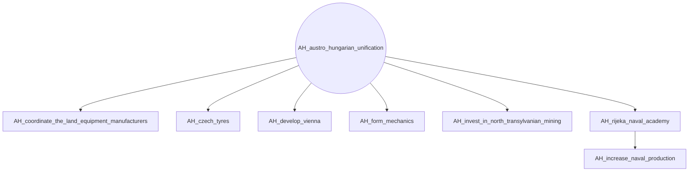

# AH_austro_hungarian_unification

```mermaid
flowchart TD
    n1(("AH_austro_hungarian_unification"))
    n2["AH_coordinate_the_land_equipment_manufacturers"]
    n3["AH_czech_tyres"]
    n4["AH_develop_vienna"]
    n5["AH_form_mechanics"]
    n6["AH_increase_naval_production"]
    n7["AH_invest_in_north_transylvanian_mining"]
    n8["AH_rijeka_naval_academy"]
    n1 --> n2
    n1 --> n3
    n1 --> n4
    n1 --> n5
    n8 --> n6
    n1 --> n7
    n1 --> n8
```
