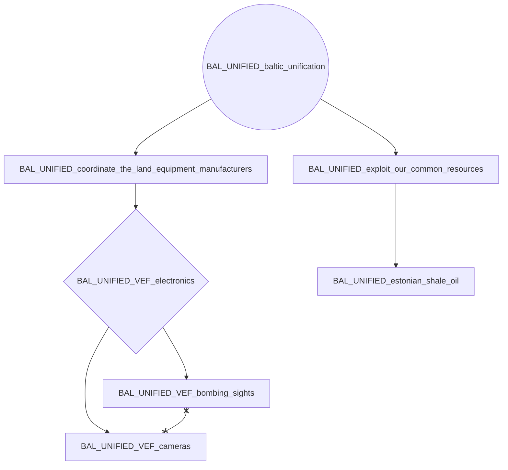

# BAL_UNIFIED_baltic_unification

```mermaid
flowchart TD
    n1["BAL_UNIFIED_VEF_bombing_sights"]
    n2["BAL_UNIFIED_VEF_cameras"]
    n3{"BAL_UNIFIED_VEF_electronics"}
    n4(("BAL_UNIFIED_baltic_unification"))
    n5["BAL_UNIFIED_coordinate_the_land_equipment_manufacturers"]
    n6["BAL_UNIFIED_estonian_shale_oil"]
    n7["BAL_UNIFIED_exploit_our_common_resources"]
    n3 --> n1
    n3 --> n2
    n5 --> n3
    n4 --> n5
    n7 --> n6
    n4 --> n7
    n1 x--x n2
```
