# BEL_Support_the_congo_railways

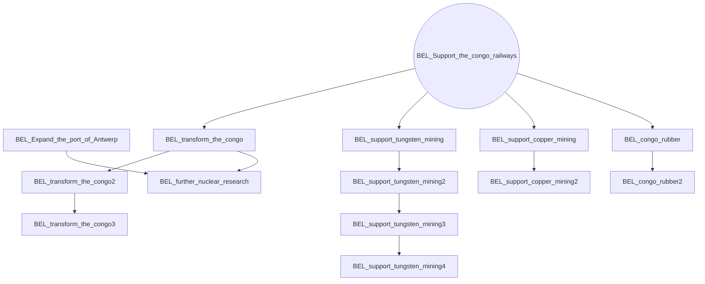

# BEL_accept_van_den_den_bergen_plan

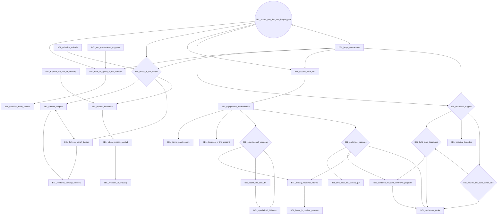

# BEL_air_force_congo

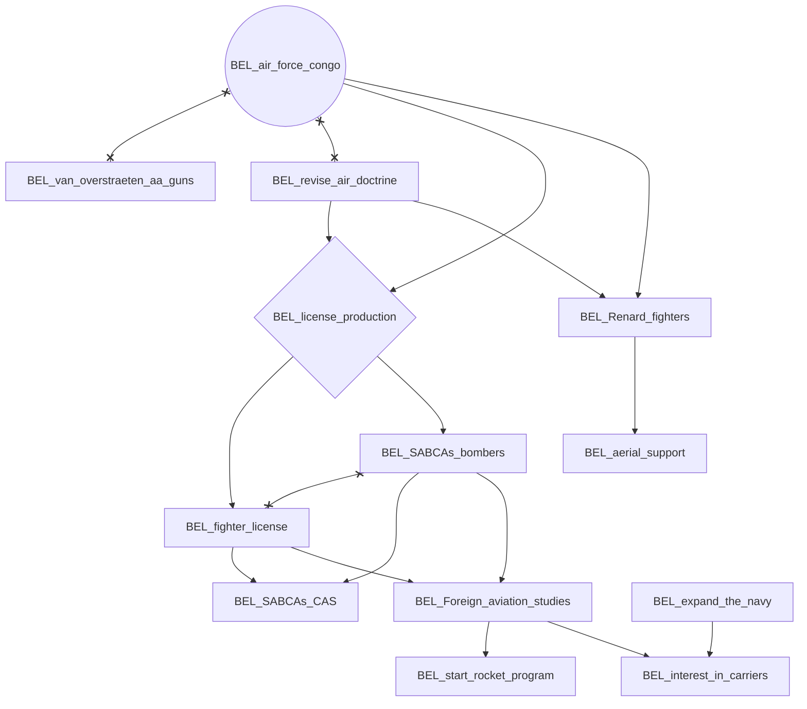

# BEL_begin_rearmement

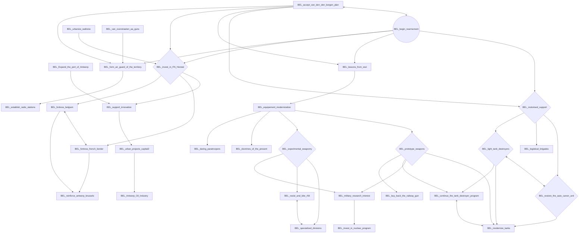

# BEL_belgian_navy_in_exile

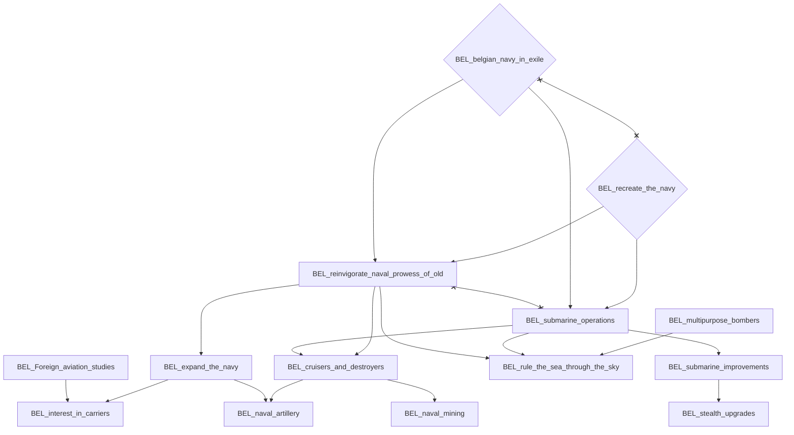

# BEL_form_coalition_government

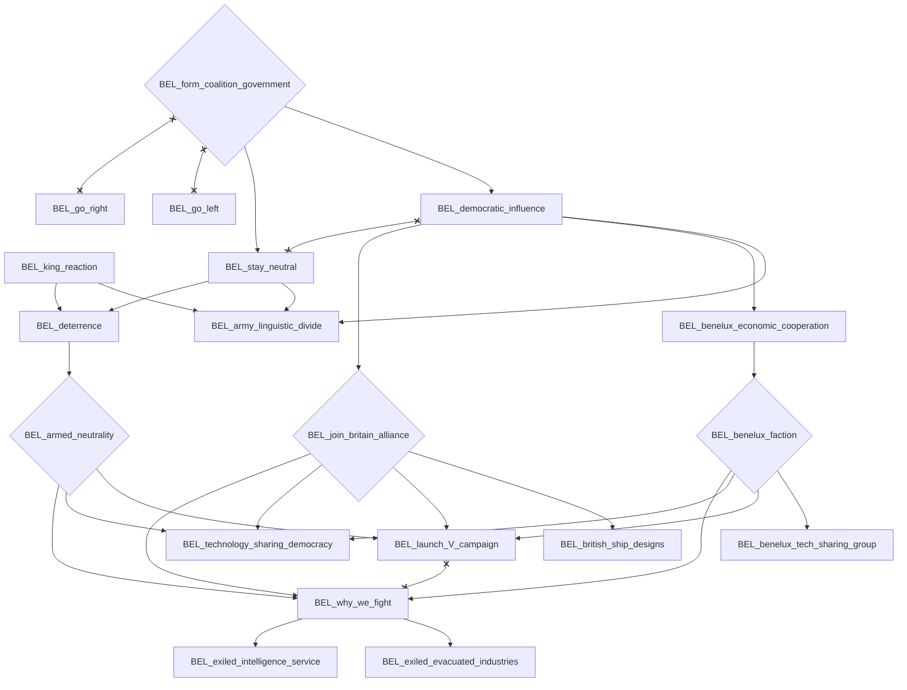

# BEL_go_left

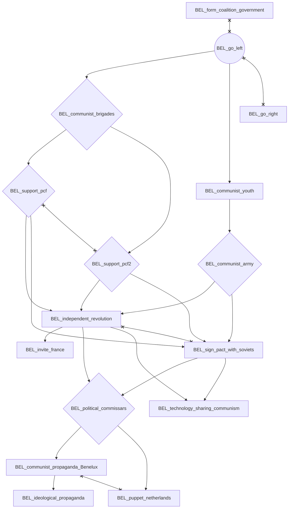

# BEL_go_right

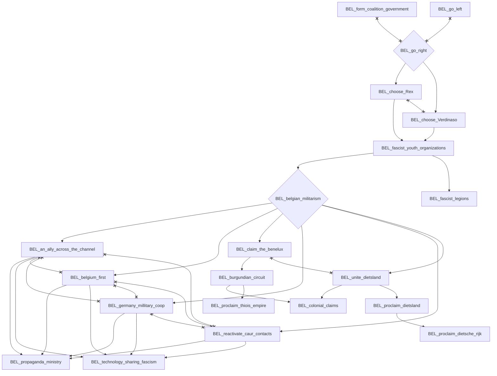

# BEL_king_reaction

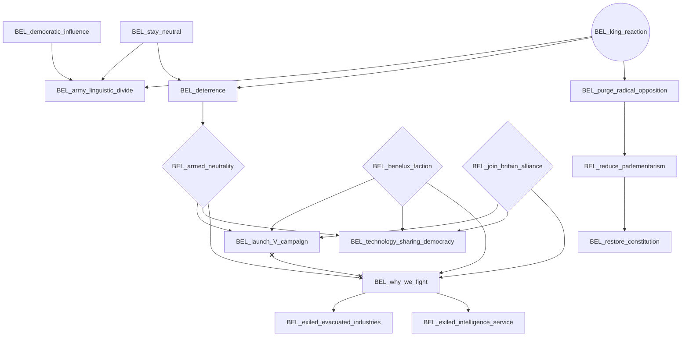

# BEL_recreate_the_navy

# BEL_revise_air_doctrine

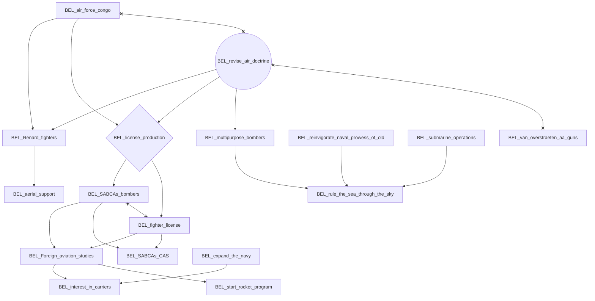

# BEL_urban_projects_capital

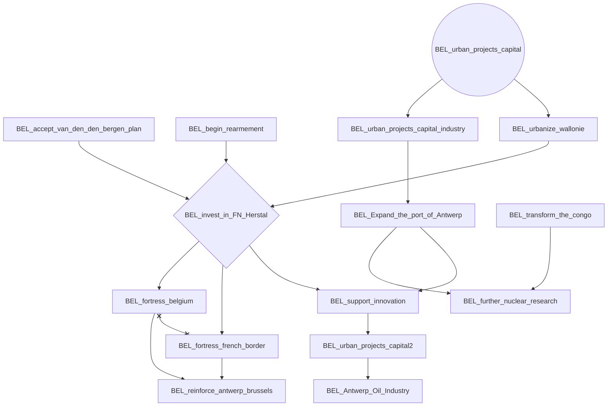

# BEL_van_overstraeten_aa_guns

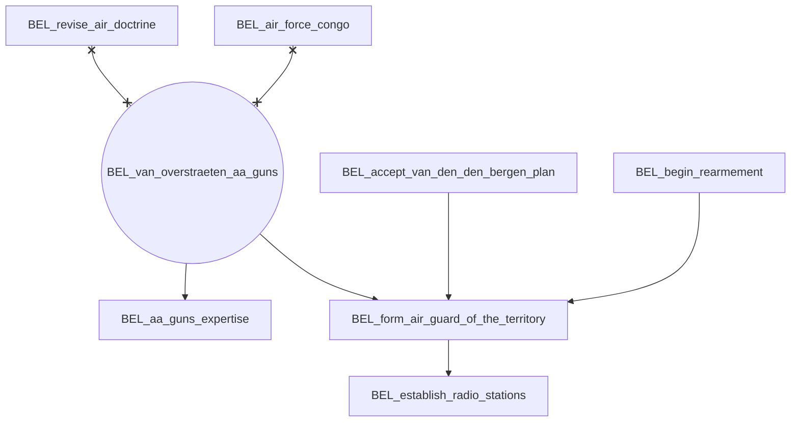
